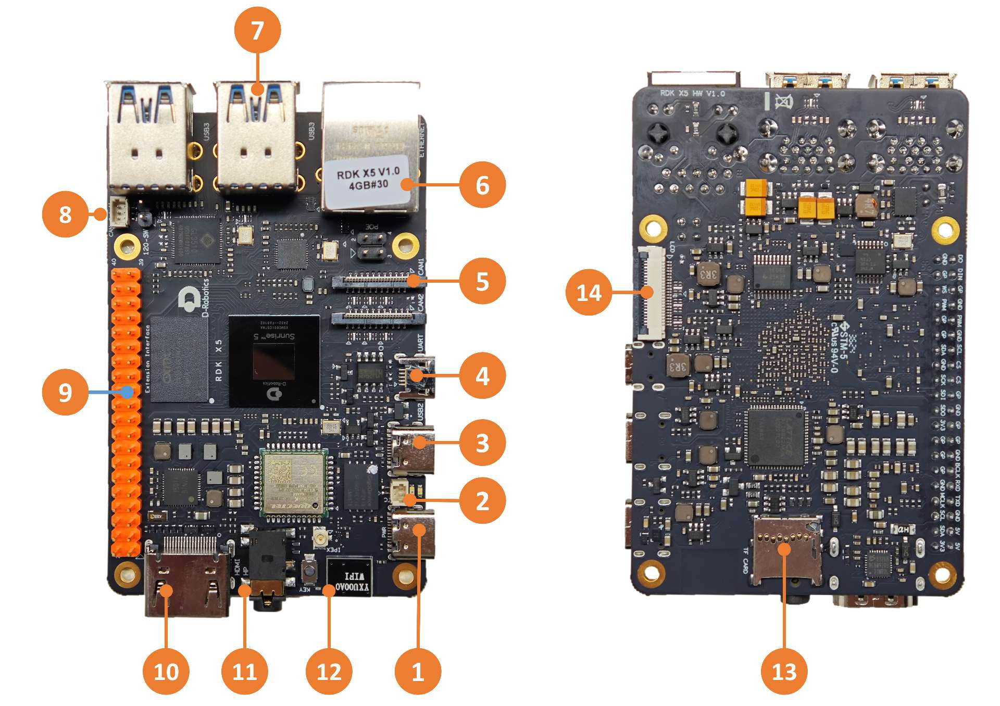

# 1.1.2 RDK X5

## 接口总览

RDK X5提供了网口、USB、摄像头、LCD、HDMI、CANFD、40PIN等功能接口，方便用户进行图像多媒体、深度学习算法等应用的开发和测试。开发板接口布局如下：

| 序号 | 功能 | 序号 | 功能 | 序号 | 功能 |
| -------- | ---------------------------- | -------- | ----------------------- | ----------------------- | ----------------------- |
| 1 | 供电接口 （USB Type C） | 2 | RTC 电池接口 | 3 | 易连接口 （USB Type C） |
| 4 | 调试串口（Micro USB） | 5 | 2 路 MIPI Camera 接口 | 6 | 千兆以太网口，支持 POE |
| 7 | 4 路 USB 3.0 Type A 接口 | 8 | CAN FD 高速接口 | 9 | 40PIN 接口 |
| 10 | HDMI 显示接口 | 11 | 多标准兼容耳机接口 | 12 | 板载 Wi-Fi 天线 |
| 13 | TF卡接口（底面） | 14 | LCD 显示接口（MIPI DSI） |  |  |

## 电源接口

开发板提供一路 USB Type C 接口(接口1)，作为供电接口，需要使用支持**5V/5A**的电源适配器为开发板供电。将电源适配器接入开发板后，**开发板绿色电源指示灯和橙色指示灯亮起**，说明开发板供电正常。

:::caution

请不要使用电脑USB接口为开发板供电，否则会因供电不足造成开发板**异常断电、反复重启**等情况。

:::

## 调试串口{#debug_uart}

开发板提供一路调试串口(接口4)，以实现串口登录、调试功能。电脑串口工具的参数配置如下：

- 波特率（Baud rate）：115200
- 数据位（Data bits）：8
- 奇偶校验（Parity）：None
- 停止位（Stop bits）：1
- 流控（Flow Control）：无

串口连接时，需要将通过 Micro-USB 线，连接开发板接口 4 与 PC。

通常情况下，用户第一次使用该接口时需要在电脑上安装 CH340 驱动，用户可搜索`CH340串口驱动`关键字进行下载、安装。

## 有线网口

开发板提供一路千兆以太网接口(接口6)，支持1000BASE-T、100BASE-T标准，默认采用静态IP模式，IP地址为`192.168.127.10` 。如需确认开发板IP地址，可通过串口登录设备，并用`ifconfig`命令进行查看 `eth0`网口的配置.

此外，该接口支持 PoE（Power over Ethernet，以太网供电）功能，无需额外的电源线即可通过网线同时传输数据和电力，使设备的安装更加简便灵活。

## HDMI 显示接口{#hdmi_interface}

开发板提供一路HDMI(接口10)显示接口，最高支持 1080P 分辨率。开发板通过HDMI接口在显示器输出Ubuntu系统桌面(Ubuntu Server版本显示logo图标)。此外，HDMI接口还支持实时显示摄像头、网络流画面功能。

## USB 显示接口

开发板通过硬件电路实现了多路USB接口扩展，满足用户对多路USB设备接入的需求，接口描述如下：

| 接口类型       | 接口序号 | 接口数量 | 接口描述                                                 |
| -------------- | -------- | -------- | -------------------------------------------------------- |
| USB 3.0 Type C | 接口3    | 1路      | USB Device模式，用于连接主机实现ADB、Fastboot、系统烧录等功能 |
| USB 3.0 Type A | 接口7    | 4路      | USB Host模式，用于接入USB 3.0外设                        |

### 接入U盘

开发板 USB Type A 接口(接口7)，支持U盘功能，可自动检测U盘接入并挂载，默认挂载目录为`/media/sda1`。

### 接入 USB 串口转接板

开发板USB Type A接口(接口7)，支持USB串口转接板功能，可自动检测USB串口转接板接入并创建设备节点`/dev/ttyUSB*` 或者 `/dev/ttyACM*`（星号代表0开始的数字）。用户可参考 [使用串口](../03_Basic_Application/03_40pin_user_guide/uart.md#40pin_uart_usage) 章节对串口进行使用。

### USB 摄像头

开发板 USB Type A 接口，支持 USB 摄像头功能，可自动检测USB摄像头接入并创建设备节点`/dev/video0`。

## MIPI Camera 接口{#mipi_port}

开发板提供2路MIPI CSI接口(接口5)，可实现2路MIPI摄像头的接入,支持双目相机的接入。目前开发板适配了多种规格的摄像头模组，模组型号、规格如下：

| 序号 | Sensor |   分辨率  |  FOV  | I2C 设备地址 |
| --- | ------ | ------- | ------- | ------- |
|  1  | IMX219  | 800W |    |  |
|  2  | OV5647  | 500W |    |  |

摄像头模组通过FPC排线跟开发板连接，注意排线两端蓝面向上插入连接器。

安装完成后，用户可以通过i2cdetect命令确认模组I2C地址能否正常检测到。

:::caution
重要提示：严禁在开发板未断电的情况下插拔摄像头，否则非常容易烧坏摄像头模组。
:::

## LCD 显示接口

RDK X5 提供一路 MIPI DSI 的 LCD 显示接口（接口14），可以用于 LCD 显示屏等接入。接口采用15pin FPC连接器，可直接接入树莓派多款 LCD 显示屏。

## Micro SD 接口

开发板提供1路Micro SD存储卡接口(接口13)。推荐使用至少8GB容量的存储卡，以便满足Ubuntu操作系统及相关功能包的安装要求。

:::caution

开发板使用中禁止热插拔TF存储卡，否则会造成系统运行异常，甚至造成存储卡文件系统损坏。

:::

## Wi-Fi 天线接口

开发板的无线网络支持板载和外置天线两种配置，通常情况下板载天线可以满足使用需求。当开发板安装金属材质外壳后，需要连接外置天线到（接口12旁的天线接口），以增强信号强度。

## CANFD 接口

RDK X5开发板提供 CANFD 接口，可用于CAN及CAN FD通信，具体信息请参考 [CAN使用](../../07_Advanced_development/01_hardware_development/rdk_x5/can.md) 章节

## 40PIN 接口

RDK X5开发板提供 40PIN 接口，IO 信号采用 3.3 V电平设计。管脚定义兼容树莓派等产品，详细管脚定义、复用关系参考硬件开发章节。
