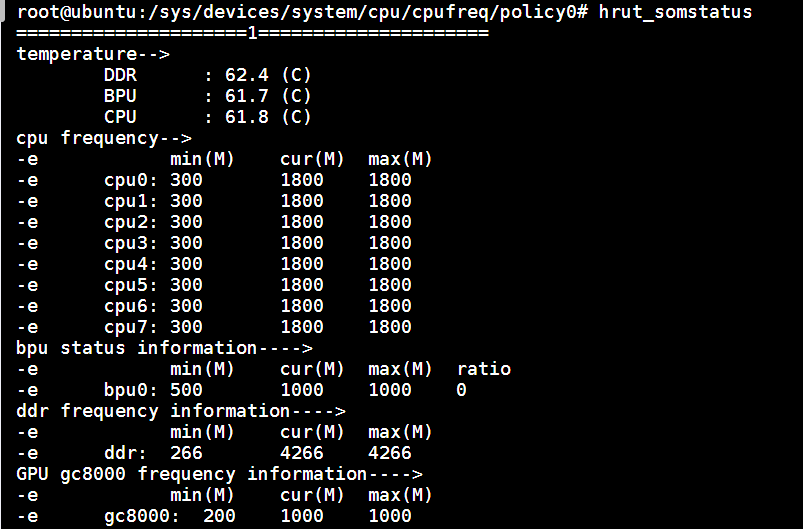

# 2.4.2 RDK X5 Thermal和CPU频率管理

## Thermal控制

### 温度传感器
在X5上有三个温度传感器，用于显示DDR/BPU/CPU的温度 在/sys/class/hwmon/下有hwmon0目录下包含温度传感器的相关参数 temp1_input是DDR的温度，temp2_input是BPU的温度，temp3_input是CPU的温度 温度的精度为0.001摄氏度

```bash
cat /sys/class/hwmon/hwmon0/temp1_input
46643
```
> BPU的温度传感器位于bpu subsytem，bpu subsystem只有在bpu运行时才会上电，所以只有bpu运行时，bpu的温度才可以查看。

### Thermal
Linux Thermal 是 Linux 系统下温度控制相关的模块，主要用来控制系统运行过程中芯片产生的热量，使芯片温度和设备外壳温度维持在一个安全、舒适的范围。

要想达到合理控制设备温度，我们需要了解以下三个模块：

获取温度的设备：在 Thermal 框架中被抽象为 Thermal Zone Device，X5上有两个thermal zone，分别是thermal_zone0和thermal_zone1；

需要降温的设备：在 Thermal 框架中被抽象为 Thermal Cooling Device，有CPU、BPU、GPU和DDR；

控制温度策略：在 Thermal 框架中被抽象为 Thermal Governor;

以上模块的信息和控制都可以在 /sys/class/thermal 目录下获取。

在X5里面一共有四个cooling(降温)设备：

- cooling_device0: cpu

- cooling_device1: bpu

- cooling_device2: gpu

- cooling_device3: ddr

其中，cooling设备DDR与thermal_zone0关联，cooling 设备CPU/BPU/GPU与thermal_zone1关联。 目前默认的策略通过以下命令可知是使用的 step_wise。

```bash
cat /sys/class/thermal/thermal_zone0/policy
```
通过以下命令可看到支持的策略：user_space、step_wise一共两种。

```bash
cat /sys/class/thermal/thermal_zone0/available_policies
```
user_space 是通过uevent将温区当前温度，温控触发点等信息上报到用户空间，由用户空间软件制定温控的策略。

step_wise 是每个轮询周期逐级提高冷却状态，是一种相对温和的温控策略

具体选择哪种策略是根据产品需要自己选择。可在编译的时候指定或者通过sysfs动态切换。 例如：动态切换thermal_zone0的策略为 user_space模式
```bash
echo user_space > /sys/class/thermal/thermal_zone0/policy
```
在thermal_zone0中有1个trip_point，用于控制cooling设备DDR的调频温度

可通过sysfs查看DDR的调频温度，当前配置的为95度

```bash
cat /sys/devices/virtual/thermal/thermal_zone0/trip_point_0_temp
```
若想调整DDR的调频温度，如85度，可通过如下命令：

```bash
echo 85000 > /sys/devices/virtual/thermal/thermal_zone0/trip_point_0_temp
```
在thermal_zone1中有3个trip_point，其中trip_point_0_temp为预留作用；trip_point_1_temp是该thermal zone的调频温度，可控制CPU/BPU/GPU的频率，当前设置为95度。trip_point_2_temp为关机温度，当前设置为105度 例如想要结温到85摄氏度，CPU/BPU/GPU开始调频：

```bash
echo 85000 > /sys/devices/virtual/thermal/thermal_zone1/trip_point_1_temp
```
如果想要调整关机温度为105摄氏度：

```bash
echo 105000 > /sys/devices/virtual/thermal/thermal_zone1/trip_point_2_temp
```
> 以上设置断电重启后需要重新设置

## CPU频率管理

在linux内核中，自带了cpufreq子系统用来控制cpu的频率和频率控制策略。

进入目录`/sys/devices/system/cpu/cpufreq/policy0`，`ls` 一下，会看到目录中有如下文件：

```shell
affected_cpus						// 当前控制影响的CPU核(没有显示处于offline状态的cpu)
cpuinfo_cur_freq					// 当前CPU频率(单位: KHz）
cpuinfo_max_freq					// 当前调频策略下CPU可用的最高频率(单位: KHz）
cpuinfo_min_freq					// 当前调频策略下CPU可用的最低频率(单位: KHz）
cpuinfo_transition_latency			// 处理器切换频率所需要的时间(单位:ns)
related_cpus						// 该控制策略影响到哪些CPU核(包括了online+offline的所有cpu)
scaling_available_frequencies		// CPU支持的主频率列表(单位: KHz）
scaling_available_governors			// 当前内核中支持的所有 governor(调频)类型
scaling_boost_frequencies			// 在boost（超频）模式下CPU支持的主频率列表(单位: KHz）
scaling_cur_freq					// 保存着 cpufreq 模块缓存的当前 CPU 频率，不会对 CPU 硬件寄存器进行检查。
scaling_disable_freq				// 禁止设置的CPU频率，只能设置一个
scaling_driver						// 当前使用的调频驱动
scaling_governor					// governor(调频)策略
scaling_max_freq					// 当前调频策略下CPU可用的最高频率（从cpufreq模块缓存中读取）
scaling_min_freq					// 当前调频策略下CPU可用的最低频率（从cpufreq模块缓存中读取）
scaling_setspeed					// 需将governor切换为userspace才能使用，往这个文件echo数值，会切换频率 
```

目前支持的频率包括
```shell
cat /sys/devices/system/cpu/cpufreq/policy0/scaling_available_frequencies
300000 600000 1200000 1500000
```

RDK X5系统使用的linux内核支持以下种类的调频策略:

- 性能（performance）：总是将CPU置于最高能耗也是最高性能的状态，即硬件所支持的最高频。
- performance：以最高频率执行
- ondemand：按照负载调整频率
- userspace：根据用户的设置频率
- powersave：以最低频率执行
- schedutil：按照负载调整频率，它是与CPU调度器结合来使用

用户可以通过控制目录`/sys/devices/system/cpu/cpu0/cpufreq/`下的对应设置来控制CPU的调频策略。

例如让CPU运行在性能模式：

```shell
echo performance >/sys/devices/system/cpu/cpu0/cpufreq/scaling_governor
```

或者控制CPU运行在一个固定的频率（1.2GHz）：

```shell
echo userspace >/sys/devices/system/cpu/cpu0/cpufreq/scaling_governor
echo 1200000 >/sys/devices/system/cpu/cpufreq/policy0/scaling_setspeed
```

### CPU超频

开发板采用CPU Freq驱动对CPU工作状态进行管理，默认模式为`schedutil`模式，此时CPU工作频率会根据负载进行动态调节，以节省功耗。用户可修改到`performance`模式，使CPU始终运行在最高频率下，命令如下：

```bash
echo performance >/sys/devices/system/cpu/cpu0/cpufreq/scaling_governor
```

开发板在系统中提供了超频功能，可将CPU最高频率从1.5GHz提升到1.8GHz，配置命令如下：

```bash
echo 1 >/sys/devices/system/cpu/cpufreq/boost
echo performance >/sys/devices/system/cpu/cpu0/cpufreq/scaling_governor
```

使用以上命令配置的 CPU 频率仅在当前运行中生效，如果设备重启则恢复默认配置。

:::info 注意
CPU超频会增加芯片的功耗和发热，如出现稳定性问题，可通过如下命令关闭超频功能：

```bash
echo 0 >/sys/devices/system/cpu/cpufreq/boost
```

:::

可通过`sudo hrut_somstatus`命令查看当前芯片工作频率、温度等状态： 


