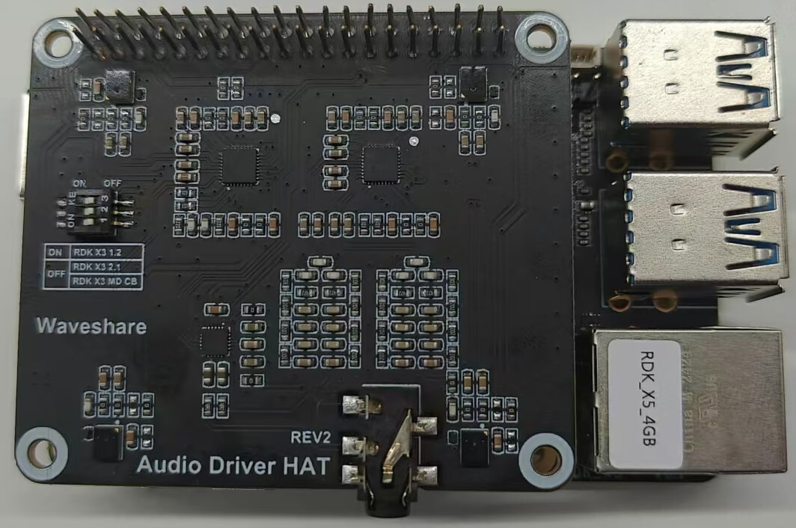
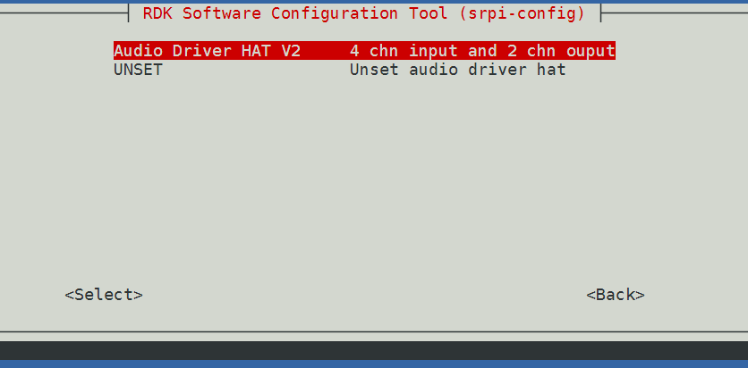

# 3.2.3 RDK X5 系列音频使用指南

RDK X5 集成了ES8326，用户还可以对接种音频板来扩展音频功能，满足不同语音场景的功能需，下面将对板载音频codec 和 音频板的使用方法进行详细介绍。

:::note 提示

如果安装驱动后提示Miniboot版本不是最新，请进入`1 System Options` -> `S7 Update Miniboot` 更新miniboot

:::


## 板载ES8326

板载Audio codec es8326可提供基础的音频功能，需要插上3.5mm音频接口才能收音和播放。

### 使用方法
可以使用amix或者tinyalsa等用户空间的接口来使用。__注意！！！__ 调整增益或者测试的时候，最好不要戴耳机操作命令，以免突然噪声或者响度过大损害听力。__保险的操作方法是__：命令先执行，观察响度或者噪音在承受范围内再对比观察。

<details>
  <summary>有关 amixer 的部分使用注意点可以点击查看</summary>

  我们发现有些小伙伴在使用的时候可能会插上一些USB音频设备，导致复制粘贴下文的参考命令无法正常使用。

  嵌入式音频设备中一般通过 `cat /proc/asound/cards`可以看到有多少张声卡，每张的序号。
  插上USB设备之后重启，UAC设备声卡首先注册上，执行上述命令可能出现如下打印：

```
  0 [RC08           ]: USB-Audio - ROCWARE RC08
                      ROCWARE RC08 at usb-xhci-hcd.2.auto-1.2, high speed
  1 [duplexaudio    ]: simple-card - duplex-audio
                      duplex-audio
```
  此时我们发现板载audio声卡的序号变为了1，amixer或者tinymix在没有指定device和card编号的时候，默认
  都是使用序号为0的设备，所以此时我们在查看板载声卡的controls等属性的时候可以使用如下命令：

```
  amixer -D 0 -c 1 controls
```
  此时如果我们想要通过amixer调整麦克风增益，可以通过如下命令来尝试设置：
```
  amixer -D 0 -c 1 sget 'ADC PGA Gain',0
```
</details>


### 录音播放测试
我们可以使用如下命令简单测试一下是否能正常录制和播放声音：

- 录制命令：
```
# arecord -Dhw:0,0 -c 2 -r 48000 -f S24_LE -t wav -d 10 /userdata/record1.wav
Recording WAVE '/userdata/record1.wav' : Signed 24 bit Little Endian, Rate 48000 Hz, Stereo
#
```
观察到屏幕输出正常的录制log，等待大概10s（-d 10 中的10代表10秒），录制结束，就可以通过如下命令来播放刚刚的录音了。

- 播放命令：
```
# aplay -D hw:0,0 /userdata/record1.wav
Playing WAVE '/userdata/record1.wav' : Signed 24 bit Little Endian, Rate 48000 Hz, Stereo
#
```

如果觉得录制的声音太小，可以通过如下方式查看和修改麦克风收音的增益。

- 查询命令：
```
# amixer sget 'ADC PGA Gain',0
Simple mixer control 'ADC PGA Gain',0
  Capabilities: volume volume-joined
  Playback channels: Mono
  Capture channels: Mono
  Limits: 0 - 10
  Mono: 0 [0%] [0.00dB]
```
上述命令执行之后，我们可以看到返回值中 "Mono: 0 [0%] [0.00dB]" 这一句，代表了当前值是0。


- 调整增益命令：
```
# amixer sset 'ADC PGA Gain',0 10
Simple mixer control 'ADC PGA Gain',0
  Capabilities: volume volume-joined
  Playback channels: Mono
  Capture channels: Mono
  Limits: 0 - 10
  Mono: 10 [100%] [30.00dB]
```
上述命令是将ADC PGA Gain调满，达到了10。


## Audio Driver HAT REV2

:::note 提示

安装音频子卡驱动后，card 0是子卡注册的设备，原本的板载音频现在是card 1

:::

### 产品简介

Audio Driver HAT REV2是由微雪电子生产的一款音频转接板，采用ES7210+ES8156双Codec方案，可实现环形4MIC录音、双通道音频播放、音频信号回采功能，转接板外观如下图：


关于音频转接板的详细介绍，请参考[Audio Driver HAT](https://www.waveshare.net/shop/Audio-Driver-HAT.htm)。

### 安装方法

1. 按照下图方式，将转接板接入RDK X5 的40pin header  
  
并将拨码开关全部拨到**off**


2. 使用`srpi-config`配置音频板  
进入`3 Interface Options`->`I5 Audio`  
选择`Audio Driver HAT V2`：
  


3. 运行命令`sync && reboot`重启开发板，如`/dev/snd`下出现如下设备节点，说明转接板安装成功
    ```shell
    root@ubuntu:/userdata# ls /dev/snd
    by-path  controlC0  controlC1  pcmC0D0c  pcmC0D1p  pcmC1D0c  pcmC1D0p  timer
    ```
    其中，pcmC0D0c  pcmC0D1p 是ES7210+ES8156注册的音频设备，pcmC1D0c  pcmC1D0p是板载音频注册的音频设备


### 卸载方法
1. 使用`srpi-config`配置音频板   
进入`3 Interface Options`->`I5 Audio`  
选择`UNSET`,即可卸载音频驱动和相关配置

### 音频节点
该音频板在`RDK X5`上的的播放节点为`pcmC1D1p`，录制节点为`pcmC1D0c`

### 录音播放测试

测试使用`tinyalsa`库的工具集：使用`tinycap`进行录制，使用`tinyplay`进行播放

`tinycap`使用说明：
```shell
tinycap
Usage: tinycap {file.wav | --} [-D card] [-d device] [-c channels] [-r rate] [-b bits] [-p period_size] [-n n_periods] [-t time_in_seconds]

Use -- for filename to send raw PCM to stdout
```
`tinyplay`使用说明：
```shell
tinyplay
usage: tinyplay file.wav [options]
options:
-D | --card   <card number>    The device to receive the audio
-d | --device <device number>  The card to receive the audio
-p | --period-size <size>      The size of the PCM's period
-n | --period-count <count>    The number of PCM periods
-i | --file-type <file-type >  The type of file to read (raw or wav)
-c | --channels <count>        The amount of channels per frame
-r | --rate <rate>             The amount of frames per second
-b | --bits <bit-count>        The number of bits in one sample
-M | --mmap                    Use memory mapped IO to play audio
```
如果想了解更多关于`tinyalsa`库的信息，请查阅它们的[仓库地址](https://github.com/tinyalsa/tinyalsa)

- 2通道麦克风录音：

```
tinycap ./2chn_test.wav -D 0 -d 1 -c 2 -b 16 -r 48000 -p 512 -n 4 -t 5
```

- 4通道麦克风录音：

```
tinycap ./4chn_test.wav -D 0 -d 1 -c 4 -b 16 -r 48000 -p 512 -n 4 -t 5
```

- 双通道音频播放（不支持直接播放4通道录音）：

```
tinyplay ./2chn_test.wav -D 0 -d 0
```