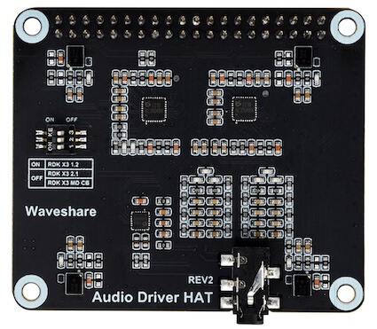
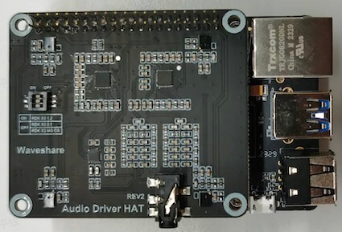
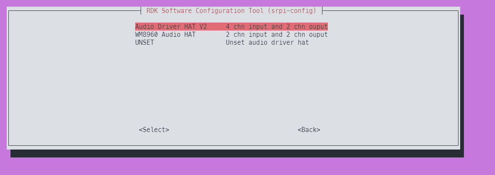

# 微雪 Audio Driver HAT REV2

## 产品简介

Audio Driver HAT REV2是由微雪电子生产的一款音频转接板，采用ES7210+ES8156双Codec方案，可实现环形4麦克风录音、双通道音频播放、音频信号回采等功能。转接板外观如下图：



关于音频子板的详细介绍，请参考[Audio Driver HAT](https://www.waveshare.net/shop/Audio-Driver-HAT.htm)。

## 安装方法

- ### 硬件部署

1. 按照下图方式，将转接板接入RDK X3的40pin header。  


2. 使用命令`cat /sys/class/socinfo/som_name`，查询开发板类型，并根据返回值设置音频子板的拨码开关状态。
   - 返回值为5或者6时，3个拨码开关全部拨到`ON`位置。
   - 返回值为8时，3个拨码开关全部拨到`OFF`位置。


- ### 软件配置

1. 使用`srpi-config`配置音频板  
进入`3 Interface Options`->`I5 Audio`  
选择`Audio Driver HAT V2`：
  

2. 运行命令`sync && reboot`重启开发板，如/dev/snd下出现如下设备节点，说明转接板安装成功。
    ```shell
    root@ubuntu:/userdata# ls /dev/snd
    by-path  controlC0  pcmC0D0c  pcmC0D1p  timer
    ```

- ### 卸载方法
1. 使用`srpi-config`配置音频板   
进入`3 Interface Options`->`I5 Audio`  
选择`UNSET`,即可卸载音频驱动和相关配置

2. 将载板拔掉。

## 运行

检查声卡是否存在，检查设备编号。

通过如下命令确认声卡是否注册
```
cat /proc/asound/cards 
```

通过如下命令确认功能设备的位置
```
cat /proc/asound/devices
```

- ### 录音
2通道麦克风录音：

```
tinycap ./2chn_test.wav -D 0 -d 0 -c 2 -b 16 -r 48000 -p 512 -n 4 -t 5
```

4通道麦克风录音：

```
tinycap ./4chn_test.wav -D 0 -d 0 -c 4 -b 16 -r 48000 -p 512 -n 4 -t 5
```


- ### 播放

双通道音频播放：

```
tinyplay ./2chn_test.wav -D 0 -d 1
```

- ### 音频回采测试

该音频板的播放回采信号，使用了录音通道7&8，因此需要使用8通道录音命令进行采集。

启动8通道麦克风录音
```shell
tinycap ./8chn_test.wav -D 0 -d 0 -c 8 -b 16 -r 48000 -p 512 -n 4 -t 5
```

启动双通道音频播放
```
tinyplay ./2chn_test.wav -D 0 -d 1
```

录制完成后，可使用音频软件查看`2chn_test.wav`文件中通道7&8的频谱信息。

## 常见问题

1、RDK X3 Module不支持老款Audio Driver HAT REV1音频板，请用户使用REV2版本。

[更多问题可以查看如下链接](../../../08_FAQ/04_multimedia.md#audio-常见问题)