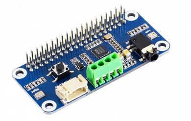
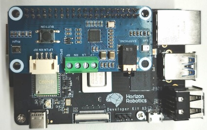
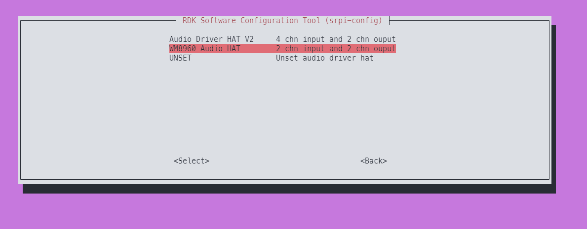

# 微雪 WM8960 Audio HAT

## 产品简介
WM8960 Audio HAT是由微雪电子生产的一款音频转接板，采用WM8960 Codec方案，可实现双通道麦克风录音、音频播放功能，转接板外观如下图：



关于音频转接板的详细介绍，请参考[WM8960音频转接板](https://www.waveshare.net/wiki/WM8960_Audio_HAT)。

## 安装方法

- ### 硬件部署

1. 按照下图方式，将转接板接入RDK X3的40pin header  


- ### 软件配置

2. 使用`srpi-config`配置音频板  
进入`3 Interface Options`->`I5 Audio`  
选择`WM8960 Audio HAT`：
  


3. 运行命令`sync && reboot`重启开发板，如`ls /dev/snd`下出现如下设备节点，说明转接板安装成功
    ```shell
    root@ubuntu:~# ls /dev/snd/
    by-path  controlC0  pcmC0D0c  pcmC0D0p  pcmC0D1c  pcmC0D1p  timer
    ```
该音频板在`RDK X3`上的的播放节点为`pcmC0D0p`，录制节点为`pcmC0D1c`

- ### 卸载方法
1. 使用`srpi-config`配置音频板   
进入`3 Interface Options`->`I5 Audio`  
选择`UNSET`,即可卸载音频驱动和相关配置

2. 将载板拔掉。

## 运行

### 1. 检查声卡设备

首先，确认声卡是否被系统正确识别和注册。

- 查看已注册的声卡列表：

    ```shell
    cat /proc/asound/cards
    ```
    输出示例：
    ```
     root@ubuntu:~# cat /proc/asound/cards
     0 [hobotsnd6      ]: hobotsnd6 - hobotsnd6
                          hobotsnd6


    ```
    若能看到类似“ hobotsnd6 ”的条目，说明声卡已被识别。

- 查看声卡下的功能设备：
    ```shell
    cat /proc/asound/devices
    ```
    输出示例：
    ```
    root@ubuntu:~# cat /proc/asound/devices
        2: [ 0]   : control
        3: [ 0- 0]: digital audio playback
        4: [ 0- 0]: digital audio capture
        5: [ 0- 1]: digital audio playback
        6: [ 0- 1]: digital audio capture
        33:        : timer

    ```

### 2. 录音操作

- **2通道麦克风录音**  
    使用tinycap录制2通道音频，参数说明如下：
    - `-D 0`：声卡编号（以上操作查看）
    - `-d 0`：设备编号（以上操作查看）
    - `-c 2`：通道数（2通道）
    - `-b 16`：位宽16bit
    - `-r 48000`：采样率48kHz
    - `-p 512`：每帧采样点数
    - `-n 4`：缓冲区数量
    - `-t 5`：录音时长5秒

    ```shell
    tinycap ./2chn_test.wav -D 0 -d 0 -c 2 -b 16 -r 48000 -p 512 -n 4 -t 5
    ```

### 3. 播放操作

- **双通道音频播放**  
    使用tinyplay播放录制好的音频文件，常用参数如下：
    - `-D 0`：声卡编号
    - `-d 1`：播放设备编号（以上操作查看）

    ```shell
    tinyplay ./2chn_test.wav -D 0 -d 1
    ```


## 常见问题排查

- 若未检测到声卡，请检查硬件连接和拨码开关设置是否正确。
- 若录音或播放无声，请确认音频文件格式、通道数与命令参数一致。

如遇其他问题，可参考[音频常见问题](../../../08_FAQ/04_multimedia.md#audio-常见问题)获取更多帮助。
