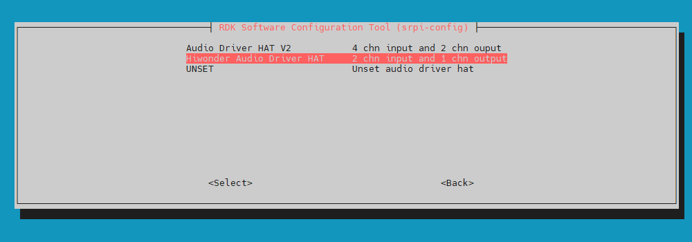

# 幻尔载板

## 产品简介
该载板集合了多种外设，如下是对音频部分的使用说明。

## 安装方法

- ### 硬件部署
参考其余音频板卡，40pin 2 40pin进行连接

- ### 软件配置
1. 使用`srpi-config`配置音频板  
进入`3 Interface Options`->`I5 Audio`  
选择`Hiwonder Audio Driver HAT`：
  

2. 根据提示执行`reboot`命令，或者运行命令`sync && reboot`重启开发板，`cat /proc/asound/cards`出现了`duplexaudioi2s1`的声卡，说明转接板安装成功。

```shell
root@ubuntu:~# cat /proc/asound/cards 
 0 [duplexaudioi2s1]: simple-card - duplex-audio-i2s1
                      duplex-audio-i2s1
 1 [duplexaudio    ]: simple-card - duplex-audio
                      duplex-audio
```

- ### 卸载方法
1. 使用`srpi-config`配置音频板   
进入`3 Interface Options`->`I5 Audio`  
选择`UNSET`,即可卸载音频驱动和相关配置

2. 将载板拔掉。

## 运行
检查声卡是否存在，检查设备编号。

通过如下命令确认声卡是否注册(上述有提到)
```shell
root@ubuntu:~# cat /proc/asound/cards 
 0 [duplexaudioi2s1]: simple-card - duplex-audio-i2s1
                      duplex-audio-i2s1
 1 [duplexaudio    ]: simple-card - duplex-audio
                      duplex-audio
```

通过如下命令确认逻辑设备
```shell
root@ubuntu:~# cat /proc/asound/devices
  2: [ 0- 0]: digital audio playback
  3: [ 0- 1]: digital audio capture
  4: [ 0]   : control
  5: [ 1- 0]: digital audio playback
  6: [ 1- 0]: digital audio capture
  7: [ 1]   : control
 33:        : timer
```

通过如下命令检查用户空间的实际设备文件
```shell
root@ubuntu:~# ls /dev/snd/
by-path  controlC0  controlC1  pcmC0D0p  pcmC0D1c  pcmC1D0c  pcmC1D0p  timer
```
通过上述查询，结合[板载 Earphone 音频口](in_board_es8326.md#运行)的介绍，可以确认，声卡0对应的是 `Hiwonder Audio Driver HAT` 节点；设备也是存在的, 且设备号为 `0-0` 和 `0-1` , 实际我们操作的设备应该是`pcmC0D0p 和 pcmC0D1c`。

板载声卡对应的是1，设备号为`1-0`，这里我们不会用到它。


- ### 录音
使用如下命令先进行录制
```
arecord -Dhw:0,0 -c 2 -r 48000 -f S32_LE -t wav -d 10 /userdata/record1.wav
```

- ### 播放
使用如下命令将刚刚录制的声音回放出来
```
aplay -D hw:0,0 /userdata/record1.wav
```

## 常见问题
[可以查看如下链接](../../../08_FAQ/04_multimedia.md#audio-常见问题)