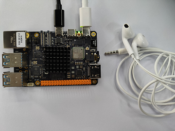
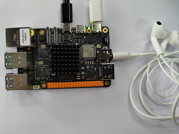
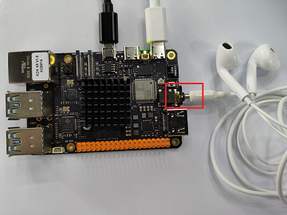
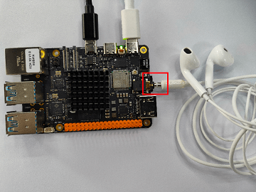

# 板载 Earphone 音频口

## 产品简介
    自带 3.5mm 音频口，可以搭配 4 段式耳机或者符合接口的其他设备使用。

## 安装方法

接 上3.5mm 耳机孔，这里要注意，耳机也需要是 4 段式的，3 段是的接口一般没有 MIC(microphone)。



耳机孔需要完全对接上，正确示范如下图：



如下是错误的示范：




上图中的错误示范可以看到，耳机都有金属接口漏出来，这样导致设备连接不完整，即使程序能正常运行，\
也无法听到声音或者录制声音。

## 运行

检查声卡是否存在，检查设备编号。

通过 `cat /proc/asound/cards` 命令确认声卡是否注册

```shell
 0 [duplexaudio    ]: simple-card - duplex-audio
                      duplex-audio
```

通过 `cat /proc/asound/devices` 命令确认逻辑设备

```shell
root@ubuntu:~# cat /proc/asound/devices
  2: [ 0- 0]: digital audio playback
  3: [ 0- 0]: digital audio capture
  4: [ 0]   : control
 33:        : timer
```

通过 `ls /dev/snd/` 命令检查用户空间的实际设备文件
```shell
root@ubuntu:~# ls /dev/snd/
by-path/   controlC0  pcmC0D0c   pcmC0D0p   timer    
```

通过上述查询，可以确认，声卡0对应的是板载声卡；设备也是存在的, 且设备号为 `0-0` , 实际我们操作的设备应该是 `pcmC0D0p` 和 `pcmC0D0c`。

- ### 录音

运行以下命令：

```
arecord -Dhw:0,0 -c 2 -r 48000 -f S24_LE -t wav -d 10 /userdata/record1.wav
```

输出如下，此时应正常录制音频文件：

```
Recording WAVE '/userdata/record1.wav' : Signed 24 bit Little Endian, Rate 48000 Hz, Stereo
```

观察到屏幕输出正常的录制log，等待大概10s（-d 10 中的10代表10秒），录制结束，就可以通过如下命令来播放刚刚的录音了。

- ### 播放

运行以下命令：

```
aplay -D hw:0,0 /userdata/record1.wav
```

输出如下，此时应正常播放音频文件：

```
Playing WAVE '/userdata/record1.wav' : Signed 24 bit Little Endian, Rate 48000 Hz, Stereo
```
正常情况下，可以在耳机中听到刚刚录制的声音。

## 常见问题
1、[USB 声卡和板载声卡如何区分使用](../../../08_FAQ/04_multimedia.md#usb-声卡和板载声卡如何区分使用)

[更多问题可以查看如下链接](../../../08_FAQ/04_multimedia.md#audio-常见问题)
