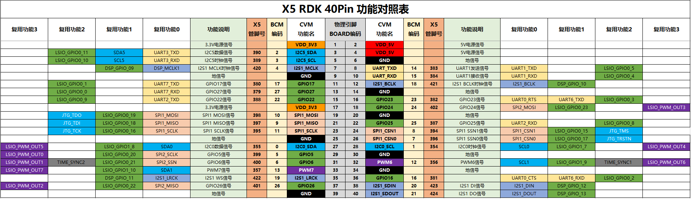

# 3.3.1 管脚定义与应用

```mdx-code-block
import Tabs from '@theme/Tabs';
import TabItem from '@theme/TabItem';
```

开发板上的 40PIN 功能管脚，接口定义请查看本章节。

## 管脚复用关系配置

40PIN 的管脚会按照本章节所示，默认使能 UART、SPI、I2C、I2S 等专用功能，如需将特定管脚配置成 GPIO 功能，需要通过 `srpi-config` 配置工具进行配置。

注意，`srpi-config` 程序需要在**全屏命令行窗口**中运行，方法如下：

```
sudo srpi-config
```


选择 `3 Interface Options` -> `I3 Peripheral bus config` 进到如下总线配置界面


`okay`配置对应管脚为专用功能，`disabled` 关闭该管脚的专用功能，可以用作 GPIO ，配置 **重启** 后生效。

- 键盘上、下键选择功能项， 回车键开关功能
- 键盘左、右键选择  Select 和 Exit ，回车键确认

## 40PIN 管脚定义{#40pin_define}

开发板提供40PIN标准接口，方便用户进行外围扩展，其中数字IO采用3.3V电平设计。40PIN接口定义如下：

<Tabs groupId="rdk-type">
<TabItem value="x3" label="RDK X3">


开发板40PIN接口位置提供了丝印网表，方便用户对照操作，PIN1、PIN40位置如下：


</TabItem>

<TabItem value="x3md" label="RDK X3 Module">


</TabItem>

<TabItem value="ultra" label="RDK Ultra">


</TabItem>

<TabItem value="rdkx5" label="RDK X5">



</TabItem>

</Tabs>

## GPIO 读写操作示例

Video: https://www.bilibili.com/video/BV1rm4y1E73q/?p=16

开发板 `/app/40pin_samples/` 目录下，预置了多种40PIN管脚的功能测试代码，包括gpio的输入/输出测试、PWM、I2C、SPI、UART等测试。所有测试程序均使用python语言编写，详细信息可以查阅本章节其他模块。

以`/app/40pin_samples/button_led.py`为例，该程序配置`37`号管脚为输入，配置`36`号管脚配置为输出，并根据`37`号管脚的输入状态来控制`36`号管脚的输出状态。

## 环境准备
使用杜邦线连接 `37`号管脚到 3.3v or GND，以控制其高低电平。

## 运行方式
执行 `button_led.py` 程序，以启动 GPIO 读写程序

  ```bash
  sunrise@ubuntu:~$ cd /app/40pin_samples/
  sunrise@ubuntu:/app/40pin_samples$ sudo python3 ./button_led.py
  ```

## 预期效果
通过控制`37`号管脚的高低电平，可以改变 `36`号管脚的输出电平值。

  ```bash
  sunrise@ubuntu:/app/40pin_samples$ sudo python3 ./button_led.py
  Starting demo now! Press CTRL+C to exit
  Outputting 0 to Pin 36
  Outputting 1 to Pin 36
  Outputting 0 to Pin 36
  ```
