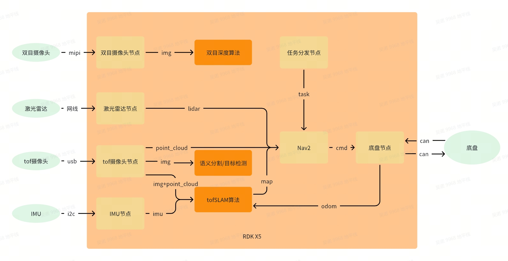
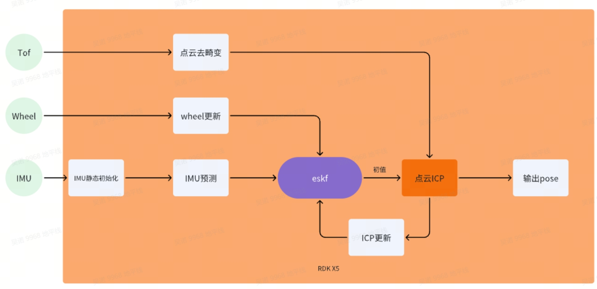
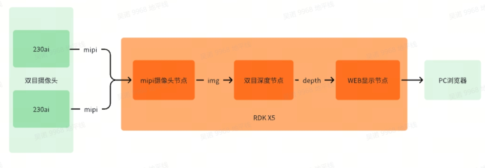
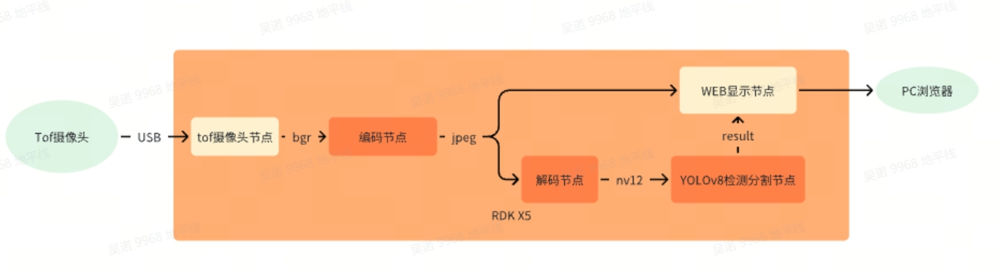
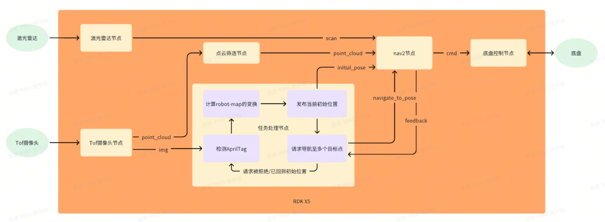

# 6.2 AMR开发指南
自主移动机器人（Autonomous Mobile Robot，AMR）是一类能够在环境中自主导航和执行任务的机器人。AMR 不同于自动导航车辆 (AGV)，AGV依赖于轨道或预定义路线，并且通常需要操作员监督。AMR 通过多传感器融合、人工智能、机器学习等多种技术来理解环境并在其中导航，不受有线电源的限制。因其高度灵活的移动能力和智能导航系统，AMR在工业自动化、物流、医疗等领域得到了广泛应用。

## 1.  样例介绍

### 1.1 外观效果


### 1.2 功能框架



## 2. 样例组装

### 2.1 组件清单
|  名称                     | 数量      | 备注    |
| -------------------------| ---------| --------|
| RDK X5                   | 1        | 地瓜     |
| AMR底盘（舵轮）+上装+螺丝零件| 1        | 煜禾森     |
| 单线激光雷达               | 1        | 氪见   |
| tof摄像头                 | 1        | 光鉴   |
| 双目摄像头（230ai）        | 1        |  地瓜配件  |
| IMU（BMI088）             | 1        | 地瓜配件  |
| usb转网口转换器            | 1        |    |
| 0.3m网线                 | 1        |    |
| 12v转5V4A(MAX 5A)        | 1        |    |
| tof相机支架（3D打印）        | 1        |    |
| 双目相机支架（3D打印）        | 1        |    |
| 盖板（3D打印）              | 1        |    |
| m2*16螺丝+m2螺母           | 1        |    |

### 2.2 组装步骤讲解

#### 2.2.1 底盘上装安装
原生底盘无法安装摄像头以及存放各种线缆，所以需要另外的上装接入底盘，只需将上装底部的两个孔位对齐底盘安装滑轨上的零件，锁紧螺丝即可


#### 2.2.2 RDK X5接线
所有传感器以及底盘都直接接入RDK X5，需要注意双目摄像头使用的是两根同面的22pin排线，请按照下图所示方向安装


#### 2.2.3 盖板安装
盖板为3D打印件（图纸见文末附件），主要用于安装RDK X5并且收纳其余线缆。黄框位置四个安装孔用于安装RDK X5，安装位置在上盖板的背面。红框位置的安装孔对齐底盘安装滑轨上的零件，锁紧螺丝即可。


#### 2.2.4 激光雷达模块接入
先将激光雷达安装至载板上，螺丝从载板背面安装，然后将接线穿过载板上的孔洞（右图中黄框所示）连接电源管理器。电源管理器安装在载板背面，螺丝从载板正面安装（如左图红框所示），安装完成后接入网线以及12V电源，网线与电源线穿过上装的孔洞（右图中红框所示）。


#### 2.2.5 摄像头安装

#####   1. tof摄像头安装
首先将tof摄像头、3D打印件、钣金支架连接在一起，注意3D打印件凹槽朝下。连接完成后将整体塞入上装上方凹槽，电源线与信号线从上装内部孔洞穿过（图3黄框）。钣金件的螺丝孔位（图1红框）与上装内部螺丝孔位（图3红框）对齐，锁紧螺丝即可。


#####   2. 双目摄像头安装
先将双目摄像头与3D打印件连接，然后接入底盘尾部的钣金支架即可


#### 2.2.6 电源说明
底盘上提供12V的电源。12V提供给雷达，tof摄像头以及变压器，变压器输出5V提供给RDK X5


#### 2.2.7 其他部件安装


## 3. 运行环境准备
:::info 注意

tof相机、激光雷达、底盘、imu请根据实际设备型号获取代码或者功能包，此处仅提供地瓜配件imu的源代码。
:::

### 3.1 传感器检查
#### 3.1.1 双目摄像头
```shell
#检查i2c设备
root@ubuntu:~# i2cdetect -y -r 4
     0  1  2  3  4  5  6  7  8  9  a  b  c  d  e  f
00:                         -- -- -- -- -- -- -- --
10: -- -- -- -- -- -- -- -- -- -- -- -- -- -- -- --
20: -- -- -- -- -- -- -- -- -- -- -- -- -- -- -- --
30: -- -- 32 -- -- -- -- -- -- -- -- -- -- -- -- --
40: -- -- -- -- -- -- -- -- -- -- -- -- -- -- -- --
50: 50 -- -- -- -- -- -- -- 58 -- -- -- -- -- -- --
60: -- -- -- -- -- -- -- -- -- -- -- -- -- -- -- --
70: -- -- -- -- -- -- -- --

root@ubuntu:~# i2cdetect -y -r 6
     0  1  2  3  4  5  6  7  8  9  a  b  c  d  e  f
00:                         -- -- -- -- -- -- -- --
10: -- -- -- -- -- -- -- -- -- -- -- -- -- -- -- --
20: -- -- -- -- -- -- -- -- -- -- -- -- -- -- -- --
30: 30 -- -- -- -- -- -- -- -- -- -- -- -- -- -- --
40: -- -- -- -- -- -- -- -- -- -- -- -- -- -- -- --
50: 50 -- -- -- -- -- -- -- 58 -- -- -- -- -- -- --
60: -- -- -- -- -- -- -- -- -- -- -- -- -- -- -- --
70: -- -- -- -- -- -- -- --
```

#### 3.1.2 雷达
```shell
#确保雷达与板子的网关与掩码一致，确认是否能ping通
ping 雷达ip
```

#### 3.1.3 底盘
```shell
#启动can设备，请根据具体can设备号以及波特率设置
ip link set can1 up type can bitrate 500000

#检查设备，会有如下输出：can1: <NOARP,UP,LOWER_UP> mtu 16 qdisc mq state UP mode DEFAULT group default qlen 10link/can 
ip link show can1

#检查能否获取can数据，请根据具体can设备号设置
candump can1
```

#### 3.1.4 IMU
```shell
#检查i2c设备 
root@ubuntu:~# i2cdetect -y -r 5
     0  1  2  3  4  5  6  7  8  9  a  b  c  d  e  f
00:                         -- -- -- -- -- -- -- --
10: -- -- -- -- -- -- -- -- -- 19 -- -- -- -- -- --
20: -- -- -- -- -- -- -- -- -- -- -- -- -- -- -- --
30: -- -- -- -- -- -- -- -- -- -- -- -- -- -- -- --
40: -- -- -- -- -- -- -- -- -- -- -- -- -- -- -- --
50: -- -- -- -- -- -- -- -- -- -- -- -- -- -- -- --
60: -- -- -- -- -- -- -- -- -- 69 -- -- -- -- -- --
70: -- -- -- -- -- -- -- --

#获取imu数据(会打印三个数，且随着imu的位姿变化)
cat /sys/devices/virtual/input/input2/acc_bal
cat /sys/devices/virtual/input/input2/gry_bal
```

### 3.2 功能安装
```shell
sudo apt -y tros-hobot-nav2 ros-foxy-navigation2 ros-foxy-nav-msgs
```

### 3.3 源码获取（无安装包的功能，需编译源码）
```shell
mkdir -p ~/amr_ws/src && cd src
#tofSLAM 
git clone https://github.com/wunuo1/Tofslam_ros2.git

#点云过滤
git clone https://github.com/wunuo1/voxel_filter.git

#指定位置导航
git clone https://github.com/wunuo1/pose_setter.git

#双目深度
git clone https://github.com/D-Robotics/hobot_stereonet.git
```

### 3.4 代码编译
```shell
cd ~/amr_ws
source /opt/tros/humble/setup.bash
colcon build
```

### 3.5 传感器标定
#### 3.5.1 标定前准备
##### 1. 标定环境准备（标定工具为kalibr，此处提供包含kalibr以及其他标定脚本的dokcer）
###### i. 下载docker文件
链接：https://pan.baidu.com/s/1yN5aj3quDJU182rYI0AK8A?pwd=31un 
提取码：31un
###### ii. 创建环境
```shell
#加载docker
docker load -i ubuntu18.04_calibration.tar

#检查docker是否加载成功（出现TAG为calibration的镜像）
docker images

#从image生成containe
docker run -it --privileged -v /home/nuo.wu/share_dir:/share_dir -e DISPLAY=$DISPLAY -e GDK_SCALE -e GDK_DPI_SCALE --net=host ubuntu18.04:calibration /bin/bash
```
###### iii.docker支持界面显示
```shell
# 在host端运行
xhost +local:docker
# 在host端运行以下指令
echo $DISPLAY
# 在docker运行以下指令
echo $DISPLAY
# 查看两者输出是否相同
# 若两者输出不同,若host端显示的结果是:0, 则在docker里运行以下指令
export DISPLAY=:0
```
##### 2. 准备标定板并配置参数
棋盘格或aprilgrid均可（aprilgrid文件见附件）。棋盘格尺寸方格边长>=10cm为宜，且为避免标定时棋盘格角点提取/连线出错问题，棋盘格行列应不同。aprilgrid标定板数据采集时比较方便，操作简单，但对图像质量的要求较高，则目前阶段还是建议使用棋盘格。标定板外尺寸> 1m。


```shell
#设置aprilgrid.yaml文件
target_type: 'aprilgrid' #gridtype
tagCols: 6               #number of apriltags
tagRows: 6               #number of apriltags
tagSize: 0.024           #size of apriltag, edge to edge [m]
tagSpacing: 0.3083          #ratio of space between tags to tagSize
codeOffset: 0            #code offset for the first tag in the aprilboard
```

```shell
#设置棋盘格标定板参数，其中targetCols，targetRows分别为每列、每行的内点数，如格子数为9列x8列，则内角点数为8列x7列。
target_type: 'checkboard' 
targetCols: 8 
targetRows: 7  
rawSpacingMeters: 0.1        
colSpacingMeters: 0.1    
```

#### 3.5.2 双目摄像头内参标定（双目深度算法使用）

#####     1. 标定数据采集
不同的距离移动相机或标定板，确保标定板尽可能覆盖图像的FOV范围，移动过程中，棋盘格标定板不要移出画面。稳慢速移动相机或标定板，避免图像因运动导致的模糊。

######      i. 启动双目摄像头
```shell
source /opt/tros/humble/setup.bash
ros2 run mipi_cam mipi_cam --ros-args -p device_mode:="dual" -p out_format:="nv12" -p dual_combine:=2 -p framerate:=10.0 --log-level warn
```

######      ii. ros1与ros2消息转换并保存图像数据集（ubuntu20.04系统，已安装ros1与ros2）
```shell
#安装ros1_bridge
sudo apt update
sudo apt install ros-foxy-ros1-bridge

#启动终端
source /opt/ros/noetic/setup.bash
roscore

#启动新终端
source /opt/ros/noetic/setup.bash
source /opt/ros/foxy/setup.bash
ros2 run ros1_bridge dynamic_bridge --bridge-all-topics=false --bridge-topic sensor_msgs/msg/Image /image_combine_raw

#启动新终端 记录图像数据（移动摄像头至不同位置）
source /opt/ros/noetic/setup.bash
rosbag record image_combine_raw
```

######     iii. 调用标定程序进行标定（需指定记录的bag包路径以及标定配置文件的路径）
```shell
$1=path_to_bag
$2=path_to_calib_yaml(checkbord.yaml or aprilgrid.yaml)
rosrun kalibr kalibr_calibrate_cameras --bag $1 --topics /camera/left/image_raw /camera/right/image_raw --models pinhole-radtan pinhole-radtan --target $2 --show-extraction
```
######     iv. 标定完成后，标定文件如下
```yaml
cam0:
  cam_overlaps: [1]
  camera_model: pinhole
  distortion_coeffs: [-0.30512368344314034, 0.06869074995752597, -0.0007768971335288749, -0.0018077365618742228]
  distortion_model: radtan
  intrinsics: [874.7756769752957, 876.9016366753913, 988.9147013767086, 574.9147170323885]
  resolution: [1920, 1080]
  rostopic: /camera/left/image_raw
cam1:
  T_cn_cnm1:
  - [0.9998783828690954, -0.0007967376839525958, 0.015575130180209843, -0.06826569753821157]
  - [0.0008025928358794327, 0.9999996095896897, -0.0003696825565397285, 8.695548926243514e-05]
  - [-0.01557482955949466, 0.0003821380847083855, 0.9998786319622305, 0.0011080079883866683]
  - [0.0, 0.0, 0.0, 1.0]
  cam_overlaps: [0]
  camera_model: pinhole
  distortion_coeffs: [-0.30647450034075296, 0.06904546877578269, -0.0015178028297652521, -0.00016199661118514476]
  distortion_model: radtan
  intrinsics: [875.6405166670517, 877.1839943792446, 963.0392879775055, 519.3086364230766]
  resolution: [1920, 1080]
  rostopic: /camera/right/image_raw
```

#### 3.5.3 单目摄像头内参标定（用于后续imu与rgb_cam的外参标定，若使用模组已提供内参，则忽略此步骤）
#####    1. 运行摄像头（请根据实际使用的模组运行指令执行）
#####    2. 记录为ros1的bag包（ros1与ros2的转换可参考双目内参标定）
#####    3. 运行标定指令（docker镜像中）
```shell
#cam.bag记录的bag文件  /image相机话题  pinhole-radtan相机模型  checkborad.yaml标定板描述文件
rosrun kalibr kalibr_calibrate_cameras --bag cam.bag --topic /image --model pinhole-radtan --target checkboard.yaml
```

#####     4. 标定完成后内容如下（distortion_coeffs：畸变系数     intrinsics：内参）


#### 3.5.4 IMU参数标定（用于imu与rgb_cam的外参标定）
#####        1. 数据采集
######      i. 运行imu
```shell
source ~/amr_ws/install/setup.bash 
ros2 launch imu_sensor imu_sensor.launch.py
```

######      ii. ros1与ros2消息转换并保存图像数据集（ubuntu20.04系统，已安装ros1与ros2）
```shell
#启动终端
source /opt/ros/noetic/setup.bash
roscore

#启动新终端
source /opt/ros/noetic/setup.bash
source /opt/ros/foxy/setup.bash
ros2 run ros1_bridge dynamic_bridge --bridge-all-topics=false --bridge-topic sensor_msgs/msg/Imu /imu_data

#启动新终端 记录imu数据（imu需静置30min以上，存储数据）
source /opt/ros/noetic/setup.bash
rosbag record imu_data
```

######      iii. 修改脚本文件参数（docker环境中）
```shell
vim /root/catkin_ws/src/imu_utils/launch/oal.launch

#imu_topic         imu的topic
#data_save_path    标定文件的保存路径
#max_time_min      采集imu数据的时间长短
```
######      iv. 运行标定脚本（待imu bag数据播放完毕会打印标定结果）
```shell
roslaunch imu_utils oal.lauch
```


######      v.播放imu的bag数据
```shell
rosbag play imu.bag
```

######    vi. 修改IMU的参数配置文件


```shell
# 将上文生成的 BMI088_imu_param.yaml文件重新复制一份，作为备份，后续需要使用，执行如下命令：
cp -r BMI088_imu_param.yaml imu.yaml

vim imu.yaml
```

配置文件打开后，如下图所示：


将原始的 BMI088_imu_param.yaml 文件内容重写，修改为如下格式：
```yaml
#Accelerometers
accelerometer_noise_density: 3.0219972277096316e-02   #Noise density (continuous-time)对应上述截图中的 Acc->avg-axis->acc_n
accelerometer_random_walk:   1.9955401630133244e-04   #Bias random walk 对应上述截图中的 Acc->avg-axis->acc_w
 
#Gyroscopes
gyroscope_noise_density:     2.8131368978892658e-03   #Noise density (continuous-time)对应上述截图中的 Gyr->avg-axis->gyr_n
gyroscope_random_walk:       1.9705283783356781e-05   #Bias random walk 对应上述截图中的 Gyr->avg-axis->gyr_w
 
rostopic:                    /imu_data     #the IMU ROS topic 对应上文生成rosbag格式数据章节数据bag中topic里面的/imu_data
update_rate:                 400.0      #Hz (for discretization of the values above)对应真实使用的IMU频率
```

#### 3.5.5 rgb_cam-imu外参标定（用于获取tof_cam-imu的变换）
#####     1. 启动双目摄像头
```shell
source /opt/tros/humble/setup.bash
ros2 run mipi_cam mipi_cam --ros-args -p device_mode:="dual" -p out_format:="nv12" -p dual_combine:=2 -p framerate:=10.0 --log-level warn
```

#####    2. 启动imu
```shell
source ~/amr_ws/install/setup.bash 
ros2 launch imu_sensor imu_sensor.launch.py
```

#####    3. ros1与ros2消息转换并保存图像数据集（ubuntu20.04系统，已安装ros1与ros2）
```shell
#安装ros1_bridge
sudo apt update
sudo apt install ros-foxy-ros1-bridge

#启动终端
source /opt/ros/noetic/setup.bash
roscore

#启动新终端
source /opt/ros/noetic/setup.bash
source /opt/ros/foxy/setup.bash
ros2 run ros1_bridge dynamic_bridge --bridge-all-topics

#启动新终端 记录图像数据（移动摄像头至不同位置）
source /opt/ros/noetic/setup.bash
rosbag record /image_combine_raw /imu_data
```

#####     4. 运行标定程序
```shell
rosrun kalibr kalibr_calibrate_imu_camera --bag cam_imu.bag --target april.yaml --cam cam.yaml --imu imu.yaml
```


标定结束后，查看标定结果(当dJ收敛,降低到0.1以下时,表示标定准确)
```shell
# storage-results-imucam.txt 
vim storage-results-imucam.txt
```
外参结果如下：


#### 3.5.6 其他
#####    1. rgb_cam-tof_cam变换由模组给出，tof_cam-bask_link变换由设备装配图纸给出。
#####    2. tof_cam-imu的变换（用于tofSLAM），可通过rgb_cam-imu与rgb_cam-tof_cam变化得到（变换矩阵相乘）
#####    3. bask_link-imu的变换（用于tofSLAM），可通过tof_cam-imu与tof_cam-bask_link变化得到（变换矩阵相乘）

### 3.6 更改配置文件（用于tofSLAM）
修改config文件夹下mapping.yaml文件，关注带有说明的参数：
```yaml
YAML: 1.0

preprocess:
  point_filter_num: 3  #点云下采样
  lidar_type: 7  # 1-AVIA 2-velodyne 3-ouster  4-robosense 5-pandar 6-dtof 7-mtof
  blind: 0.01


common:
  imu_topic: /imu #imu消息名称
  lid_topic: /nebula/mtof_points2 #点云或雷达消息名称
  odom_topic: /odom  #里程计消息
  img_topic: /camera/color/image_raw/compressed #rgb图像消息，可使用压缩消息也可用原图
  Localization_mode: False #是否进行定位，否则为建图
  output_path: /home/slam_ws_2/output #存放建图产物的路径
  model_path: /home/slam_ws_2/output/hfnet.onnx #指定hfnet模型路径
  imuhz: 400 #imu的频率
 
mapping:
  extrinsic_est_en: true
  #tof到imu的变化，获取方式请查看标定说明
  tof2imu_extrinsic_T: [ -0.0039799203111821468, -0.027189542185995823831, -0.14001955020902342461]
  tof2imu_extrinsic_R: [-0.993063627638373553564 ,0.052518963674774226572 ,-0.01498737732389914978, 
                        -0.033814436045461613632 ,-0.016796566829113524293 ,-0.99928717438014507495, 
                        -0.00801808196977665167 ,-0.99847864521832871386  ,0.03465425204866725379]
  
  #bask_link到imu的变化，获取方式请查看标定说明
  robot2imu_extrinsic_T: [0.12588064308116462841, 0.008162559660163853708, 0.20705414746130172184]
  robot2imu_extrinsic_R: [0.052268869631951098023, -0.93852017660344945467, 0.033846560965168889575, 
                          0.93808656435923075909, -0.051737213472478319612, 0.015014368436287678477, 
                          0.033019704102458273174        , 0.01675474093936925155, 0.99931446977489903968]


delay_time: 0.3

odometry:
  wheelmode: 1 #0-relativepose 1-velocity
  max_trans_diff: 0.1
  max_drift_num: 15
  surf_res: 0.1 #0.4
  log_print: true
  max_num_iteration: 5
  # ct_icp
  icpmodel: CT_POINT_TO_PLANE  # CT_POINT_TO_PLANE  #CT_POINT_TO_PLANE                    # Options: [CT_POINT_TO_PLANE, POINT_TO_PLANE]
  size_voxel_map: 0.1 #0.4                         # The voxel size of in the voxel map
  min_distance_points: 0.05
  max_num_points_in_voxel: 20                 # The maximum number of points per voxel of the map
  max_distance: 50.0                        # The threshold of the distance to suppress voxels from the map
  weight_alpha: 0.9
  weight_neighborhood: 0.1
  max_dist_to_plane_icp: 0.1 #0.3
  init_num_frames: 20
  voxel_neighborhood: 1
  max_number_neighbors: 20
  threshold_voxel_occupancy: 1
  estimate_normal_from_neighborhood: true
  min_number_neighbors: 20                    # The minimum number of neighbor points to define a valid neighborhood
  power_planarity: 2.0
  num_closest_neighbors: 1

  sampling_rate: 1.0
  ratio_of_nonground: 2
  # max_num_residuals: 1000
  max_num_residuals: 2000
  min_num_residuals: 100
  motion_compensation: CONSTANT_VELOCITY #NONE #CONSTANT_VELOCITY  #CONTINUOUS #NONE, CONSTANT_VELOCITY, ITERATIVE, CONTINUOUS
  beta_location_consistency: 1.0
  beta_orientation_consistency: 1.0
  beta_constant_velocity: 1.0
  beta_small_velocity: 0.0

  thres_translation_norm: 0.03
  thres_orientation_norm: 0.05

  use_ground_constraint: 0

#以下为定位功能参数
reloc:
  mapfile: /home/slam_ws_2/output/final-voxel.pcd #pcd点云地图路径，建图完成的产物
  reloc_mode: 1  #0-scancontext 1-hfnet  2-no   #重定位检测方式，0为点云检测，1为特征点检测
  scancontext_dbfile: /home/slam_ws_2/output/ScanContext.bin #点云检测模型路径
  hfnet_dbfile: /home/slam_ws_2/output/HFNet.bin #特征点检测模型路径
  icp_threshold: 0.03
```

## 4. 功能体验
### 4.1 tofSLAM建立三维地图
```shell
#确保完成运行环境准备中提及的各项内容
#确保建图开始时请确保摄像头可以看到完整的apriltag，且各类话题参数匹配，运行后会在output文件夹下生成map坐标系到apriltag的变换
source ~/amr_ws/install/setup.bash
ros2 run demo demo --ros-args -p build_map:=true

#config配置文件中Localization_mode参数设置为False，且各类话题参数匹配
source ~/amr_ws/install/setup.bash
ros2 run ct_lio ct_lio_eskf
```

启动之后需静置3~4秒，让imu初始化成功，随后可移动机器人进行建图，建立完成后关闭程序。运行完成后如下图所示：

在mapping.yaml文件中指定的路径会生成以下产物


使用pcl_viewer工具查看点云地图：


建图效果视频：
Video: https://www.bilibili.com/video/BV1T4tKeoEsH

### 4.2 tofSLAM定位
```shell
#确保完成运行环境准备中提及的各项内容，config配置文件中Localization_mode参数设置为True，且各类话题参数匹配
source ~/amr_ws/install/setup.bash
ros2 run ct_lio ct_lio_eskf
```
启动后，当显示帧序号一直为1，说明还未重定位成功

当帧序号大于1，说明重定位成功，可开启rviz2查看路径


### 4.3 三维点云地图转二维栅格地图
该功能包为开源功能包，为ros1的功能包，请在已安装ros1的环境下使用，使用方法如下：

####  1. 源码下载与编译
```shell
mkdir -p ~/pcd3d-2d/src && cd ~/pcd3d-2d/src
git clone https://github.com/Hinson-A/pcd2pgm_package
cd ..
source /opt/ros/noetic/setup.bash
catkin_make
```

####   2. 运行功能
```shell
source /opt/ros/noetic/setup.bash
source ~/pcd3d-2d/devel/setup.bash

#将launch文件中的pcd文件路径更换为实际路径
roslaunch pcd2pgm run.launch
```

####  3. 保存地图
```shell
#开启新的终端（需安装ros-noetic-map-server）
source /opt/ros/noetic/setup.bash
rosrun map_server map_saver
```
执行后会在当前路径下生成map.pgm和map.yaml文件，这两个文件可用于nav2，使用时需更换hobot_nav2的maps文件夹中的文件，一般路径为/opt/tros/humble/share/hobot_nav2/maps，点云地图以及栅格地图效果如下：


### 4.4 定点位置导航
####   1. 启动tof摄像头，激光雷达，底盘，imu
```shell
#各传感器启动请根据实际的设备运行相应指令，此处仅给出imu启动指令
source /opt/tros/humble/setup.bash
ros2 launch imu_sensor imu_sensor.launch.py

#打开新终端，启动点云过滤
ros2 run point_cloud_processing point_cloud_sparsification
```

####   2. 启动nav2导航功能
```shell
source /opt/tros/humble/setup.bash
ros2 launch hobot_nav2 hobot_nav2_bringup.launch.py
```

####   3. 启动定点位置导航功能（确保启动后摄像头图像中能看到完整的AprilTag）
```shell
source ~/amr_ws/install/setup.bash
ros2 run demo demo
```

####  4. PC端打开rviz查看导航效果
```shell
ros2 launch nav2_bringup rviz_launch.py
```
Video: https://www.bilibili.com/video/BV1t4tKeoEgh

### 4.5 目标检测与分割
####  1. 复制该launch脚本到板端，更改对应参数：
```shell
import os
from launch import LaunchDescription
from launch_ros.actions import Node
from launch.actions import IncludeLaunchDescription
from launch.launch_description_sources import PythonLaunchDescriptionSource, AnyLaunchDescriptionSource
from ament_index_python import get_package_share_directory

def generate_launch_description():
    #将tof摄像头发布的bgr8图像编码为jpeg，用于web端展示
    bgr2jpeg =  Node(
        package='hobot_codec',
        executable='hobot_codec_republish',
        output='screen',
        parameters=[{
            'in_mode': 'ros',
            'in_format': 'bgr8',
            'out_mode': 'ros',
            'out_format': 'jpeg',
            'sub_topic': '/nebula200/stof_rgb/image_raw',
            'dump_output': False
        }],
        arguments=['--ros-args', '--log-level', 'warn']
    )
    #将jpeg图像解码为nv12，用于yolov8推理
    jpeg2nv12 =  Node(
        package='hobot_codec',
        executable='hobot_codec_republish',
        output='screen',
        parameters=[{
            'in_mode': 'ros',
            'in_format': 'jpeg',
            'out_mode': 'ros',
            'out_format': 'nv12',
            'channel': 1,
            'sub_topic': '/image_raw/compressed',
            'dump_output': False,
            'pub_topic': '/image'
        }],
        arguments=['--ros-args', '--log-level', 'warn']
    )
    #运行yolov8检测分割
    yolov8 =  Node(
        package='dnn_node_example',
        executable='example',
        output='screen',
        parameters=[{
            'feed_type': 1,
            'is_shared_mem_sub': 0,
            'config_file': 'config/yolov8segworkconfig.json'
        }],
        arguments=['--ros-args', '--log-level', 'warn']
    )
    #启动web端展示功能
    web_node = IncludeLaunchDescription(
        PythonLaunchDescriptionSource(
            os.path.join(
                get_package_share_directory('websocket'),
                'launch/websocket.launch.py')),
        launch_arguments={
            'websocket_image_topic': '/image_raw/compressed',
            'websocket_image_type': 'mjpeg',
            'websocket_smart_topic': '/hobot_dnn_detection'
        }.items()
    )

    return LaunchDescription([
        bgr2jpeg,
        jpeg2nv12,
        yolov8,
        web_node
    ])
```

####  2. 将命令中path_of_launch_file更换为自己的launch文件路径，运行命令
```shell
source /opt/tros/humble/setup.bash
ros2 launch <path_of_launch_file>
```

####  3. 同一局域网下的PC打开浏览器，在网址处输入：板子ip:8000，即可查看识别效果


## 5. 代码介绍
### 5.1 tofSLAM
#### 5.1.1 代码仓库：
https://github.com/wunuo1/TofSLAM_ros2

#### 5.1.2 工程框架逻辑：


#### 5.1.3 详细说明：
#####  1. ESKF（Error State Kalman Filter）
误差状态卡尔曼滤波器，是一种传感器融合的算法。它基于经典的卡尔曼滤波器（Kalman Filter, KF）原理，并对其进行改进，以更好地处理非线性系统中的误差传播

*状态量*：p、R、v、bg、ba、g

*预测模型*：IMU


*观测（更新）模型 1*：底盘轮速&底盘imu通过EKF计算的位姿——松耦合（R、p更新）

*观测（更新）模型 2*：点云ICP计算得到的位姿——松耦合（R、p更新）

#####   2. IMU静态初始化
imu初始化保持静态，根据加速度计估计出重力方向、陀螺仪零偏、加速度计零偏，设置初始位姿为原点，初始速度为0

#####  3. 地图格式：哈系体素地图
用一个哈系列表来保存体素地图，每个体素（0.1×0.1×0.1）里面保存若干个点，点与点之间保持一定距离（0.05）。


#####  4. 点云ICP
###### 1. 关键点提取：对每一帧的点云采用gridsample的方法进行降采样，提取关键点。
对于每个关键点：

    1. 寻找最近邻：通过voxelmap，在相邻的voxel中寻找距离最近的N个点qi作为邻居点。
    2. 计算邻居点的法向n、协方差矩阵和平滑度权重a
    3. 计算关键点到邻居点所在平面的距离，满足距离小于阈值的点对，加入icp优化。


#####  5. CT_ICP算法（CT-ICP: Real-time Elastic LiDAR Odometry with Loop Closure）
######    1. 前端位姿估计
CTICP算法前端部分整体框架对于每一帧使用了两个pose来描述：

不需要再提前对每一帧点云单独去运动畸变了，而是直接在优化过程中去畸变，该算法对于高速运动更鲁棒。

优化方程：


######    2. 后端回环优化
每次取Nmap帧scan拼成点云，把每个点插入到一个2D高程网格中。再由2D高程网格生成2D高程图，每个像素对应Z轴最大的点。对2D高程图进行特征提取，提取的特征与2D高程网格一起随着关键帧保存在内存中。当每次提取完高程图特征后都与内存中的特征进行匹配；对匹配成功的高程图对先用Ransac估计一次2D变换矩阵，根据内点个数来验证匹配可信度；再用2D变换矩阵作为初值，对2D高程网格中的点云进行ICP，最终为成功匹配的关键帧添加一条边，使用g2o进行姿态图优化。（该方法只适用于平面运动）


### 5.2 双目深度
#### 5.2.1 代码仓库:
https://github.com/D-Robotics/hobot_stereonet.git

#### 5.2.2 工程逻辑框架:



#### 5.2.3 详细说明：
#####  1. 双目深度感知原理：


#####  2. 双目立体匹配算法步骤:


#####  3. 模型介绍

    1. Backbone：MixVarGENet+UNet。针对X5优化的高效backbone+UNet恢复细节；
    2. Cost Volume：Groupwise Correlation Cost Volume。计算左右图特征相关性构建cost volume；
    3. Cost Aggregation：UNet。通过UNet对cost volume进行aggregation，更精细化的整合cost volume；
    4. Refinement：GRU。采用GRU模块带来边缘细节的性能提升。
    5. Spatial Upsampling：使用Conv代替Unfold操作进行张量的切分，通过加权组合来生成完整分辨率的视差图


### 5.3 目标检测与分割
#### 5.3.1 代码仓库:
https://github.com/D-Robotics/hobot_dnn/tree/

#### 5.3.2 工程逻辑框架:


#### 5.3.3 详细说明：
  1. 使用模型为官版yolov8-seg，源码仓库链接https://github.com/ultralytics/ultralytics
  2. 编解码功能使用RDK X5上的硬件单元加速，大幅降低CPU占用的同时提升格式转换效率
  3. 工程使用代码为tros的hobot_dnn_example，除yolov8-seg外，同时支持多种模型的推理使用

### 5.4 导航以及任务调度
#### 5.4.1 代码仓库:
https://github.com/wunuo1/pose_setter.git

#### 5.4.2 工程逻辑框架:


#### 5.4.3 详细说明：
  1. 程序在启动进行AprilTag检测，检测成功后，会缓存十帧的变换并取平均值。以此得到rgb到AprilTag的变换，读取建图时记录的map到AprilTag的变换，计算出rgb到map的变换。而前期的标定过程中，已经可以计算出rgb到robot的变换，所以可以得到robot到map的变换，以此发布机器人在map坐标系下的初始位置。
  2. 初始位置发布完成之后，激活线程开始请求导航到目标位置，若请求被拒绝，则说明姿态初始化失败，重新发布初始位置。
  3. 请求导航到多个目标位置，只有前一个目标位置导航成功之后，才会激活线程进行下一个请求
  4. 当初始位置之后，会进行AprilTag的检测，并重复循环进行之前的步骤
  5. nav2导航插件中，在障碍物层增加了点云信息做，用于避开高度低于激光雷达的障碍物，但因原生点云数据会有噪声，并且点云数据量过多，所以增加点云筛选节点对点云进行稀疏化以及过滤。

## 6. 附件
链接：https://pan.baidu.com/s/14A4mqJvqzfp-MZaQkGpvLg?pwd=8VpL
提取码：8VpL