# 显示屏使用

RDK X5提供一路MIPI DSI接口，一路HDMI接口，display只能选择其中的一路，默认是HDMI。

可以通过以下指令切换HDMI输出，和MIPI DSI输出。

切换成MIPI DSI
```bash
mv /etc/X11/xorg.conf.d/xorg_dsi_ignore.conf /etc/X11/xorg.conf.d/xorg_dsi_ignore.conf.disable
mv /etc/X11/xorg.conf.d/xorg_hdmi_ignore.conf.disable /etc/X11/xorg.conf.d/xorg_hdmi_ignore.conf
```
切换成HMDI
```bash
mv /etc/X11/xorg.conf.d/xorg_dsi_ignore.conf /etc/X11/xorg.conf.d/xorg_dsi_ignore.conf.disable
mv /etc/X11/xorg.conf.d/xorg_hdmi_ignore.conf.disable /etc/X11/xorg.conf.d/xorg_hdmi_ignore.conf
```
也可以通过srpi-config来选择输出方式，可以参考 [Dsiplay Chose DSI or HDMI](../../../System_configuration/srpi-config#display-options) 章节


## HDMI

RDK X5支持的最大分辨率为1080P60，系统默认分辨率为720P60。

默认分辨率可以通过修改`/etc/X11/xorg.conf.d/1-resolution.conf`文件来实现：

```bash
Section "Screen"
    Identifier "Screen0"
    Device "Device0"
    Monitor "Monitor0"
    DefaultDepth 24
    SubSection "Display"
        Depth 24
        Modes "1280x720"
    EndSubSection
EndSection
```
- 对接最大分辨率小于1280x720的屏幕，可以根据实际情况，调整`Modes`，可以解决出不了图的问题。
- 对接2K，4K屏幕，建议将`Modes`设置为`1920x1080`，这受限于RDK X5 的视频转换芯片的性能。

## MIPI DSI

RDK X5提供一路MIPI DSI接口，支持多种LCD屏幕的接入。

### 支持列表

| 供应商 | 型号 | 描述 | 购买链接 | 使用指南 |
| --------- | -------- | --------------- | --------- | --------- |
| 微雪 | 2.8inch DSI LCD | 2.8寸IPS全贴合电容触控屏小屏幕480×640像素 DSI通信  | [购买链接](https://www.waveshare.net/shop/2.8inch-DSI-LCD.htm)  |  [2.8inch DSI LCD](display#28inch-dsi-lcd)  |
| 微雪 | 3.4inch DSI LCD (C) | 3.4寸DSI圆形电容触控屏 800×800像素 IPS显示面板 十点触控  | [购买链接](https://www.waveshare.net/shop/3.4inch-DSI-LCD-C.htm)  |  [3.4inch DSI LCD](display#34inch-dsi-lcd)  |
| 微雪 | 4.3inch DSI LCD | 树莓派4.3寸电容触控屏 800×480 IPS广视角 MIPI DSI接口  | [购买链接](https://www.waveshare.net/shop/4.3inch-DSI-LCD.htm)  |  [4.3inch DSI LCD](display#43inch-dsi-lcd)  |
| 微雪 | 7inch DSI LCD (C) | 7寸IPS电容触控屏1024×600像素 DSI通信  | [购买链接](https://www.waveshare.net/shop/7inch-DSI-LCD-C.htm)  |  [7inchC DSI LCD](display#7inchc-dsi-lcd)  |
| 微雪 | 7.9inch DSI LCD | 7.9寸IPS电容触控屏超长屏幕400×1280像素 DSI通信  | [购买链接](https://www.waveshare.net/shop/7.9inch-DSI-LCD.htm)  |  [7.9inch DSI LCD](display#79inch-dsi-lcd)  |
| 微雪 | 8inch DSI LCD (C) | 树莓派系列显示屏 8寸IPS电容触控屏 1280×800像素 DSI通信  | [购买链接](https://www.waveshare.net/shop/8inch-DSI-LCD-C.htm)  |  [8inch DSI LCD](display#8inch-dsi-lcd)  |
| 微雪 | 10.1inch DSI LCD (C) | 树莓派 dsi接口显示屏 10.1寸IPS电容触控屏 1280×800像素 DSI通信  | [购买链接](https://www.waveshare.net/shop/10.1inch-DSI-LCD-C.htm)  |  [10.1inch DSI LCD](display#101inch-dsi-lcd)  |

### 2.8inch DSI LCD

#### 硬件连接

屏幕连接方式如下图所示：

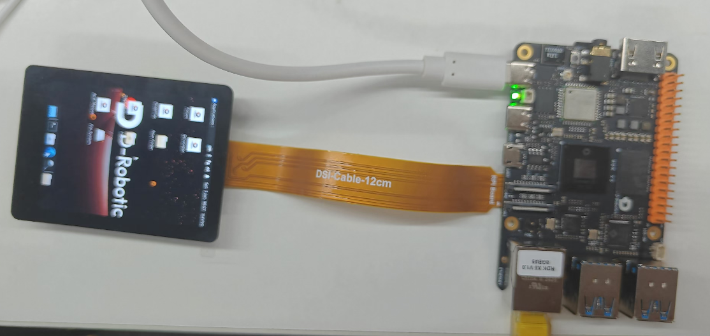

用DSI-Cable-12cm线材，将2.8inch DSI LCD连接到X5 rdk主板的22PIN DSI1接口。

#### 软件配置

1，由于RDK X5 系统默认采用HDMI输出，需要通过命令切换到MIPI DSI显示方式。
```bash
mv /etc/X11/xorg.conf.d/xorg_dsi_ignore.conf /etc/X11/xorg.conf.d/xorg_dsi_ignore.conf.disable
mv /etc/X11/xorg.conf.d/xorg_hdmi_ignore.conf.disable /etc/X11/xorg.conf.d/xorg_hdmi_ignore.conf
```
也可以通过srpi-config来选择输出方式，可以参考 [Dsiplay Chose DSI or HDMI](../../../System_configuration/srpi-config#display-options) 章节

2，打开`/boot/config.txt`文件，在config.txt最后加入以下代码，保存，退出，重启系统

```bash
dtoverlay=dsi-waveshare-panel-overlay-2_8_inch
```

### 3.4inch DSI LCD

#### 硬件连接

屏幕连接方式如下图所示：

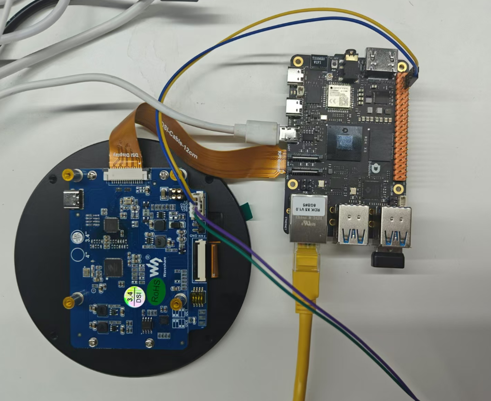

用DSI-Cable-12cm线材，将3.4inch DSI LCD连接到X5 rdk主板的22PIN DSI1接口。

通过4PIN顶针连通5V供电，包括5V和GND。

#### 软件配置

1，由于RDK X5 系统默认采用HDMI输出，需要通过命令切换到MIPI DSI显示方式。
```bash
mv /etc/X11/xorg.conf.d/xorg_dsi_ignore.conf /etc/X11/xorg.conf.d/xorg_dsi_ignore.conf.disable
mv /etc/X11/xorg.conf.d/xorg_hdmi_ignore.conf.disable /etc/X11/xorg.conf.d/xorg_hdmi_ignore.conf
```
也可以通过srpi-config来选择输出方式，可以参考 [Dsiplay Chose DSI or HDMI](../../../System_configuration/srpi-config#display-options) 章节

2，打开`/boot/config.txt`文件，在config.txt最后加入以下代码，保存，退出，重启系统

```bash
dtoverlay=dsi-waveshare-panel-overlay-3_4_inch
```

#### 效果演示

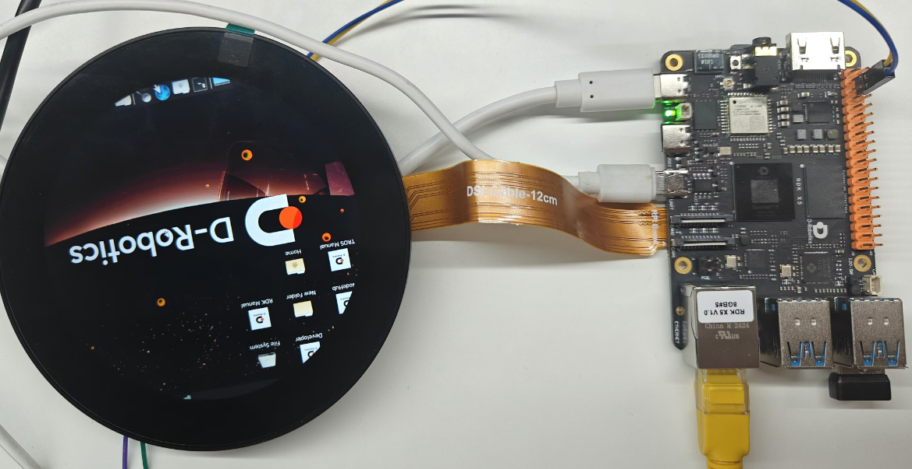

### 4.3inch DSI LCD

#### 硬件连接

屏幕连接方式如下图所示：

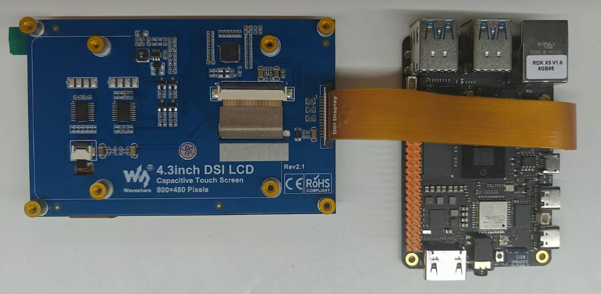

用DSI-Cable-12cm线材，将4.3inch DSI LCD连接到X5 rdk主板的22PIN DSI1接口。

#### 软件配置

1，由于RDK X5 系统默认采用HDMI输出，需要通过命令切换到MIPI DSI显示方式。
```bash
mv /etc/X11/xorg.conf.d/xorg_dsi_ignore.conf /etc/X11/xorg.conf.d/xorg_dsi_ignore.conf.disable
mv /etc/X11/xorg.conf.d/xorg_hdmi_ignore.conf.disable /etc/X11/xorg.conf.d/xorg_hdmi_ignore.conf
```
也可以通过srpi-config来选择输出方式，可以参考 [Dsiplay Chose DSI or HDMI](../../../System_configuration/srpi-config#display-options) 章节

2，打开`/boot/config.txt`文件，在config.txt最后加入以下代码，保存，退出，重启系统

```bash
dtoverlay=dsi-waveshare-panel-overlay-4_3_inch
```

#### 效果演示

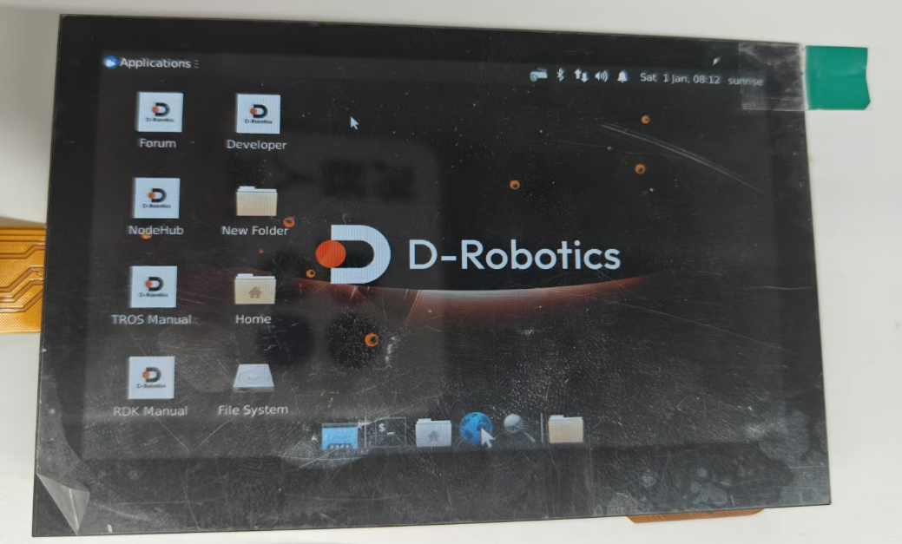

### 7inchC DSI LCD

#### 硬件连接

屏幕连接方式如下图所示：

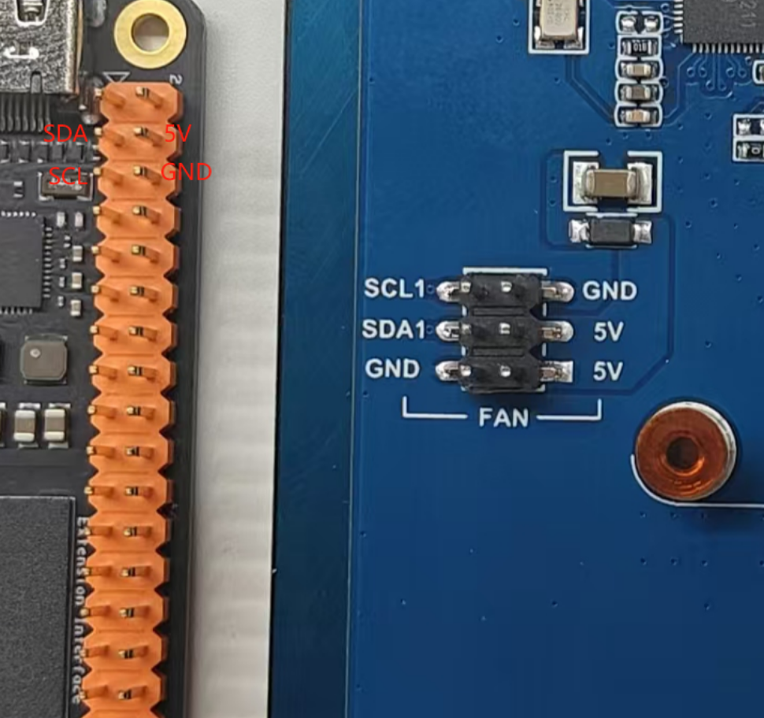
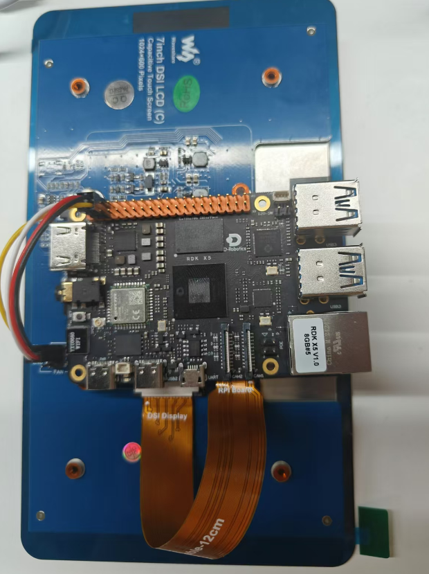

用DSI-Cable-12cm线材，将7inchC DSI LCD连接到X5 rdk主板的22PIN DSI1接口。

并通过4PIN杜邦线连接5V供电和I2C5通信。

#### 软件配置

1，由于RDK X5 系统默认采用HDMI输出，需要通过命令切换到MIPI DSI显示方式。
```bash
mv /etc/X11/xorg.conf.d/xorg_dsi_ignore.conf /etc/X11/xorg.conf.d/xorg_dsi_ignore.conf.disable
mv /etc/X11/xorg.conf.d/xorg_hdmi_ignore.conf.disable /etc/X11/xorg.conf.d/xorg_hdmi_ignore.conf
```
也可以通过srpi-config来选择输出方式，可以参考 [Dsiplay Chose DSI or HDMI](../../../System_configuration/srpi-config#display-options) 章节

2，打开`/boot/config.txt`文件，在config.txt最后加入以下代码，保存，退出，重启系统

```bash
dtoverlay=dsi-waveshare-panel-overlay-7_0_inchC
```

#### 效果演示

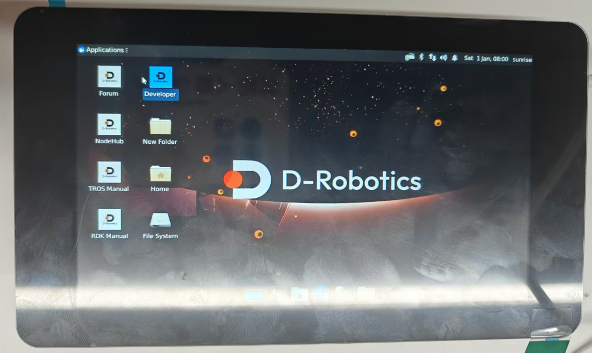

### 7.9inch DSI LCD

#### 硬件连接

屏幕连接方式如下图所示：

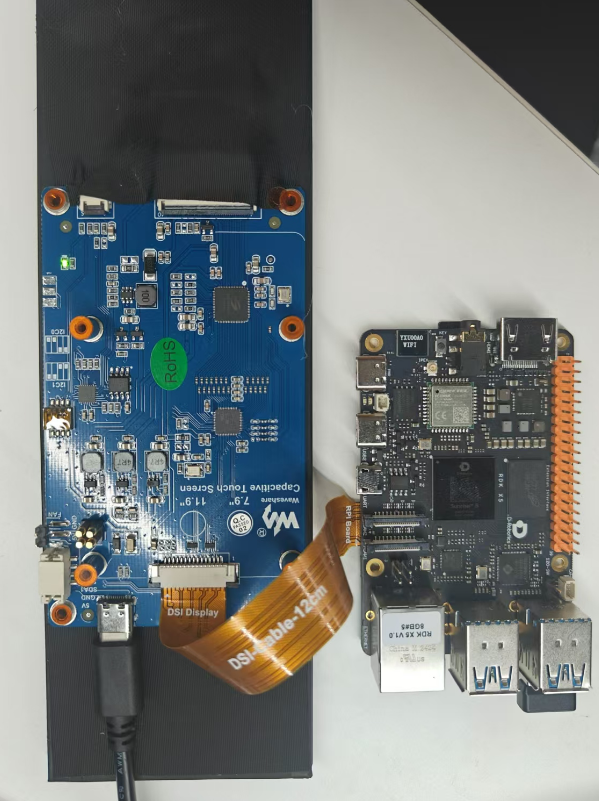

用DSI-Cable-12cm线材，将7.9inch DSI LCD连接到X5 rdk主板的22PIN DSI1接口。

使用5V/3A的 type-C 接口电源为屏幕供电。

#### 软件配置

1，由于RDK X5 系统默认采用HDMI输出，需要通过命令切换到MIPI DSI显示方式。
```bash
mv /etc/X11/xorg.conf.d/xorg_dsi_ignore.conf /etc/X11/xorg.conf.d/xorg_dsi_ignore.conf.disable
mv /etc/X11/xorg.conf.d/xorg_hdmi_ignore.conf.disable /etc/X11/xorg.conf.d/xorg_hdmi_ignore.conf
```
也可以通过srpi-config来选择输出方式，可以参考 [Dsiplay Chose DSI or HDMI](../../../System_configuration/srpi-config#display-options) 章节

2，打开`/boot/config.txt`文件，在config.txt最后加入以下代码，保存，退出，重启系统

```bash
dtoverlay=dsi-waveshare-panel-overlay-7_9_inch
```

#### 效果演示

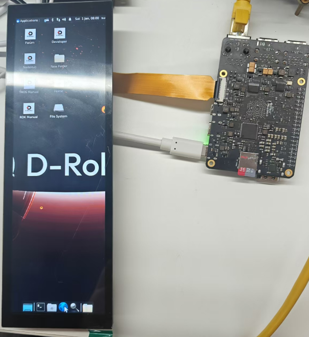

### 8inch DSI LCD

#### 硬件连接

屏幕连接方式如下图所示：

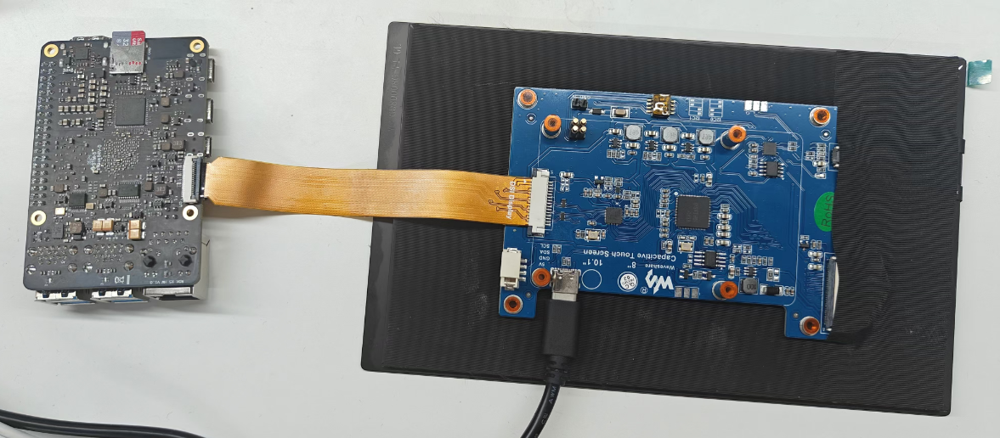

用DSI-Cable-12cm线材，将8inch DSI LCD连接到X5 rdk主板的22PIN DSI1接口。

使用5V/3A的 type-C 接口电源为屏幕供电。

#### 软件配置

1，由于RDK X5 系统默认采用HDMI输出，需要通过命令切换到MIPI DSI显示方式。
```bash
mv /etc/X11/xorg.conf.d/xorg_dsi_ignore.conf /etc/X11/xorg.conf.d/xorg_dsi_ignore.conf.disable
mv /etc/X11/xorg.conf.d/xorg_hdmi_ignore.conf.disable /etc/X11/xorg.conf.d/xorg_hdmi_ignore.conf
```
也可以通过srpi-config来选择输出方式，可以参考 [Dsiplay Chose DSI or HDMI](../../../System_configuration/srpi-config#display-options) 章节

2，打开`/boot/config.txt`文件，在config.txt最后加入以下代码，保存，退出，重启系统

```bash
dtoverlay=dsi-waveshare-panel-overlay-8_0_inch
```

#### 效果演示

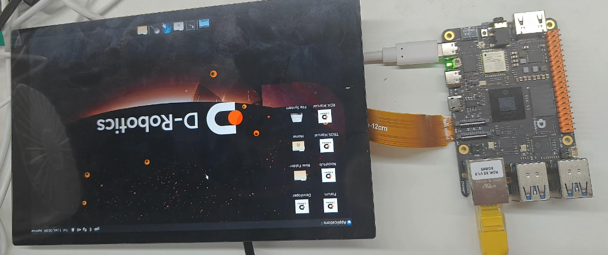

### 10.1inch DSI LCD

#### 硬件连接

屏幕连接方式如下图所示：

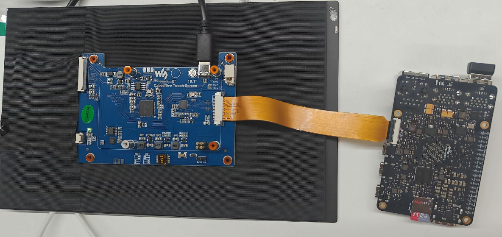

用DSI-Cable-12cm线材，将10.1inch DSI LCD连接到X5 rdk主板的22PIN DSI1接口。

使用5V/3A的 type-C 接口电源为屏幕供电。

#### 软件配置

1，由于RDK X5 系统默认采用HDMI输出，需要通过命令切换到MIPI DSI显示方式。
```bash
mv /etc/X11/xorg.conf.d/xorg_dsi_ignore.conf /etc/X11/xorg.conf.d/xorg_dsi_ignore.conf.disable
mv /etc/X11/xorg.conf.d/xorg_hdmi_ignore.conf.disable /etc/X11/xorg.conf.d/xorg_hdmi_ignore.conf
```
也可以通过srpi-config来选择输出方式，可以参考 [Dsiplay Chose DSI or HDMI](../../../System_configuration/srpi-config#display-options) 章节

2，打开`/boot/config.txt`文件，在config.txt最后加入以下代码，保存，退出，重启系统

```bash
dtoverlay=dsi-waveshare-panel-overlay-10_1_inch
```

#### 效果演示

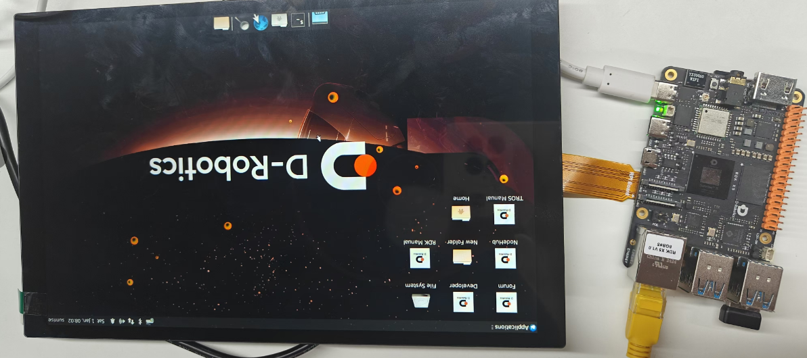


