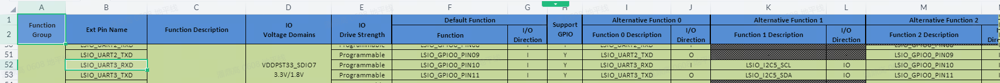
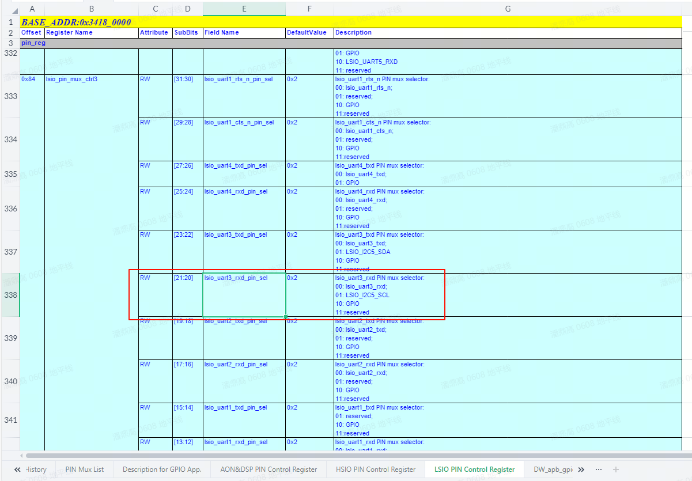
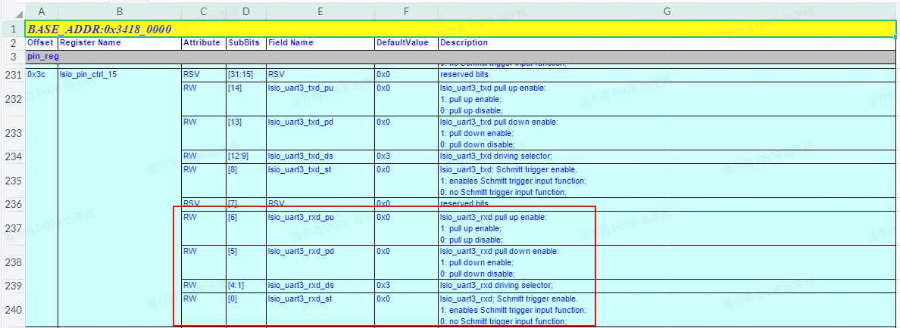
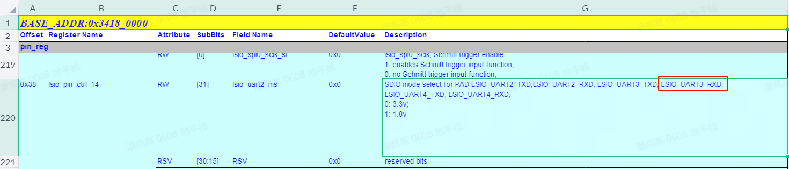
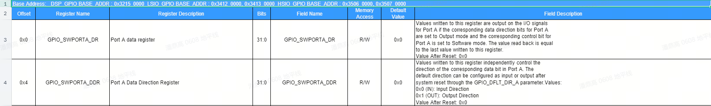

# GPIO调试指南

X5 芯片共有308个IO功能管脚，其中129个管脚都可以配置工作在gpio模式下，但是需要注意和其他功能管脚的复用关系。

## 管脚查询

IO管脚的复用和配置，以及上电默认状态、复用、驱动能力、上下拉、施密特触发配置和对应管脚的gpio寄存器信息可以在 [datasheets](https://archive.d-robotics.cc/downloads/datasheets/) 查阅《X5 PIN SW Reg-V1.1.xlsx》（以下统称为“表格”）。

### 示例

以查询`LSIO_UART3_RXD`号管脚的复用、方向控制、数据寄存器地址为例进行说明：

**功能复用寄存器说明：**

- 打开表格，选择  `PIN Mux List` 的数据表。
- 第B列是PinName，找到`LSIO_UART3_RXD`所在的行，第F列表示默认function，为`LSIO_GPIO0_PIN10`，即功能为GPIO，GPIO名为`LSIO_GPIO0_PIN10`。第I, K, M, O列表示每种function对应的功能，如下图所示：


- 配置PIN功能：选择`LSIO PIN Control Register`数据表，如下图所示：

    - 数据表的第一行记录了寄存器的基地址，也就是`0x34180000`；
    - 数据表的第A列记录了各个寄存器的偏移；
    - 数据表的第G列描述了寄存器的功能；
    - 在数据表G列找到“`lsio_uart3_rxd PIN mux selector`”所在的行，可以看到`LSIO_UART3_RXD`的`PIN mux`寄存器偏移为`0x84`，完整地址可由`基地址 + 偏移`得到：`0x34180000 + 0x84 = 0x34180084`；
    - 找到以上配置项后，就可以设置对应PIN的function，Function[x]代表了如果想要配置为该功能，需要在寄存器内的对应偏移写入对应的[x]。例如在寄存器`0x34180084`的`bit20-21`置为`0x0`，表示`LSIO_UART3_RXD`引脚被配置为`uart3 rx`功能，也就是`Function 0`；配置为`0x1`，表示`LSIO_UART3_RXD`引脚被配置为`i2c5 scl`功能，也就是`Function 1`；配置为`0x2`，表示`LSIO_UART3_RXD`引脚被配置为`GPIO`功能，也就是`Function 2`；

- 配置PIN属性：选择`LSIO PIN Control Register`数据表，如下图所示：

    - 数据表的第一行记录了寄存器的基地址，也就是`0x34180000`；
    - 数据表的第A列记录了各个寄存器的偏移；
    - 数据表的第G列描述了寄存器的功能；
    - 在数据表G列找到“`lsio_uart3_rxd pull up enable`”所在的行，可以看到`LSIO_UART3_RXD`的PU/PD/施密特开关/PIN驱动力的寄存器偏移为`0x3C`，完整地址可由基地址 + 偏移得到：`0x34180000 + 0x3C = 0x3418003C`;
    - PIN的驱动力具体数值请参考`Description for GPlO App`.数据表的驱动力表格;
    - PIN的电源域请搜索`mode select`并在G列确认当前寄存器控制的PIN包含了`LSIO_UART3_RXD`，可以看到控制PIN电源域的寄存器偏移为`0x38`，完整地址可由`基地址 + 偏移`得到：`0x34180000 + 0x38 = 0x34180038`如下图所示：
    

- 配置寄存器时，建议先把该值先读出来，然后只修改所需寄存器比特后再写回。

**GPIO控制和数据寄存器：**

- 在表格的`DW_apb_gpio8_mem_map_v1.0`和`DW_apb_gpio32_mem_map_v1.0`数据表，描述了引脚对应的GPIO方向寄存器和数值寄存器，如下图（`DW_apb_gpio32_mem_map_v1.0`）所示：


- 例如引脚`LSIO_UART3_RXD`对应的GPIO为`LSIO_GPIO0_PIN10`，如上图所示，`LSIO_GPIO0`的控制器的基地址为`0x34120000`，那么数值寄存器地址就是`0x34120000`，方向寄存器地址就是`0x34120004`。`LSIO_UART3_RXD`引脚在这两个寄存器中对应的bit偏移为GPIO的序号。引脚`LSIO_UART3_RXD`所对应的GPIO为`LSIO_GPIO0_PIN10`，那么bit偏移就是10。

## 驱动代码

```bash
kernel/drivers/gpio/gpio-dwapb.c # gpio驱动源文件
```

### 内核配置

GPIO_DWAPB


### 内核DTS配置

X5 GPIO控制器的设备树定义位于SDK包的kernel文件夹下的arch/arm64/boot/dts/hobot/x5.dtsi文件内。

:::info 备注
x5.dtsi中的节点主要声明SoC共有特性，和具体电路板无关，一般情况下不用修改。
:::

## GPIO使用

### Kernel Space

#### DTS配置

X5所有引脚的GPIO配置位于SDK包的kernel文件夹下路径为`arch/arm64/boot/dts/hobot/pinmux-gpio.dtsi`的文件内。
用户需要配置特定引脚为GPIO功能时，可以直接引用预定义GPIO配置：

```c
/* arch/arm64/boot/dts/hobot/hobot/x5-som.dtsi */

&extcon_usb2otg {
	pinctrl-names = "default";
	pinctrl-0 = <&aon_gpio_6>;

	id-gpios = <&aon_gpio_porta 6 GPIO_ACTIVE_HIGH>;

	status = "okay";
};
```

#### 驱动代码接口

```c
/* include/linux/gpio.h */
/* 申请GPIO */
int gpio_request(unsigned gpio, const char *label);
/* GPIO初始化为输出。并设置输出电平*/
int gpio_direction_output(unsigned gpio, int value);
/* GPIO初始化为输入 */
int gpio_direction_input(unsigned gpio);
/* 获取GPIO的电平 */
int gpio_get_value(unsigned int gpio);
/* 设置GPIO的电平 */
void gpio_set_value(unsigned int gpio, int value);
/* 释放GPIO */
void gpio_free(unsigned gpio);
/* 申请GPIO中断，返回的值可以传给request_irq和free_irq */
int gpio_to_irq(unsigned int gpio);
```

#### X5 GPIO IRQ

X5 GPIO共有129个pin，所有的GPIO均可以被配置为中断功能。

:::info 备注 
X5的GPIO控制器支持上升沿/下降沿/高电平/低电平作为中断触发条件，每个作为中断的GPIO的触发条件可以独立配置;

X5 GPIO在Kernel Space的接口都是Linux的标准接口，更多使用方法请参考Documentation/driver-api/gpio/consumer.rst。
:::

### User Space{#user-space}

#### 控制接口

<font color="red">注意：</font>X5使用的Linux-V6.1基线中，Linux已经将GPIO的sysfs节点标记为“Obsolete”，详情请参考Linux文档

```bash
/sys/class/gpio/export # 用户空间可以通过写入gpio号申请将gpio的控制权导出到用户空间，比如 echo 356 > export
/sys/class/gpio/unexport # 和export相反
/sys/class/gpio/gpiochip0 # gpio控制器
```

#### 调用接口

使用export导出gpio的控制权以后会有路径`/sys/class/gpio/gpio356/`，路径下有如下属性：

-   direction：表示GPIO端口方向，读取为"in"或"out"，写入"in"或者"out"可以设置输入或输出
-   value：表示GPIO的电平，0为低电平，1为高电平，如果GPIO配置为输出，则value值可写
-   edge：表示中断触发方式，有"none" "rising" "falling" "both" 4种类型，"none"表示GPIO不为中断引脚，"rising"表示引脚为上升沿触发的中断，"falling"表示引脚为下降沿触发的中断，"both"表示引脚为边沿触发的中断。

#### 调用示例

以下示例演示导出LSIO_UART3_RXD管脚，设置为输出模式，输出高电平，最后反导出。

```bash
echo 356 > /sys/class/gpio/export
echo out > /sys/class/gpio/gpio356/direction
echo 1 > /sys/class/gpio/gpio356/value
# echo 0 > /sys/class/gpio/gpio356/value
echo 356 > /sys/class/gpio/unexport
```

#### 调试接口

如果在内核配置中打开了Linux Kernel的CONFIG_DEBUG_FS选项，并且挂载了debugfs文件系统，内核已提供了GPIO的debugfs接口。

首先，检查内核是否已经挂载了debugfs，如果下列命令输出不为空，则代表当前已挂载debugfs：

```
mount | grep debugfs
```

如果输出为空，则执行以下命令挂载debugfs：

```
mount -t debugfs none /sys/kernel/debug
```

确保debugfs已挂载后则可以通过如下节点查看GPIO的申请列表。

```bash
# cat /sys/kernel/debug/gpio
gpiochip9: GPIOs 347-378, parent: platform/34130000.gpio, 34130000.gpio:
 gpio-352 (                    |enable              ) out lo

gpiochip8: GPIOs 379-410, parent: platform/34120000.gpio, 34120000.gpio:
 gpio-410 (                    |phyreset            ) out hi

gpiochip7: GPIOs 411-433, parent: platform/32150000.gpio, 32150000.gpio:

gpiochip6: GPIOs 434-465, parent: platform/35070000.gpio, 35070000.gpio:
 gpio-435 (                    |voltage             ) out hi ACTIVE LOW

gpiochip5: GPIOs 466-497, parent: platform/35060000.gpio, 35060000.gpio:
 gpio-492 (                    |power               ) out hi

gpiochip4: GPIOs 498-505, parent: platform/31000000.gpio, 31000000.gpio:
 gpio-500 (                    |GPIO Key Power      ) in  hi IRQ ACTIVE LOW
 gpio-503 (                    |id                  ) in  hi IRQ
 gpio-504 (                    |id                  ) in  hi IRQ

gpiochip3: GPIOs 506-507, parent: platform/34180000.lsio_iomuxc, 34180000.lsio_iomuxc:

gpiochip2: GPIOs 508-508, parent: platform/31040014.dsp_iomuxc, 31040014.dsp_iomuxc:

gpiochip1: GPIOs 509-510, parent: platform/35050000.hsio_iomuxc, 35050000.hsio_iomuxc:

gpiochip0: GPIOs 511-511, parent: platform/31040000.aon_iomuxc, 31040000.aon_iomuxc:
#
```

:::info 备注  
上述输出仅为示例，实际输出与板端实际的DTS配置相关；

X5 GPIO在User Space的接口都是Linux的标准接口，更多使用方法请参考Documentation/gpio/sysfs.txt。
:::

## Linux GPIO序号与芯片Pin脚的映射关系

<font color="red">注意：</font>Linux内的GPIO序号为纯软件概念，会随着软件改变而发生变化，GPIO序号与芯片Pin脚没有物理意义上的绑定关系；

推荐用户使用<font color="red">hb_gpioinfo工具</font>，查看当前开发板的的PinName和PinNum和PinFunc的对应关系。

如果板卡上还没有hb_gpioinfo工具，可以通过apt更新hobot-io；

**hb_gpioinfo使用实例**

PinName：指的是Soc上的管脚名字，原理图上X5 Soc管脚命名一致

PinNum：指的是X5实际的对应的管脚gpio编号

PinFunc：指的是X5实际的设备树中已经使用的管脚对应的复用功能 查看PinFunc时需要注意,如果为Default时，代表设备树中没有使用该复用功能,需要查看pinlist的默认功能是什么


```bash
gpiochip0 - 8 lines: @31000000.gpio: @498-505
        [Number]                [Mode]  [Status]  [GpioName]       [PinName]          [PinNum]   [PinFunc]
        line  0:        unnamed input                             AON_GPIO_PIN0         498      Default
        line  1:        unnamed input                             AON_GPIO_PIN1         499      Default
        line  2:        unnamed input  active-low  GPIO Key Power AON_GPIO_PIN2         500      aon_gpio_2
        line  3:        unnamed input              interrupt      AON_GPIO_PIN3         501      Default
        line  4:        unnamed input                             AON_GPIO_PIN4         502      Default
        line  5:        unnamed input              id             AON_ENV_VDD           503      aon_gpio_5
        line  6:        unnamed input              id             AON_ENV_CNN0          504      aon_gpio_6
        line  7:        unnamed input                             AON_ENV_CNN1          505      aon_gpio_7
gpiochip1 - 31 lines: @35060000.gpio: @466-496
        [Number]                [Mode]  [Status]  [GpioName]       [PinName]          [PinNum]   [PinFunc]
        line  0:        unnamed input                             HSIO_ENET_MDC         466      enetgrp
        line  1:        unnamed input                             HSIO_ENET_MDIO        467      enetgrp
        line  2:        unnamed input                             HSIO_ENET_TXD_0       468      enetgrp
        line  3:        unnamed input                             HSIO_ENET_TXD_1       469      enetgrp
        line  4:        unnamed input                             HSIO_ENET_TXD_2       470      enetgrp
        line  5:        unnamed input                             HSIO_ENET_TXD_3       471      enetgrp
        line  6:        unnamed input                             HSIO_ENET_TXEN        472      enetgrp
        line  7:        unnamed input                             HSIO_ENET_TX_CLK      473      enetgrp
        line  8:        unnamed input                             HSIO_ENET_RX_CLK      474      enetgrp
        line  9:        unnamed input                             HSIO_ENET_RXD_0       475      enetgrp
        line 10:        unnamed input                             HSIO_ENET_RXD_1       476      enetgrp
        line 11:        unnamed input                             HSIO_ENET_RXD_2       477      enetgrp
        line 12:        unnamed input                             HSIO_ENET_RXD_3       478      enetgrp
        line 13:        unnamed input                             HSIO_ENET_RXDV        479      enetgrp
        line 14:        unnamed input                             HSIO_ENET_PHY_CLK     480      enetgrp
        line 15:        unnamed input                             HSIO_SD_WP            481      sdgrp 
        line 16:        unnamed input                             HSIO_SD_XLK           482      sdgrp 
        line 17:        unnamed input                             HSIO_SD_CMD           483      sdgrp 
        line 18:        unnamed input                             HSIO_SD_CDN           484      sdgrp 
        line 19:        unnamed input                             HSIO_SD_DATA0         485      sdgrp 
        line 20:        unnamed input                             HSIO_SD_DATA1         486      sdgrp 
        line 21:        unnamed input                             HSIO_SD_DATA2         487      sdgrp 
        line 22:        unnamed input                             HSIO_SD_DATA3         488      sdgrp 
        line 23:        unnamed output             phyreset       HSIO_SDIO_WP          489      hsio_gpio0_23
        line 24:        unnamed input                             HSIO_SDIO_XLK         490      sdiogrp
        line 25:        unnamed input                             HSIO_SDIO_CMD         491      sdiogrp
        line 26:        unnamed output             power          HSIO_SDIO_CDN         492      hsio_gpio0_26
        line 27:        unnamed input                             HSIO_SDIO_DATA0       493      sdiogrp
        line 28:        unnamed input                             HSIO_SDIO_DATA1       494      sdiogrp
        line 29:        unnamed input                             HSIO_SDIO_DATA2       495      sdiogrp
        line 30:        unnamed input                             HSIO_SDIO_DATA3       496      sdiogrp
gpiochip2 - 18 lines: @35070000.gpio: @434-451
        [Number]                [Mode]  [Status]  [GpioName]       [PinName]          [PinNum]   [PinFunc]
        line  0:        unnamed input                             HSIO_QSPI_SSN0        434      qspigrp
        line  1:        unnamed output active-low  voltage        HSIO_QSPI_SSN1        435      hsio_gpio1_1
        line  2:        unnamed input                             HSIO_QSPI_SCLK        436      qspigrp
        line  3:        unnamed input                             HSIO_QSPI_DATA0       437      qspigrp
        line  4:        unnamed input                             HSIO_QSPI_DATA1       438      qspigrp
        line  5:        unnamed input                             HSIO_QSPI_DATA2       439      qspigrp
        line  6:        unnamed input                             HSIO_QSPI_DATA3       440      qspigrp
        line  7:        unnamed input                             HSIO_EMMC_CLK         441      Default
        line  8:        unnamed input                             HSIO_EMMC_CMD         442      Default
        line  9:        unnamed input                             HSIO_EMMC_DATA0       443      Default
        line 10:        unnamed input                             HSIO_EMMC_DATA1       444      Default
        line 11:        unnamed input                             HSIO_EMMC_DATA2       445      Default
        line 12:        unnamed input                             HSIO_EMMC_DATA3       446      Default
        line 13:        unnamed input                             HSIO_EMMC_DATA4       447      Default
        line 14:        unnamed input                             HSIO_EMMC_DATA5       448      Default
        line 15:        unnamed input                             HSIO_EMMC_DATA6       449      Default
        line 16:        unnamed input                             HSIO_EMMC_DATA7       450      Default
        line 17:        unnamed input                             HSIO_EMMC_RSTN        451      Default
gpiochip3 - 23 lines: @32150000.gpio: @411-433
        [Number]                [Mode]  [Status]  [GpioName]       [PinName]          [PinNum]   [PinFunc]
        line  0:        unnamed input                             DSP_I2C7_SCL          411      dsp_i2c7grp
        line  1:        unnamed input                             DSP_I2C7_SDA          412      dsp_i2c7grp
        line  2:        unnamed input                             DSP_UART0_RXD         413      uart0grp
        line  3:        unnamed input                             DSP_UART0_TXD         414      uart0grp
        line  4:        unnamed input                             DSP_I2S0_MCLK         415      i2s0grp
        line  5:        unnamed input                             DSP_I2S0_SCLK         416      i2s0grp
        line  6:        unnamed input                             DSP_I2S0_WS           417      i2s0grp
        line  7:        unnamed input                             DSP_I2S0_DI           418      i2s0grp
        line  8:        unnamed input                             DSP_I2S0_DO           419      i2s0grp
        line  9:        unnamed input                             DSP_I2S1_MCLK         420      Default
        line 10:        unnamed input                             DSP_I2S1_SCLK         421      Default
        line 11:        unnamed input                             DSP_I2S1_WS           422      Default
        line 12:        unnamed input                             DSP_I2S1_DI           423      Default
        line 13:        unnamed input                             DSP_I2S1_DO           424      Default
        line 14:        unnamed output active-low  ACT            DSP_PDM_CKO           425      32150000.gpio:425
        line 15:        unnamed input                             DSP_PDM_IN0           426      dsp_gpio0_15
        line 16:        unnamed input                             DSP_PDM_IN1           427      dsp_gpio0_16
        line 17:        unnamed output                            DSP_PDM_IN2           428      dsp_gpio0_17
        line 18:        unnamed output                            DSP_PDM_IN3           429      dsp_gpio0_18
        line 19:        unnamed input              interrupt      DSP_SPI6P_SCLK        430      dsp_gpio0_19
        line 20:        unnamed output active-low  reset          DSP_SPI6_SSN          431      dsp_gpio0_20
        line 21:        unnamed input              interrupt      DSP_SPI6_MISO         432      Default
        line 22:        unnamed input                             DSP_SPI6_MOSI         433      Default
gpiochip4 - 32 lines: @34120000.gpio: @379-410
        [Number]                [Mode]  [Status]  [GpioName]       [PinName]          [PinNum]   [PinFunc]
        line  0:        unnamed input                             LSIO_UART7_RX         379      Default
        line  1:        unnamed input                             LSIO_UART7_TX         380      Default
        line  2:        unnamed input                             LSIO_UART7_CTS        381      Default
        line  3:        unnamed input                             LSIO_UART7_RTS        382      Default
        line  4:        unnamed input                             LSIO_UART1_RX         383      uart1grp
        line  5:        unnamed input                             LSIO_UART1_TX         384      uart1grp
        line  6:        unnamed output                            LSIO_UART1_CTS        385      lsio_gpio0_6
        line  7:        unnamed output             reset          LSIO_UART1_RTS        386      lsio_gpio0_7
        line  8:        unnamed input                             LSIO_UART2_RX         387      Default
        line  9:        unnamed input                             LSIO_UART2_TX         388      Default
        line 10:        unnamed input                             LSIO_UART3_RX         389      i2c5grp
        line 11:        unnamed input                             LSIO_UART3_TX         390      i2c5grp
        line 12:        unnamed input                             LSIO_UART4_RX         391      lsio_gpio0_12
        line 13:        unnamed output                            LSIO_UART4_TX         392      lsio_gpio0_13_rdk_v1p0
        line 14:        unnamed input                             LSIO_SPI0_SCLK        393      Default
        line 15:        unnamed input                             LSIO_SPI1_SSN_1       394      spi1_ssn1grp
        line 16:        unnamed input                             LSIO_SPI1_SCLK        395      spi1grp
        line 17:        unnamed input                             LSIO_SPI1_SSN         396      spi1grp
        line 18:        unnamed input                             LSIO_SPI1_MISO        397      spi1grp
        line 19:        unnamed input                             LSIO_SPI1_MOSI        398      spi1grp
        line 20:        unnamed input                             LSIO_SPI2_SCLK        399      Default
        line 21:        unnamed input                             LSIO_SPI2_SSN         400      Default
        line 22:        unnamed input                             LSIO_SPI2_MISO        401      Default
        line 23:        unnamed input                             LSIO_SPI2_MOSI        402      Default
        line 24:        unnamed input                             LSIO_SPI3_SCLK        403      pinctrl_lpwm1_0
        line 25:        unnamed input                             LSIO_SPI3_SSN         404      pinctrl_lpwm1_1
        line 26:        unnamed input                             LSIO_SPI3_MISO        405      Default
        line 27:        unnamed input                             LSIO_SPI3_MOSI        406      Default
        line 28:        unnamed input                             LSIO_SPI4_SCLK        407      uart5grp
        line 29:        unnamed input                             LSIO_SPI4_SSN         408      uart5grp
        line 30:        unnamed input                             LSIO_SPI4_MISO        409      i2c6grp
        line 31:        unnamed input                             LSIO_SPI4_MOSI        410      i2c6grp
gpiochip5 - 17 lines: @34130000.gpio: @347-363
        [Number]                [Mode]  [Status]  [GpioName]       [PinName]          [PinNum]   [PinFunc]
        line  0:        unnamed input                             LSIO_SPI5_SCLK        347      spi5grp
        line  1:        unnamed input                             LSIO_SPI5_SSN         348      spi5grp
        line  2:        unnamed input                             LSIO_SPI5_MISO        349      spi5grp
        line  3:        unnamed input                             LSIO_SPI5_MOSI        350      spi5grp
        line  4:        unnamed input                             LSIO_SPI0_SSN         351      lsio_gpio1_4
        line  5:        unnamed output             enable         LSIO_SPI0_MISO        352      lsio_gpio1_5
        line  6:        unnamed input                             LSIO_SPI0_MOSI        353      lsio_gpio1_6
        line  7:        unnamed input                             LSIO_I2C0_SCL         354      i2c0grp
        line  8:        unnamed input                             LSIO_I2C0_SDA         355      i2c0grp
        line  9:        unnamed input                             LSIO_I2C1_SCL         356      pinctrl_pwm3_0
        line 10:        unnamed input                             LSIO_I2C1_SDA         357      pinctrl_pwm3_1
        line 11:        unnamed input                             LSIO_I2C2_SCL         358      i2c2grp
        line 12:        unnamed input                             LSIO_I2C2_SDA         359      i2c2grp
        line 13:        unnamed input                             LSIO_I2C3_SCL         360      i2c3grp
        line 14:        unnamed input                             LSIO_I2C3_SDA         361      i2c3grp
        line 15:        unnamed input                             LSIO_I2C4_SCL         362      i2c4grp
        line 16:        unnamed input                             LSIO_I2C4_SDA         363      i2c4grp
        ```

