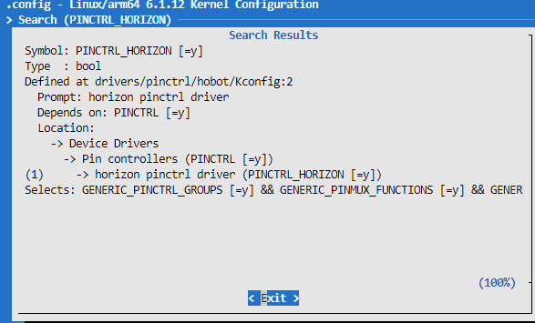

# Pinctrl调试指南

X5 Pinctrl使用自研Pinctrl代码驱动，主要通过配置DTS来实现Pinctrl功能。

## 管脚查询

IO管脚的复用和配置，以及上电默认状态、复用、驱动能力、上下拉、施密特触发配置和对应管脚的gpio寄存器信息可以在 [datasheets](https://archive.d-robotics.cc/downloads/datasheets/) 查阅《X5 PIN SW Reg-V1.1.xlsx》

### 驱动代码

```bash
kernel/drivers/pinctrl/hobot/aon.c # Pinctrl 驱动代码源文件
kernel/drivers/pinctrl/hobot/common.c # Pinctrl 驱动代码源文件
kernel/drivers/pinctrl/hobot/display.c # Pinctrl 驱动代码源文件
kernel/drivers/pinctrl/hobot/dsp.c # Pinctrl 驱动代码源文件
kernel/drivers/pinctrl/hobot/hsio.c # Pinctrl 驱动代码源文件
kernel/drivers/pinctrl/hobot/lsio.c # Pinctrl 驱动代码源文件
kernel/drivers/pinctrl/hobot/common.h # Pinctrl 驱动代码头文件
```

### 内核配置

CONFIG_PINCTRL_SINGLE



### Pinctrl的DTS配置

X5 Pinctrl控制器的设备树定义位于SDK包的kernel文件夹下的`arch/arm64/boot/dts/hobot/x5.dtsi`文件内。

<font color="red">备注：</font> x5.dtsi中的节点主要声明SoC共有特性，和具体电路板无关，一般情况下不用修改。

## Pinctrl使用

### 驱动DTS配置

驱动在使用Pinctrl的接口前，需要在DTS里配置相应的Pinctrl配置组，当驱动probe的时候，会将“default”对应的这组Pinctrl配置到寄存器里面，而其它组的配置需要在代码里面解析出来，再选择切换使用，以uart2为例：

```c
/* arch/arm64/boot/dts/hobot/x5-evb.dts */
&uart2 {
	status = "okay";
	pinctrl-names = "default";
	pinctrl-0 = <&pinctrl_uart2>;
};
```

uart2 Pinctrl中引用的配置组在arch/arm64/boot/dts/hobot/pinmux-func.dtsi中，内容如下：

```c
/* arch/arm64/boot/dts/hobot/pinmux-func.dtsi */
	pinctrl_uart2: uart2grp {
		horizon,pins = <
			LSIO_UART2_RX  LSIO_PINMUX_3 BIT_OFFSET16  MUX_ALT0 &pconf_drv_pu_mid_3v3
			LSIO_UART2_TX  LSIO_PINMUX_3 BIT_OFFSET18  MUX_ALT0 &pconf_drv_pu_mid_3v3
		>;
	};
};
```

另外也提供了GPIO功能的配置，在arch/arm64/boot/dts/hobot/pinmux-gpio.dtsi中，内容如下：

```c
/* arch/arm64/boot/dts/hobot/pinmux-gpio.dtsi */
	lsio_gpio0_8: lsio_gpio0_8 {
		horizon,pins = <
			LSIO_UART2_RX	LSIO_PINMUX_3 BIT_OFFSET16	MUX_ALT2	&pconf_input_en_3v3
		>;
	};

	lsio_gpio0_9: lsio_gpio0_9 {
		horizon,pins = <
			LSIO_UART2_TX	LSIO_PINMUX_3 BIT_OFFSET18	MUX_ALT2	&pconf_input_en_3v3
		>;
	};
```

Pinctrl配置组将多个Pin配置组合到一起，每个Pin的配置包含5列，第一列表示相关域的Pin id，在kernel/include/dt-bindings/pinctrl/horizon-*-pinfunc.h等头文件中有定义；第二列表示Pin的功能复用配置寄存器；第三列表示功能复用配置的bit偏移；第四列为对应功能的Pin-mux值；第五列可以配置上电默认状态、驱动能力、上下拉、施密特触发配置、电压域等。

### Pin-mux配置

X5 每个芯片的Pin脚支持最多4种功能，在配置某个功能时，客户可以通过《X5 PIN SW Reg-V1.1.xlsx》查看对应功能的Pin-mux值，例如Pin脚LSIO_UART7_RX的mux配置为0，也就是MUX_ALT0时Pin的功能为uart rx; 当配置为MUX_ALT2时，Pin的功能是gpio。

```c
/* The macro defines the mux mode of horizon pinctrl */
#define MUX_ALT0 0x0
#define MUX_ALT1 0x1
#define MUX_ALT2 0x2
#define MUX_ALT3 0x3
```

### 驱动强度配置

X5 每个Pin脚支持配置最大的输出电流，在arch/arm64/boot/dts/hobot/pinmux-func.dtsi可以设置默认配置，然后Pin脚配置时再去引用。X5 Pin脚有两种类型GPIO型和SDIO型，同样的bit配置在不同类型Pin上表示的驱动电流不一致。具体的类型和驱动bit对应的驱动电流，请咨询地瓜官方。

```c
pconf_drv_pu_mid_3v3: pconf-dev-pu-mid-3v3 {
    bias-pull-up;
    power-source = <HORIZON_IO_PAD_VOLTAGE_3V3>;
    drive-strength = <7>;
};
```

<font color="red">注意：</font> 驱动强度配置过大可能导致芯片管脚损坏！请谨慎配置！

### 上下拉配置

X5 每个Pin脚也支持上下拉配置，在arch/arm64/boot/dts/hobot/pinmux-func.dtsi可以设置默认配置，然后Pin脚配置时再去引用。

```c
pconf_drv_pu_mid_3v3: pconf-dev-pu-mid-3v3 {
    bias-pull-up;
    power-source = <HORIZON_IO_PAD_VOLTAGE_3V3>;
    drive-strength = <7>;
};
```

当前可支持的上下拉配置有

```c
bias-pull-up
bias-disable
bias-pull-down
```

### 施密特触发配置

X5 每个Pin脚也支持施密特触发的配置，在arch/arm64/boot/dts/hobot/pinmux-func.dtsi可以设置默认配置，然后Pin脚配置时再去引用。

```c
pconf_drv_pu_mid_3v3: pconf-dev-pu-mid-3v3 {
    input-schmitt-enable
    power-source = <HORIZON_IO_PAD_VOLTAGE_3V3>;
    drive-strength = <7>;
};
```

### 电压域配置

X5 每个Pin脚也支持电压域的配置，可支持配置1.8V和3.3V的电压域。在arch/arm64/boot/dts/hobot/pinmux-func.dtsi可以设置默认配置，然后Pin脚配置时再去引用。

```c
#define  HORIZON_IO_PAD_VOLTAGE_3V3 0
#define  HORIZON_IO_PAD_VOLTAGE_1V8 1

pconf_drv_pu_mid_3v3: pconf-dev-pu-mid-3v3 {
    bias-pull-up;
    power-source = <HORIZON_IO_PAD_VOLTAGE_3V3>;
    drive-strength = <7>;
};
```

### 驱动调用示例代码

驱动先通过Pinctrl-names查找对应的pinctrl state，然后再切换到对应的state。

```c
static int hobot_xxx_probe(struct platform_device *pdev)
{
    ...
    g_xxx_dev->pinctrl = devm_pinctrl_get(&pdev->dev);
    if (IS_ERR(g_xxx_dev->pinctrl)) {
        dev_warn(&pdev->dev, "pinctrl get none\n");
        g_xxx_dev->pins_xxxx = NULL;
    }
    ...
        /* 按照 pinctrl-names lookup state */
        g_xxx_dev->pins_xxxx = pinctrl_lookup_state(g_xxx_dev->pinctrl, "xxx_func");
    if (IS_ERR(g_xxx_dev->pins_xxxx)) {
        dev_info(&pdev->dev, "xxx_func get error %ld\n",
                PTR_ERR(g_xxx_dev->pins_xxxx));
        g_xxx_dev->pins_xxxx = NULL;
    }
    ...
}
int xxxx_pinmux_select(void)
{
    if (!g_xxx_dev->pins_xxxx)
        return -ENODEV;
    /* 切换到对应的state */
        return pinctrl_select_state(g_xxx_dev->pinctrl, g_xxx_dev->pins_xxxx);
}
```

### 用户空间调试

如果在内核配置中打开了Linux Kernel的 CONFIG_DEBUG_FS 选项，并且挂载了debugfs文件系统，内核已提供了Pinctrl的debugfs接口。

首先，检查内核是否已经挂载了debugfs，如果下列命令输出不为空，则代表当前已挂载debugfs：

```shell
mount | grep debugfs
```

如果输出为空，则执行以下命令挂载debugfs：

```shell
mount -t debugfs none /sys/kernel/debug
```

确保debugfs已挂载后，用户可以在用户空间的debugfs下查看Pinctrl的信息。 以lsio子系统为例，lsio子系统的debugfs节点路径为：`/sys/kernel/debug/pinctrl/34180000.lsio_iomuxc/`

该目录下的节点就可以查看lsio域引脚的Pinctrl信息（以下命令输出仅供参考，具体节点以Linux内核代码为准）：

```shell
ls /sys/kernel/debug/pinctrl/34180000.lsio_iomuxc/
gpio-ranges  pinconf-groups  pinconf-pins  pingroups  pinmux-functions  pinmux-pins  pinmux-select  pins
```

以“pinmux-pins”为例，这个节点可以查看哪些Pin脚被配置为配置组。(以下命令输出仅供参考，具体输出会随着dts配置变化)

```shell
cat /sys/kernel/debug/pinctrl/34180000.lsio_iomuxc/pinmux-pins
pin 14 (lsio_spi0_sclk): (MUX UNCLAIMED) (GPIO UNCLAIMED)
pin 36 (lsio_spi0_ssn): (MUX UNCLAIMED) (GPIO UNCLAIMED)
pin 37 (lsio_spi0_miso): vdd08_gpu_reg@3 (GPIO UNCLAIMED) function lsio_iomuxc group lsio_gpio1_5
pin 38 (lsio_spi0_mosi): soc:cam:vcon@3 (GPIO UNCLAIMED) function lsio_iomuxc group lsio_gpio1_6
pin 15 (lsio_spi1_ssn_1): (MUX UNCLAIMED) (GPIO UNCLAIMED)
pin 16 (lsio_spi1_sclk): (MUX UNCLAIMED) (GPIO UNCLAIMED)
pin 17 (lsio_spi1_ssn): (MUX UNCLAIMED) (GPIO UNCLAIMED)
pin 18 (lsio_spi1_miso): (MUX UNCLAIMED) (GPIO UNCLAIMED)
pin 19 (lsio_spi1_mosi): (MUX UNCLAIMED) (GPIO UNCLAIMED)
pin 20 (lsio_spi2_sclk): 34020000.spi (GPIO UNCLAIMED) function lsio_iomuxc group spi2grp
pin 21 (lsio_spi2_ssn): 34020000.spi (GPIO UNCLAIMED) function lsio_iomuxc group spi2grp
pin 22 (lsio_spi2_miso): 34020000.spi (GPIO UNCLAIMED) function lsio_iomuxc group spi2grp
pin 23 (lsio_spi2_mosi): 34020000.spi (GPIO UNCLAIMED) function lsio_iomuxc group spi2grp
pin 24 (lsio_spi3_sclk): 3d060000.mipi_host (GPIO UNCLAIMED) function lsio_iomuxc group lsio_gpio0_24
pin 25 (lsio_spi3_ssn): 34110000.lpwm (GPIO UNCLAIMED) function lsio_iomuxc group pinctrl_lpwm1_1
pin 26 (lsio_spi3_miso): 3d080000.mipi_host (GPIO UNCLAIMED) function lsio_iomuxc group lsio_gpio0_26
pin 27 (lsio_spi3_mosi): 3d090000.mipi_host (GPIO UNCLAIMED) function lsio_iomuxc group lsio_gpio0_27
pin 28 (lsio_spi4_sclk): 341a0000.serial (GPIO UNCLAIMED) function lsio_iomuxc group uart5grp
pin 29 (lsio_spi4_ssn): 341a0000.serial (GPIO UNCLAIMED) function lsio_iomuxc group uart5grp
pin 30 (lsio_spi4_miso): (MUX UNCLAIMED) (GPIO UNCLAIMED)
pin 31 (lsio_spi4_mosi): 35010000.gmac-tsn (GPIO UNCLAIMED) function lsio_iomuxc group lsio_gpio0_31
pin 32 (lsio_spi5_sclk): 34100000.lpwm (GPIO UNCLAIMED) function lsio_iomuxc group pinctrl_lpwm0_0
pin 33 (lsio_spi5_ssn): 34100000.lpwm (GPIO UNCLAIMED) function lsio_iomuxc group pinctrl_lpwm0_1
pin 34 (lsio_spi5_miso): 34100000.lpwm (GPIO UNCLAIMED) function lsio_iomuxc group pinctrl_lpwm0_2
pin 35 (lsio_spi5_mosi): 34100000.lpwm (GPIO UNCLAIMED) function lsio_iomuxc group pinctrl_lpwm0_3
pin 39 (lsio_i2c0_scl): (MUX UNCLAIMED) (GPIO UNCLAIMED)
pin 40 (lsio_i2c0_sda): (MUX UNCLAIMED) (GPIO UNCLAIMED)
pin 41 (lsio_i2c1_scl): 34170000.pwm (GPIO UNCLAIMED) function lsio_iomuxc group pinctrl_pwm3_0
pin 42 (lsio_i2c1_sda): 34170000.pwm (GPIO UNCLAIMED) function lsio_iomuxc group pinctrl_pwm3_1
pin 43 (lsio_i2c2_scl): 340d0000.i2c (GPIO UNCLAIMED) function lsio_iomuxc group i2c2grp
pin 44 (lsio_i2c2_sda): 340d0000.i2c (GPIO UNCLAIMED) function lsio_iomuxc group i2c2grp
pin 45 (lsio_i2c3_scl): (MUX UNCLAIMED) (GPIO UNCLAIMED)
pin 46 (lsio_i2c3_sda): (MUX UNCLAIMED) (GPIO UNCLAIMED)
pin 47 (lsio_i2c4_scl): 340f0000.i2c (GPIO UNCLAIMED) function lsio_iomuxc group i2c4grp
pin 48 (lsio_i2c4_sda): 340f0000.i2c (GPIO UNCLAIMED) function lsio_iomuxc group i2c4grp
pin 0 (lsio_uart7_rx): gpiochip8 (GPIO UNCLAIMED) function lsio_iomuxc group lsio_gpio0_0
pin 1 (lsio_uart7_tx): gpiochip8 (GPIO UNCLAIMED) function lsio_iomuxc group lsio_gpio0_1
pin 3 (lsio_uart7_rts): gpiochip8 (GPIO UNCLAIMED) function lsio_iomuxc group lsio_gpio0_3
pin 2 (lsio_uart7_cts): gpiochip8 (GPIO UNCLAIMED) function lsio_iomuxc group lsio_gpio0_2
pin 4 (lsio_uart1_rx): gpiochip8 (GPIO UNCLAIMED) function lsio_iomuxc group lsio_gpio0_4
pin 5 (lsio_uart1_tx): gpiochip8 (GPIO UNCLAIMED) function lsio_iomuxc group lsio_gpio0_5
pin 7 (lsio_uart1_rts): gpiochip8 (GPIO UNCLAIMED) function lsio_iomuxc group lsio_gpio0_7
pin 6 (lsio_uart1_cts): gpiochip8 (GPIO UNCLAIMED) function lsio_iomuxc group lsio_gpio0_6
pin 8 (lsio_uart2_rx): 34080000.serial (GPIO UNCLAIMED) function lsio_iomuxc group uart2grp
pin 9 (lsio_uart2_tx): 34080000.serial (GPIO UNCLAIMED) function lsio_iomuxc group uart2grp
pin 10 (lsio_uart3_rx): 341c0000.i2c (GPIO UNCLAIMED) function lsio_iomuxc group i2c5grp
pin 11 (lsio_uart3_tx): 341c0000.i2c (GPIO UNCLAIMED) function lsio_iomuxc group i2c5grp
pin 12 (lsio_uart4_rx): gpiochip8 (GPIO UNCLAIMED) function lsio_iomuxc group lsio_gpio0_12
pin 13 (lsio_uart4_tx): gpiochip8 (GPIO UNCLAIMED) function lsio_iomuxc group lsio_gpio0_13
```
