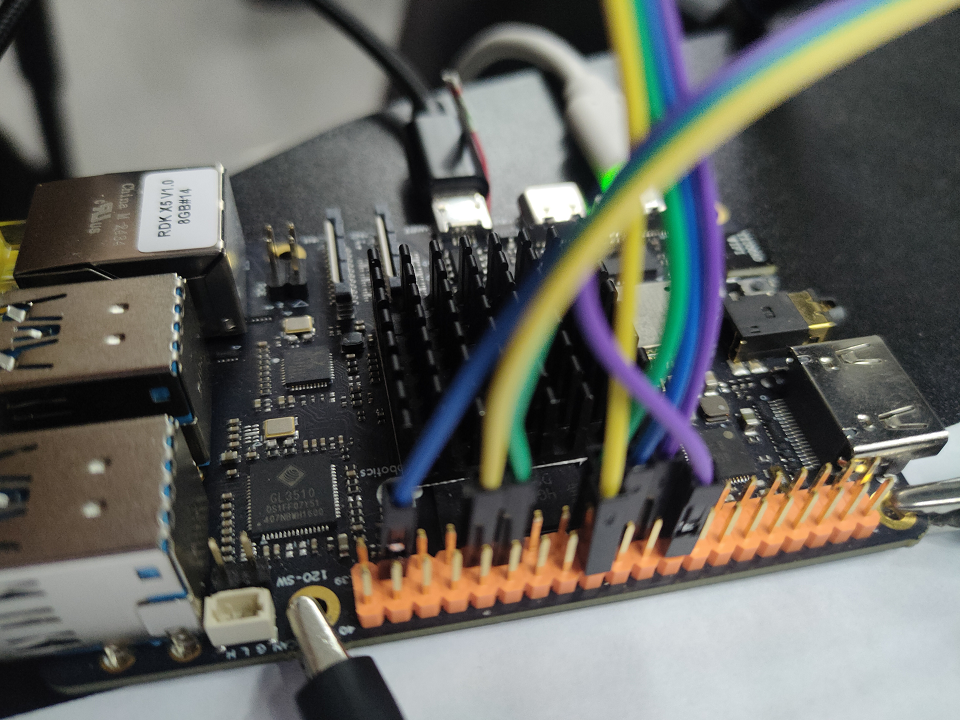
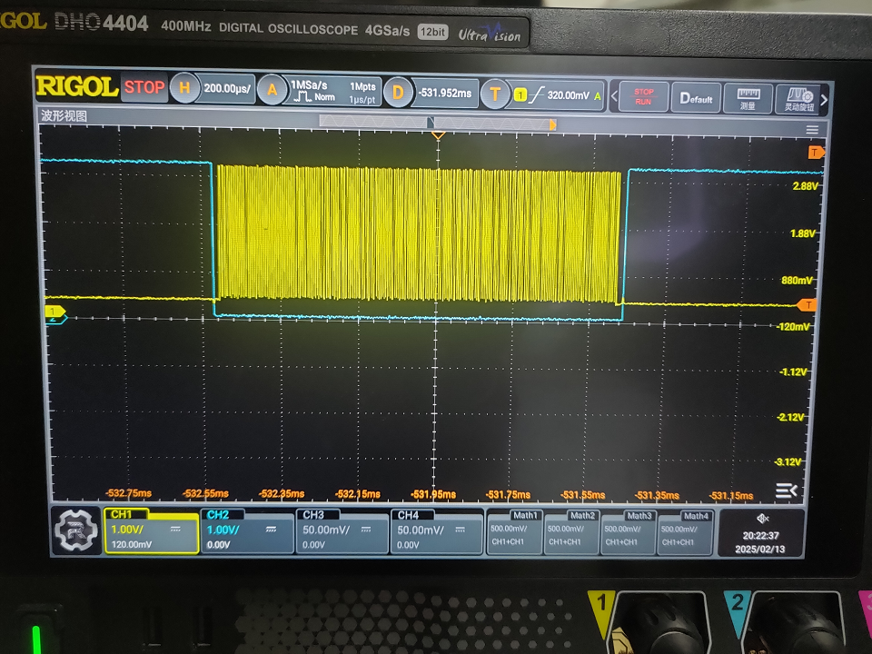
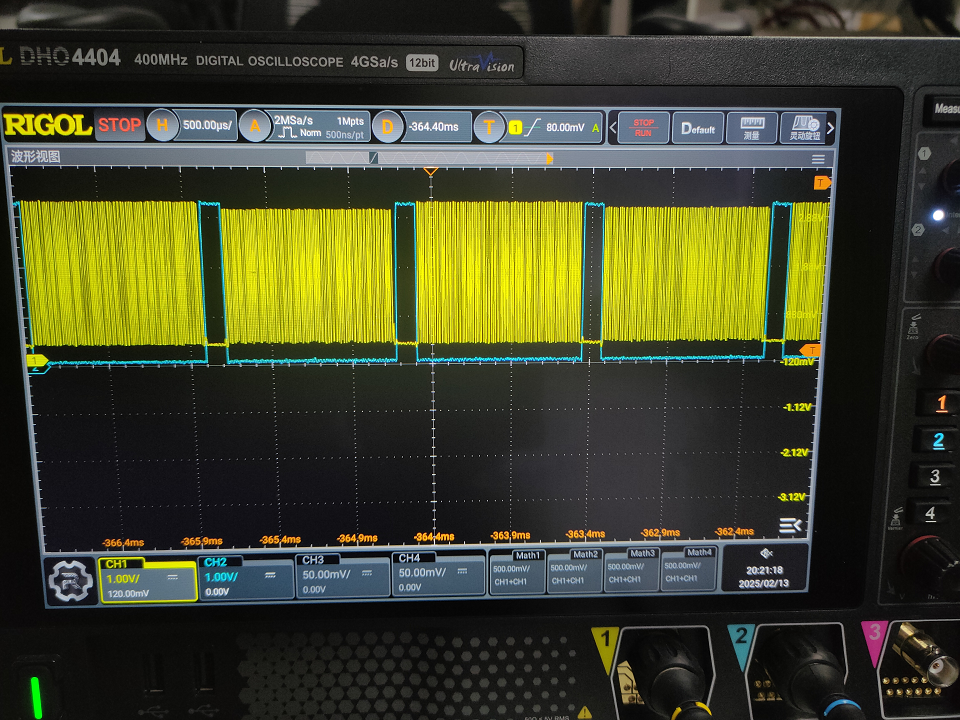

# SPI调试指南

## SPI硬件支持

X5共支持7路SPI控制器，其中6路(spi0-spi5)位于LSIO子系统，1路(spi6)位于DSP子系统。 所有SPI控制器均支持主/从模式。
RDK X5 上留出来的引脚主要是在 40pin 中，分别是**SPI1**和**SPI2**，可以参考RDK X5 [40pin介绍](/rdk_doc/Basic_Application/03_40pin_user_guide/40pin_define#40pin_define)
其他的 SPI 口并不在 40pin 上。

## Linux SPI驱动框架介绍

- spi driver层：主要实现对SPI硬件IP的操作，另外还实现了spi framework定义的接口。
- spi framework层：可以理解为spi driver的适配层，对下层定义了一组driver层需要实现的接口，对上提供了通用接口屏蔽了硬件细节。
- spi char device层：为用户空间提供节点，方便用户空间与内核空间进行数据交换。


### 代码路径

X5使用新思的ssi控制器，驱动代码位于：drivers/spi目录下，主要有三个文件：

```bash
drivers/spi/spi-dw-core.c
drivers/spi/spi-dw-mmio.c
drivers/spi/spi-dw-dma.c
```

### 控制器硬件说明

X5的所有SPI均控制器可以运行Master/Slave模式。Master及Slave的运行限制如下：

- SPI-Master：最高频率50MHz
- SPI-Slave：最高频率32MHz

X5的所有SPI控制器均可以运行在中断/DMA模式。中断模式运行限制如下：

- SPI-Slave：
    - Rx：CPU定频在1.5GHz时，可以达到32MHz
    - Tx：CPU定频在1.5GHz时，可以达到16MHz
- SPI-Master：均可正常通讯。

### DTS配置说明

X5 SPI控制器的设备树定义位于SDK包的kernel文件夹下的`arch/arm64/boot/dts/hobot/x5.dtsi`文件内。

<font color="red">注意：</font>x5.dtsi中的节点主要声明SoC共有特性，和具体电路板无关，一般情况下不用修改。

X5 SPI控制器默认关闭，请根据实际硬件情况，在对应的DTS文件内使能相应的SPI控制器。

以使能SPI2为例：

```c
&spi2 {
	status = "okay";
	pinctrl-names = "default";
	pinctrl-0 = <&pinctrl_spi2>;
};
```

### DTS配置SPI使用DMA

如果需要使用DMA，则需要在对应的DTS文件内绑定对应的DMA握手，以SPI2为例：

```c
&spi2 {
	status = "okay";
	pinctrl-names = "default";
	pinctrl-0 = <&pinctrl_spi2>;
	dma-names = "tx", "rx";
	dmas = <&axi_dmac 25>, <&axi_dmac 24>;
};
```

SPI6绑定时需要指定dsp_axi_dma，如下所示：

```c
&spi6 {
	status = "okay";
	pinctrl-names = "default";
	pinctrl-0 = <&pinctrl_dsp_spi>;
	dma-names = "tx", "rx";
	dmas = <&dsp_axi_dma 21>, <&dsp_axi_dma 20>;
};
```

SPI DMA握手列表如下：

| SPI  | DMA TX | DMA RX |
| ---- | ------ | ------ |
| SPI0 | 20 | 21 |
| SPI1 | 22 | 23 |
| SPI2 | 24 | 25 |
| SPI3 | 26 | 27 |
| SPI4 | 28 | 29 |
| SPI5 | 30 | 31 |
| SPI6 | 21 | 22 |

## SPI功能验证

本小节主要介绍X5 SPI的功能验证，主要包括环境配置，测试命令执行及测试代码等。

### 测试环境准备

确认内核的CONFIG_SPI_SPIDEV为使能状态:

```c
/* arch/arm64/configs/hobot_x5_soc_defconfig */
...
CONFIG_SPI_SPIDEV=m
...
```

确认在当前硬件的DTS内需要测试的SPI控制器节点下创建了一个dummy从设备：

```c
&spi2 {
	spidev@2 {
		compatible = "dr,x5-spidev";
		spi-max-frequency = <32000000>;
		reg = <0>;
	};
}
```

### SPI 内部回环测试
SPI内部回环测试仅SPI Master支持，其原理是SPI硬件IP的tx fifo将数据发给rx fifo从而形成回环。

测试命令及结果参考如下：

```c
# modprobe spidev
# ./spidev_tc -D /dev/spidev2.0 -v -s 1000000 -m 3 -l -e 10 -t 1
   spi mode: 0x20
   bits per word: 8
   max speed: 1000000 Hz (1000 KHz)
   userspace spi read and write test, len=10 times=1
   test, times=0
   TX | 67 C6 69 73 51 FF 4A EC 29 CD __ __ __ __ __ __ __ __ __ __ __ __ __ __ __ __ __ __ __ __ __ __

   RX | 67 C6 69 73 51 FF 4A EC 29 CD __ __ __ __ __ __ __ __ __ __ __ __ __ __ __ __ __ __ __ __ __ __
```

### SPI 外部回环测试

SPI 外部回环测试是指定一个SPI Slave，一个SPI Master，对应线连接进行的测试。 我们基于 RDK X5 的硬件以SPI2作为Slave，SPI1作为Master（使用双片选中的SPI1.1）为例： 修改SPI2 DTS以支持Slave功能：

```c
&spi2 {
	status = "okay";
	pinctrl-names = "default";
	pinctrl-0 = <&pinctrl_spi2>;
	spi-slave;

	slave@0 {
		compatible = "dr,x5-spidev";
		spi-max-frequency = <32000000>;
		reg = <0>;
	};
};
```

修改SPI1 DTS以支持Master功能：（SPI1具有两个片选，所以这里我们定义了两个设备子节点，系统正常启动之后，体现在文件系统中，就会有两个设备，/dev/spi1.0 和 /dev/spi1.1）

```c
&spi1 {
	status = "okay";
	pinctrl-names = "default";
	pinctrl-0 = <&pinctrl_spi1 &pinctrl_spi1_ssn1>;

	spidev@0 {
		compatible = "dr,x5-spidev";
		spi-max-frequency = <32000000>;
		reg = <0>;
	};

	spidev@1 {
		compatible = "dr,x5-spidev";
		spi-max-frequency = <32000000>;
		reg = <1>;
	};
};
```

测试命令及结果参考如下(以SPI2为Slave，SPI1.1为Master)：

```c

1、打开一个终端，操作 SPI 从设备：

root@ubuntu:~# /app/multimedia_samples/chip_base_test/05_spi_test/spidev_tc -D /dev/spidev2.0 -e 1 -v -S 64 -I 1
spi mode: 0x0
bits per word: 8
max speed: 500000 Hz (500 kHz)
Userspace spi read test, test_len=64 iterations=1

（说明：上述命令执行之后，程序会一直等待，直到接收到从 SPI Master 发送的数据。）


2、打开另一个终端，操作 SPI 主设备：
root@ubuntu:~# /app/multimedia_samples/chip_base_test/05_spi_test/spidev_tc -D /dev/spidev1.1 -e 2 -v -S 64 -I 1
spi mode: 0x0
bits per word: 8
max speed: 500000 Hz (500 kHz)
Userspace spi write test, test_len=64 iterations=1
TX | 67 C6 69 73 51 FF 4A EC 29 CD BA AB F2 FB E3 46 7C C2 54 F8 1B E8 E7 8D 76 5A 2E 63 33 9F C9 9A  |g.isQ.J.)......F|.T.....vZ.c3...|
TX | 66 32 0D B7 31 58 A3 5A 25 5D 05 17 58 E9 5E D4 AB B2 CD C6 9B B4 54 11 0E 82 74 41 21 3D DC 87  |f2..1X.Z%]..X.^.......T...tA!=..|
Test times: 0
root@ubuntu:~#

（说明：上述命令执行之后，SPI主设备就直接发送数据出去了）


3、这个时候可以观察到 SPI 从设备的终端会显示接收到的数据，整体状态形如下述结果：

root@ubuntu:~# /app/multimedia_samples/chip_base_test/05_spi_test/spidev_tc -D /dev/spidev2.0 -e 1 -v -S 64 -I 1
spi mode: 0x0
bits per word: 8
max speed: 500000 Hz (500 kHz)
Userspace spi read test, test_len=64 iterations=1
RX | 67 C6 69 73 51 FF 4A EC 29 CD BA AB F2 FB E3 46 7C C2 54 F8 1B E8 E7 8D 76 5A 2E 63 33 9F C9 9A  |g.isQ.J.)......F|.T.....vZ.c3...|
RX | 66 32 0D B7 31 58 A3 5A 25 5D 05 17 58 E9 5E D4 AB B2 CD C6 9B B4 54 11 0E 82 74 41 21 3D DC 87  |f2..1X.Z%]..X.^.......T...tA!=..|
rate: tx 0.1kbps, rx 0.1kbps
Test times: 0
root@ubuntu:~#


```

:::info 备注  
在进行外部回环测试时，需要先执行SPI Slave程序，再执行SPI Master程序。假如先执行SPI Master程序，后执行SPI Slave程序，可能会由于Master与Slave不同步导致SPI接收数据出现丢失。如果想进行多次测试，可以写脚本多次执行测试程序，来保证Master与Slave之间的同步。
:::

## 附录

**附录1 测试用例源码：spidev_tc.c**

```c
// Copyright (c) 2024，D-Robotics.
//
// Licensed under the Apache License, Version 2.0 (the "License");
// you may not use this file except in compliance with the License.
// You may obtain a copy of the License at
//
//     http://www.apache.org/licenses/LICENSE-2.0
//
// Unless required by applicable law or agreed to in writing, software
// distributed under the License is distributed on an "AS IS" BASIS,
// WITHOUT WARRANTIES OR CONDITIONS OF ANY KIND, either express or implied.
// See the License for the specific language governing permissions and
// limitations under the License.

/*
 * SPI testing utility (using spidev driver)
 *
 * Copyright (c) 2007  MontaVista Software, Inc.
 * Copyright (c) 2007  Anton Vorontsov <avorontsov@ru.mvista.com>
 *
 * This program is free software; you can redistribute it and/or modify
 * it under the terms of the GNU General Public License as published by
 * the Free Software Foundation; either version 2 of the License.
 *
 * Cross-compile with cross-gcc -I/path/to/cross-kernel/include
 */

#include <stdint.h>
#include <unistd.h>
#include <stdio.h>
#include <stdlib.h>
#include <string.h>
#include <errno.h>
#include <getopt.h>
#include <fcntl.h>
#include <time.h>
#include <sys/ioctl.h>
#include <linux/ioctl.h>
#include <sys/stat.h>
#include <linux/types.h>
#include <linux/spi/spidev.h>

#define ARRAY_SIZE(a) (sizeof(a) / sizeof((a)[0]))

static void pabort(const char *s)
{
	if (errno != 0)
		perror(s);
	else
		printf("%s\n", s);

	abort();
}

static const char *device = "/dev/spidev1.1";
static uint32_t mode;
static uint8_t bits = 8;
static char *input_file;
static char *output_file;
static uint32_t speed = 500000;
static uint16_t delay;
static int verbose;
static int transfer_size;
static int iterations = -1;
static int interval = 5; /* interval in seconds for showing transfer rate */
static int ext_mode = 0; //1: read, 2: write, 3: write and read(loopback)

static uint8_t default_tx[] = {
	0xFF, 0xFF, 0xFF, 0xFF, 0xFF, 0xFF,
	0x40, 0x00, 0x00, 0x00, 0x00, 0x95,
	0xFF, 0xFF, 0xFF, 0xFF, 0xFF, 0xFF,
	0xFF, 0xFF, 0xFF, 0xFF, 0xFF, 0xFF,
	0xFF, 0xFF, 0xFF, 0xFF, 0xFF, 0xFF,
	0xF0, 0x0D,
};

static uint8_t default_rx[ARRAY_SIZE(default_tx)] = {0, };
static char *input_tx;

static void hex_dump(const void *src, size_t length, size_t line_size,
		char *prefix)
{
	int i = 0;
	const unsigned char *address = src;
	const unsigned char *line = address;
	unsigned char c;

	printf("%s | ", prefix);
	while (length-- > 0) {
		printf("%02X ", *address++);
		if (!(++i % line_size) || (length == 0 && i % line_size)) {
			if (length == 0) {
				while (i++ % line_size)
					printf("__ ");
			}
			printf(" |");
			while (line < address) {
				c = *line++;
				printf("%c", (c < 32 || c > 126) ? '.' : c);
			}
			printf("|\n");
			if (length > 0)
				printf("%s | ", prefix);
		}
	}
}

/*
 *  Unescape - process hexadecimal escape character
 *      converts shell input "\x23" -> 0x23
 */
static int unescape(char *_dst, char *_src, size_t len)
{
	int ret = 0;
	int match;
	char *src = _src;
	char *dst = _dst;
	unsigned int ch;

	while (*src) {
		if (*src == '\\' && *(src+1) == 'x') {
			match = sscanf(src + 2, "%2x", &ch);
			if (!match)
				pabort("malformed input string");

			src += 4;
			*dst++ = (unsigned char)ch;
		} else {
			*dst++ = *src++;
		}
		ret++;
	}
	return ret;
}

static void transfer(int fd, uint8_t const *tx, uint8_t const *rx, size_t len)
{
	int ret;
	int out_fd;
	struct spi_ioc_transfer tr = {
		.tx_buf = (unsigned long)tx,
		.rx_buf = (unsigned long)rx,
		.len = len,
		.delay_usecs = delay,
		.speed_hz = speed,
		.bits_per_word = bits,
	};

	if (mode & SPI_TX_QUAD)
		tr.tx_nbits = 4;
	else if (mode & SPI_TX_DUAL)
		tr.tx_nbits = 2;
	else if (mode & SPI_RX_QUAD)
		tr.rx_nbits = 4;
	else if (mode & SPI_RX_DUAL)
		tr.rx_nbits = 2;
	if (!(mode & SPI_LOOP)) {
		if (mode & (SPI_TX_QUAD | SPI_TX_DUAL))
			tr.rx_buf = 0;
		else if (mode & (SPI_RX_QUAD | SPI_RX_DUAL))
			tr.tx_buf = 0;
	}

	ret = ioctl(fd, SPI_IOC_MESSAGE(1), &tr);
	if (ret < 1)
		pabort("can't send spi message");

	if (verbose && ext_mode >> 1)
		hex_dump(tx, len, 32, "TX");

	if (output_file) {
		out_fd = open(output_file, O_WRONLY | O_CREAT | O_TRUNC, 0666);
		if (out_fd < 0)
			pabort("could not open output file");

		ret = write(out_fd, rx, len);
		if (ret != len)
			pabort("not all bytes written to output file");

		close(out_fd);
	}

	if (verbose && ext_mode&0x01)
		hex_dump(rx, len, 32, "RX");
}

static void print_usage(const char *prog)
{
	printf("Usage: %s [-DsbdlHOLC3vpNR24SIeh]\n", prog);
	puts("  -D --device   device to use (default /dev/spidev1.1)\n"
			"  -s --speed    max speed (Hz)\n"
			"  -d --delay    delay (usec)\n"
			"  -b --bpw      bits per word\n"
			"  -i --input    input data from a file (e.g. \"test.bin\")\n"
			"  -o --output   output data to a file (e.g. \"results.bin\")\n"
			"  -l --loop     loopback\n"
			"  -H --cpha     clock phase\n"
			"  -O --cpol     clock polarity\n"
			"  -L --lsb      least significant bit first\n"
			"  -C --cs-high  chip select active high\n"
			"  -3 --3wire    SI/SO signals shared\n"
			"  -v --verbose  Verbose (show tx buffer)\n"
			"  -p            Send data (e.g. \"1234\\xde\\xad\")\n"
			"  -N --no-cs    no chip select\n"
			"  -R --ready    slave pulls low to pause\n"
			"  -2 --dual     dual transfer\n"
			"  -4 --quad     quad transfer\n"
			"  -S --size     transfer size\n"
			"  -I --iter     iterations\n"
			"  -e --exmode   Specify the test ext_mode, 1: read, 2: write, 3: write and read\n"
			"  -h --help     Display this help message\n");
	exit(1);
}

static void parse_opts(int argc, char *argv[])
{
	while (1) {
		static const struct option lopts[] = {
			{ "device",  1, 0, 'D' },
			{ "speed",   1, 0, 's' },
			{ "delay",   1, 0, 'd' },
			{ "bpw",     1, 0, 'b' },
			{ "input",   1, 0, 'i' },
			{ "output",  1, 0, 'o' },
			{ "loop",    0, 0, 'l' },
			{ "cpha",    0, 0, 'H' },
			{ "cpol",    0, 0, 'O' },
			{ "lsb",     0, 0, 'L' },
			{ "cs-high", 0, 0, 'C' },
			{ "3wire",   0, 0, '3' },
			{ "no-cs",   0, 0, 'N' },
			{ "ready",   0, 0, 'R' },
			{ "dual",    0, 0, '2' },
			{ "verbose", 0, 0, 'v' },
			{ "quad",    0, 0, '4' },
			{ "size",    1, 0, 'S' },
			{ "iter",    1, 0, 'I' },
			{ "exmode",  1, 0, 'e' },
			{ "help",    0, 0, 'h' },
			{ NULL, 0, 0, 0 },
		};
		int c;

		c = getopt_long(argc, argv, "D:s:d:b:i:o:lHOLC3NR24p:vS:I:e:h",
				lopts, NULL);

		if (c == -1)
			break;

		switch (c) {
		case 'D':
			device = optarg;
			break;
		case 's':
			speed = atoi(optarg);
			break;
		case 'd':
			delay = atoi(optarg);
			break;
		case 'b':
			bits = atoi(optarg);
			break;
		case 'i':
			input_file = optarg;
			break;
		case 'o':
			output_file = optarg;
			break;
		case 'l':
			mode |= SPI_LOOP;
			break;
		case 'H':
			mode |= SPI_CPHA;
			break;
		case 'O':
			mode |= SPI_CPOL;
			break;
		case 'L':
			mode |= SPI_LSB_FIRST;
			break;
		case 'C':
			mode |= SPI_CS_HIGH;
			break;
		case '3':
			mode |= SPI_3WIRE;
			break;
		case 'N':
			mode |= SPI_NO_CS;
			break;
		case 'v':
			verbose = 1;
			break;
		case 'R':
			mode |= SPI_READY;
			break;
		case 'p':
			input_tx = optarg;
			break;
		case '2':
			mode |= SPI_TX_DUAL;
			break;
		case '4':
			mode |= SPI_TX_QUAD;
			break;
		case 'S':
			transfer_size = atoi(optarg);
			break;
		case 'I':
			iterations = atoi(optarg);
			break;
		case 'e':
			ext_mode = atoi(optarg);
			break;
		case 'h':
			print_usage(argv[0]);
			break;
		default:
			print_usage(argv[0]);
		}
	}
	if (mode & SPI_LOOP) {
		if (mode & SPI_TX_DUAL)
			mode |= SPI_RX_DUAL;
		if (mode & SPI_TX_QUAD)
			mode |= SPI_RX_QUAD;
	}
}

static void transfer_escaped_string(int fd, char *str)
{
	size_t size = strlen(str);
	uint8_t *tx;
	uint8_t *rx;

	tx = malloc(size);
	if (!tx)
		pabort("can't allocate tx buffer");

	rx = malloc(size);
	if (!rx)
		pabort("can't allocate rx buffer");

	size = unescape((char *)tx, str, size);
	transfer(fd, tx, rx, size);
	free(rx);
	free(tx);
}

static void transfer_file(int fd, char *filename)
{
	ssize_t bytes;
	struct stat sb;
	int tx_fd;
	uint8_t *tx;
	uint8_t *rx;

	if (stat(filename, &sb) == -1)
		pabort("can't stat input file");

	tx_fd = open(filename, O_RDONLY);
	if (tx_fd < 0)
		pabort("can't open input file");

	tx = malloc(sb.st_size);
	if (!tx)
		pabort("can't allocate tx buffer");

	rx = malloc(sb.st_size);
	if (!rx)
		pabort("can't allocate rx buffer");

	bytes = read(tx_fd, tx, sb.st_size);
	if (bytes != sb.st_size)
		pabort("failed to read input file");

	transfer(fd, tx, rx, sb.st_size);
	free(rx);
	free(tx);
	close(tx_fd);
}

static uint64_t _read_count;
static uint64_t _write_count;

static void show_transfer_rate(void)
{
	static uint64_t prev_read_count, prev_write_count;
	double rx_rate, tx_rate;

	rx_rate = ((_read_count - prev_read_count) * 8) / (interval*1000.0);
	tx_rate = ((_write_count - prev_write_count) * 8) / (interval*1000.0);

	printf("rate: tx %.1fkbps, rx %.1fkbps\n", rx_rate, tx_rate);

	prev_read_count = _read_count;
	prev_write_count = _write_count;
}

static void transfer_buf(int fd, int len)
{
	uint8_t *tx;
	uint8_t *rx;
	int i;

	tx = malloc(len);
	if (!tx)
		pabort("can't allocate tx buffer");
	for (i = 0; i < len; i++)
		tx[i] = random();

	rx = malloc(len);
	if (!rx)
		pabort("can't allocate rx buffer");

	transfer(fd, tx, rx, len);

	_write_count += len;
	_read_count += len;

	if (mode & SPI_LOOP) {
		if (memcmp(tx, rx, len)) {
			fprintf(stderr, "transfer error !\n");
			hex_dump(tx, len, 32, "TX");
			hex_dump(rx, len, 32, "RX");
			exit(1);
		}
	}

	free(rx);
	free(tx);
}

static void transfer_read_write(int fd, int len)
{
	uint8_t *tx;
	uint8_t *rx;
	int i = 0, j = 0;
	char str[64] = {0};
	struct timespec last_stat;
	struct timespec current;

	if (ext_mode == 2)
		sprintf(str, "write");
	else if (ext_mode == 3)
		sprintf(str, "read and write");
	else {
		ext_mode = 1;
		sprintf(str, "read");
	}

	printf("Userspace spi %s test, test_len=%d iterations=%d\n", str, len, iterations);

	tx = malloc(len);
	if (!tx)
		pabort("can't allocate tx buffer");
	rx = malloc(len);
	if (!rx)
		pabort("can't allocate rx buffer");

	clock_gettime(CLOCK_MONOTONIC, &last_stat);
	while (iterations == -1 || j < iterations) {
		memset(tx, 0 , len);
		memset(rx, 0, len);

		if (ext_mode >> 1) {
			for (i = 0; i < len; i++)
				tx[i] = random();
		} else {
			for (i = 0; i < len; i++)
				tx[i] = i << 2;
		}

		transfer(fd, tx, rx, len);

		_write_count += len;
		_read_count += len;

		clock_gettime(CLOCK_MONOTONIC, &current);
		if (verbose && current.tv_sec - last_stat.tv_sec > interval) {
			show_transfer_rate();
			last_stat = current;
		}

		if (ext_mode == 3) {
			printf("Test times: %d Data verification %s\n", j, memcmp(tx, rx, len) == 0 ? "Successful" : "Failed");
		} else {
			printf("Test times: %d\n", j);
		}
		j++;
	}

	free(rx);
	free(tx);
}

int main(int argc, char *argv[])
{
	int ret = 0;
	int fd;
	uint32_t request;

	parse_opts(argc, argv);

	if (input_tx && input_file)
		pabort("only one of -p and --input may be selected");

	fd = open(device, O_RDWR);
	if (fd < 0)
		pabort("can't open device");

	/*
	 * spi mode
	 */
	/* WR is make a request to assign 'mode' */
	request = mode;
	ret = ioctl(fd, SPI_IOC_WR_MODE32, &mode);
	if (ret == -1)
		pabort("can't set spi mode");

	/* RD is read what mode the device actually is in */
	ret = ioctl(fd, SPI_IOC_RD_MODE32, &mode);
	if (ret == -1)
		pabort("can't get spi mode");
	/* Drivers can reject some mode bits without returning an error.
	 * Read the current value to identify what mode it is in, and if it
	 * differs from the requested mode, warn the user.
	 */
	if (request != mode)
		printf("WARNING device does not support requested mode 0x%x\n",
			request);

	/*
	 * bits per word
	 */
	ret = ioctl(fd, SPI_IOC_WR_BITS_PER_WORD, &bits);
	if (ret == -1)
		pabort("can't set bits per word");

	ret = ioctl(fd, SPI_IOC_RD_BITS_PER_WORD, &bits);
	if (ret == -1)
		pabort("can't get bits per word");

	/*
	 * max speed hz
	 */
	ret = ioctl(fd, SPI_IOC_WR_MAX_SPEED_HZ, &speed);
	if (ret == -1)
		pabort("can't set max speed hz");

	ret = ioctl(fd, SPI_IOC_RD_MAX_SPEED_HZ, &speed);
	if (ret == -1)
		pabort("can't get max speed hz");

	printf("spi mode: 0x%x\n", mode);
	printf("bits per word: %u\n", bits);
	printf("max speed: %u Hz (%u kHz)\n", speed, speed/1000);

	if (input_tx)
		transfer_escaped_string(fd, input_tx);
	else if (input_file) {
		transfer_file(fd, input_file);
	} else if (ext_mode && transfer_size) {
		transfer_read_write(fd, transfer_size);
	} else if (transfer_size) {
		struct timespec last_stat;

		clock_gettime(CLOCK_MONOTONIC, &last_stat);

		while (iterations-- > 0) {
			struct timespec current;

			transfer_buf(fd, transfer_size);

			clock_gettime(CLOCK_MONOTONIC, &current);
			if (current.tv_sec - last_stat.tv_sec > interval) {
				show_transfer_rate();
				last_stat = current;
			}
		}
		printf("total: tx %.1fKB, rx %.1fKB\n",
				_write_count/1024.0, _read_count/1024.0);
	} else
		transfer(fd, default_tx, default_rx, sizeof(default_tx));

	close(fd);

	return ret;
}
```

**附录2 测试用例源码：Makefile**

```shell
OUT_DIR = $(shell pwd)/_build/

.PHONY: build install clean

BIN_NAME = spidev_tc
SRCS = $(wildcard ./*.c)
OBJS = $(addprefix ${OUT_DIR}/, $(patsubst %.c, %.o, ${SRCS}))

BIN_TEST1 = ${OUT_DIR}/${BIN_NAME}
OBJECT = ${BIN_TEST1}

build: ${OBJECT}

Q:=

$(OBJECT): $(OBJS)
	$(Q)mkdir -p $(abspath $(dir $@))
	$(Q)echo CC $@
	$(Q)${CC} ${CFLAGS} ${INCS} $^ ${LDFLAGS} $(LIBS) -o $@

${OUT_DIR}/%.o: %.c
	$(Q)mkdir -p $(abspath $(dir $@))
	$(Q)echo CC $@
	$(Q)${CC} $(INCS) -c $< -o $@

clean :
	rm -rf $(OBJS) $(OBJECT)
```


## 常见问题
Q：引脚都连接好了，执行了程序，但还是没有看到期望的结果，是怎么回事？

A：可以拿出示波器或者其他信号测量的设备，连接想测量的引脚，进行测量。\
比如上述的外部回环测试，我们确认接线正确之后，测量片选和时钟信号。参考如下：






