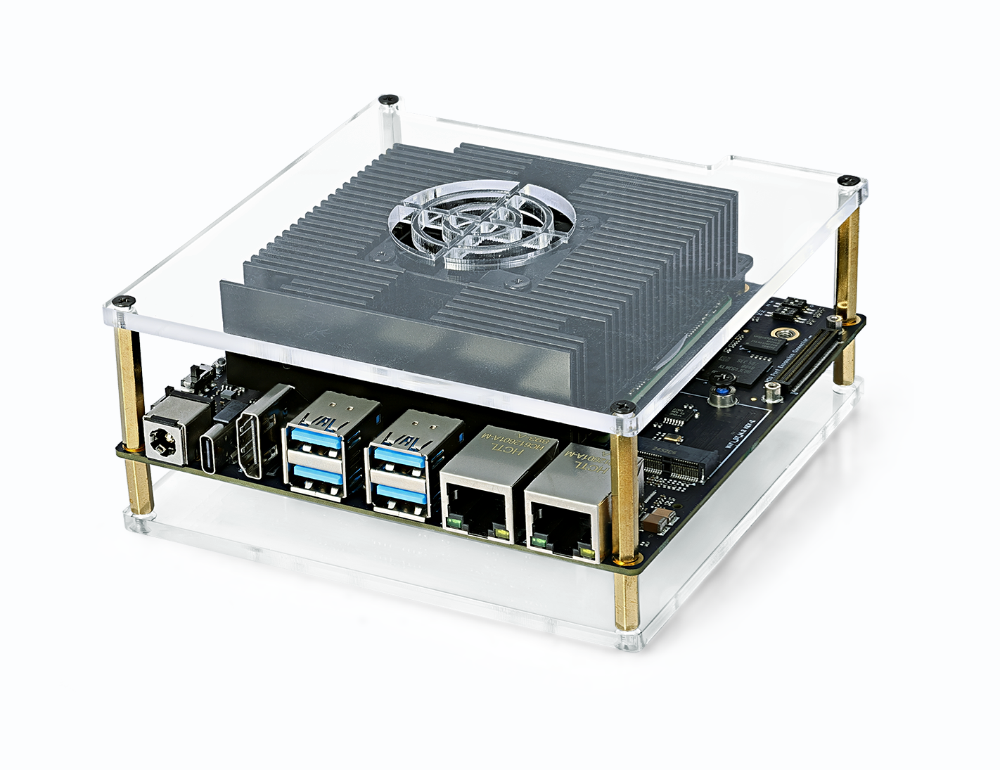
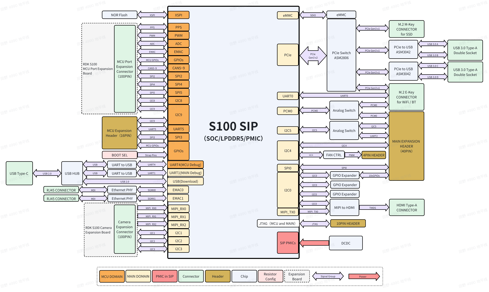
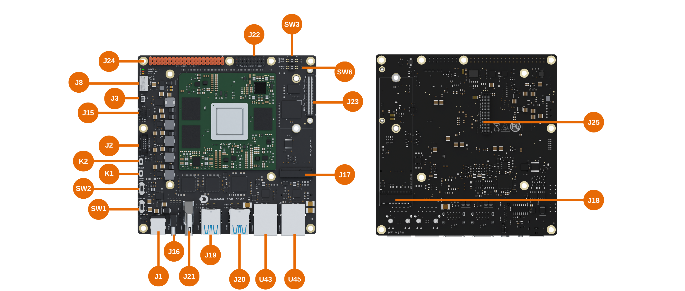

# 1.1.1 RDK S100

:::warning 警告

1. RDK S100 使用外接电源，需满足相关地区的法规标准。
2. 本产品应在通风良好的环境中使用，在密闭空间使用时，需要做好散热措施。
3. 使用时，本产品应放置在稳固、平坦、不导电的表面上。
4. 将不兼容的设备与 RDK S100 连接时，导致设备损坏，将不支持维修。
5. 所有与本产品配套使用的外围设备均应符合使用国家的相关标准，并标明相应地确保满足安全和性能要求。 外围设备包括但不限于与 RDK S100 结合使用时的键盘、显示器和鼠标。
6. 与本产品一起使用的所有外围设备的电缆和连接器必须有足够的绝缘，以便相关的满足安全要求。

:::

:::warning 安全守则

为避免本产品发生故障或损坏，请遵守以下事项：

1. 运行时，请勿接触水或湿气，或放置在导电物体表面上，不要接触任何热源，以确保本品在正常环境温度下可靠运行。
2. 装配时，避免对印刷电路板和连接器造成机械或电气损坏。
3. 通电时，避免手触摸印刷电路板及设备边缘，减少静电放电损坏的风险。

:::

## 产品介绍

地瓜机器人 RDK S100 系列开发者套件搭载 S100 智能计算芯片，BPU 可提供高达 80/128TOPS 的算力，是一款面向智能计算与机器人应用的开发板，接口丰富，极致易用，独特的异构设计可以同时兼顾感知推理和实时运动控制的需求，减少控制系统的体积和复杂度。

### 主要功能

| 名称     | 参数                                                                                                                                                                                                                                 |
| -------- | ------------------------------------------------------------------------------------------------------------------------------------------------------------------------------------------------------------------------------------ |
| 核心规格 | CPU: 6x ARM® Cortex®-A78AE  MCU: 4x ARM® Cortex®-R52+ (1× DCLS, 1× Split-Lock) BPU: 1x BPU Nash GPU: ARM Mali-G78AE RAM: 96bit LPDDR5, Up to 6400Mbps                                                            |
| 存储     | 板载 64GB EMMC 提供 M.2 Key M 硬盘接口                                                                                                                                                                                          |
| 互联接口 | 4 x USB 3.0 Type-A 接口 1 x USB 2.0 Type-C（镜像烧录、MCU/Main Domain 串口调试）  1 x JTAG 调试接口（Main & MCU Domain）  1 x 40-Pin GPIO（SPI、I2C、I2S、PWM、UART 等）  1 x MCU 接口扩展（供 MCU Domain 使用） |
| 显示     | 1 x HDMI Type-A 接口，最高支持 2560x1440@60Hz                                                                                                                                                                                        |
| 相机     | 1 x 相机扩展接口，提供 3x 4lane MIPI CSI-2                                                                                                                                                                                           |
| 音频     | 1 x I2S/PCM                                                                                                                                                                                                                          |
| 网络能力 | 2 x RJ45 接口（1000M 以太网） M.2 Key E（接入 WiFi & BT 模组）                                                                                                                                                             |
| 电源     | 电源适配器：包装内包含 90W 电源适配器 电源输入：板卡支持 12-20V DC, Max 150W                                                                                                                                                    |
| 温度范围 | 0℃ ~ 45℃                                                                                                                                                                                                                             |

### 拓扑图

### 接口图

| 序号    | 功能                                        | 序号    | 功能                    |
| ------- | ------------------------------------------- | ------- | ----------------------- |
| J1      | 主板供电接口                                | J22     | MCU 域的 16-Pin 接口    |
| J2      | 主板功能接插件                              | J23     | MCU 扩展板 100-Pin 接口 |
| J3      | RTC 电池接口                                | J24     | 40-Pin 接口             |
| J8      | 风扇控制接口                                | J25     | 相机口展板 100-Pin 接口 |
| J15     | Main 域和 MCU 域 JTAG 接口                  | K1      | 重置按钮                |
| J16     | Type-C 接口，用于烧录，Main 域和 MCU 域调试 | K2      | 睡眠按钮                |
| J17     | M.2 Key E 接口                              | SW1     | 电源开关                |
| J18     | M.2 Key M 接口                              | SW2     | 烧录模式开关            |
| J19&J20 | 4x USB3.0 Type-A 接口                       | SW3&SW6 | 引脚功能切换拨码开关    |
| J21     | HDMI 接口                                   | U43&U45 | 2x 千兆 RJ45 网口       |

## 接口说明

接口定义: [drobotics_rdk_s100_pinlist_v1p0.xlsx](../../../static/asset/rdk_s100/drobotics_rdk_s100_pinlist_v1p0.xlsx)

### DC Jack (J1)

:::info

1. 主板上的 DC 电源连接器的额定电压为 20V，额定电流为 10A。
2. 系统的负载工作在典型场景使用 70W 的供电电源(12V@5.5A)，极限场景下建议使用 150W 的供电电源(20@7.5A)。
3. 选择内径 2.5mm，实测外径 5.5mm 或 6mm 适配器都可以正常使用。

:::

### Automatic (J2)

:::info 提示

1. 12pin 连接器主要作用如下：
   1. 将主板上得系统运行灯/电源指示灯/烧录指示灯拓展到主板外部进行显示，能让人清楚看到对应功能是否正常。
   2. 将烧录开关拓展到主板外面便于人工操作
   3. 将休眠按键和复位按键拓展到主板外面便于操作
   4. 将电源开关拓展到主板外面便于人工操作
2. 上面接口的供电只允许接功能描述中涉及到的电路，不允许接大功耗的负载，若需要接负载必须咨询地瓜工程师。
3. PIN1 和 3 连接自锁开关作为烧录开关
4. PIN5 和 GND 连接按键为复位按键
5. PIN7 和 GND 连接按键为休眠按键
6. PIN11 连接外部控制系统运行指示灯 MOS 管的 G 极可以控制灯的闪烁
7. PIN2 和 6 连接自锁开关作为电源开关
8. PIN10 用来接电源指示灯(翠绿色)
9. PIN12 用来接系统运行指示灯(黄色)
10. PIN3 还可以用来接烧录的 LED 指示灯(红色)
11. VDD_AON_PERI_5V，DCIN_CONN，休眠状态下不掉电，VDD_PERI_3V3 休眠下会掉电
12. 使用这些电源注意在外接小板上预留短路保护电路，避免导致主板因为外扩子板短路导致供电异常。

:::

### RTC (J3)

:::info

请联系 FAE 获取相关信息

:::

### FAN (J8)

:::info 提示

1. 用于连接 S100 系统的散热风扇控制风扇转动速率，12V 供电能力 200mA。

:::

### Type-C (J16)

RDK S100 开发板提供的一路 Type-C 接口，具有多种功能，包括固件烧录，Main 域调试串口和 MCU 域调试串口。

- 调试串口。硬件上通过 2 颗`CH340`芯片将核心模组 Main 域与 MCU 域的调试串口转换为 USB 接口，用户可使用该接口进行各种调试工作。用户第一次使用该接口时需要在电脑上安装 CH340 驱动，用户可搜索`CH340串口驱动`关键字进行下载、安装。电脑串口工具的参数需按如下方式配置：

  - 波特率（Baud rate）：921600
  - 数据位（Data bits）：8
  - 奇偶校验（Parity）：None
  - 停止位（Stop bits）：1
  - 流控（Flow Control）：无

- USB 下载接口。RDK S100 开发板提供的一路下载接口用于固件下载，具体可以参考[1.2 系统烧录](../02_install_os/rdk_s100.md)

### M.2 Key E (J17)

用于接支持 PCIE 的 WIFI 和四线 UART 的 BT，PCIE 支持单 lane gen3x1，没有提供 USB/SDIO 接口，无 LED 信号。

:::info

1. 支持 WIFI/BT 休眠唤醒。
2. VDD_AON_PERI_3V3 休眠下会掉电，供电能力为 750mA。

:::

### M.2 Key M (J18)

用于接 PCIE 固态硬盘，PCIE 支持单 lane gen3x1，无 LED 信号；

:::info

1. 不支持休眠唤醒；
2. I2C4 预留给 SSD 使用，注意外设地址不要与 0X32,0X2F(不算读写位的地址)冲突。
3. VDD_PERI_3V3 休眠下会掉电，供电能力为 700mA。

:::

### MCU 16-Pin (J22)

:::info 提示

1. 信号均为 3V3 电平信号。
2. 3V3 和 5V 电源休眠模式下不会掉电，3V3 和 5V 电源最大供电电流分别为 300mA 和 200mA。

:::

### MCU 100-Pin (J23)

:::info 提示

1. 3V3 和 5V 电源休眠模式下不会掉电，3V3 和 5V 电源最大供电电流均为 1000mA。
2. VDDIO_MCU_3V3 和 VDDIO_MCU_1V8 不能接外设负载，只允许用作电平转换，上下拉电阻，ADC 分压等小功耗应用，休眠模式下这两个电源会掉电。

:::

### A-Core 40-Pin (J24)

:::info 提示

1. 40PIN_GPIO0_3V3~40PIN_GPIO9_3V3 一共 10 个 GPIO，默认是由扩展 IO IC TPT29555A 提供,上电内部有 100K 弱上拉电阻，若需要使用其同时做多个输入或中断功能请咨询地瓜软件或硬件工程师
2. I2C4/5 主板上默认有 4K 上拉电阻
3. SPI0 只支持 master
4. UART2_TX/RX_3V3 和 I2C5_SCL/SDA_3V3 两个接口属于共用 ball 的关系，同时只能使用其中一个接口
5. I2C4 默认给 M2.M 接口/RTC IC/FAN 控制 IC 进行通讯，M2.M 接口默认未使用 I2C4，RTC IC 和 FAN 控制 IC 默认进行通讯，I2C ADDRESS 分别为 0X32 和 0X2F(不算读写位的地址)，用 I2C4 接外设需要注意外设地址不要和板级 IC 地址重复
6. PCM0 接口与 WIFI 模组的 PCM 共用
7. GPIO_CAM_4_3V3 和 GPIO_CAM_5_3V3 信号可以输出 LPWM 或 GPIO 信号

:::

### CAM 100-Pin (J25)

:::info 提示

1. 3V3 和 12V 电源休眠模式下会掉电，3V3 和 12V 电源最大供电电流分别为 1700mA 和 800mA。
2. 包含 3 组 4lane MIPI RX 信号，IO 信号有 1V8 电平的也有 3V3 电平的，可以参考 pin 定义文件。

:::

### 有线网口 (U43/U45)

开发板配备两路千兆以太网接口，兼容 1000BASE-T 和 100BASE-T 标准，支持自动协商速率切换。

| 编号 | 标识 | 功能说明                             | IP 配置方式                  | 默认 IP 地址   |
| ---- | ---- | ------------------------------------ | ---------------------------- | -------------- |
| U43  | eth0 | 通用以太网接口，需用户配置 IP 地址   | 外部 DHCP 分配或手动静态配置 | 无             |
| U45  | eth1 | 管理或专用通信接口，内置静态 IP 地址 | 固定静态 IP                  | 192.168.127.10 |

### HDMI 接口 (J21)

RDK S100 开发板提供一路 HDMI 显示接口，最高支持 2k 60 帧的显示模式。开发板上电后会通过 HDMI 接口输出 Ubuntu 图形界面，配合特定的示例程序，同时还支持摄像头、视频流画面的预览显示功能。

### USB 接口 (J19/J20)

RDK S100 开发板提供了四路 PCIE 拓展出来的 USB3.0 标准接口，可以满足 4 路 USB 外设同时接入使用。

## 开关、按键和灯光说明

### 按键 (K1/K2)

| 编号 | 名称  | 描述                                | 使用方法                       |
| ---- | ----- | ----------------------------------- | ------------------------------ |
| K1   | RST   | 复位 S100 系统                      | 按下按键之后系统进入复位       |
| K2   | SLEEP | 控制 S100 系统进入休眠或者唤醒 S100 | 单点按键中断触发休眠和唤醒功能 |

### 开关 (SW1/SW2)

| 编号 | 名称     | 描述         | 使用方法                     |
| ---- | -------- | ------------ | ---------------------------- |
| SW1  | ON/OFF   | 电源开关     | ▽：上电，↑：关闭             |
| SW2  | DOWNLOAD | 烧录模式开关 | ▽：正常启动模式，↑：烧录模式 |

### 拨码开关 (SW3/SW6)

#### 系统启动盘选择 (SW3)

:::info

当前仅支持 eMMC 启动

:::

| D13 | D12 | 启动介质 | 描述                     |
| --- | --- | -------- | ------------------------ |
| 0   | 1   | eMMC     | 从板载 eMMC 启动         |
| 1   | 0   | NVMe     | 从 M.2 NVMe 固态硬盘启动 |

#### 功能切换 (SW4)

:::info 建议

对于 PCM0，如果不需要 Wi-Fi 模组的蓝牙音频功能，可以默认向右拨码。

:::

| 拨码名称 | 1                               | 0                                 |
| -------- | ------------------------------- | --------------------------------- |
| 40 PIN   | 40-Pin 的 3、5 引脚有效，为 I2C | 40-Pin 的 8、10 引脚有效，为 UART |
| PCM0     | PCM0 用于 M.2 E Key             | PCM0 用于 40PIN                   |
