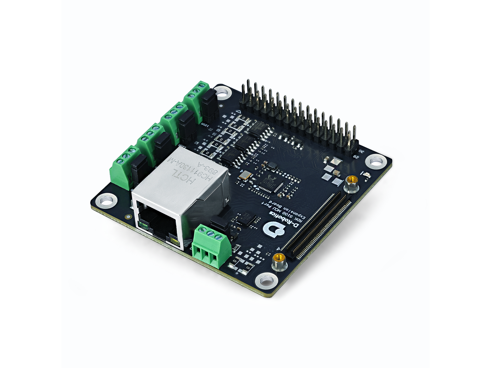
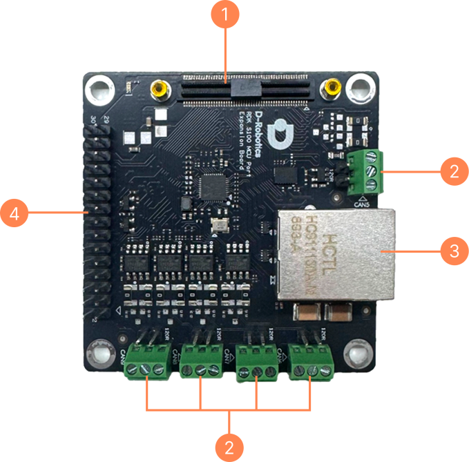

# 1.1.3 MCU 接口扩展板

地瓜机器人 RDK S100 MCU 接口扩展板是 RDK S100 开发者套件的一个扩展件。将 RDK S100 的 MCU Domain 的主要接口引出，便于用户接入外设进行测试和开发。

:::warning

1. 使用外接电源，需满足相关地区的法规标准。
2. 本产品应在通风良好的环境中使用，在密闭空间使用时，需要做好散热措施。
3. 使用时，本产品应放置在稳固、平坦、不导电的表面上。
4. 将不兼容的设备与本品连接时，导致设备损坏，将不支持维修。
5. 所有与本产品配套使用的外围设备均应符合使用国家的相关标准，并标明相应地确保满足安全和性能要求。
6. 与本产品一起使用的所有外围设备的电缆和连接器必须有足够的绝缘，以便相关的满足安全要求。

:::

:::warning 安全使用

为避免本产品发生故障或损坏，请遵守以下事项：

1. 运行时，请勿接触水或湿气，或放置在导电物体表面上，不要接触任何热源，以确保本品在正常环境温度下可靠运行。
2. 装配时，避免对印刷电路板和连接器造成机械或电气损坏。 3)通电时，避免手触摸印刷电路板及设备边缘，减少静电放电损坏的风险。

:::

## 产品规格

| **名称** | **参数**                                                                 |
| -------- | ------------------------------------------------------------------------ |
| 接口     | 5 x CANFD 1 x 30-pin，具有最多 7x ADC, 2x IIC, 2x SPI 1 x RJ45 |
| 板载模组 | IMU：BMI088                                                              |
| 工作温度 | 0℃~45℃                                                                   |

## 接口描述

| **序号** | **功能**                                            |
| -------- | --------------------------------------------------- |
| 1        | MCU 扩展板 100-pin 连接器，用于和 RDK S100 主板连接 |
| 2        | CAN 接口，总共 5 路                                 |
| 3        | MCU 域的 RJ45 千兆网口                              |
| 4        | 30-pin 引脚，具有最多 7x ADC, 2x IIC, 2x SPI        |

## 尺寸规格

板卡尺寸：70x70x17mm
