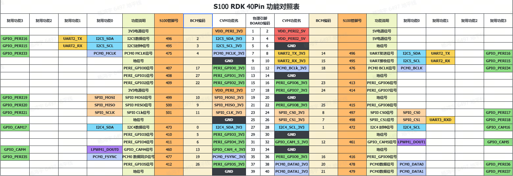

# 3.3.1 管脚定义与应用

```mdx-code-block
import Tabs from '@theme/Tabs';
import TabItem from '@theme/TabItem';
```

开发板上的存在扩展引脚排，方便用户进行外围扩展，接口定义请查看本章节。

## 管脚复用关系配置(废弃)

待更新

## 扩展引脚排定义{#40pin_define}

RDKS100 有 40-pin，方便用户进行外围扩展，其中数字 IO 采用 3.3V 电平设计。接口定义如下：



## GPIO 读写操作示例

:::tip
以下所提及的管脚仅作示例说明，不同平台的端口值存在差异，实际情况应以实际为准。亦可直接使用`/app/40pin_samples/`目录下的代码，该代码已在板子上经过实际验证。
:::

Video: https://www.bilibili.com/video/BV1rm4y1E73q/?p=16

开发板 `/app/40pin_samples/` 目录下，预置了多种 PIN 管脚的功能测试代码，包括 gpio 的输入/输出测试、PWM、I2C、SPI、UART 等测试。所有测试程序均使用 python 语言编写，详细信息可以查阅本章节其他模块。

以`/app/40pin_samples/button_led.py`为例，该程序配置`24`号管脚为输入，配置`23`号管脚配置为输出，并根据`24`号管脚的输入状态来控制`23`号管脚的输出状态。

## 环境准备

使用杜邦线连接 `24`号管脚到 3.3v or GND，以控制其高低电平。

## 运行方式

执行 `button_led.py` 程序，以启动 GPIO 读写程序

```bash
root@ubuntu:~# cd /app/40pin_samples/
root@ubuntu:/app/40pin_samples# sudo python3 ./button_led.py
```

## 预期效果

通过控制`24`号管脚的高低电平，可以改变 `23`号管脚的输出电平值。

```bash
root@ubuntu:/app/40pin_samples# ./button_led.py
Starting demo now! Press CTRL+C to exit
Outputting 1 to Pin 23
Outputting 0 to Pin 23
Outputting 1 to Pin 23
```
