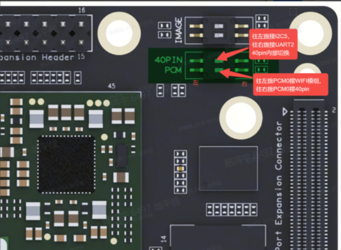

# 3.3.5 I2C 应用

RDX S100 在 40PIN 上默认使能 I2C5（物理管脚号 3 和 5）和 I2C4（物理管脚号 27 和 28），IO 电压 3.3V。

:::info

- 40pin 上需要波动拨码开关来选择使用 I2C5 还是 UART2, 具体细节可以查看下图：



管脚定义请参考 [管脚配置与定义](./01_40pin_define.md#40pin_define)

:::

请参阅 `/app/40pin_samples/test_i2c.py`了解如何使用 I2C 的详细信息。

:::tip
以下所提及的管脚仅作示例说明，不同平台的端口值存在差异，实际情况应以实际为准。亦可直接使用`/app/40pin_samples/`目录下的代码，该代码已在板子上经过实际验证。
:::

## 测试方法

- 运行测试程序 `python3 /app/40pin_samples/test_i2c.py`

- 首先列出当前系统使能的 I2C 总线
- 通过输入总线号扫描得到当前总线上连接了哪些外设
- 输入外设地址（16 进制数），测试程序会从该外设上读取一个字节的数据

## 运行效果

```bash
root@ubuntu:/app/40pin_samples# ./test_i2c.py
Starting demo now! Press CTRL+C to exit
List of enabled I2C controllers:
/dev/i2c-0  /dev/i2c-1  /dev/i2c-2  /dev/i2c-3  /dev/i2c-4  /dev/i2c-5
Please input I2C BUS num:0
     0  1  2  3  4  5  6  7  8  9  a  b  c  d  e  f
00:                         -- -- -- -- -- -- -- --
10: -- -- -- -- -- -- -- -- -- -- -- -- -- -- -- --
20: UU -- -- -- UU -- -- UU -- -- -- UU -- -- -- --
30: -- -- -- -- -- -- -- -- -- -- -- -- -- -- -- --
40: -- -- -- -- 44 -- -- -- -- -- -- -- -- -- -- --
50: -- -- -- -- -- -- -- -- -- -- -- -- -- -- -- --
60: -- -- -- -- -- -- -- -- -- -- -- -- -- -- -- --
70: -- -- -- -- -- -- -- --
Please input I2C device num(Hex):44
Read data from device 44 on I2C bus 0
read value= b'\x00'
```

## 测试代码

```python
#!/usr/bin/env python3

import sys
import signal
import os
import time

# 导入i2cdev
from i2cdev import I2C

def signal_handler(signal, frame):
    sys.exit(0)

def i2cdevTest():
    # device, bus = 0x51, 0
    bus = input("Please input I2C BUS num:")
    os.system('i2cdetect -y -r ' + bus)
    device = input("Please input I2C device num(Hex):")
    print("Read data from device %s on I2C bus %s" % (device, bus))
    i2c = I2C(eval("0x" + device), int(bus))
    value = i2c.read(1)
    i2c.write(value)
    print("read value=", value)
    i2c.close()

if __name__ == '__main__':
    signal.signal(signal.SIGINT, signal_handler)
    print("Starting demo now! Press CTRL+C to exit")
    print("List of enabled I2C controllers:")
    os.system('ls /dev/i2c*')
    while True:
        i2cdevTest()
```
