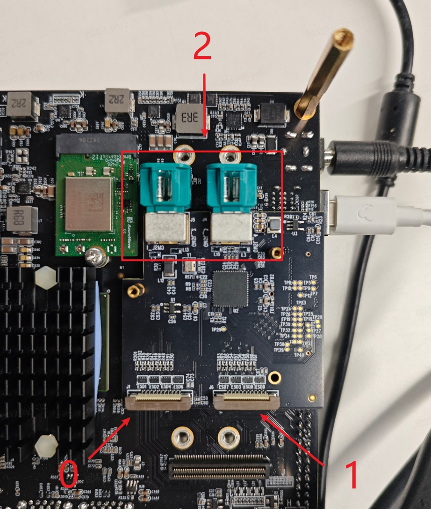

# Camera对象

Camera对象用于完成MIPI Camera的图像采集和处理功能，包含了`open_cam`、`open_vps`、`get_img`、`set_img`、`close_cam`等几种方法，详细说明如下：
## open_cam

<font color='Blue'>【功能描述】</font>  

打开指定通道的MIPI摄像头，并设置摄像头输出帧率、分辨率格式。

<font color='Blue'>【函数声明】</font>  

```python
Camera.open_cam(pipe_id, video_index, fps, width, height, raw_height, raw_width)
```

<font color='Blue'>【参数描述】</font>  

| 参数名称      | 定义描述                  | 取值范围    |
| ----------- | ------------------------ | --------  |
| pipe_id     | camera对应的pipeline通道号  | 默认从0开始，范围0~7  |
| video_index | camera对应的host编号，-1表示自动探测 | 取值 -1,0,1,2 请参考host编号选择小节 |
| fps         | camera图像输出帧率          | 依据camera型号而定，默认值30   |
| width       | camera最终图像输出宽度    |  视camera型号而定，默认值1920 |
| height      | camera最终图像输出高度  |    视camera型号而定，默认值1080 |
| raw_height       | camera原始RAW图像输出宽度    |  视camera型号而定，默认值1920|
| raw_width      | camera原始RAW图像输出高度  |    视camera型号而定，默认值1080|

<font color='Blue'>【使用方法】</font> 

```python
#create camera object
camera = libsrcampy.Camera()

#open MIPI Camera, fps: 30, solution: 1080p
ret = camera.open_cam(0, -1, 30, 1920, 1080)
```

<font color='Blue'>【返回值】</font>  

| 返回值 | 描述 |
| ------ | ----- |
| 0      | 成功  |
| -1    | 失败 |

<font color='Blue'>【注意事项】</font> 

`width`，`height`参数支持`list`类型输入，表示使能camera多组不同分辨率输出。`list`最多支持6组缩小, 缩放区间为camera原始分辨率的[1 ,1/64)。使用方式如下：

```python
ret = cam.open_cam(0, -1, 30, [1920, 1280], [1080, 720])
```

`raw_height`，`raw_width` 只有在需要摄像头不是默认分辨率的情况下才设置，比如在使用`IMX477`摄像头时，若想同时输出4k分辨率（3840x2160）和1080P分辨率（1920x1080），则可以这样使用：
```python
cam.open_cam(0, -1, 10, [3840, 1920], [2160, 1080], 3000, 4000)
```

目前支持的摄像头分辨率见下表：

| camera | 分辨率 |
| ---- | ----- |
|IMX219|1920x1080@30fps(default)|

:::info 注意！

`IMX477`从`1080P`的分辨率切换至其它分辨率需要进行手动复位，可以在板端执行`hobot_reset_camera.py`完成复位操作。

:::

:::info 注意！

`S100`芯片对于`VPS`输出的宽度是有对齐需求的，输出宽度需满足16对齐，输出高度需满足2对齐，如果您设置的宽度和高度不符合对齐要求，则会检测报错。

:::

<font color='Blue'>【参考代码】</font>  

无

## open_vps

<font color='Blue'>【功能描述】</font>

使能指定camera通道的vps(video process)图像处理功能，支持对输入图像完成缩放、裁剪等功能。

<font color='Blue'>【函数声明】</font>  

```python
Camera.open_vps(pipe_id, proc_mode, src_width, src_height, dst_width, dst_height, crop_rect, rotate, src_size, dst_size)
```

<font color='Blue'>【参数描述】</font>  


| 参数名称      | 定义描述                  | 取值范围    |
| ----------- | ------------------------ | --------  |
| pipe_id    | camera对应的pipeline通道号  | 默认从0开始，范围0~7  |
| proc_mode  | 图像处理模式配置，支持缩放、裁剪   | 范围1~4，分别表示`缩放`、`裁剪+缩放`|
| src_width  | 图像输入宽度                 | 视camera输出宽度而定 |
| src_height | 图像输入高度                 | 视camera输出高度而定 |
| dst_width  | 图像输出宽度 | 输入宽度的[1, 1/64)倍 |
| dst_height | 图像输出高度 | 输入高度的[1, 1/64)倍 |
| crop_rect  | 裁剪区域的宽高，输入格式[x, y] | 不超过输入图像尺寸 |
| rotate     | 旋转角度，最多支持两个通道旋转, 目前不支持旋转 | 范围0~3，分别表示`不旋转`、`90度` `180度`、`270度` |
| src_size | 保留参数 | 默认不需要配置 |
| dst_size | 保留参数 | 默认不需要配置 |

<font color='Blue'>【使用方法】</font> 

```python
#create camera object
camera = libsrcampy.Camera()

#enable vps function
ret = camera.open_vps(1, 1, 1920, 1080, 512, 512)
```

<font color='Blue'>【返回值】</font>  

| 返回值 | 定义描述 |                 
| ------ | ----- |
| 0      | 成功  |
| -1    | 失败 |

:::info 注意！
- vps处理功能最多支持6个通道输出，只支持缩小。缩小倍率范围为[1, 1/64)，多通道配置通过输入参数`list`传递。
- 图像裁剪功能以图像左上角为原点，按照配置尺寸进行裁剪
- 图像裁剪会在缩放、旋转操作之前进行，多通道配置通过输入参数`list`传递。
:::


:::info 注意！

`S100`芯片对于`VPS`输出的宽度是有对齐需求的，输出宽度需满足16对齐，输出高度需满足2对齐，如果您设置的宽度和高度不符合对齐要求，则会检测报错。。

:::

```python
#creat camera object
camera = libsrcampy.Camera()

#enable vps function
#input: 4k, output0: 1080p, output1: 720p
#ouput0 croped by [2560, 1440]
ret = camera.open_vps(0, 1, 3840, 2160, [1920, 1280], [1080, 720], [2560, 1440])
```

<font color='Blue'>【参考代码】</font>  
无

## get_img

<font color='Blue'>【功能描述】</font>

获取camera对象的图像输出，需要在`open_cam`、`open_vps`之后调用

<font color='Blue'>【函数声明】</font> 

```python
Camera.get_img(module, width, height)
```

<font color='Blue'>【参数描述】</font>  

| 参数名称 | 定义描述                 | 取值范围     |
| -------- | ------- | ----------- |
| module   | 需要获取图像的模块 | 默认为2 |
| width    | 需要获取图像的宽度 | `open_cam`、`open_vps`设置的输出宽度 |
| height   | 需要获取图像的高度 | `open_cam`、`open_vps`设置的输出高度 |


<font color='Blue'>【使用方法】</font> 

```python
cam = libsrcampy.Camera()

#open MIPI Camera, fps: 30, solution: 1080p
ret = cam.open_cam(0, 1, 30, 1920, 1080)

#wait for 1s
time.sleep(1)

#get one image from camera
img = cam.get_img(2)
```

<font color='Blue'>【返回值】</font>  

| 返回值 | 定义描述 |                 
| ------ | ----- |
| 0      | 成功  |
| -1    | 失败   |

<font color='Blue'>【注意事项】</font> 

该方法需要在`open_cam`、`open_vps`之后调用  

<font color='Blue'>【参考代码】</font>  

```python
import sys, os, time

from hobot_vio import libsrcampy

def test_camera():
    cam = libsrcampy.Camera()

    #open MIPI camera, fps: 30, solution: 1080p
    ret = cam.open_cam(0, 1, 30, 1920, 1080)
    print("Camera open_cam return:%d" % ret)

    # wait for 1s
    time.sleep(1)

    #get one image from camera   
    img = cam.get_img(2)
    if img is not None:
        #save file
        fo = open("output.img", "wb")
        fo.write(img)
        fo.close()
        print("camera save img file success")
    else:
        print("camera save img file failed")
    
    #close MIPI camera
    cam.close_cam()
    print("test_camera done!!!")

test_camera()
```

## set_img

<font color='Blue'>【功能描述】</font>

向`vps`模块输入图像，并触发图像处理操作

<font color='Blue'>【函数声明】</font>  

```python
Camera.set_img(img)
```

<font color='Blue'>【参数描述】</font>  

| 参数名称 | 定义描述     | 取值范围      |
| -------- | -------------------- | ----- |
| img      | 需要处理的图像数据 | 跟vps输入尺寸保持一致 |

<font color='Blue'>【使用方法】</font> 

```python
camera = libsrcampy.Camera()

#enable vps function, input: 1080p, output: 512x512
ret = camera.open_vps(1, 1, 1920, 1080, 512, 512)
print("Camera vps return:%d" % ret)

fin = open("output.img", "rb")
img = fin.read()
fin.close()

#send image to vps module
ret = vps.set_img(img)
```

<font color='Blue'>【返回值】</font>  

| 返回值 | 定义描述 |                 
| ------ | ----- |
| 0      | 成功  |
| -1    | 失败 |

<font color='Blue'>【注意事项】</font> 

该接口需要在`open_vps`之后调用

<font color='Blue'>【参考代码】</font>  

```python
import sys, os, time

import numpy as np
import cv2
from hobot_vio import libsrcampy

def test_camera_vps():
    vps = libsrcampy.Camera()

    #enable vps function, input: 1080p, output: 512x512
    ret = vps.open_vps(1, 1, 1920, 1080, 512, 512)
    print("Camera vps return:%d" % ret)

    fin = open("output.img", "rb")
    img = fin.read()
    fin.close()

    #send image data to vps
    ret = vps.set_img(img)
    print ("Process set_img return:%d" % ret)

    fo = open("output_vps.img", "wb+")

    #get image data from vps
    img = vps.get_img()
    if img is not None:
        fo.write(img)
        print("encode write image success")
    else:
        print("encode write image failed")
    fo.close()

    #close vps function
    vps.close_cam()
    print("test_camera_vps done!!!")

test_camera_vps()
```

## close_cam

<font color='Blue'>【功能描述】</font>

关闭使能的MIPI camera摄像头

<font color='Blue'>【函数声明】</font>  

```python
Camera.close_cam()
```

<font color='Blue'>【参数描述】</font>  

无

<font color='Blue'>【使用方法】</font> 

```python
cam = libsrcampy.Camera()

#open MIPI camera, fps: 30, solution: 1080p
ret = cam.open_cam(0, 1, 30, 1920, 1080)
print("Camera open_cam return:%d" % ret)

#close MIPI camera
cam.close_cam()
```

<font color='Blue'>【返回值】</font>  

无

<font color='Blue'>【注意事项】</font> 

无

<font color='Blue'>【参考代码】</font>  

无
## host编号选择
camera对应的host编号如下图所示

