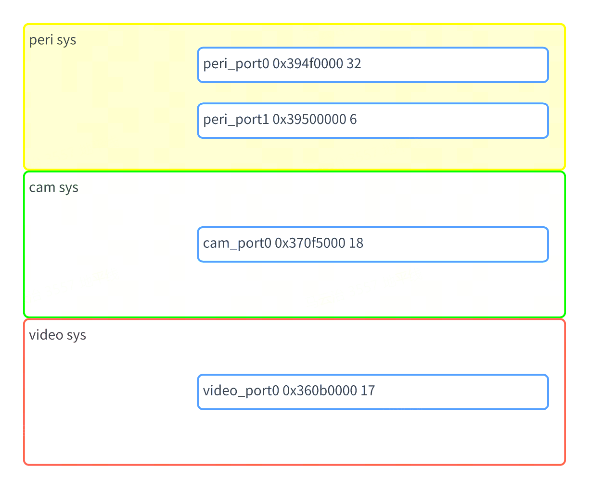
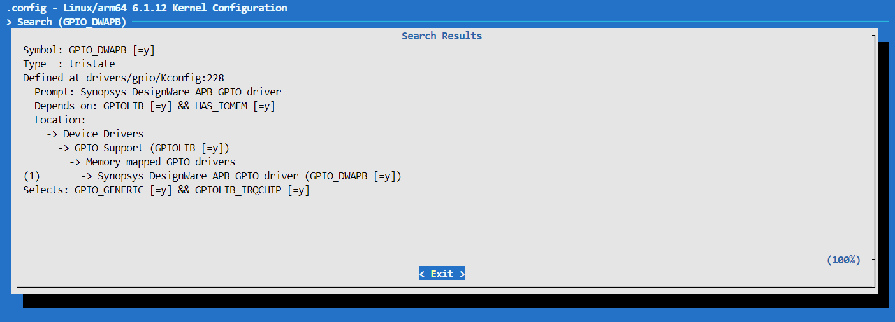

# GPIO使用

S100 Acore芯片内中共有3个sys有gpio设备，分别是peri, cam和video，每个设备最多有32个gpio引脚，并且每个gpio引脚都支持中断。



## 驱动代码

```bash
kernel/drivers/gpio/gpio-dwapb.c # gpio驱动源文件
```

### 内核配置

GPIO_DWAPB



### 内核DTS配置

S100 GPIO控制器的设备树定义位于SDK包的kernel文件夹下的arch/arm64/boot/dts/hobot/drobot-s100-soc.dtsi文件内。

:::info 备注
s100.dtsi中的节点主要声明SoC共有特性，和具体电路板无关，一般情况下不用修改。
:::

## GPIO使用

### Kernel Space

#### DTS配置

s100所有引脚的GPIO配置位于SDK包的kernel文件夹下路径为`arch/arm64/boot/dts/hobot/drobot-s100-soc.dtsi`的文件内。

用户需要配置特定引脚为GPIO功能时，可以直接引用预定义GPIO配置：

GPIO设备树节点的属性命名方式一般为`<names>-gpios`或`<names>-gpio`，举例如下：

```c
/**
* peri_port0表示peri sys的第一个gpio设备
* 下列设备节点共有四个gpio引脚，分别是：
*       peri sys的第一个gpio设备 16号引脚(从0开始)
*       peri sys的第二个gpio设备 17号引脚(从0开始)
*        cam sys的第一个gpio设备 28号引脚(从0开始)
*      video sys的第一个gpio设备 18号引脚(从0开始)
* GPIO_ACTIVE_HIGH表示高电平有效，一般设为GPIO_ACTIVE_HIGH
*/
gpio-test {
        test-gpios = <&peri_port0 16 GPIO_ACTIVE_HIGH
                      &peri_port1 17 GPIO_ACTIVE_HIGH
                      &cam_port0 28 GPIO_ACTIVE_HIGH
                      &video_port0 18 GPIO_ACTIVE_HIGH>;
};
```

#### 驱动代码接口

```c
/* include/linux/gpio.h */
/* 申请GPIO */
int gpio_request(unsigned gpio, const char *label);
/* GPIO初始化为输出。并设置输出电平*/
int gpio_direction_output(unsigned gpio, int value);
/* GPIO初始化为输入 */
int gpio_direction_input(unsigned gpio);
/* 获取GPIO的电平 */
int gpio_get_value(unsigned int gpio);
/* 设置GPIO的电平 */
void gpio_set_value(unsigned int gpio, int value);
/* 释放GPIO */
void gpio_free(unsigned gpio);
/* 申请GPIO中断，返回的值可以传给request_irq和free_irq */
int gpio_to_irq(unsigned int gpio);
```

### User Space{#user-space}

#### 控制接口

在用户层可以使用/sys/class/gpio节点来进行相关gpio的操作。

在sys节点下存在如下节点：

```shell
#申请gpio
echo <gpio_num> > /sys/class/gpio/export
#释放gpio
echo <gpio_num> > /sys/class/gpio/unexport
#设置gpio为输出
#当设置dir为out时，可以向value中echo 1/0，分别表示输入高低电平。
echo out > /sys/class/gpio/gpio<gpio_num>/direction
#设置高电平
echo 1 > /sys/class/gpio/gpio<gpio_num>/value
#设置低电平
echo 0 > /sys/class/gpio/gpio<gpio_num>/value

#设置gpio为输入, 当设置dir为in时，cat value表示输入的值(0-低，1-高)。
echo in > /sys/class/gpio/gpio<gpio_num>/direction
#读取gpio的外部值
cat /sys/class/gpio/gpio<gpio_num>/value


#查看gpio的debug接口
cat /sys/kernel/debug/gpio

#查看gpio和pinctrl的关系
#可以看到系统的引脚和gpio的号关系
cat /sys/kernel/debug/pinctrl/<pinctrl_dev>/gpio-ranges
```

### sysfs接口介绍

#### export&unexport

/sys/class/gpio/export和/sys/class/gpio/unexport，这两个节点只能写不能读。

用户程序通过写入gpio的编号来向内核申请将某个gpio的控制权导出到用户空间，前提是没有内核代码申请这个gpio端口，如用户申请编号为480的GPIO的命令：

``` {.shell}
echo 480 > export
```

上述操作会为480号gpio创建一个节点gpio480，此时/sys/class/gpio目录下边生成一个gpio480的目录。

/sys/class/gpio/unexport和导出的效果相反，比如移除gpio480这个节点操作命令：

``` {.shell}
echo 480 > unexport #该操作将会移除gpio480这个节点，释放序号为480的gpio。
```

#### direction

其中direction表示gpio端口的方向，读取结果是in或out。也可以对该文件进行写操作，写入out时该gpio设为输出，写入in时该gpio设为输入。

#### value

当设置dir为in时，cat value表示输入的值(0-低，1-高)。

当设置dir为out时，可以向value中echo 1/0，分别表示输入高低电平。

#### edge

用户层设置中断时，direction需要设置为in，然后向edge中设置相应的值。

| edge的值 | 含义 |
| --- | --- |
| none | 表示引脚为输入，不是中断引脚 |
| rising | 表示引脚为中断输入，上升沿触发 |
| falling | 表示引脚为中断输入，下降沿触发 |
| both | 表示引脚为中断输入，边沿触发 |

## 调试

``` {.shell}
cat /sys/kernel/debug/gpio
```

查询上述节点，可以获取到当前系统中正在使用的gpio和所处的状态（in，out，IRQ）。

``` {.shell}
root@ubuntu:~# cat /sys/kernel/debug/gpio
gpiochip4: GPIOs 423-438, parent: i2c/3-0076, 3-0076, can sleep:
gpio-423 (                    |io-ser-reset0       ) out hi
gpio-424 (                    |io-ser-reset1       ) out hi
gpio-425 (                    |io-ser-reset2       ) out hi
gpio-426 (                    |io-ser-reset3       ) out hi

gpiochip3: GPIOs 439-455, parent: platform/360b0000.gpio, 360b0000.gpio:

gpiochip2: GPIOs 456-473, parent: platform/370f5000.gpio, 370f5000.gpio:

gpiochip1: GPIOs 474-479, parent: platform/39500000.gpio, 39500000.gpio:

gpiochip0: GPIOs 480-511, parent: platform/394f0000.gpio, 394f0000.gpio:
gpio-481 (                    |sysfs               ) out hi ACTIVE LOW
gpio-491 (                    |sysfs               ) in  hi
gpio-495 (                    |sysfs               ) in  hi
gpio-496 (                    |sysfs               ) in  hi
gpio-498 (                    |sysfs               ) in  hi
gpio-503 (                    |io-ext-reset        ) out lo
root@ubuntu:~#
```

### 确定gpio-index

kernel_index = base + offset，base 通过 "/sys/class/gpio"
或者"/sys/kernel/debug/gpio" 获取，offset通过dts获取。

以pin sensor8_err为例：通过查看
drobot-s100-pinctrl.dtsi，可以知道sensor8_err对应的gpio chip是
video_port0: gpio\@360b0000，对应的offset是 13。
查看/sys/kernel/debug/gpio，可知"video_port0:
gpio\@360b0000"对应的base是439 则sensor8_err 对应的gpio kernel
index是：439+13 = 452

### 查看drobot-s100-pinctrl.dtsi，获取offset和base

下面设备树可知sensor8_err对应video_sensor8_err，对应的gpio
chip是"video_port0: gpio\@360b0000"。
video_gnss_int的offset为0，递增计数，则video_sensor8_err的offset为13。

``` {.shell}
pinctrl_video: pinctrl@36090000 {
   compatible = "drobot,s100-pinctrl";
   reg = <0x0 0x36090000 0x0 0x1000>,
         <0x0 0x360a0000 0x0 0x1000>;
   pctldev-name = "video";
   status = "okay";

   video_gpio: video_gpio_func {
      pinmux {
         function = "video_gpio";
         pins = "video_gnss_int", "video_peri_rsto",
                  "video_cam_pint", "video_sd_1v8", "video_sd_bus_pow",
                  "video_sensor0_err", "video_sensor1_err",
                  "video_sensor2_err", "video_sensor3_err", "video_sensor4_err",
                  "video_sensor5_err", "video_sensor6_err",
                  "video_sensor7_err", "video_sensor8_err",
                  "video_sensor9_err", "video_sensor10_err", "video_sensor11_err";
      };
      pinconf {
         pins = "video_gnss_int", "video_peri_rsto",
                  "video_cam_pint", "video_sd_1v8", "video_sd_bus_pow",
                  "video_sensor0_err", "video_sensor1_err",
                  "video_sensor2_err", "video_sensor3_err", "video_sensor4_err",
                  "video_sensor5_err", "video_sensor6_err",
                  "video_sensor7_err", "video_sensor8_err",
                  "video_sensor9_err", "video_sensor10_err", "video_sensor11_err";
         drive-strength = <1>;
      };
   };
}
```

如这行：gpiochip3: GPIOs 439-455, parent: platform/360b0000.gpio,
360b0000.gpio: "GPIOs 439-455"代表base是439

``` {.shell}
cat /sys/kernel/debug/gpio
```

``` {.shell}
root@ubuntu:~# cat /sys/kernel/debug/gpio
gpiochip4: GPIOs 423-438, parent: i2c/3-0076, 3-0076, can sleep:
gpio-423 (                    |io-ser-reset0       ) out hi
gpio-424 (                    |io-ser-reset1       ) out hi
gpio-425 (                    |io-ser-reset2       ) out hi
gpio-426 (                    |io-ser-reset3       ) out hi

gpiochip3: GPIOs 439-455, parent: platform/360b0000.gpio, 360b0000.gpio:

gpiochip2: GPIOs 456-473, parent: platform/370f5000.gpio, 370f5000.gpio:
gpio-464 (                    |scl                 ) out lo
gpio-465 (                    |sda                 ) in  lo
gpio-466 (                    |scl                 ) out lo
gpio-467 (                    |sda                 ) in  lo
gpio-468 (                    |scl                 ) out lo
gpio-469 (                    |sda                 ) in  lo
gpio-470 (                    |scl                 ) out lo
gpio-471 (                    |sda                 ) in  lo
gpio-472 (                    |scl                 ) out lo
gpio-473 (                    |sda                 ) in  lo

gpiochip1: GPIOs 474-479, parent: platform/39500000.gpio, 39500000.gpio:

gpiochip0: GPIOs 480-511, parent: platform/394f0000.gpio, 394f0000.gpio:
gpio-495 (                    |scl                 ) out lo
gpio-496 (                    |sda                 ) in  lo
gpio-503 (                    |io-ext-reset        ) out lo
```
