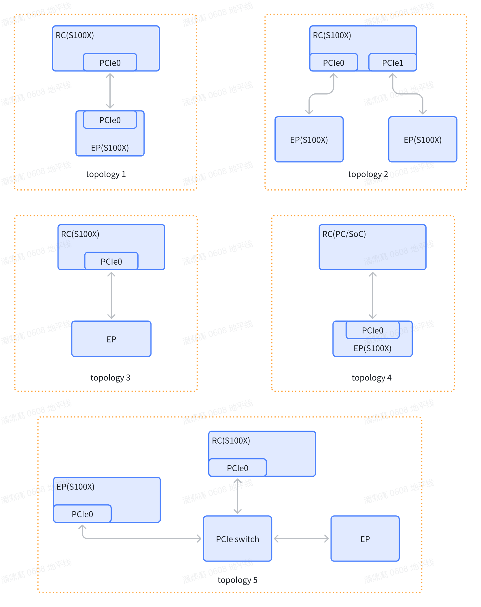

# S100X PCIe硬件规格以及支持的拓扑结构

## PCIe简介

PCI Express (PCIe) 模块是一种多通道 I/O 互连，提供低引脚数、高可靠性和高速数据传输。
它是继 ISA 和 PCI 总线之后的第三代 I/O 互连技术，旨在用作多个细分市场的通用
串行 I/O 互连，包括台式机、移动设备、服务器、存储和嵌入式通信。

## S100X PCIe硬件规格

### S100E

- 两个PCIe Gen 4.0控制器，控制器与lane的配置如下：
  - 一个控制器：x2或者x4
  - 两个控制器：x1
- 每个控制器都支持配置为RC或者EP模式
- EP模式支持SR-IOV：1个PF+4个VF
- 支持8对DMA通道
- 支持MSI-X
- 支持SMMU
- 支持48个Outbound
- 支持PTM时间同步

## S100X支持如下几种PCIe总线拓扑

1. **拓扑1**：双S100X直连，一个S100X作为RC，另一个S100X作为EP

2. **拓扑2**：三S100X直连，一个S100X作为RC同时连接两个S100X EP

3. **拓扑3**：一个S100X直连另一个第三方的标准PCIe EP设备，例如NVMe SSD设备

4. **拓扑4**：一个S100X作为PCIe EP设备连接到第三方的RC设备上，典型的场景是S100X作为PCIe加速卡

5. **拓扑5**：多个S100X以及第三方标准PCIe EP设备通过PCIe Switch连接，其中一个S100X作为RC，其他设备均为EP
