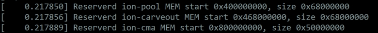

# debug信息

Hbmem支持通过sys节点查询相关debug信息。

## 如何查看当前ION内存分配情况

```shell
cat /sys/kernel/debug/ion/heaps/ion_cma
cat /sys/kernel/debug/ion/heaps/cma_reserved
cat /sys/kernel/debug/ion/heaps/carveout
cat /sys/kernel/debug/ion/heaps/all_heap_info
```

## 如何查看当前的ION预留内存的情况

其中ION_HEAP_TYPE_CARVEOUT（HB_MEM_USAGE_PRIV_HEAP_RESERVED）、ION_HEAP_TYPE_CMA_RESERVED（HB_MEM_USAGE_PRIV_HEAP_2_RESERVED）和 ION_HEAP_TYPE_DMA（HB_MEM_USAGE_PRIV_HEAP_DMA）heap的预留情况也可以查看启动日志，如下所示，第一行代表ION_HEAP_TYPE_CARVEOUT的起始地址和大小，第二行代表ION_HEAP_TYPE_CMA_RESERVED的起始地址和大小，第三行代表ION_HEAP_TYPE_DMA的起始地址和大小：



## 如何直接读写内存

### 使用devmem工具可以直接访问内存

```shell
root@ubuntu:~# devmem -h
BusyBox v1.30.1 (Ubuntu 1:1.30.1-7ubuntu3.1) multi-call binary.

Usage: devmem ADDRESS [WIDTH [VALUE]]

Read/write from physical address

        ADDRESS Address to act upon
        WIDTH   Width (8/16/...)
        VALUE   Data to be written
```

### 直接写入内存

```shell
root@ubuntu:~# devmem 0xE0000000 32 0x12345678
root@ubuntu:~#
```

### 读取内存

```shell
root@ubuntu:~# devmem 0xE0000000
0x12345678
root@ubuntu:~#
```
