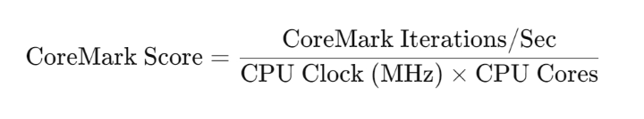

# CPU 性能测试

## 测试原理

`CoreMark` 是一个广泛用于评估嵌入式系统 CPU 性能的基准测试程序。其测试核心是通过模拟一些典型的嵌入式应用计算任务，来评估 CPU 在常见计算模式下的表现，测试的核心是基于以下几个要素：

- 算法选择： CoreMark 使用了以下几种基础的算法和操作：
  - 整数运算：包括加法、乘法、位操作等常见操作。
  - 数据结构：测试包含了链表、队列等数据结构的操作。
  - 控制结构：涉及循环、条件判断等基本的控制结构。
  - 矩阵乘法和基本计算任务：用来模拟常见的数值计算任务。
- 测试任务： CoreMark 测试的工作负载包括了下列几个方面：
  - 计算密集型操作：例如整数加法、乘法和位运算。
  - 内存操作：模拟典型的内存访问模式，包括链表和队列的操作。
  - 任务调度和控制：涉及复杂的控制流，例如条件判断和循环。
- 测试环境： CoreMark 的测试运行是在没有其他进程或线程干预的环境中执行的，这种方式确保了测试结果不受操作系统调度、资源管理等因素的影响，从而真实反映处理器的计算性能。
- 性能测量： CoreMark 的性能指标是 CoreMark 分数 (CoreMark score) ，这个分数反映了在测试期间执行的算法和任务的平均计算速度，分数越高，表示处理器的性能越好。

## 测试准备工作

**1.** 长时间高负载测试可能导致 CPU 温度升高，从而触发温控机制（如自动降频），影响测试结果。确保测试环境通风良好，散热正常。

**2.** 为避免其他进程干扰，建议关闭无关的后台程序，可以使用 `top` 命令查看并停止不必要的服务。

**3.** 在 /app/multimedia_samples/chip_base_test/07_cpu_performance/coremark-main 路径下，已经提供了coremark的源码。

**4.** 编译 O3 优化下的多核与单核性能程序

编译单核开启 `-O3` 的 coremark 命令：

```shell
make XCFLAGS="-O3 -funroll-all-loops -static --param max-inline-insns-auto=550 -DPERFORMANCE_RUN=1 -mcpu=cortex-a55" REBUILD=1 run1.log

mv coremark.exe coremark_O3_single
```

编译 8 核开启 `-O3` 的 coremark 命令：

```shell
make  XCFLAGS="-O3 -funroll-all-loops -static --param max-inline-insns-auto=550 -DPERFORMANCE_RUN=1 -mcpu=cortex-a55 -DMULTITHREAD=8 -DUSE_PTHREAD -DVALIDATION_RUN=1  -lrt -pthread" REBUILD=1 run2.log

mv coremark.exe coremark_O3_multi
```


**检测 cpu 工作频率与温度：**
使用命令 hrut_somstatus 来查看 CPU、 MCU、 BPU 等模块的频率与温度信息：

```shell
temperature-->
        pvt_cmn_pvtc1_t1 : 52.719 (C)
        pvt_cmn_pvtc1_t2 : 54.190 (C)
        pvt_mcu_pvtc1_t1 : 52.168 (C)
        pvt_mcu_pvtc1_t2 : 52.351 (C)
        pvt_bpu_pvtc1_t1 : 53.271 (C)
voltage-->
        FAKE     : 100.0 (mV)
        VDDQ_DDR2 : 503.0 (mV)
        VDD_MCU  : 748.0 (mV)
        VDDIO_PVT_MCU : 1802.0 (mV)
        VDDIO_TOP4_1V8 : 1802.0 (mV)
        VDDQ_DDR0 : 503.0 (mV)
        VDD2H_DDR0 : 1052.0 (mV)
        VAA_DDR0 : 1792.0 (mV)
        VDD_DDR0 : 748.0 (mV)
        VDDQ_DDR1 : 497.0 (mV)
        VDD2H_DDR1 : 1040.0 (mV)
        VAA_DDR1 : 1792.0 (mV)
        VDD_DDR1 : 742.0 (mV)
        CMN_PVTC1_V13 : 0.0 (mV)
        CMN_PVTC1_V14 : 0.0 (mV)
        CMN_PVTC1_V15 : 0.0 (mV)
        CMN_PVTC1_V16 : 0.0 (mV)
        VDDIO_SD_SDIO_T : 1788.0 (mV)
        VDD_CPU  : 776.0 (mV)
        CMN_PVTC1_V19 : 0.0 (mV)
        VAA_DDR2 : 1790.0 (mV)
        VDD2H_DDR2 : 1042.0 (mV)
        VDD_DDR2 : 742.0 (mV)
        VDDIO_TOP2_1V8 : 1780.0 (mV)
        VDD_BPU  : 737.0 (mV)
        VDDIO_TOP0_1V8 : 1790.0 (mV)
        PLL_TOP0_VDDHV : 1768.0 (mV)
        CMN_PVTC1_V27 : 0.0 (mV)
        CMN_PVTC1_V28 : 0.0 (mV)
        CMN_PVTC1_V29 : 0.0 (mV)
        CMN_PVTC1_V30 : 0.0 (mV)
        CMN_PVTC1_V31 : 0.0 (mV)
        CMN_PVTC1_V32 : 0.0 (mV)
        VDDIO_SD_33_MCU : 3308.0 (mV)
        VDDIO_ADC_MCU : 1802.0 (mV)
        VDDIO_MCU_1V8 : 1802.0 (mV)
        PLL_MCU_VDDHV : 1802.0 (mV)
        PLL_MCU_VDDPOST : 753.0 (mV)
        PLL_MCU_VDDREF : 753.0 (mV)
        VDD_TOP  : 759.0 (mV)
        VDD_AON  : 753.0 (mV)
        VDDIO_SD_AON_CA : 1644.0 (mV)
        VDDIO_PVT_1V8 : 1802.0 (mV)
        MCU_PVTC1_V11 : 0.0 (mV)
        MCU_PVTC1_V12 : 0.0 (mV)
        MCU_PVTC1_V13 : 0.0 (mV)
        MCU_PVTC1_V14 : 0.0 (mV)
        MCU_PVTC1_V15 : 0.0 (mV)
        MCU_PVTC1_V16 : 0.0 (mV)
cpu frequency-->
                  min   cur     max
        policy0: 1125000        1500000 1500000
        policy4: 1125000        1500000 1500000
bpu status information---->
                ratio
        bpu0:   0
```

**手动设置 cpu 频率：**
设置 CPU 运行在性能模式下，命令如下：

```shell
echo userspace >/sys/devices/system/cpu/cpu0/cpufreq/scaling_governor
echo 1500000 >/sys/devices/system/cpu/cpufreq/policy0/scaling_setspeed
```

## 测试方法

**1. 执行单核测试（coremark_O3_single**）

确保准备工作部分的一致性后，执行命令：

```shell
./coremark_O3_single
```

等待 10 秒后得到以下结果：

```yaml
2K performance run parameters for coremark.
CoreMark Size    : 666
Total ticks      : 13811
Total time (secs): 13.811000
Iterations/Sec   : 14481.210629
Iterations       : 200000
Compiler version : GCC11.3.1 20220712
Compiler flags   :  -O3 -funroll-all-loops -static --param max-inline-insns-auto=550 -DPERFORMANCE_RUN=1 -mcpu=cortex-a55  -lrt
Memory location  : Please put data memory location here
                        (e.g. code in flash, data on heap etc)
seedcrc          : 0xe9f5
[0]crclist       : 0xe714
[0]crcmatrix     : 0x1fd7
[0]crcstate      : 0x8e3a
[0]crcfinal      : 0x4983
Correct operation validated. See README.md for run and reporting rules.
CoreMark 1.0 : 14481.210629 / GCC11.3.1 20220712  -O3 -funroll-all-loops -static --param max-inline-insns-auto=550 -DPERFORMANCE_RUN=1 -mcpu=cortex-a55  -lrt / Heap
```

**2. 执行多核测试（coremark_O3_multi**）

确保准备工作部分的一致性后，执行命令：

```shell
./coremark_O3_multi
```

```yaml
2K performance run parameters for coremark.
CoreMark Size    : 666
Total ticks      : 18982
Total time (secs): 18.982000
Iterations/Sec   : 84290.380360
Iterations       : 1600000
Compiler version : GCC11.3.1 20220712
Compiler flags   :  -O3 -funroll-all-loops -static --param max-inline-insns-auto=550 -DPERFORMANCE_RUN=1 -mcpu=cortex-a55 -DMULTITHREAD=8 -DUSE_PTHREAD -DVALIDATION_RUN=1  -lrt -pthread  -lrt
Parallel PThreads : 8
Memory location  : Please put data memory location here
                        (e.g. code in flash, data on heap etc)
seedcrc          : 0xe9f5
[0]crclist       : 0xe714
[1]crclist       : 0xe714
[2]crclist       : 0xe714
[3]crclist       : 0xe714
[4]crclist       : 0xe714
[5]crclist       : 0xe714
[6]crclist       : 0xe714
[7]crclist       : 0xe714
[0]crcmatrix     : 0x1fd7
[1]crcmatrix     : 0x1fd7
[2]crcmatrix     : 0x1fd7
[3]crcmatrix     : 0x1fd7
[4]crcmatrix     : 0x1fd7
[5]crcmatrix     : 0x1fd7
[6]crcmatrix     : 0x1fd7
[7]crcmatrix     : 0x1fd7
[0]crcstate      : 0x8e3a
[1]crcstate      : 0x8e3a
[2]crcstate      : 0x8e3a
[3]crcstate      : 0x8e3a
[4]crcstate      : 0x8e3a
[5]crcstate      : 0x8e3a
[6]crcstate      : 0x8e3a
[7]crcstate      : 0x8e3a
[0]crcfinal      : 0x4983
[1]crcfinal      : 0x4983
[2]crcfinal      : 0x4983
[3]crcfinal      : 0x4983
[4]crcfinal      : 0x4983
[5]crcfinal      : 0x4983
[6]crcfinal      : 0x4983
[7]crcfinal      : 0x4983
Correct operation validated. See README.md for run and reporting rules.
CoreMark 1.0 : 84290.380360 / GCC11.3.1 20220712  -O3 -funroll-all-loops -static --param max-inline-insns-auto=550 -DPERFORMANCE_RUN=1 -mcpu=cortex-a55 -DMULTITHREAD=8 -DUSE_PTHREAD -DVALIDATION_RUN=1  -lrt -pthread  -lrt / Heap / 8:PThreads

```

**结果参数解析说明：**

- **`CoreMark Size`**：表示 CoreMark 基准测试的代码和数据大小，单位是字节。在这个例子中， CoreMark Size 为 666 字节，指的是整个 CoreMark 测试代码的大小。
- **`Total ticks`**：表示测试过程中 CPU 使用的总时钟周期数。比如： 18982 表示测试总共耗费了 18982 个时钟周期。
- **`Total time (secs)`**：表示测试所用的总时间，单位是秒。
- **`Iterations/Sec`**：每秒执行的迭代次数，即单位时间内程序运行的次数，这里是 84290 次 / 秒，即评分公式的 `coremark` 分数。
- **`Iterations`**：表示整个测试过程中执行的总迭代次数。 1600000 表示 CoreMark 基准测试在 18.982000 秒的时间里执行了 1600000 次测试循环。
- **`seedcrc`**： CRC 校验：这些是 循环冗余校验（ CRC）值，用于验证测试的正确性。
- **`Compiler flags`**： 编译器标志，这里是 `-O3` 和 `-lrt`。
- **`CoreMark 1.0`**： 对关键信息的汇总 , 84290.380360 是 CoreMark 性能得分，表示每秒迭代次数，这个值越高，表示处理器性能越强。

## 测试指标

以下标准需要在系统无工作任务时且多次取平均值测试得到， CoreMark 标准评分公式为 :



- `CoreMark Iterations/Sec`：表示每秒执行的 CoreMark 基准测试迭代次数，通常反映处理器的性能。越高的迭代次数意味着更强的计算能力。
- `CPU Clock (MHz)`：处理器的时钟频率，单位是 MHz（兆赫兹）。它反映了处理器运行的速度，时钟频率越高，理论上处理器每秒可以执行的操作越多。
- `CPU Cores`：处理器的核心数， CoreMark 可以在单核或多核模式下进行测试。

### 分数标准

- `O3` 编译优化的 CoreMark ：在 S100 平台上，单核分数应达到 X > 4.2 。
- `O2` 编译优化的 CoreMark ：在 S100 平台上，单核分数应达到 X > 4.2 。

### 如何理解评分标准

这两个评分标准（-O3 和 -O2 ）实际上为不同优化级别下处理器的性能表现设定了最低要求。这个评分的意义在于：

- O3 优化是 GCC 和其他编译器中的最高优化级别，通过激进的优化策略来提高执行速度。-O3 优化级别会开启很多性能优化特性，如循环展开、内联函数等，目标是获得更高的计算性能。
- O2 优化 是相对较为保守的优化级别。相比于 -O3 ，-O2 优化不会启用一些可能导致代码大小增加的激进优化。因此，-O2 优化通常会得到更平衡的性能表现，并且能兼顾性能和可移植性。

根据 O3 优化下单核测试的评分结果计算， CoreMark Iterations/Sec = 14481 次 / 秒， CPU Clock (MHz) = 1500 MHz， CPU Cores = 1 核（单核测试），根据公式计算 `CoreMark Score = 14481 /（ 1500 x 1 ） = 9.65`, 性能远高于常规 O3 优化基准（4.2），表现优秀。

根据 O3 优化下多核测试的评分结果计算， CoreMark Iterations/Sec = 84290 次 / 秒， CPU Clock (MHz) = 1500 MHz， CPU Cores = 8 核（多核测试），根据公式计算 `CoreMark Score = 84290 /（ 1500 x 8 ） ≈ 7.03` , 同样远高于 O3 多核基准（4.2），系统整体计算能力强。
## 常见问题

**1. 问**：需要测试多核怎样开启 `-O2` 编译优化情况下的 coremark 指标 ?

**1. 答**：测试多核以及开启 `-O2` 编译优化情况下的 coremark 指标，需要重新编译 coremark 源码，通过设置编译选项参数得到需要的 coremark 程序。在 `/app/multimedia_samples/chip_base_test/07_cpu_performance/coremark-main` 路径下，可以按照以下命令进行重新编译。

编译单核开启 `-O2` 的 coremark 命令：

```shell
make XCFLAGS="-O2 -funroll-all-loops -static --param max-inline-insns-auto=550 -DPERFORMANCE_RUN=1 -mcpu=cortex-a55" REBUILD=1 run1.log

mv coremark.exe coremark_O2_single
```

编译 8 核开启 `-O2` 的 coremark 命令：

```shell
make XCFLAGS="-O2 -funroll-all-loops -static --param max-inline-insns-auto=550 -DPERFORMANCE_RUN=1 -mcpu=cortex-a55 -DMULTITHREAD=8 -DUSE_PTHREAD -DVALIDATION_RUN=1  -lrt -pthread" REBUILD=1 run2.log

mv coremark.exe coremark_O2_mutli
```
