# 7.2.6 OTA

## 概述

**OTA** ：（ Over-the-Air Technology，空中下载技术）是指通过无线网络实现远程软件升级的技术。最早由安卓系统引入到手机设备中， OTA 技术大幅简化了传统软件升级过程，无需通过计算机连接设备，用户可直接在设备上下载并安装更新。这一技术极大地方便了用户，提高了设备维护的效率。

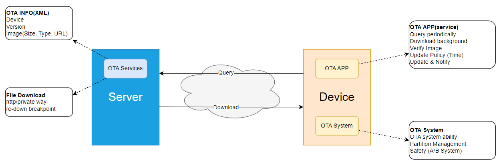

- 在 OTA 的广义应用中，可以划分为云端和设备端两个主要组成部分。云端部分负责处理设备的升级请求，包括执行升级校验、下发升级包以及收集升级结果等任务。而设备端则主要依赖云端下发的升级包，完成系统软件（ FOTA， Firmware Over-the-Air）或应用程序（ SOTA， Software Over-the-Air）的更新与升级。
- 本文旨在提供底层设备端 OTA 的用户手册，详细阐述 OTA 在底层系统软件和应用程序升级中的机制及其实现方法，同时提供相关的开发指导。需要特别指出的是，通过 OTA 升级的系统软件与应用程序，主要是指更新存储在外部存储器（如 eMMC ）中的数据。
- OTA 的对外交付物主要为一套 API 及其相应的实现库（如 libupdate.so），该库实现了底层烧写校验等关键功能。上层的 OTA 服务架构则由客户方实现，用以对接客户的云端服务。在成功从云端下载升级包后， OTA 服务会通过调用 libupdate.so 中的接口，实现版本的升级和校验等操作，从而确保设备能够顺利、安全地完成软件更新。

**缩略语**

| 缩略语   | 英文全称                         | 中文解释                  |
|----------|---------------------------------|--------------------------|
| SoC      | System on Chip                  | 片上系统                  |
| BL[x]    | Boot Loader Stage [x]           | 启动的阶段 x              |
| SPL      | Secondary Program Loader        | 二级程序加载器            |
| GPT      | GUID Partition Table            | GUID 磁盘分区表           |
| GUID     | Globally Unique IDentifier      | 全局唯一标识符            |
| RSA      | RSA Algorithm                   | RSA 公开密钥密码体制      |
| eMMC     | embedded MultiMedia Card        | 嵌入式非易失性存储器       |

## 系统分区表

OTA 时，将以分区为单位对目标分区进行更新，这些分区按照不同的类型做如下区分：

| 分区类型   | 属性 | 升级方式 | 举例 |
|-----------|------|---------|------|
| 持久化分区 | 参数分区：一般存储系统运行时需要加载的一些配置文件和参数等数据。如分区表中的 ubootenv 等 <br /><br /> 用户分区：指与系统启动无关的分区。一般在系统启动后才会被挂载，如 userdata 分区 | 单分区一般没有镜像， 分区数据需要长期保存， 不支持 OTA 升级。| ubootenv, veeprom, userdata |
| AB 分区 | 前缀同名且尾缀带 _a 和 _b 的分区称做 AB 分区。 | AB 分区交替升级。 | boot_a, boot_b |
| BAK 分区 | 前缀同名且尾缀带`bak`的分区称作 BAK 分区，主要构成为 1 个主分区和若干个备份分区。 | BAK 分区只升级主分区，主分区升级并验证成功后，将主分区内容同步到备份分区。 |SBL, SBL_bak|

## 开启OTA
RDK默认不开启OTA功能，如需开启请按如下流程操作：
1. 开启OTA前，若未编译过工程，没有生成out目录则执行下列命令，必须先编译工程或者建立编译环境。
        ```bash
        # 编译工程，生成镜像
        sudo ./pack_image.sh

        # 仅建立编译环境
        sudo ./pack_image.sh -p
        ```
2. 将build_params目录下的`ubuntu-22.04_desktop_rdk-s100_beta.conf`和`ubuntu-22.04_desktop_rdk-s100_release.conf`中的中的PARTITION_FILE配置为OTA版本（PARTITION_FILE="s100-ota-gpt.json）；

    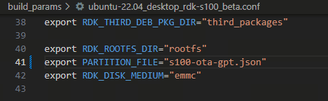

3. 将source/bootloader/device/rdk/s100目录下的`board_s100_debug.mk`和`board_s100_release.mk`文件中的`RDK_OTA`变量配置为开启（export RDK_OTA="yes"）

    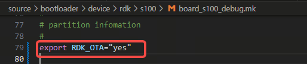
4. 编译
   - 制作新的miniboot的deb包
        ```bash
        ./mk_debs.sh hobot-miniboot
        ```
   - 重新编译本地镜像
        ```bash
        sudo ./pack_image.sh -l
        ```

## OTA 打包工具

### OTA 打包工具介绍

OTA打包工具位于”ota_tools/”路径下，该文件夹包含的内容如下：
```bash
tree
.
├── hdiffz              // 差分工具，用于生成文件差异
├── hpatchz             // 差分工具，用于应用文件差异
├── mk_otapackage.py    // OTA 打包工具，用于生成 OTA 升级包
├── ota_pack_tool.sh    // OTA 打包脚本，封装了 mk_otapackage.py 的功能
├── ota_process         // OTA 升级过程中使用的二进制工具，包含在 OTA 包中
├── out                 // OTA 打包的输出文件夹
│   ├── deploy          // 存放 OTA 包制作过程的中间文件
│   └── ota_packages    // 存放制作好的 OTA 升级包
└── private_key.pem     // 私钥文件，用于 OTA 包的签名
```

一般使用位于”ota_tools/”路径下的ota_pack_tool.sh制作所需的OTA升级包，支持OTA升级包解包，解包后重打包，制作升级包以及制作差分包等。

使用方法如下：
```bash
Usage: ./ota_pack_tool.sh [OPTIONS]...
Options:
  -x, -unpack <ota_package>        Unpack the given OTA package file.
  -r, -repack                      Repack the files into a new OTA package.
  -c, -create <pack_type> -d <source_dir>
       Generate OTA package by source dir or img_packages.
       <pack_type>: sys, sys_signed ... etc.
       <source_dir>: sys and sys_signed require img dir.
       (e.g.)run "./ota_pack_tool.sh -c sys -d ../out/product/img_packages/"
  -i, -inc <pack_type> -old <old_pkg> -new <new_pkg>
       Create an incremental OTA package.
       <pack_type>: sys, sys_signed.
       <old_pkg>, <new_pkg>: OTA pack, xxx.zip.
       (e.g.)run "./ota_pack_tool.sh -i sys -old out/ota_packages/all_in_one_old.zip -new out/ota_packages/all_in_one_new.zip".
  -h, -help                        Display this help message.
```

#### OTA 升级包解包与重打包
升级包解包指令为：
```bash
./ota_pack_tool.sh -x out/ota_packages/all_in_one.zip
```
- 升级包解包后，可以更新ota_tools/out/ota_unpack下的镜像，重新制作OTA包，使用的OTA配置文件与ota_process均位于ota_tools/out/ota_unpack目录，该方法无法修改OTA配置文件gpt.conf。

升级包重打包指令为：
```BASH
./ota_pack_tool.sh -r
```
- 打包的源文件夹路径为：ota_tools/out/ota_unpack
- 打包后的目标文件路径为：ota_tools/out/ota_repack
#### OTA 制作普通升级包

通过如下命令可以制作系统升级包，使用的分区配置文件通过ota_pack_tool.sh脚本中的GPT_CONFIG配置，默认使用/out/product/img_packages/s100-gpt.json，可根据实际需求修改。

```BASH

# sys代表打包nonsecure版本升级包
 ./ota_pack_tool.sh -c sys -d ~/s100/out/product/img_packages/

# sys_signed代表打包secure版本升级包
 ./ota_pack_tool.sh -c sys_signed -d ~/s100/out/product/img_packages/
```
生成的 OTA 升级包将输出到ota_tools/out/ota_packages目录，在该目录下，您将看到zip和signature两种后缀的文件,其中zip后缀文件是 OTA 升级包, signature后缀文件是对同名升级包的签名文件：
```BASH
all_in_one.signature            #nonsecure 升级包签名文件
all_in_one.zip                  #nonsecure 升级包文件

all_in_one_signed.signature     #secure 升级包签名文件
all_in_one_signed.zip           #secure 升级包文件
```

#### OTA 制作差分升级包
可以通过ota_pack_tool制作all_in_one_signed_inc.zip系统差分包，制作时使用的OTA配置文件与ota_process均为new包解压所得。

1. 差分升级作用

    节省流量，并不节省升级时间。

2. 差分升级原理

    利用差分算法，得出新老镜像差分镜像，升级时差分还原到对向分区。（flash介质的镜像不差分，其体积仅数M，且flash读取慢）。差分库：hpatchz。支持的镜像：OTA镜像包中的所有非flash介质的镜像。

3. 差分升级的限制
   - flash上的分区不支持差分升级；
   - boot分区有写入行为，不支持差分升级；
   - 只有镜像包的大小大于10M时才支持差分升级；
   - 需要差分升级的分区如需挂载时，必须以只读方式挂载，且挂载时应添加noload选项，否则会出现md5校验失败的问题；
4. 制作差分升级包

    - 差分镜像升级时需要依赖已经烧录的旧镜像包，因此，在计划使用差分升级时，**请务必妥善保存旧镜像包避免丢失或损坏**。
   ```bash
    # 基于out/ota_packages/all_in_one_signed_old.zip制作out/ota_packages/all_in_one_signed_new.zip的差分包all_in_one_signed_inc.zip
    ./ota_pack_tool.sh -i sys_signed -old out/ota_packages/all_in_one_signed_old.zip -new out/ota_packages/all_in_one_signed_new.zip
   ```

### 签名密钥

签名所用的私钥`private_key.pem`放置在工程的：`ota_tools`目录。签名所用的公钥`public_key.pem`放置在工程的：`source/bootloader/miniboot/ota_flash_tools/`目录，在设备端该公钥的路径为 /usr/hobot/share/ota/public_key.pem。

如果需要替换为自己的密钥，步骤如下：

- 私钥生成：

  ```bash
  openssl genrsa -out private_key.pem 4096
  ```

- 公钥生成：

  ```bash
  openssl rsa -RSAPublicKey_out -in private_key.pem  -out public_key.pem
  ```

- 替换路径`source/bootloader/miniboot/ota_flash_tools/`下的`public_key.pem`以及替换路径`ota_tools/`下的`private_key.pem`.
- 执行下列命令重新编译

    ```bash
    #回到项目的顶层目录，制作miniboot的deb包
    ./mk_debs.sh hobot-miniboot

    #编译本地项目
    sudo ./pack_image.sh -l

**注意：**
- 打包生成的 OTA 包默认命名为 all_in_one_xxx.zip。升级程序会对包名进行校验，包名中必须包含 "all_in_one" 关键字，且后缀必须为 .zip。此外，包名中不得包含以下关键字："app"、"APP"、"middleware"、"param"。

### OTA 升级包介绍

#### 升级包结构

```bash
Archive:  all_in_one_signed.zip
  Length      Date    Time    Name
---------  ---------- -----   ----
     1047  2025-05-14 12:11   gpt.conf
     5326  2025-05-14 12:11   data.json
   526336  2025-05-13 20:37   HSM_FW_signed.img
   264192  2025-05-13 20:37   HSM_RCA_signed.img
   264192  2025-05-13 20:37   keyimage_signed.img
   264192  2025-05-13 20:37   keyimage_ohp_signed.img
   526336  2025-05-13 20:37   scp_signed.img
   526336  2025-05-13 20:37   spl_signed.img
  1312768  2025-05-13 20:37   MCU_S100_V1.0_signed.img
   256288  2025-05-13 20:37   acore_cfg.img
   348928  2025-05-13 20:37   bl31.img
   986080  2025-05-13 20:37   optee.img
  1076928  2025-05-13 20:37   uboot.img
 36388864  2025-05-13 20:37   boot.img
8589934592  2025-05-13 20:37   system.img
   310144  2025-05-13 19:47   ota_process
---------                     -------
8632992549                     16 files
```

上述内容展示了当前 OTA 升级包中的文件结构，主要包括以下四类文件。镜像文件的数量会根据实际配置有所增减。

|    文件      |    描述      |
|--------------|-------------|
|   gpt.conf   | 分区表文件   |
|  data.json   | OTA 配置文件 |
|    *.img     | 各分区镜像   |
| ota_process  | OTA 烧写程序 |

#### OTA 配置文件

OTA 升级包中包含一个名为 data.json 的配置文件。该文件在编译时生成，其中包含了升级包的分区信息和镜像信息。

通用配置

| 配置                    | 类型      | 功能                     |
|-------------------------|----------|--------------------------|
| backup_dir              | arr[obj] | HSM备份目录               |
| ab_sync                 | str      | reserved字段,默认固定false |
| nor_sign                | bool     | NOR Flash镜像签名校验开关   |
| update_partition        | arr[str] | 升级分区                   |
| partition_info          | arr[str] | 各分区配置                 |


各分区配置（ partition_info）

| 配置           | 类型     | 功能                                              |
|----------------|----------|--------------------------------------------------|
| md5sum         | arr[obj] | 各镜像 MD5 值                                     |
| md5_scope      | arr[obj] | 各镜像 MD5 校验长度                                |
| medium         | str      | 所在外存介质 (NOR/eMMC/NAND)                       |
| part_type      | str      | 分区类型 (AB/BAK/GOLDEN)                          |
| upgrade_method | str      | 升级方式 (image)                                  |
| imgname        | str      | 镜像名，仅支持以 `.img/.bin/.ubifs` 为后缀的文件    |

以下是一个 data.json 文件的示例：

```JSON
{
    "antirollbackUpdate_host": false,
    "antirollbackUpdate_hsm": false,
    "backup_dir": "/tmp/ota/backup",
    "ab_sync": false,
    "update_partition": [
        "HSM_FW",
        "HSM_RCA",
        "keyimage",
        "scp",
        "spl",
        "MCU",
        "acore_cfg",
        "bl31",
        "optee",
        "uboot",
        "boot",
        "system"
    ],
    "nor_sign": true,
    "partition_info": {
        "HSM_FW": {
            "md5sum": {
                "HSM_FW_signed.img": "3e19e04f97e0cb4e37899958e3aec34f"
            },
            "md5_scope": {
                "HSM_FW_signed.img": 524288
            },
            "medium": "nor",
            "part_type": "BAK",
            "have_anti_ver": null,
            "upgrade_method": "image",
            "imgname": "HSM_FW_signed.img"
        },
        "HSM_RCA": {
            "md5sum": {
                "HSM_RCA_signed.img": "9b2f9cb4d00586dd49112f50fdb90952"
            },
            "md5_scope": {
                "HSM_RCA_signed.img": 262144
            },
            "medium": "nor",
            "part_type": "BAK",
            "have_anti_ver": null,
            "upgrade_method": "image",
            "imgname": "HSM_RCA_signed.img"
        },
        "keyimage": {
            "md5sum": {
                "keyimage_signed.img": "df28a9900fa504a90a4c85368cb7879d",
                "keyimage_ohp_signed.img": "af81665e36a9a274084e2dc02b7a3830"
            },
            "md5_scope": {
                "keyimage_signed.img": 262144,
                "keyimage_ohp_signed.img": 262144
            },
            "medium": "nor",
            "part_type": "BAK",
            "have_anti_ver": null,
            "upgrade_method": "image",
            "imgname": "keyimage%s_signed.img"
        },
        "scp": {
            "md5sum": {
                "scp_signed.img": "6ea63e573ae3bb50dc8cb0052c29fddb"
            },
            "md5_scope": {
                "scp_signed.img": 524288
            },
            "medium": "nor",
            "part_type": "AB",
            "have_anti_ver": null,
            "upgrade_method": "image",
            "imgname": "scp_signed.img"
        },
        "spl": {
            "md5sum": {
                "spl_signed.img": "ba48f24f989de1ddbc6eb3aedd139b4f"
            },
            "md5_scope": {
                "spl_signed.img": 524288
            },
            "medium": "nor",
            "part_type": "AB",
            "have_anti_ver": null,
            "upgrade_method": "image",
            "imgname": "spl_signed.img"
        },
        "MCU": {
            "md5sum": {
                "MCU_S100_V1.0_signed.img": "d44784323de5f5d57fa606ea178fd854"
            },
            "md5_scope": {
                "MCU_S100_V1.0_signed.img": 1310720
            },
            "medium": "nor",
            "part_type": "AB",
            "have_anti_ver": null,
            "upgrade_method": "image",
            "imgname": "MCU_S100_V1.0_signed.img"
        },
        "acore_cfg": {
            "md5sum": {
                "acore_cfg.img": "fe36a8ad522a2ca5ee811da8208828ef"
            },
            "md5_scope": {
                "acore_cfg.img": 256288
            },
            "medium": "emmc",
            "part_type": "AB",
            "have_anti_ver": null,
            "upgrade_method": "image",
            "imgname": "acore_cfg.img"
        },
        "bl31": {
            "md5sum": {
                "bl31.img": "5be617cd08128e89318f61964696509a"
            },
            "md5_scope": {
                "bl31.img": 348928
            },
            "medium": "emmc",
            "part_type": "AB",
            "have_anti_ver": null,
            "upgrade_method": "image",
            "imgname": "bl31.img"
        },
        "optee": {
            "md5sum": {
                "optee.img": "f0f663462f523f9e8722e0c26d29209e"
            },
            "md5_scope": {
                "optee.img": 986080
            },
            "medium": "emmc",
            "part_type": "AB",
            "have_anti_ver": null,
            "upgrade_method": "image",
            "imgname": "optee.img"
        },
        "uboot": {
            "md5sum": {
                "uboot.img": "78b07c6a4264bd757c4d992e2dc0ee0b"
            },
            "md5_scope": {
                "uboot.img": 1076928
            },
            "medium": "emmc",
            "part_type": "AB",
            "have_anti_ver": null,
            "upgrade_method": "image",
            "imgname": "uboot.img"
        },
        "boot": {
            "md5sum": {
                "boot.img": "aca98db8136ad4f1d55cd3e7bdb4c856"
            },
            "md5_scope": {
                "boot.img": 36388864
            },
            "medium": "emmc",
            "part_type": "AB",
            "have_anti_ver": null,
            "upgrade_method": "image",
            "imgname": "boot.img"
        },
        "system": {
            "md5sum": {
                "system.img": "a6f61c86ae0045ad3167b3daf7c33b3a"
            },
            "md5_scope": {
                "system.img": 8589934592
            },
            "medium": "emmc",
            "part_type": "AB",
            "have_anti_ver": null,
            "upgrade_method": "image",
            "imgname": "system.img"
        }
    }
}
```

通过以上配置， OTA 升级包能够确保每个分区的镜像在升级过程中被正确校验和更新。

## OTA 实现详解
### OTA流程
以下流程以ota_tool中实现为例（开发者实现可参考此工具）。

- 准备阶段：

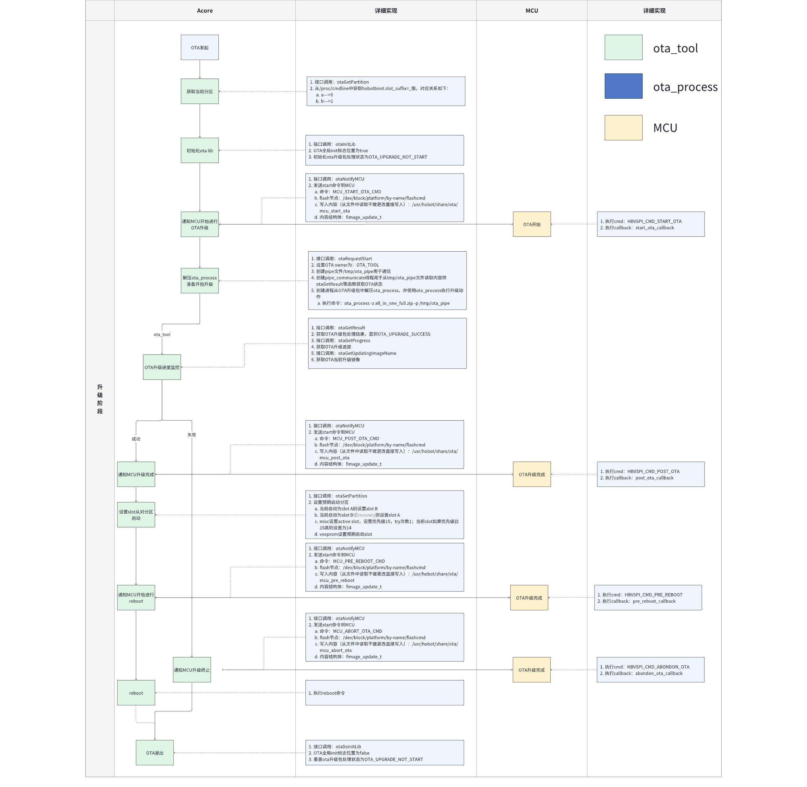

- 升级阶段：

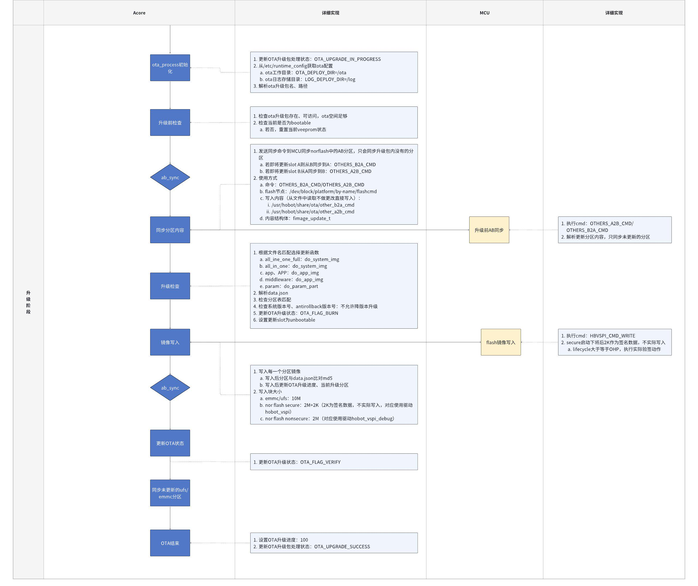

- 验证阶段：

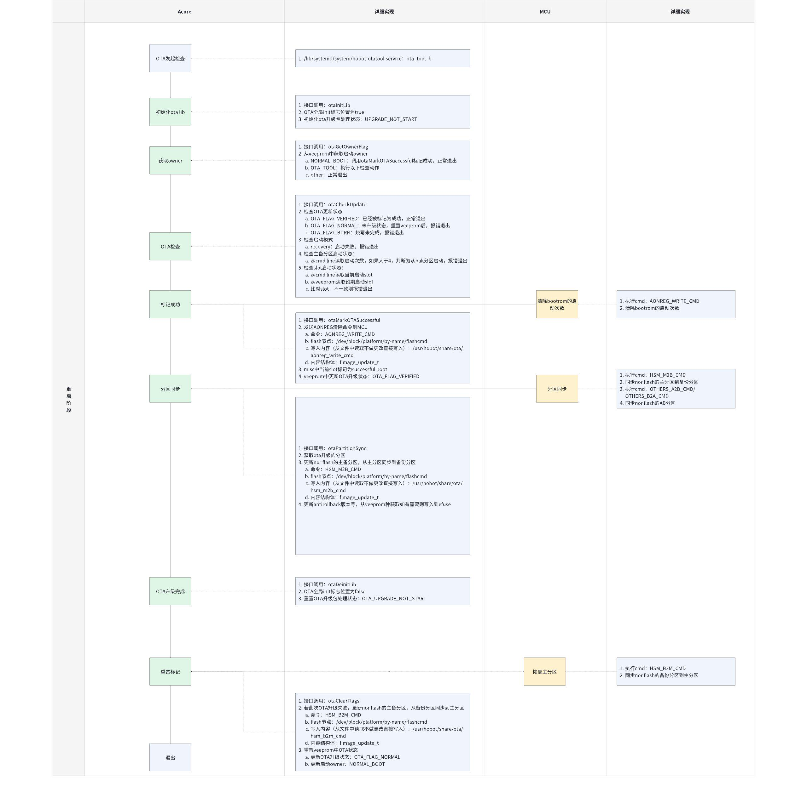

### OTA 状态机

#### 升级包的状态
状态存储在OTA进程空间，以下是流程说明：
```c
/**
 * @enum otahl_update_result
 * @brief ota upgrade result
 * @NO{S21E03C02}
 */
typedef enum otahl_update_result {
    OTA_UPGRADE_NOT_START = 0, /**< OTA upgrade not start */
    OTA_UPGRADE_IN_PROGRESS, /**< OTA upgrading */
    OTA_UPGRADE_SUCCESS, /**< OTA upgrade success*/
    OTA_UPGRADE_FAILED, /**< OTA upgrade failed*/
} otahl_update_result_e;
```

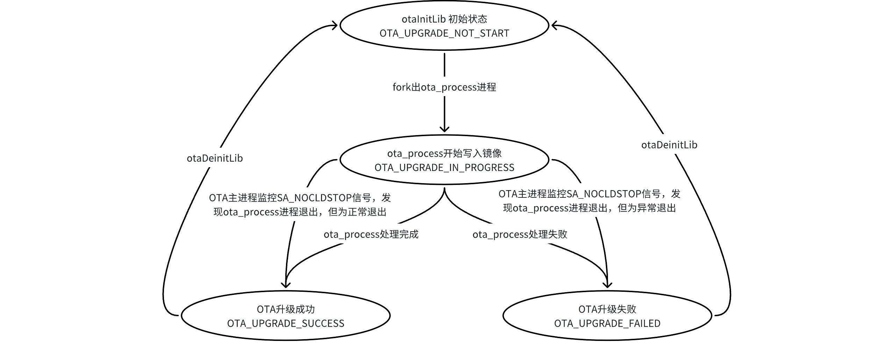

#### OTA升级流程的状态
状态存储在veeprom，以下是流程说明：
```c
typedef enum ota_update_flag {
    OTA_FLAG_NORMAL = 0,     // normal状态
    OTA_FLAG_BURN,           // 烧写状态
    OTA_FLAG_VERIFY,         // 待验证状态
    OTA_FLAG_VERIFIED,       // 已验证状态
} ota_update_flag_e;
```

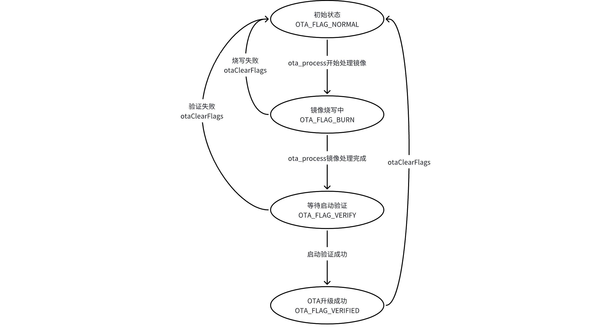

#### misc （AB状态机）
1. 区域分配

    地瓜使用andriod AB机制来应用AB系统，下面的信息都是对于该机制的部分原理介绍，详细原理请参考：https://source.android.google.cn/docs/core/ota?hl=zh-cn

    bootloader_message_ab 总共占4K： 其中AB使用的bootloader_control 位于struct bootloader_message_ab->slot_suffix处，占32个字节。
    ```c
    struct bootloader_message_ab {
        struct bootloader_message message;
        char              slot_suffix[32];
        char              update_channel[128];

        // Round up the entire struct to 4096-byte.
        char reserved[1888];
    };

    /**
    * Be cautious about the struct size change, in case we put anything post
    * bootloader_message_ab struct (b/29159185).
    */
    #if (__STDC_VERSION__ >= 201112L) || defined(__cplusplus)
    static_assert(sizeof(struct bootloader_message_ab) == 4096,
            "struct bootloader_message_ab size changes");
    #endif
    ```

2. AB结构体数据
    ```c
    #define ARRAY_32    (32U)

    struct slot_metadata {
        // Slot priority with 15 meaning highest priority, 1 lowest
        // priority and 0 the slot is unbootable.
        uint8_t priority : 4;
        // Number of times left attempting to boot this slot.
        uint8_t tries_remaining : 3;
        // 1 if this slot has booted successfully, 0 otherwise.
        uint8_t successful_boot : 1;
        // 1 if this slot is corrupted from a dm-verity corruption, 0 otherwise.
        uint8_t verity_corrupted : 1;
        // Reserved for further use.
        uint8_t reserved : 7;
    } __attribute__((packed));

    struct bootloader_control {
        // NUL terminated active slot suffix.
        char slot_suffix[4];
        // Bootloader Control AB magic number (see BOOT_CTRL_MAGIC).
        uint32_t magic;
        // Version of struct being used (see BOOT_CTRL_VERSION).
        uint8_t version;
        // Number of slots being managed.
        uint8_t nb_slot : 3;
        // Number of times left attempting to boot recovery.
        uint8_t recovery_tries_remaining : 3;
        // Ensure 4-bytes alignment for slot_info field.
        uint8_t reserved0[2];
        // Per-slot information.  Up to 4 slots.
        struct slot_metadata slot_info[4];
        // Reserved for further use.
        uint8_t reserved1[8];
        // CRC32 of all 28 bytes preceding this field (little endian
        // format).
        uint32_t crc32_le;
    } __attribute__((packed));
    ```

3. 状态机说明

    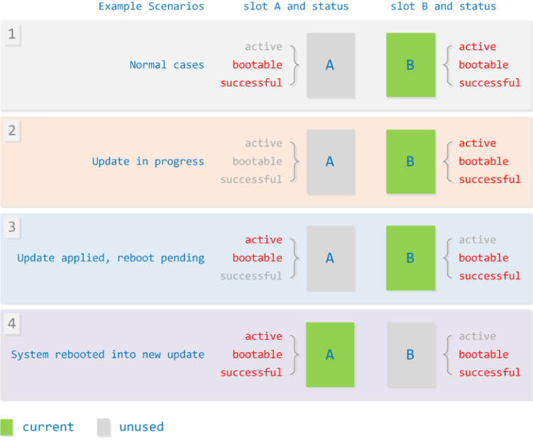
- 状态1：默认状态，AB slot都可以启动。b的优先级高于a，默认从b启动。

- 状态2：升级状态（烧写状态），a slot不可启动且boot success为0。

- 状态3：烧写成功，还未重启，这个时候将要升级的slot设置为active状态，将当前slot设置为非active状态（调整优先级）。

- 状态4：重启验证成功，将a设置为success boot状态。

#### veeprom区域

OTA升级的状态机存储在此区域，以下是OTA中对此区域的应用：

```c
#define VEEPROM_OTA_STAT_OFFSET \
    (1024) /**< offset 0f OTA status in the veeprom partition */
#define VEEPROM_OTA_STAT_SIZE \
    (2048) /**< size of OTA status in the veeprom partition */

#define VEEPROM_RECOVERY_STAT_OFFSET \
    (VEEPROM_OTA_STAT_OFFSET +   \
     VEEPROM_OTA_STAT_SIZE) /**< offset 0f recovery information in the veeprom partition */
#define VEEPROM_RECOVERY_STAT_SIZE \
    (128) /**< size 0f recovery information in the veeprom partition */
```

1.  OTA区域

    起始位置：1024

    大小：2048

    作用：OTA状态存储

    存储数据如下：

    ```c
    /**
    * @ota_status_t
    * @brief ota status
    * @NO{S21E03C04U}
    */
    typedef struct ota_status_s {
        uint32_t           magic;               /**< magic number */
        ota_update_flag_e  up;
        ota_update_flag_e  up_system;           /**< system partition update flag */
        ota_update_flag_e  up_backup;           /**< system partition update flag */
        ota_update_flag_e  up_app;              /**< system partition update flag */
        ota_update_flag_e  up_middleware;       /**< system partition update flag */
        ota_update_flag_e  up_param;            /**< system partition update flag */
        ota_update_owner_e owner;
        uint32_t           next_slot;           /**< expect slot for next boot */
        update_part_t      update_part;
        uint8_t            reserved[ARRAY_32];
        uint32_t           crc32_le;            /**< crc verify value */
    } ota_status_t;
    ```

### 启动状态切换
下图说明正常启动时A/B slot是如何切换的（有没有OTA都是这个流程）
    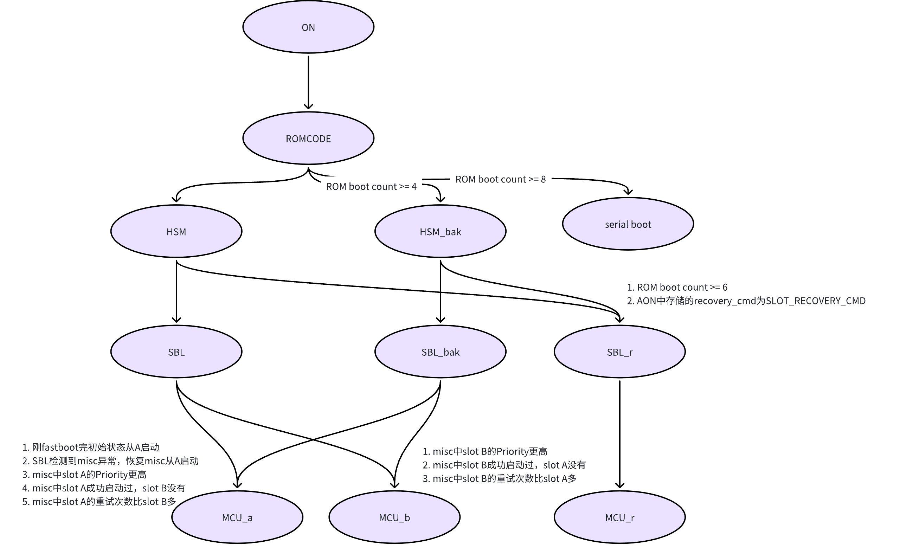

- 启动时，ROM boot count自动累加(该标记在aon域，下电时复位)

- OTA升级时设置要更新的slot优先级为15，另一个slot为14。设置要升级的slot重试次数为1，slot损坏为0

- OTA启动验证成功时该slot标记为successboot，启动失败时该slot标记为已损坏

- 从未标记successboot的slot启动时将会消耗一次重试次数，重试次数为0或被标记损坏会跳过此slot


### 重启验证与回滚
S100参考实现中，OTA升级完重启之后起到内核会触发systemd的OTA服务来执行重启检查，来完成完整的OTA流程（实际上是执行ota_tool -b）
    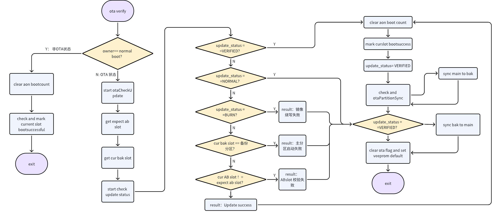

### 分区烧写方式
    OTA以分区为单位来进行升级，每个要升级的分区都有自己的镜像，升级时主要是将该镜像写入到外部存储器对应的分区上。在镜像类型上又分为全镜像与差分镜像两种形式。

#### 全镜像升级
  - 全镜像指的是提供的目标分区完整镜像，升级时将镜像直接写到外部存储器对应分区的方式。
#### 差分镜像升级
  - 差分镜像是通过差分算法对原始镜像和目标镜像进行差分计算得到的镜像。差分一般会提取目标镜像与原始镜像之间的差异信息，精简冗余信息。通过差分得到的镜像大小一般会远远小于目标镜像（具体大小取决于原始与目标之间的差异度，差异越小，镜像越小），可用于节省流量。

  - 当差分升级时，S100 OTA会根据差分镜像和板端原始分区数据通过逆差分还原成目标镜像，并写入到对应的外部存储器分区，完成最终的升级。

  - S100上使用的是开源的差分算法工具hdiffz/hpatch，详细信息请参考:https://github.com/sisong/HDiffPatch。


### OTA 安全保护措施

#### 分区校验
    OTA支持对镜像中的fpt/GPT分区文件校验，通过与当前系统的fpt/GPT分区进行对比，验证fpt/GPT分区表是否有调整，如果fpt/GPT分区有调整，则停止升级。
    - OTA升级包含有通过编译系统生成的分区文件gpt.conf，具体内容格式如下：
        ```bash
        fpt:0:262143:0
        recovery:262144:6291455:0
        misc:6291456:6553599:0
        HB_APDP:6553600:6815743:0
        keystorage:6815744:7340031:0
        HSM_FW:7340032:7864319:0
        HSM_FW_bak:7864320:8388607:0
        HSM_RCA:8388608:8650751:0
        ···
        ```
    - 由于S100分区支持最后一个分区的自动扩展，其结束地址会动态变化，所以校验GPT只校验到userdata分区，且最后一个分区一般不含镜像，不影响正常使用。
### 典型升级流程
1. OTA Service 从云端下载并校验升级包，并调用otaInitLib初始化动态库。

2. 调用otaRequestStart发起升级。该API会解压升级包中的ota_process程序，并fork一个进程，执行ota_process程序进行实际烧写。同时，该API还会创建文件锁（防止同时存在多次升级）、创建pipe文件（用于和ota_process通信）。另外，该API还会创建一个线程，用于定期读取pipe，获取实时升级进度、升级结果、升级分区等信息。

3. 子进程升级阶段，OTA Service可以调用otaGetResult获取升级结果、调用otaGetProgress获取升级进度、调用otaGetUpdatingImageName获取正在升级的镜像。

4. 当otaGetResult返回OTA_UPGRADE_SUCCESS时，代表镜像烧写成功，需要进入校验阶段。

5. 调用otaSetPartition将下次启动分区设置为对向分区，并执行重启流程。

6. 重启后，OTA Service 调用otaGetOwnerFlag获取升级owner，如果owner为OTA Service，则 OTA Service 为该次升级的校验负责，进入校验流程。

7. 调用otaCheckUpdate，获取升级结果。该API主要会检查镜像是否完整写入、是否从期望AB slot、Backup slot启动。

8. 调用otaMarkOTASuccessful，标记当前分区启动成功。该API操作AB状态机，将本slot标记为boot_successful，保证后续从该slot启动。若在此步骤前发生任何重启，则下次将从旧版本镜像所在slot启动，升级失败。

9. 调用otaPartitionSync，进行BAK分区的主备同步。

10. 调用otaClearFlags清除升级标记，结束升级。

    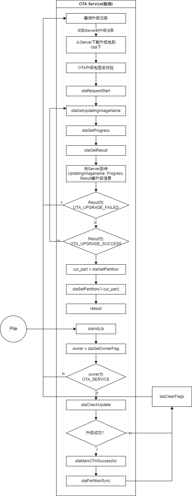

## OTA 升级端介绍

### ota_tool 使用

在板端可通过ota_tool手动发起 OTA 升级，在输入ota_tool -h指令可查询详细的。

```bash
ota_tool Usage:
   -v, --version                      get this library's version.
   -b, --boot                         check ota update status when boot.
   -s, --setpartition [partition]     set A/B slot partition, 0--A; 1--B.
   -g, --getpartition                 get A/B slot partition, 0--A; 1--B.
   -p, --package [package_path]       specify the path of package, the package paths can be relative or absolute, it's length must be smaller than 64 bytes.
   -n, --noreboot                     request ota without reboot.
   -c, --checksign                    signature check.
   -i, --signature                    signature information file.
   -h, --help                         Display this help screen.
```

使用 ota_tool 进行升级前，需要将 OTA 升级包上传至板端。

参数介绍：

- -h 用于获取帮助信息。
- -v 用于获取 libupdate.so 版本、当前系统软件版本。
- -b 启动后检查升级结果（系统启动时会自动进行此检查，用户无需干预）。
- -s 设置下次启动 A/B slot, 0 表示 A， 1 表示 B。
- -g 获取当前 A/B slot。
- -p 指定升级包。
- -n 升级成功后不进行自动重启。
- -c 启用包完整性验证。
- -i 指定签名文件（必须跟在 -p 参数后面）。

举例：

```BASH
# 全量升级，不验证包完整性
ota_tool -p all_in_one.zip

# 全量升级，验证包完整性
ota_tool -c -p all_in_one.zip -i all_in_one.signature

# 差分升级，不验证包完整性
ota_tool -p all_in_one_inc.zip

# 差分升级，验证包完整性
ota_tool -c -p aall_in_one_inc.zip -i all_in_one_inc.signature
```

### ota_tool 实现
ota_tool 使用C语言实现，源码仅 otainterface.c 一个文件。 实现了获取系统软件版本、升级结果检查、设置/获取AB slot、OTA升级、强制升级、OTA包签名校验等功能。

若-c参数传入，则使用传入的签名文件对升级包进行签名校验。

最后，调用 ota_update_all_img 启动升级。

#### ota_update_all_img
```c
static int32_t ota_update_all_img(const char *zip_path)
{
     int32_t progress = 0;

     uint8_t             slot = 0;
     uint8_t             next_slot = 0;
     int32_t             ret = 0;
     ota_update_result_e result = 0;
     char                part_name[ARRAY_32] = { 0 };

     ret = otaGetPartition(&slot);
     if (ret < 0) {
             return ret;
     }

     if (slot == 2) {
             next_slot = 0;
             printf("The slot [%d] to be burned\n", next_slot);
     } else {
             next_slot = 1 - slot;
             printf("The slot [%d] to be burned\n", next_slot);
     }

     ret = otaInitLib();
     if (ret < 0) {
             printf("error:init failed!\n");
             return ret;
     }

     ret = otaRequestStart(zip_path, OTA_TOOL);
     if (ret < 0) {
             printf("error: start ota update failed!\n");
             ret = -1;
             goto err;
     }
     while (otaGetResult() != OTA_UPGRADE_SUCCESS && otaGetResult() != OTA_UPGRADE_FAILED) {
             progress = otaGetProgress();
             result = otaGetResult();
             otaGetUpdatingImageName(part_name, sizeof(part_name));

             if (result == UPGRADE_FAILED) {
                     printf("error: ota update failed!\n");
                     ret = -1;
                     break;
             }
             OTA_show_Process_Bar(part_name, progress,
                                  "OTA is upgrading ...");
             usleep(100 * 1000);
     }

err:
     if (otaGetResult() == OTA_UPGRADE_SUCCESS) {
             ret = otaSetPartition(next_slot);
             if (ret < 0) {
                     printf("error: set partition failed!\n");
                     return ret;
             }
             if (g_is_reboot == true) {
                     printf("reboot system!\n");
                     ota_system_exe("reboot");
             } else {
                     printf("ota update success and waiting for reboot!\n");
             }
     }
     otaDeinitLib();

     return ret;
}
```

1. 调用 otaGetPartition 获取当前所在 AB slot

2. 调用 otaInitLib 初始化 libupdate.so

3. 调用 otaRequestStart 并传入升级包和owner(OTA_TOOL)，开始升级

4. 等待 otaGetResult 的结果为 OTA_UPGRADE_SUCCESS 或 OTA_UPGRADE_FAILED 。等待过程中，调用 otaGetProgress 、 otaGetResult 、 otaGetUpdatingImageName 获取升级进度、升级结果、正在升级的镜像，并调用 OTA_show_Process_Bar 打印到控制台

5. 若升级结果 otaGetResult 为 OTA_UPGRADE_SUCCESS ，则认为升级成功，调用 otaSetPartition 设置 AB slot 到对向 slot ，然后重启 SoC

    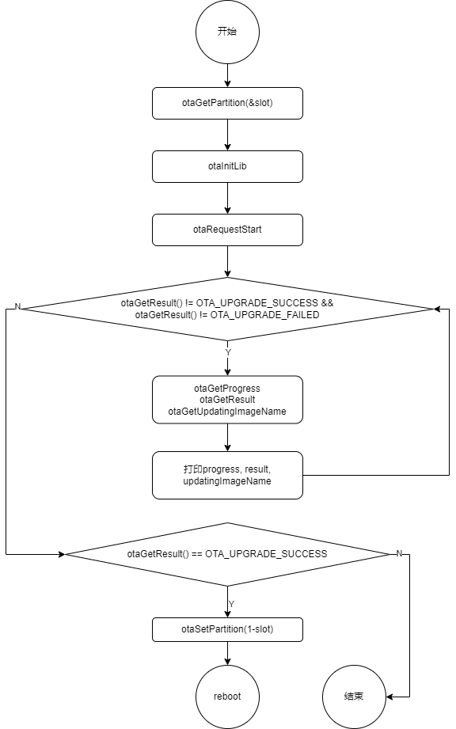

升级流程结束重启后，应启动 ota_tool -b 对升级结果进行检查校验，并进行后续操作。

#### ota_boot_check
S100 启动后，会启动一个 hobot-otatool.service 服务，该服务调用了 ota_tool -b ，该选项会检查 /ota/ota_tool_force_upgrade 文件是否存在，若存在，则进入升级流程（该进程会重新调用升级命令）。 若该文件不存在，则进入升级校验流程 ota_boot_check
```c
int32_t ota_boot_check(void)
{
     int32_t               ret = 0;
     enum ota_update_owner owner = 0;

     if ((ret = otaInitLib()) != 0) {
             printf("error: init failed!\n");
             goto exit;
     }

     if ((ret = otaGetOwnerFlag(&owner)) != 0) {
             printf("error: Get owner flag failed!\n");
             goto exit;
     }

     if (owner == NORMAL_BOOT) {
             printf("Normal boot\n");
             if ((ret = otaMarkOTASuccessful()) != 0) {
                     printf("error: mark boot success failed\n");
             }
             return ret;
     }

     if (owner != OTA_TOOL) {
             printf("ota_tool is not owner, owner is [%d]\n", owner);
             return 0;
     }

     if ((ret = otaCheckUpdate()) != 0) {
             printf("error: boot check failed\n");
             goto exit;
     }

     if ((ret = otaMarkOTASuccessful()) != 0) {
             printf("error: mark boot success failed\n");
             goto exit;
     }

     if ((ret = otaPartitionSync()) != 0) {
             printf("error: partition sync failed\n");
             goto exit;
     }

     ret = otaDeinitLib();

exit:
     otaClearFlags();
     return ret;
}
```
1. 调用 otaInitLib

2. 调用 otaGetOwnerFlag 获取升级owner

3. 若 owner 为 NORMAL_BOOT ，则调用 otaMarkOTASuccessful 标记启动成功，然后退出

4. 若 owner 不为 OTA_TOOL ，则正常退出

5. 调用 otaCheckUpdate 获取升级结果。若升级结果异常，则调用 otaClearFlags 清除 OTA 标记，终止OTA流程

6. 调用 otaMarkOTASuccessful 标记启动成功

7. 调用 otaPartitionSync 进行 AB 分区、 BAK 分区同步

    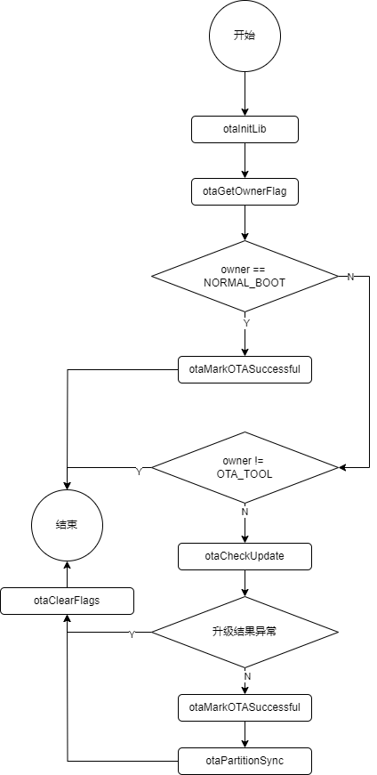


## OTA API介绍
S100 提供底层刷写库 libupdate.so，实现了一套跨平台的API，用于烧写OTA包。

底软基于 OTA HighLevel API 开发了 ota_tool 工具。

头文件：hobot_ota_hl.h

链接库：libupdate.so

### 动态库接口错误码列表
```c
enum ota_err_e {
    OTA_SUCCESS = 0,
    OTAERR_IO,
    OTAERR_PLAT_UNSUPPORT,
    OTAERR_REPEAT,
    OTAERR_MUTEX_INIT_LOCK_ERR,
    OTAERR_NOTINIT,
    OTAERR_NULLPOINTER,
    OTAERR_SHORTBUF,
    OTAERR_THREAD_CREATE,
    OTAERR_RANGE,
    OTAERR_STAGE,
    OTAERR_IMAGE_WRITE,
    OTAERR_BOOT_FAILED,
    OTAERR_VEEPROM,
    OTAERR_FILE_TYPE,
    OTAERR_UNZIP,
    OTAERR_NO_EXISTS,
    OTAERR_MALLOC,
    OTAERR_VERIFY,
    OTAERR_IMG_SIZE,
    OTAERR_UPDATE_STATUS,
};
```

### Interface List
| 接口原型 | 描述 |
|----------|------|
| `int32_t otaInitLib(void);` | 动态库初始化 |
| `int32_t otaDeinitLib(void);` | 动态库反初始化 |
| `int32_t otaGetLibVersion(char *version, int32_t len);` | 获取动态库版本 |
| `int32_t otaRequestStart(const char *image_name, enum ota_update_owner owner);` | 启动升级线程 |
| `int32_t otaGetResult(void);` | 获取升级状态和结果 |
| `int32_t otaGetProgress(void);` | 获取升级进度 |
| `int32_t otaGetUpdatingImageName(char *image_name, int32_t len);` | 获取正在升级的包 |
| `int32_t otaGetPartition(uint8_t *partition);` | 获取当前启动的 AB 分区 |
| `int32_t otaSetPartition(uint8_t partition);` | 设置下次启动的 AB 分区 |
| `int32_t otaGetOwnerFlag(enum ota_update_owner *owner);` | 获取 OTA owner（重启后） |
| `int32_t otaMarkOTASuccessful();` | 标记 OTA 升级成功（重启后） |
| `int32_t otaCheckUpdate();` | 检查是否升级成功（重启后） |
| `int32_t otaPartitionSync(void);` | AB分区、BAK分区同步 |
| `void otaClearFlags(void);` | 结束升级，清除 OTA 标志 |

### Interface: otaInitLib
| 接口名     | int32_t otaInitLib(void); |
|:---------|:-------------|
| 接口形式   | c 函数接口    |
| 输入参数   | N/A           |
| 输出参数   | N/A           |
| 返回值     | 0: 成功；<br/> -OTAERR_REPEAT:重复初始化 |
| 功能描述   | 板端刷写接口动态库初始化，主要进行全局结构体g_upgrade_info的初始化 |

**示例代码**
```c
#include <stdio.h>
#include <hobot_ota_hl.h>
int main(void) {
    int32_t ret;
    ret = otaInitLib();
    if (ret != 0) {
        printf("otaInitLib return: %d\n", ret);
        return ret;
    }
    ret = otaDeinitLib();
    if (ret != 0) {
        printf("otaDeinitLib return: %d\n", ret);
        return ret;
    }
    return 0;
}
```
### Interface: otaDeinitLib
| 接口名   | int32_t otaDeinitLib(void); |
|:---------|:--------------------------|
| 接口形式 | c 函数接口                |
| 输入参数 | N/A                       |
| 输出参数 | N/A                       |
| 返回值   | 0: 成功；<br/>-OTAERR_NOTINIT: 当前未初始化，不能调用反初始化 |
| 功能描述 | 反初始化            |

**示例代码**

参考 otaInitLib

### Interface: otaGetLibVersion
| 接口名   | int32_t otaGetLibVersion(char *version, int32_t len); |
|:---------|:----------------------------------------------|
| 接口形式 | c 函数接口                                    |
| 输入参数 | len: 传入的 buffer 长度                       |
| 输出参数 | version: 用于存储 version 信息。version 以三段式字符串形式返回（如：1.0.0） |
| 返回值   | 0: 成功；<br/> -OTAERR_NULLPOINTER: version 空指针；<br/> -OTAERR_SHORTBUF: 传入的 buffer 过小 |
| 功能描述 | 获取本动态库版本                              |

**示例代码**
```c
#include <stdio.h>
#include <hobot_ota_hl.h>
int main(void) {
    int32_t ret;
    char version[128];
    if (ret = otaGetLibVersion(version, sizeof(version))) {
        return ret;
    }
    printf("version: %s\n", version);
}
```

### Interface: otaRequestStart
| 接口名   | int32_t otaRequestStart(const char *image_name, enum ota_update_owner owner); |
|:---------|:---------------------------------------------------------------------|
| 接口形式 | c 函数接口                                                           |
| 输入参数 | text image_name: 升级包绝对路径。支持多种不同类型的包同时传入，用分号隔开。<br/>owner: 发起本次升级的进程，owner 由 enum ota_update_owner 定义|
| 输出参数 | N/A                                                                   |
| 返回值   | 0: 成功；<br/>-OTAERR_NULLPOINTER：image_name 空指针；<br/>-OTAERR_RANGE：owner 设置错误，超出当前定义范围；<br/>-OTAERR_NOTINIT：未初始化本动态库；<br/>-OTAERR_REPEAT：当前有其他进程正在升级；<br/>-OTAERR_IO：IO失败；<br/>-OTAERR_THREAD_CREATE：线程创建失败 |
| 功能描述 | 启动升级进程，对传入的 image_name 进行升级，并设置当前升级所有者       |

**示例代码**
```c
#include <stdio.h>
#include <hobot_ota_hl.h>
int main(void) {
    int32_t ret;
    int32_t result;
    int32_t progress;
    char imgname[256];
    ret = otaInitLib();
    if (ret != 0) {
        printf("otaInitLib return: %d\n", ret);
        return ret;
    }
    if (ret = otaRequestStart("/ota/all_in_one-secure_signed.zip;/ota/middleware.zip;/ota/param.zip", OTA_TOOL)) {
        printf("otaRequestStart return: %d\n", ret);
        return ret;
    }
    do {
        result = otaGetResult();
        if (ret = otaGetUpdatingImageName(imgname, sizeof(imgname))) {
            printf("otaGetUpdatingImageName return: %d\n", imgname);
        }
        progress = otaGetProgress();
        printf("current image: %s, progress: %d\n", imgname, progress);
        sleep(1);
    } while(result != OTA_UPGRADE_SUCCESS && result != OTA_UPGRADE_FAILED);

    ret = otaGetPartition(&cur_part);
    if (ret != 0) {
        printf("otaGetPartition returned with %d\n", ret);
    }
    ret = otaSetPartition(1 - cur_part);
    if (ret != 0) {
        printf("otaSetPartition returned with %d\n", ret);
    }
    /* Then reboot system */
    return 0;
}
```
### Interface: otaGetResult
| 接口名   | int32_t otaGetResult(void);                                                 |
|:---------|:-------------------------------------------------------------------|
| 接口形式 | c 函数接口                                                         |
| 输入参数 | N/A                                                                 |
| 输出参数 | N/A                                                                 |
| 返回值   | -OTAERR_NOTINIT: 未初始化本动态库<br/>OTA_UPGRADE_NOT_START：升级未开始；<br/>OTA_UPGRADE_IN_PROGRESS：升级中；<br/>OTA_UPGRADE_SUCCESS：升级结束，成功；<br/>OTA_UPGRADE_FAILED: 升级结束，失败 |
| 功能描述 | 获取升级结果|

**示例代码**

参考 otaRequestStart

### Interface: otaGetProgress
| 接口名       | 	int32_t otaGetProgress(void); |
|:---------|:-------------|
| 接口形式     | c 函数接口                                       |
| 输入参数     | N/A                                             |
| 输出参数     | N/A                                             |
| 返回值       | 0 ~ 100: 当前升级进度(%)<br/>-OTAERR_NOTINIT: 未初始化本动态库 |
| 描述         | 获取当前升级进度                               |


**示例代码**

参考 otaRequestStart

### Interface: otaGetUpdatingImageName
| 接口名       | int32_t otaGetUpdatingImageName(char *image_name, int32_t len); |
|:---------|:-------------|
| 接口形式     | c 函数接口                                     |
| 输入参数     | len: buffer长度                               |
| 输出参数     | image_name: 用于存放结果的buffer。<br/>image_name可能出现的内容：idle_state–升级未开始，<br/>all_img_finish–升级完成，app_param–应用参数，其他以”.img”结尾的包名。 |
| 返回值       | 0：成功<br/>-OTAERR_NULLPOINTER：image_name空指针<br/>-OTAERR_NOTINIT：本动态库未初始化<br/>-OTAERR_SHORTBUF：buffer长度太短 |
| 描述         | 获取当前正在升级的镜像                       |


**示例代码**

参考 otaRequestStart

### Interface: otaGetPartition
| 接口名       | int32_t otaGetPartition(uint8_t *partition); |
| :------------ | :------------------------------------------- |
| 接口形式     | c 函数接口                                   |
| 输入参数     | N/A                                         |
| 输出参数     | partition：用于接收当前分区的变量地址。<br/>*partition=0：当前为A分区，*partition=1：当前为B分区 |
| 返回值       | 0:成功<br/>-OTAERR_NULLPOINTER: partition 为空指针<br/>-OTAERR_IO: io错误，请重试 |
| 描述         | 获取当前启动AB分区                         |

**示例代码**

参考 otaRequestStart

### Interface: otaSetPartition
| 接口名       | int32_t otaSetPartition(uint8_t partition); |
| :------------ | :------------------------------------------- |
| 接口形式     | c 函数接口                                   |
| 输入参数     | partition：下次启动分区。0：A分区，1：B分区 |
| 输出参数     | N/A                                         |
| 返回值       | 0:成功<br/>-OTAERR_NOTINIT：本动态库未初始化<br/>-OTAERR_RANGE: partition范围错误，partition范围为0和1<br/>-OTAERR_IO: io错误，请重试<br/>-OTAERR_STAGE: 当前升级阶段不支持。升级过程中或升级失败不支持 |
| 描述         | 设置下次启动AB分区                         |


**示例代码**

参考 otaRequestStart

### Interface: otaGetOwnerFlag
| 接口名       | int32_t otaGetOwnerFlag(enum ota_update_owner *owner); |
| :------------ | :------------------------------------------ |
| 接口形式     | c 函数接口                                  |
| 输入参数     | N/A                                        |
| 输出参数     | owner：接收当前升级owner的变量。请参考enum ota_update_owner |
| 返回值       | OTA_SUCCESS:成功<br/> -OTAERR_NOTINIT:未初始化<br/> -OTAERR_NULLPOINTER: partition为空指针<br/> -OTAERR_IO:io错误,请重试 |
| 描述         | 获取当前升级owner                          |


**示例代码**

```c
static int check_and_mark(void) {
    enum ota_update_owner owner;
    int32_t ret;
    ret = otaGetOwnerFlag(&owner);
    if (ret != 0) {
            printf("otaGetOwnerFlag returned with %d\n", ret);
            return -1;
    }
    if (owner != OTA_TOOL) {
            printf("The OTA update is not launched by ota_tool, owner: %d\n", owner);
            return -1;
    }
    ret = otaCheckUpdate();
    if (ret == -OTAERR_IMAGE_WRITE) {
            printf("ota_tool: OTA image write failed, is there a reboot during update?\n");
            goto clearFlags;
    }
    if (ret == -OTAERR_BOOT_FAILED) {
            printf("ota_tool: The new package boot failed. Please check the packages\n");
            goto clearFlags;
    }
    if (ret != 0) {
            printf("otaCheckUpdate returned with %d\n", ret);
            goto clearFlags;
    }
    ret = otaMarkOTASuccessful();
    if (ret != 0) {
            printf("otaMarkOTASuccessful returned with %d\n", ret);
            goto clearFlags;
    }
    ret = otaPartitionSync();
    if (ret != 0) {
            printf("otaPartitionSync returned with %d\n", ret);
            goto clearFlags;
    }
clearFlags:
    otaClearFlags();
    return ret;
}
```

### Interface: otaMarkOTASuccessful
| 接口名       | int32_t otaMarkOTASuccessful(); |
| :------------ | :---------------------------------------- |
| 接口形式     | c 函数接口                                |
| 输入参数     | N/A                                      |
| 输出参数     | N/A                                      |
| 返回值       | 0:成功<br/>-OTAERR_NOTINIT: 未初始化<br/>-OTAERR_IO: io错误，请重试 |
| 描述         | 标记本次升级成功                          |


**示例代码**

参考 otaGetOwnerFlag

### Interface: otaCheckUpdate
| 接口名       | int32_t otaCheckUpdate(); |
| :------------ | :---------------------------------------- |
| 接口形式     | c 函数接口                                |
| 输入参数     | N/A                                      |
| 输出参数     | N/A                                      |
| 返回值       | 0:成功<br/>-OTAERR_IO: io错误，请重试<br/>-OTAERR_STAGE: 未进行升级<br/>-OTAERR_IMAGE_WRITE: 镜像写入失败<br/>-OTAERR_BOOT_FAILED: 新镜像启动失败或未切换分区 |
| 描述         | 检查本次升级是否成功                      |


**示例代码**

参考 otaGetOwnerFlag

### Interface: otaClearFlags
| 接口名       | void otaClearFlags(void); |
| :------------ | :---------------------------------------- |
| 接口形式     | c 函数接口                                |
| 输入参数     | N/A                                      |
| 输出参数     | N/A                                      |
| 返回值       | N/A                                      |
| 描述         | 清除 OTA flags                           |


**示例代码**

参考 otaGetOwnerFlag


### Interface: otaPartitionSync
| 接口名       | int32_t otaPartitionSync(void); |
| :------------ | :---------------------------------------- |
| 接口形式     | c 函数接口                                |
| 输入参数     | N/A                                      |
| 输出参数     | N/A                                      |
| 返回值       | 0：成功<br/> -OTAERR_NOTINIT：未初始化<br/> -OTAERR_IO：IO错误 <br/>-OTAERR_REPEAT：与其他升级进程冲突 |
| 描述         | AB分区、BAK分区同步                      |


**示例代码**

参考 otaGetOwnerFlag
