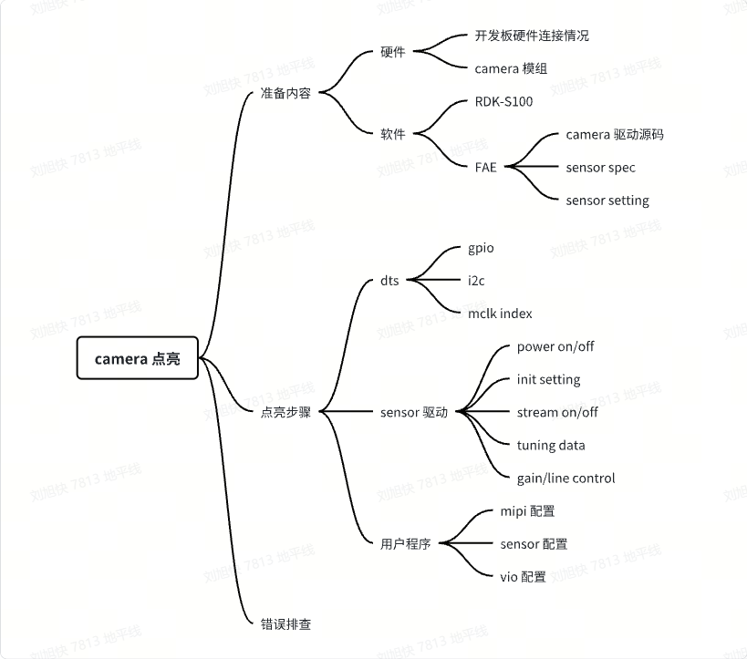
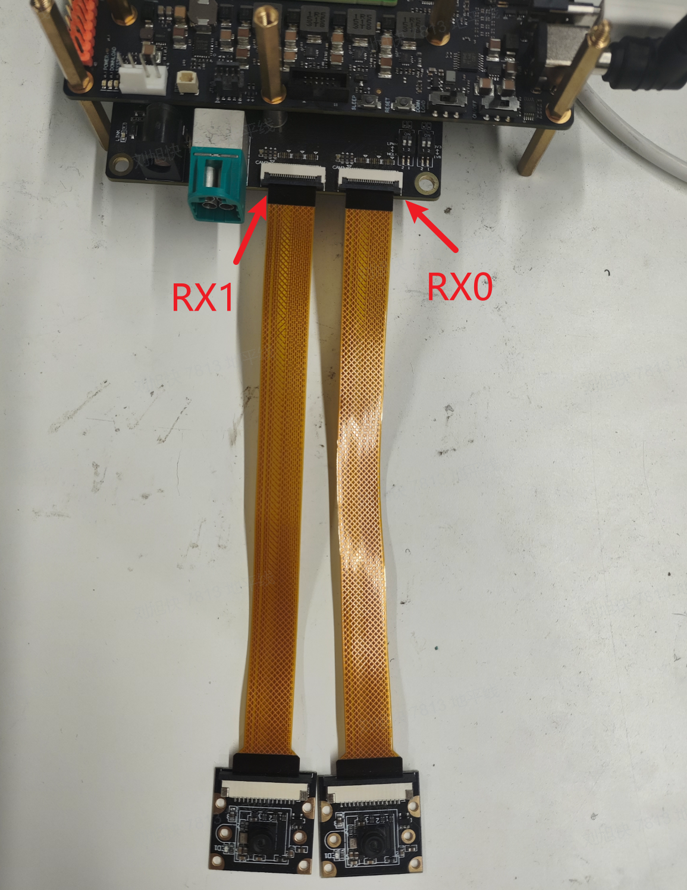
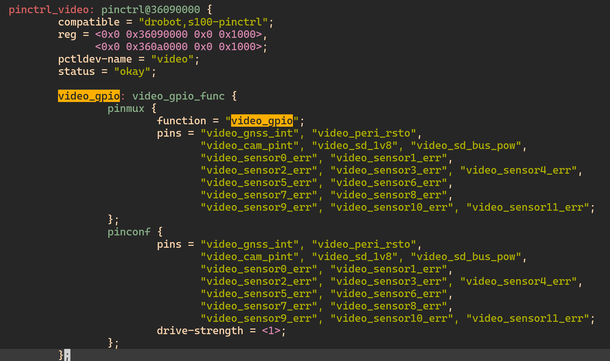
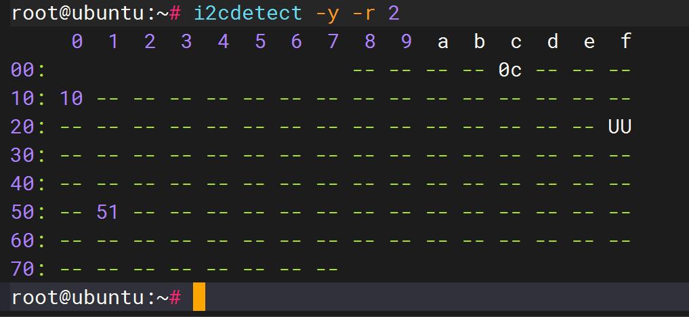
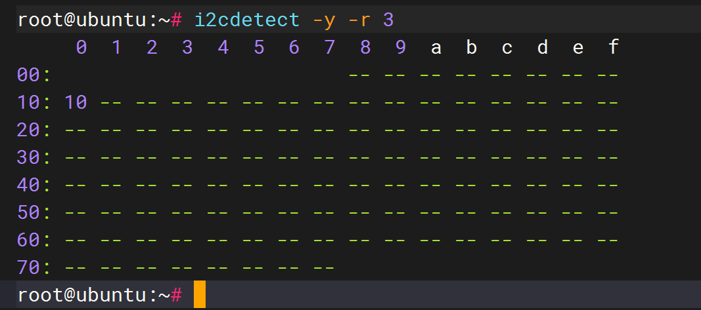
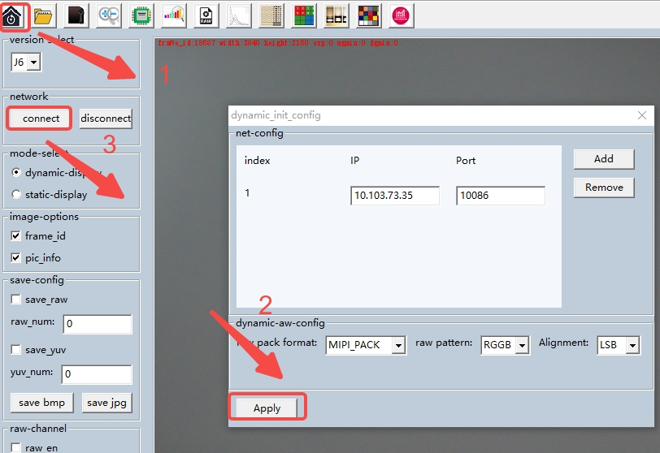
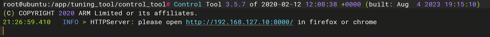
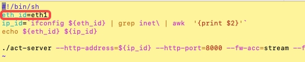
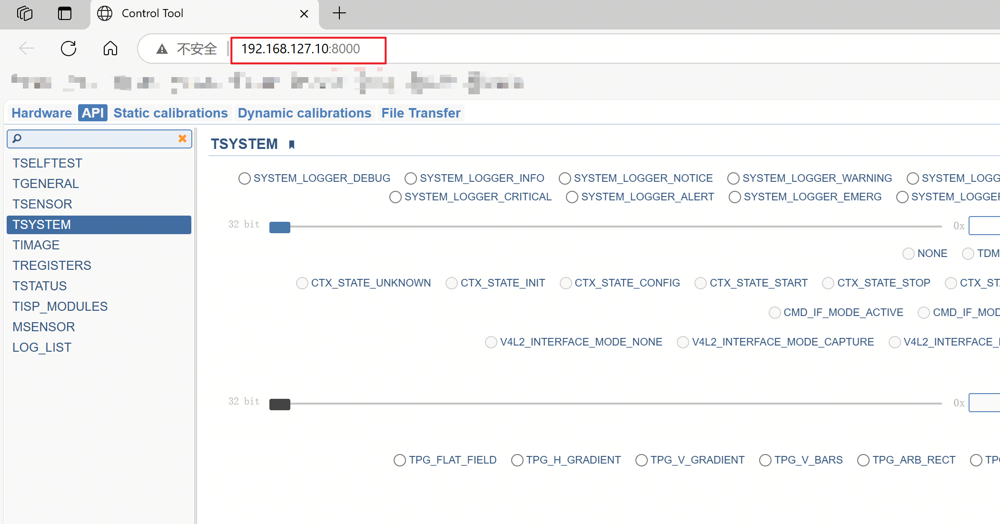

# Camera点亮

## 范围

本章节概述了 RDK-S100 camera bring up 的过程，用于帮助读者快速了解并掌握
RDK-S100 camera 框架，如何快速的新增 camera 配置，并点亮 camera。

该部分内容以 RDK-S100 开发板 + imx219 camera
模组为例，进行配置讲解，其他硬件平台或者 camera 模组以实际情况为准。



## 准备工作

硬件资源：RDK-S100 开发板、camera 模组。

软件资源：系统 SDK、camera 驱动源码、sensor datasheet、sensor 的 initialize
settings 等。

RDK-S100 开发板 camera 相关硬件资源如下：

| RDK-S100                       | MIPI host    | I2C   | gpio_en                          | gpio_lpwm_mclk                           | 其他                                                            |
|--------------------------------|------------------|-------|-----------------------------------|-----------------------------------|-----------------------------------------------------------------|
| RX0<br /> 可接 imx219 模组 | **0**<br />  4 lane | **1** | SPI1_CSN0<br />  gpio_number:502 | 可通过拨码开关进行选择<br />  • LPWM0_DOUT0<br />  gpio_number:456<br />  • mclk 24Mhz  | 注意： imx219 模组本身外接 24M 晶振，所以不需要 SOC 端输出 mclk |
| RX1<br /> 可接 imx219 模组 | **1**<br />   4 lane | **2** | SD_WPROT<br />  gpio_number:494 | 可通过拨码开关进行选择<br />  • LPWM0_DOUT1<br /> gpio_number:457<br />  • mclk 24Mhz  | 注意： imx219 模组本身外接 24M 晶振，所以不需要 SOC 端输出 mclk |
| RX4<br /> 用于接 serdes    | **4**<br />  4 lane | **3** | 暂无介绍                          | 暂无介绍                          | 解串器 max96712, addr: 0x29 poc: max20087, addr: 0x28           |

硬件连接示意图：




## 添加新 sensor 点亮步骤

RDK-S100 平台进行**新硬件**和**新 camera** 适配时，需要修改平台设备树
dts，camera 驱动库及相关配置文件即可，系统库一般无需改动。

### dts 修改

#### sensor gpio 配置

确保新硬件使用的 sensor gpio 在 drobot-s100-pinctrl.dtsi --\> pinctrl_video --\>
video_gpio节点中有配置，这样在开机启动时，系统才会将对应的 pin 设置为
gpio，用户程序方可以操作 pin。



vcon 是 RDK-S100 camera 用于管理 sensor 硬件相关的 dts 节点，如果 sensor
需要对应的时序才能正常启动，则需要在该节点中配置对应的
gpio。请根据硬件连接的实际情况配置，该相关信息可以从原理图及 pin list 中获取。

```c
// dts： 在对应 vcon node 中设置 gpio，注意 vcon 端口号与 mipi rx 端口号 一 一对应
// vcon0 -- RX0
// ....
// vcon3 -- RX3
&vin_vcon0 {
        bus = <2>;
        gpio_poc = <0>;
        gpio_des = <0>;
        sensor_err = <0>;
        //gpio_oth = <444 445>; // imx219 无需配置，所以这里是注释掉，为空
        lpwm_chn = <0 1 2 3>;
        rx_phy = <2 0>;
};
```

#### sensor i2c 配置

I2C bus number 需要在 dts vcon 中与 MIPI RX
端口进行绑定，请根据硬件连接的实际情况配置，该相关信息可以从原理图中获取。

```c
// 在对应 vcon 中设置 i2c bus，如 RX0 设置 I2C2
&vin_vcon0 {
        bus = <2>;
        gpio_poc = <0>;
        gpio_des = <0>;
        sensor_err = <0>;
        lpwm_chn = <0 1 2 3>;
        rx_phy = <2 0>;
};
```

#### mclk 配置

RDK-S100 底座硬件暂时不支持 SOC 输出的 mclk 连接到 sensor
模组，目前只支持外带晶振的模组。

#### dts 修改验证

一般 dts 配置正确，硬件正确连接后，保证 sensor 供电及 mclk 正常 ，便可以使用 i2cdetect 检测到模组的 i2c 地址。
通过 echo 命令进行控制 sensor 上电或者 reset （注：该说明使用 imx219模组无需操作 gpio）

```c
echo 502 > /sys/class/gpio/export
echo out > /sys/class/gpio/gpio502/direction
echo 1 > /sys/class/gpio/gpio502/value
echo 502 > /sys/class/gpio/unexport
```

使用 i2cdetect 检测 sensor i2c地址。如果检测到正确的地址，如下图所示，则表示 dts 配置正确，否则需要检查dts 配置。

|  |  |
|--------------------------------------|--------------------------------------|


### sensor 驱动文件添加

不同厂家的 sensor，都会搭配风格各异的 driver 和 setting。因此需要将原厂 sensor
驱动，转换成 RDK-S100 camera 驱动代码，并编译生成 so 库，然后将 so
库拷贝到设备的 /usr/hobot/lib/sensor/ 目录下。**需要说明的是，在 mipi start
之前，必须保证 sensor 没有开流。**

系统 SDK 目录 hobot-camera/drivers/sensor 下提供了 sensor 驱动模板文件
imx219_utility.c 以及适配过的其他 sensor 驱动，当添加新 camera sensor
支持时，可以仿照该部分文件进行修改。

```c
 #ifdef CAMERA_FRAMEWORK_HBN
 SENSOR_MODULE_F(imx219, CAM_MODULE_FLAG_A16D8);
 sensor_module_t imx219 = {
         .module = SENSOR_MNAME(imx219),
 #else
 sensor_module_t imx219 = {
         .module = "imx219",
 #endif
         .init = sensor_init,
         .start = sensor_start,
         .stop = sensor_stop,
         .deinit = sensor_deinit,
         .aexp_gain_control = sensor_aexp_gain_control,
         .aexp_line_control = sensor_aexp_line_control,
         .power_on = sensor_poweron,
         .power_off = sensor_poweroff,
         .userspace_control = sensor_userspace_control,
 };
```

如上代码所示，RDK-S100 camera 框架下的 sensor 驱动接口包含在 sensor_module_t
的结构体中，文件名、结构体名和 module 字段要统一，例如文件名为
imx219_utility.c，那么结构体名和 module 字段要统一为 imx219。对于新 sensor
点亮，下列函数需要用户自行实现：

• init：sensor 初始化、setting 下发

• deinit：sensor 去初始化

• start：sensor 开流

• stop：sensor 关流

• power on: sensor 上电

• power off: sensor 下电

• aexp_gain_control: sensor gain 增益控制

• aexp_line_control: sensor line 曝光控制

• userspace_control: 用户回调功能开启控制

对于 3A
控制，系统支持驱动注册和应用层回调两种方式，默认使用应用层回调函数的方式，接口定义如下：

| 函数              | 功能               | 传入参数                                                                                                                                                                                 |
|-------------------|--------------------|------------------------------------------------------------------------------------------------------------------------------------------------------------------------------------------|
| aexp_gain_control | sensor 增益控制    | info：sensor 总线信息 mode：senosr 运行模式；linear/hdr/pwl again：sensor again 参数，最大4个 dgain：sensor dgain 参数，最大4个 gain_num：sensor gain 参数个数                           |
| aexp_line_control | sensor 曝光控制    | info：sensor 总线信息 mode：senosr 运行模式；linear/hdr/pwl line：sensor line 参数，最大4个 line_num：sensor line 参数个数                                                               |
| awb_control       | sensor 端 awb 控制 | info：sensor 总线信息； mode：senosr 运行模式；linear/hdr/pwl rgain：sensor rgain bgain：sensor bgain grgain：sensor rrgain gbgain：sensor gbgain                                        |
| userspace_control | hal 层各类控制开关 | port：sensor 端口号 enable：使能用户回调控制开关，默认全部关闭。 位定义： \#define HAL_LINE_CONTROL 0x00000001 \#define HAL_GAIN_CONTROL 0x00000002 \#define HAL_AWB_CONTROL 0x00000004  |

如下代码是对 sensor 驱动主要结构体的初始化，需要根据每个 sensor
的实际情况来对应填写

```c
// sensor 实际输出的宽度
turning_data->sensor_data.active_width = 1920;
// sensor 实际输出的高度
turning_data.sensor_data.active_height = 1080;

// 每秒多少曝光行，计算公式为1/每行时间或者(fps*vts)，其中vts在不同sensor的里面的名字可能有所不同，
//可能是frame_length、vts等，但含义都是每帧的所含的总共行数，
//包括有效行和blanking。lines_per_second 亦可以理解成HMAX,需要注意的是有些sensor 无HMAX 概念
turning_data.sensor_data.lines_per_second = vts * sensor_info->fps;

// 短曝光最大曝光时间(短曝光每帧最大曝光行数),短曝光每帧最大曝光行数可以通过公式
//单帧曝光时间/单行曝光时间，
//即(1/fps)/(1/lines_per_second)
turning_data.sensor_data.exposure_time_max = vts;

// a_gain最大倍数，举一个例子，turning_data.sensor_data.analog_gain_max =126，
//最大倍率计算公式就是2^(X/32)，其中X就是126，X这个值每一个sensor厂家不一样，
//需要从sensor手册或者sensor厂家查找得到；最大倍率也可以这样得到：先获取sensor最大增益，
//然后查找J5-ISP的增益表，得到对应的索引值，该索引值就是最大倍率。
turning_data.sensor_data.analog_gain_max = 109;
turning_data.sensor_data.digital_gain_max = 0;

//短曝光最小曝光时间(短曝光每帧最小曝光行数)，
//每行的曝光时间可以用公式1秒/(帧率*(有效行+blank))即1/lines_per_second推算得出
turning_data.sensor_data.exposure_time_min = 1;

//长曝光最大曝光时间(长曝光每帧最大曝光行数)
turning_data.sensor_data.exposure_time_long_max = vts;

// 填充 sensor 位宽data_width、bayer_start(RGGB pattern start (R/Gr/Gb/B))、
// bayer_pattern(RGGB/RCCC/RIrGB/RGIrB) 信息
sensor_data_bayer_fill(&turning_data.sensor_data, 10, (uint32_t)BAYER_START_R, (uint32_t)BAYER_PATTERN_RGGB);

// 填充 exposure_max_bit_width(pwl mode bits ) 信息
sensor_data_bits_fill(&turning_data.sensor_data, 12);

// setting stream ctrl
// 开流、关流
turning_data.stream_ctrl.data_length = 1;

// again lut表，fireware根据index索引lut表，查找sensor对应的寄存器值，lut表区分a_gain/d_gain，
// lut表格大小：again_lut[again_control_num][256], dgain_lut[dgain_control_num][256]
turning_data.normal.again_lut = malloc(256 * sizeof(uint32_t));
if (turning_data.normal.again_lut != NULL)
{
    memset(turning_data.normal.again_lut, 0xff, 256 * sizeof(uint32_t));
    memcpy(turning_data.normal.again_lut, imx219_gain_lut,
           sizeof(imx219_gain_lut));
}

turning_data.normal.dgain_lut = malloc(256*sizeof(uint32_t));
if (turning_data.normal.dgain_lut != NULL) {
        memset(turning_data.normal.dgain_lut, 0xff, 256*sizeof(uint32_t));
        memcpy(turning_data.normal.dgain_lut, imx219_dgain_lut,
                sizeof(imx219_dgain_lut));
}
```

• turning_data.sensor_data.active_width：sensor 实际输出的宽度。

• turning_data.sensor_data.active_height：sensor 实际输出的高度。

• turning_data.sensor_data.analog_gain_max：a_gain
    最大倍数，举一个例子，turning_data.sensor_data.analog_gain_max
    =126，最大倍率计算公式就是2\^(X/32)，其中 X 就是 126，X这个值每一个 sensor
    厂家不一样，需要从 sensor 手册或者 sensor 厂家查找得到。

• turning_data.sensor_data.digital_gain_max：d_gain 最大倍数。

• turning_data.sensor_data.exposure_time_min：短曝光最小曝光时间(短曝光每帧最小曝光行数)，每行的曝光时间可以用公式1秒/(帧率\*(有效行+blank))即1/lines_per_second推算得出。

• turning_data.sensor_data.exposure_time_max：短曝光最大曝光时间(短曝光每帧最大曝光行数)，短曝光每帧最大曝光行数可以通过公式单帧曝光时间/单行曝光时间，即(1/fps)/(1/lines_per_second)。

• turning_data.sensor_data.exposure_time_long_max：长曝光最大曝光时间(长曝光每帧最大曝光行数)，HDR
    sensor 会用到。

• turning_data.sensor_data.lines_per_second：每秒多少曝光行，计算公式为1/每行时间或者(fps\*vts)，其中vts在不同
    sensor
    的里面的名字可能有所不同，可能是frame_length、vts等，但含义都是每帧的所含的总共行数，包括有效行和
    blanking。lines_per_second 亦可以理解成HMAX,需要注意的是有些 sensor 无 HMAX
    概念。

• turning_data.normal.again_lut：again lut 表，fireware 根据 index 索引 lut
    表，查找 sensor 对应的寄存器值，lut 表区分 a_gain/d_gain，lut
    表格大小：again_lut[again_control_num][256],
    dgain_lut[dgain_control_num][256]。

注意事项1：当某个 gain 值不存在时，该位填充 0xffffffff，分配 gain
时，程序会向下查找，直到可以查到可以分配的 gain，下发到 kernel 中的 lut
表需要是完成高低位转换，避免在 kernel 中进行，比如gain = 0x1234，写入寄存器
0x3012，0x3013，有些 sensor 在 0x3012 中写 0x12，有些 sensor 在 0x3013 中写
0x12，在 hal 中转换屏蔽该差异性；

注意事项2：lut 表示 [0,255] 共 256 gain 控制，转换公式为 2\^(x/32)，即实际的
gain 倍数为[2\^(0/32),2\^(255/32)]， gain 的控制曲线为 log 类型，即任何一颗
sensor 的 gain 的控制被离散为 256 个控制点，原因是现在 3a 的控制算法给出 256
个控制点，给出更多的控制点并不会提高 gain 的控制精度

camera 在 mipi start 之前，需要保证 sensor 没有开流，在 camera sensor init
settings 中进行更改。

```c
static uint32_t imx219_linear_init_setting[] = {
    ....
    // 0x0100,0x01,  // 在 setting 最后不包含 开流 的配置
}
```

当 sensor 驱动和 setting 编写完成后，拷贝 \*_utility.c 和 \*_setting.h 到 SDK
对应目录中，并重新编译 SDK 生成 sensor 驱动库，生成文件位于
out/deploy/rootfs/usr/hobot/lib/sensor 中。

一般代码结构没有问题，即使 tuning_data 参数配置有不当的地方，框架也能正常加载 sensor驱动。如果 logcat 有 sensor so check 失败或者加载失败，则需要检查代码结构，是否按照 HBN 框架来编写。


### 用户程序

参考 SDK 已有的用户程序，包含 CIM、ISP 的参数配置，这些配置需要根据具体的 sensor
的分辨率，帧率，数据格式进行配置。下面列出文件中需要单独配置的部分，其余部分可保持默认值，无需关注。

#### mipi 配置

| 字段                              | 描述                                                                                                               |
|-----------------------------------|--------------------------------------------------------------------------------------------------------------------|
| rx_enable                         | MIPI 接收(RX) 设备使能，使能对应的 MIPI RX 端口，默认填 1。 注意 该字段不是配置 MIPI RX 端口号，只是使能 MIPI RX。 |
| phy                               | 0: 代表 mipi dphy。                                                                                                |
| lane                              | mipi lane 数，目前每一个 MIPI RX 默认支持 4 lane。                                                                 |
| datatype                          | mipi 输入的数据格式，与 sensor 配置保持一致。 常见的如下： RAW8：0x2A RAW10: 0x2B RAW12: 0x2C YUV422 8-bit: 0x1E   |
| fps                               | 帧率，供计算 MIPI 一些配置使用，按照 sensor 输出帧率填写即可，可从 FAE 获取。                                      |
| mipiclk                           | mipi 总传输率 (所有 LANE)，可从 FAE 获取，一般 FAE 提供 sensor init setting 时有描述。                             |
| width                             | 输入图像 宽度 piexl。                                                                                              |
| height                            | 输入图像 高度 piexl。                                                                                              |
| linelenth                         | mipi linelenth， 根据 sensor 实际情况配置，可从sensor spec 寄存器读取，或者实际硬件测量。                          |
| framelenth                        | mipi framelenth， 根据 sensor 实际情况配置，可从sensor spec 寄存器读取，或者实际硬件测量。                         |
| settle                            | mipi settle， phy 的 settle 时间配置，可实际硬件测量。报 mipi phy 错时可调整， 0 - 120 范围。                      |
| channel_num                       | mipi 虚拟通道 number，linear mode 填 1，HDR DOL2 mode 填 2。                                                       |
| channel_sel[MIPIHOST_CHANNEL_NUM] | mipi 虚拟通道对应的 ipi channel。                                                                                  |

#### camera sensor 配置

| 字段                         | 描述                                                                                                                                                                                                                                                                                                                                                                                                                                                                                       |
|------------------------------|--------------------------------------------------------------------------------------------------------------------------------------------------------------------------------------------------------------------------------------------------------------------------------------------------------------------------------------------------------------------------------------------------------------------------------------------------------------------------------------------|
| name[CAMERA_MODULE_NAME_LEN] | camera 模组名称，需要和 sensor lib名称对应，如：sensor 驱动名称为：libimx219.so，那么 name 为 imx219                                                                                                                                                                                                                                                                                                                                                                                       |
| addr                         | sensor 设备地址，一般是 i2c 7位地址。                                                                                                                                                                                                                                                                                                                                                                                                                                                      |
| sensor_mode                  | sensor 工作模式： 1：NORMAL_M，linear 模式 2：DOL2_M，hdr 2帧合成1帧 3：DOL3_M，hdr 3帧合成1帧 4: DOL4_M，hdr 4帧合成1帧 5: PWL_M，hdr 模式 sensor 内部合成                                                                                                                                                                                                                                                                                                                                |
| gpio_enable                  | 是否使用 gpio 控制 camera sensor 的引脚，以满足 sensor 上下电的时序要求。如：使用 gpio 来控制 sensor XSHUTDN 引脚。**注意**：需要在 dts 中配置对应的 gpio number。 0: 不使用 gpio 来控制。  非 0: 使用 gpio 来控制 sensor，按照 bit 来使能 gpio 数量。 比如: 0x07 则代表使能 [a, b, c] 3 个 gpio。                                                                                                                                                                                         |
| gpio_level                   | 如果选择 gpio_enable_bit，则可以配置 gpio_level 来控制 sensor 引脚高低电平。某个 gpio bit 与 sensor 管脚高低电平关系如下： 0: 先输出低电平，sleep 1s (休眠时间可以在 sensor 驱动文件 power_on 函数中，通过 usleep 自行定义)，再输出高电平。 1: 先输出高电平，sleep 1s，再输出低电平 比如：0x05 = 101，从 bit0 到 bit2 分别代表 gpio a 先输出高电平，再输出低电平，gpio b 先输出低电平，再输出高电平，gpio c 先输出高电平，再输出低电平。 **注意**：需要根据 sensor spec 上电时序来自定义。 |
| fps                          | sensor 帧率配置                                                                                                                                                                                                                                                                                                                                                                                                                                                                            |
| width                        | sensor 出图宽度 pixel                                                                                                                                                                                                                                                                                                                                                                                                                                                                      |
| height                       | sensor 出图高度 piexl                                                                                                                                                                                                                                                                                                                                                                                                                                                                      |
| format                       | sensor mipi 数据类型，常见的如下： RAW8：0x2A RAW10: 0x2B RAW12: 0x2C YUV422 8-bit: 0x1E                                                                                                                                                                                                                                                                                                                                                                                                   |
| extra_mode                   | 模组索引配置，部分 sensor 驱动中会用到                                                                                                                                                                                                                                                                                                                                                                                                                                                     |
| config_index                 | 功能配置，部分 sensor 驱动中会用到                                                                                                                                                                                                                                                                                                                                                                                                                                                         |
| calib_lname                  | sensor 效果库路径，默认路径为 /usr/hobot/lib/sensor                                                                                                                                                                                                                                                                                                                                                                                                                                        |
| end_flag                     | 固定为 CAMERA_CONFIG_END_FLAG                                                                                                                                                                                                                                                                                                                                                                                                                                                              |

#### vio 配置

| 字段1 | 字段2                | 字段3                                 | 描述                                                                                                                                                                                                                                                                                                                                                                                                                                                                                                                                                                                                                                                                                                                                                                                                                                                                                                                                                                                                               |
|-------|----------------------|---------------------------------------|--------------------------------------------------------------------------------------------------------------------------------------------------------------------------------------------------------------------------------------------------------------------------------------------------------------------------------------------------------------------------------------------------------------------------------------------------------------------------------------------------------------------------------------------------------------------------------------------------------------------------------------------------------------------------------------------------------------------------------------------------------------------------------------------------------------------------------------------------------------------------------------------------------------------------------------------------------------------------------------------------------------------|
| VIN   | cim                  | mipi_en                               | 使能 mipi 接口                                                                                                                                                                                                                                                                                                                                                                                                                                                                                                                                                                                                                                                                                                                                                                                                                                                                                                                                                                                                     |
|       |                      | mipi_rx                               | mipi rx 端口号                                                                                                                                                                                                                                                                                                                                                                                                                                                                                                                                                                                                                                                                                                                                                                                                                                                                                                                                                                                                     |
|       |                      | vc_index                              | mipi virtual index，mipi 虚拟通道，默认填写 0 即可                                                                                                                                                                                                                                                                                                                                                                                                                                                                                                                                                                                                                                                                                                                                                                                                                                                                                                                                                                 |
|       |                      | ipi_channel                           | ipi channel number，linear mode 为 1， hdr mode dol2 为 2                                                                                                                                                                                                                                                                                                                                                                                                                                                                                                                                                                                                                                                                                                                                                                                                                                                                                                                                                          |
|       |                      | cim_isp_flyby                         | cim/sif online 到 isp。 0: sif offline 到 isp，数据经过 ddr。 1：sif online 到 isp，数据不经过 ddr。                                                                                                                                                                                                                                                                                                                                                                                                                                                                                                                                                                                                                                                                                                                                                                                                                                                                                                               |
|       | input channel        | format                                | vin format，sensor 输出 format                                                                                                                                                                                                                                                                                                                                                                                                                                                                                                                                                                                                                                                                                                                                                                                                                                                                                                                                                                                     |
|       |                      | width                                 | sensor 输出分辨率 宽度 pixel                                                                                                                                                                                                                                                                                                                                                                                                                                                                                                                                                                                                                                                                                                                                                                                                                                                                                                                                                                                       |
|       |                      | height                                | sensor 输出分辨率 高度 pixel                                                                                                                                                                                                                                                                                                                                                                                                                                                                                                                                                                                                                                                                                                                                                                                                                                                                                                                                                                                       |
|       | output channel / ddr | ddr_en                                | 数据是否 dump 到 DDR                                                                                                                                                                                                                                                                                                                                                                                                                                                                                                                                                                                                                                                                                                                                                                                                                                                                                                                                                                                               |
|       |                      | wstride                               | 设置为 0，驱动会自动计算 wstride。                                                                                                                                                                                                                                                                                                                                                                                                                                                                                                                                                                                                                                                                                                                                                                                                                                                                                                                                                                                 |
|       |                      | format                                | 下 ddr 时，设置的 sensor format                                                                                                                                                                                                                                                                                                                                                                                                                                                                                                                                                                                                                                                                                                                                                                                                                                                                                                                                                                                    |
|       |                      | buffers_num                           | cim/sif 下 ddr 的buffer number，设置为 1 - 6                                                                                                                                                                                                                                                                                                                                                                                                                                                                                                                                                                                                                                                                                                                                                                                                                                                                                                                                                                       |
|       |                      | flags                                 | 一般在程序设置                                                                                                                                                                                                                                                                                                                                                                                                                                                                                                                                                                                                                                                                                                                                                                                                                                                                                                                                                                                                     |
|       |                      |                                       | HB_MEM_USAGE_CPU_READ_OFTEN \| HB_MEM_USAGE_CPU_WRITE_OFTEN \| HB_MEM_USAGE_CACHED                                                                                                                                                                                                                                                                                                                                                                                                                                                                                                                                                                                                                                                                                                                                                                                                                                                                                                                                 |
| ISP   | base                 | hw_id 和 slot_id                      | CIM 硬件直连 ISP 情况： hw_id 需要与 cim 的 rx_index 一一对应。 在sched_mode配置为1的情况下，CIM online ISP slot_id 取值0 \~ 3，与cim vc_index一一对应。 在sched_mode配置为2的情况下，slot_id 固定为0，cim vc_index可视sensor实际接入情况设置为0 \~ 3。 CIM DDR 连接 ISP 情况： hw_id 无限制，可视 sensor 实际接入情况和项目需要选择hw_id。 slot id只需从4开始到11即可。 注意：在多路压力场景下，采用CIM DDR的连接方式情况时，大分辨率的sensor通路连接尽量选择slot id取值较小的ISP通道上，可保证对sensor实时控制。                                                                                                                                                                                                                                                                                                                                                                                                                                                                                                 |
|       |                      | sched_mode                            | ISP的工作模式， 1: 表示manual，软件调度的方式， 2: 表示passthru模式，全online独占ISP的工作模式。                                                                                                                                                                                                                                                                                                                                                                                                                                                                                                                                                                                                                                                                                                                                                                                                                                                                                                                   |
|       |                      | width                                 | 输入图像高度                                                                                                                                                                                                                                                                                                                                                                                                                                                                                                                                                                                                                                                                                                                                                                                                                                                                                                                                                                                                       |
|       |                      | height                                | 输入图像宽度                                                                                                                                                                                                                                                                                                                                                                                                                                                                                                                                                                                                                                                                                                                                                                                                                                                                                                                                                                                                       |
|       |                      | frame_rate                            | 输入帧率，无实际效果                                                                                                                                                                                                                                                                                                                                                                                                                                                                                                                                                                                                                                                                                                                                                                                                                                                                                                                                                                                               |
|       |                      | algo_state                            | 2a 的开关参数                                                                                                                                                                                                                                                                                                                                                                                                                                                                                                                                                                                                                                                                                                                                                                                                                                                                                                                                                                                                      |
|       | output channel       | stream_output_mode 和 axi_output_mode | isp 模式                                                                                                                                                                                                                                                                                                                                                                                                                                                                                                                                                                                                                                                                                                                                                                                                                                                                                                                                                                                                           |

### 板端运行程序

执行对应的测试程序

### isp 图像预览

**SDK 代码添加 tuning 程序**

修改 /app/tuning_tool/scripts/tuning_menu.sh 文件，仿照已有的
sensor，进行添加。

```c
ITEM_IMX219_RGGB="module:Raw10_IMX219_RDK-S100"
IMX219_RGGB_Raw10_IMX219_RDK-S100()
{
        IDESC="imx219 rggb raw10 RDK-S100"
        setup_case ${folder}/tuning_imx219_cim_isp_1080p
}
```

在 /app/tuning_tool/cfg/matrix 目录下建立 tuning_imx219_cim_isp_1080p
文件夹，并添加对应的 hb_j6dev.json mipi.json vpm_config.json 三个文件。

编译 SDK 系统代码，确保板端已经包含修改和添加的文件。

**板端执行 tuning 程序**

```c
cd /app/utils/tuning_tool/scripts
.bash run_tuning.sh 
# 按照交互页面提示，选择对应的 sensor
```

**图像预览**

打开 hbplayer，并设置网络地址（PC需要与板子可以ping通），点 apply 设置生效，并点
connect 则可以看到实时视频流。实时预览操作示意如图所示。



## 错误码

下面是 sensor 常见的错误码及简单的排查方向：

| 错误码 | 定义                        | 排查方向                                                        |
|--------|-----------------------------|-----------------------------------------------------------------|
| 203    | HB_CAM_INIT_FAIL            | sensor 初始化失败，一般可能 i2c 不通，配置的 sensor mode 不支持 |
| 205    | HB_CAM_START_FAIL           | sensor 启动失败，一般可能 i2c 不通，配置的 sensor mode 不支持   |
| 207    | HB_CAM_I2C_WRITE_FAIL       | sensor i2c 不通。                                               |
| 217    | HB_CAM_SENSOR_POWERON_FAIL  | sensor 上电失败，可能是 sensor gpio 配置错误。                  |
| 218    | HB_CAM_SENSOR_POWEROFF_FAIL | sensor 下电失败，可能是 sensor gpio 配置错误。                  |

## FAQ

5.1 **control-tool 使用说明**

进入tuning 目录，cd /app/tuning_tool/control_tool

按照交互界面提示，执行启动脚本 sh server_isp\*_8000.sh，ISP 硬件具有两个 IP
核，每个核可以单独运行，若需要启动 isp 的控制则运行脚本 sh server_isp0_8000.sh.

启动方式如图所示。



脚本会自动识别板子ip, 默认检查eth1网卡ip地址。若需要修改为启动eth0
网卡，修改脚本eth_id=eth0。修改位置如图所示。



修改通信地址示意图


