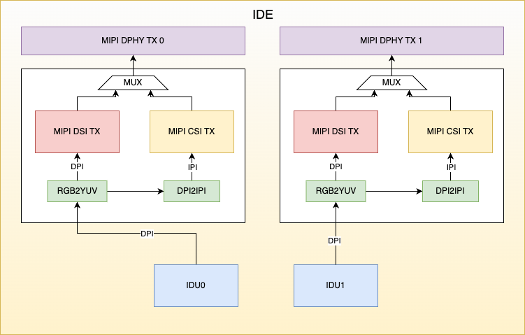
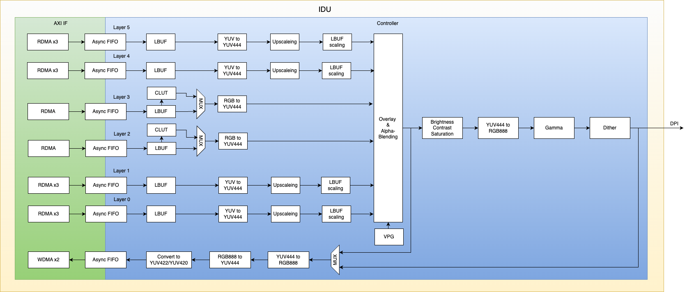

# 显示子系统

## IDE架构图

IDE（Image Display Engine）包含图像显示单元（Image Display
Unit）、图像数据输出模块（MIPI CSI2 Device和MIPI
DSI）。通过IDU从内存中读取图像数据进行处理，在IDE内部支持像素格式转换和像素结构转换，使IDU的输出数据能够通过MIPI
DSI和MIPI CSI2 Device两种方式输出，MIPI DSI和MIPI CSI2
Device两个控制器共用一个MIPI D-PHY



## IDU架构图

S100 有两个功能完全相同的IDU（Image Display Unit）硬件模块



## IDU支持的功能

-   IDU模块共支持6个通道，通道0、通道1、通道4、通道5作为YUV图层通道，通道2、通道3作为RGB图层通道

-   每个通道支持最大输入分辨率为2880x2160

-   6个通道都支持Crop功能，支持Crop宽高配置，支持crop顶点坐标配置

-   YUV图层支持UYVY Interleaved YUV422、VYUY Interleaved YUV422、YUYV
    Interleaved YUV422、YVYU Interleaved YUV422、UV Semi-planar YUV422、VU
    Semi-planar YUV422、UV Semi-planar YUV420、VU Semi-planar YUV420、Planar
    YUV422(YU YV)、Planar YUV422(YV YU)、Planar YUV420(YU YV)、Planar YUV420(YV
    YU)

-   RGB图层支持8-bpp (CLUT、调色盘)、RGB565、Unpacked RGB888、Packed
    RGB888、ARGB、RGBA。其中8-bpp格式沒有endian问题，RGB565、Unpacked
    RGB888、Packed
    RGB888只支持little-endian格式，ARGB、RGBA支持little-endian或big-endian格式。(主流图像格式皆为big-endian)

-   支持6个图层与背景（Background）层及光标（HW Cursor）进行叠加（Overlay &
    Alpha-Blending, Key-color），可配置a值和叠加层优先级

-   YUV图层支持Up-Scale，最大放大倍数6倍

-   输出支持Color-Adjust(对比度，饱和度，亮度，色度，gamma，Dithering)

-   支持回写功能，支持回写格式有：UYVY、VYUY、YUYV、YVYU、NV12、NV21、Unpacked
    RGB888

-   输出方式支持MIPI-CSI-TX或MIPI DSI

-   IDU输出支持RGB888、RGB565、RGB666，并支持通过RGB2YUV模块将IDU输出转换为YUV422、Ycbcr

-   最大pixel rate: 600MHz，最大输出分辨率: 3840x2160

## MIPI TX支持的功能

-   MIPI CSI TX控制器为CSI2.0

-   MIPI DSI控制器为DSI1.2

-   IDE中共有两路MIPI TX输出，可配置CSI或DSI输出，两种控制器共用一个D-PHY

-   MIPI D-PHY最大支持4 lanes x 2.5Gbps速率

## IDU的调试方法

### IDU的调试节点

-   使能寄存器配置跟踪信息：

```c
echo 1 > /sys/kernel/debug/idu_hw0/trace_log

echo 1 > /sys/kernel/debug/idu_hw1/trace_log
```

-   查看IDU配置信息：

```c
cat /sys/kernel/debug/idu_hw0/config

cat /sys/kernel/debug/idu_hw1/config
```

### IDU驱动debug日志开启方法

```c
echo -n "file hb_idu_hw.c +p" > /sys/kernel/debug/dynamic_debug/control
```

## MIPI CSI TX的调试方法

### MIPI CSI TX的调试节点

-   查看MIPI CSI TX配置信息：

```c
cat /sys/kernel/debug/mipi_csi_dev0/config

cat /sys/kernel/debug/mipi_csi_dev1/config
```

### MIPI CSI TX驱动debug日志开启方法

```c
echo -n "file hb_mipi_csi_device_debug.c +p" > /sys/kernel/debug/dynamic_debug/control
```

## MIPI DSI的调试方法

### MIPI DSI的调试节点

-   查看MIPI DSI配置信息：

```c
cat /sys/kernel/debug/mipi_dsi_host0/config

cat /sys/kernel/debug/mipi_dsi_host1/config
```

### MIPI DSI驱动debug日志开启方法

```c
echo -n "file hb_mipi_dsi_host_ops.c +p" > /sys/kernel/debug/dynamic_debug/control
```
