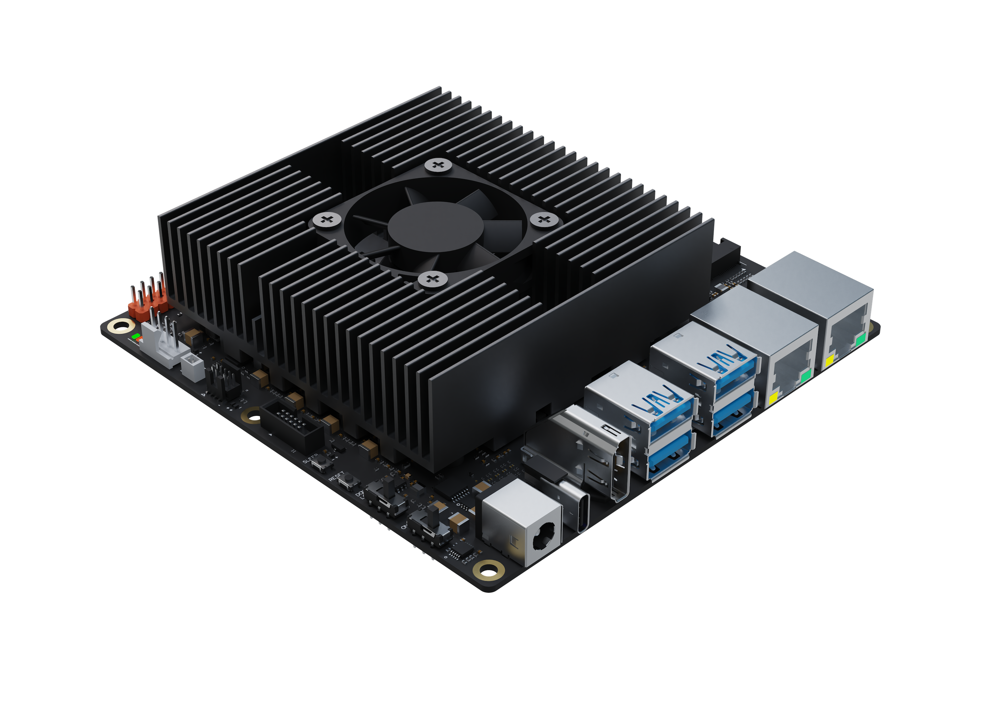

# D-Robotics RDK 套件

本文档为 D-Robotics RDK 套件 Super 系列的用户手册，为开发者提供关于 RDK S100、RDK S100P 等产品的使用说明和开发指导，内容涵盖硬件设计、系统定制、应用开发、算法工具链等多个方面。欢迎用户使用，具体方法请参考**系统烧录**章节。

:::info 注意
用户如需确认系统版本号，可通过该命令查询 `cat /etc/version`, 2.1.0 及以上版本可以通过 `rdkos_info` 命令查看具体的版本信息。
:::

## D-Robotics RDK 套件概述

**D-Robotics Developer Kits**，简称 RDK 套件，是基于 D-Robotics 智能芯片打造的机器人开发者套件，套件涵盖以下硬件产品：

- RDK X3（旭日 X3 派）
- RDK X3 Module（旭日 X3 模组）
- RDK X5
- RDK Ultra
- RDK S100

搭配 TogetheROS.Bot 机器人中间件，RDK 套件可以帮助发者快速搭建机器人原型，开展评测和验证工作。

本文将详细说明 RDK S100、RDK S100P 套件的使用方法，包括开发环境搭建、示例教程的运行、应用程序的开发、系统镜像的定制等方面内容。无论您选择使用哪种硬件，本文所介绍的内容都将为您提供一致的使用体验。

## 产品介绍

**RDK S100** 是一款高性能开发套件，具有 80Tops 端侧推理算力与 6 核 ARM A78AE 处理能力，支持 2 路 MIPI Camera 接入，4 路 USB3.0 接口，2 路 PCIe3.0 接口，充分满足各类场景的使用需求。

## 文档使用指引

下面将对用户手册的整体内容划分进行介绍，帮助用户快速了解文档的结构和内容，以便更好地利用文档进行开发、学习工作。

**一、快速开始**
介绍系统安装，硬件接口使用的入门说明，帮助用户快速上手使用开发板。

**二、系统配置**
介绍一系列配置步骤和技巧，以确保系统能够正常工作并满足特定的需求，引导用户进行系统的配置，包括系统升级、网络、蓝牙的配置。

**三、基础应用开发**
介绍系统中预装的功能示例，如 IO 管脚控制、音视频采集，多媒体初步使用等。

**四、算法应用开发**
介绍 Python 和 C++两种语言版本的算法简易接口的使用方法，此接口简单易用，方便用户快速上手，基于更底层的推理接口进行了封装，并提供基础的使用示例。

**五、机器人应用开发**
向机器人厂商和生态开发者推出的机器人操作系统，旨在释放机器人场景的智能潜能，助力生态开发者和商业客户能够高效、便捷的进行机器人开发，打造具有竞争力的智能机器人产品。

**六、应用开发指南**
包含了深度学习寻线小车、AMR 开发指南，大模型应用等多方面的应用开发指南。

**七、进阶开发**
完整的介绍了硬件开发、系统开发、多媒体应用开发以及算法开发指南，涵盖了硬件设计，系统配置编译，多媒体使用与调试，算法训练与量化上板的开发流程，接口功能丰富，可以实现复杂、灵活的功能需求。

**八、常见问题**
本章节回答了用户在使用开发者套件过程中可能遇到的常见问题和疑惑。它提供了解决方案和技巧，帮助用户解决常见问题并顺利进行开发工作。

**九、附录**
本章节提供 RDK OS 中常用的命令用法，其中 RDK 专属命令可以帮助用户获取、查询系统的一些关键信息。

## 版本发布记录
