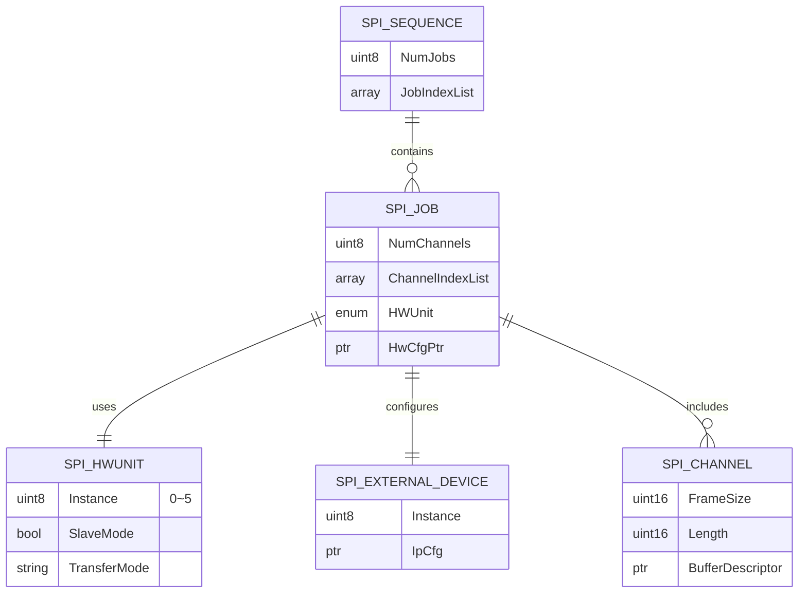

# SPI User Guide

## Hardware Support

- If SPI uses DMA transfer, the following restrictions must be observed:
    - Transfer length must be 8-byte aligned; otherwise, data out-of-bounds issues may occur;
    - The buffer addresses for sending and receiving data must be 64-byte aligned;
    - The amount of data transferred per channel cannot exceed 4096 bytes;
- SPI Slave functionality is supported;
- When MCU-side SPI operates as Slave with a rate greater than 9M, only DMA mode can be used;
- When MCU-side SPI operates in 8-bit mode, it has the following limitations:
    - Maximum speed for 1 SPI parallel transmission/reception: 50M;
    - Maximum speed for 2 SPI parallel transmission/reception: 33.3M;
    - Maximum speed for 3 SPI parallel transmission/reception: 25M;
    - Maximum speed for 4 SPI parallel transmission/reception: 20M;
    - Maximum speed for 5 SPI parallel transmission/reception: 15.6M;
    - Maximum speed for 6 SPI parallel transmission/reception: 12.5M;
- SPI peripheral only supports MSB;
- SPI SpiCsPolarity and spi time clk2c are not configurable; SpiCsPolarity defaults to active low.
- After enabling the SPI SpiCsToggleEnable configuration, the CS pin will be pulled high after transmitting one frame. Only TRAILING mode is supported; LEADING mode is not supported.
- Compared to non-DMA mode, SPI DMA mode consumes lower CPU load.
- When SPI transmits data in non-DMA mode, if the system load is high, the SPI interrupt may not be serviced promptly, causing a failure to write to the SPI FIFO in time, which can result in a brief pull-high of the CS pin. In this scenario, DMA mode is recommended.
- If the usage scenario involves asynchronous transmissions using the same SPI IP across multiple sequences, and there is no specific completion order between sequences, sequence transmission queuing will occur. In this case, critical section protection via interrupt disabling needs to be implemented in the `SchM_Spi.c` file.

## Code Paths

- `McalCdd/Spi/inc/Spi.h` - SPI driver header file
- `McalCdd/Spi/inc/Spi_Lld.h` - SPI low-level driver header file
- `McalCdd/Spi/src/Spi.c` - SPI driver source file
- `McalCdd/Spi/src/Spi_Lld.c` - SPI low-level driver source file
- `McalCdd/Common/Register/inc/Spi_Register.h` - SPI register definition file
- `Platform/Schm/SchM_Spi.h` - SPI module scheduler management header file
- `Config/McalCdd/gen_s100_sip_B_mcu1/Spi/inc/Spi_Cfg.h` - SPI configuration header file
- `Config/McalCdd/gen_s100_sip_B_mcu1/Spi/inc/Spi_PBcfg.h` - SPI PB configuration header file
- `Config/McalCdd/gen_s100_sip_B_mcu1/Spi/src/Spi_PBcfg.c` - SPI PB configuration source file
- `samples/Spi/SPI_sample/Spi_sample.c` - SPI sample code

## Application Sample

### Software Operation Flow

The general software operation flow is as follows:

1.  **Initialization**
    - Modify configuration structures such as `ChannelCfgArrayPtr`, `JobCfgArrayPtr`, `SeqCfgArrayPtr`, `HwCfgPtr`, `PhyCfgPtr`, etc. Configure the corresponding SPI instance with the desired baud rate and transmission mode. Refer to the SPI configuration explanation in [Spi Configuration Description](./06_mcu_spi.md#spi_config).
    - Call `Spi_Init(&Spi_Config)` or `Spi_Init(NULL)`. When passing `NULL`, the default configuration in `Spi_PBcfg.c` is used.
    - The driver iterates, initializing internal data structures (such as `Spi_ChannelState`, `Spi_JobState`, `Spi_HwQueueArray`, etc.) and the physical SPI hardware unit (setting registers according to `Spi_PhyCfgType` and `Spi_IpCfg`) based on the configuration information.

2.  **Set Transmission Mode**:
    - The application selects whether to use interrupt mode or polling mode via `Spi_SetAsyncMode()`.

3.  **Data Preparation**:
    - The application places the data to be sent into the buffer associated with the channel using `Spi_WriteIB()` or `Spi_SetupEB()`.

4.  **Transmission Request**:
    - The application calls `Spi_AsyncTransmit(sequence)` or `Spi_SyncTransmit(sequence)` to initiate the transmission of a sequence.

5.  **Driver Processing**:
    - The driver finds the corresponding `Spi_SeqCfg` based on the `sequence ID`.
    - Retrieves the job list according to `Spi_SeqCfg.JobIndexList`.
    - For each job in the sequence:
        - Determines the physical SPI hardware unit to use based on `Spi_JobCfg.HWUnit`.
        - Obtains the communication parameters for the external device corresponding to the job via `Spi_JobCfg.HwCfgPtr`.
        - Retrieves the channel list based on `Spi_JobCfg.ChannelIndexList`.
        - Iterates through the channel list, obtaining transmission data from the buffer pointed to by `Spi_ChannelCfg.BufferDescriptor`.
        - Configures the physical SPI hardware unit.
        - Starts the hardware transmission.

6.  **Transmission Completion**:
    - For asynchronous transmission, after the hardware completes the transfer (detected via interrupt or polling), the driver calls the corresponding notification function.
    - For synchronous transmission, the function waits for the transfer to complete.

7.  **Status Query**:
    - The application can query the transmission status using functions like `Spi_GetJobResult()`, `Spi_GetSequenceResult()`, etc.

:::tip
- SPI only needs to configure `set_AsyncMode()` once after `INIT`. Repeated calls will cause transmission anomalies.
- When a transmission anomaly occurs, the SPI state machine does not reset automatically. You need to manually call the `Spi_Cancel()` function to reset the transmission state machine.
- The sample uses DMA but does not perform initialization because it is already completed in the `Target/Target-hobot-lite-freertos-mcu1/target/HorizonTask.c` file.
:::

### Single Chip Select Usage Example

The `spi_test` command is used to test SPI (Serial Peripheral Interface) functionality. This command supports initialization and parameter setting, displaying current parameters, and performing SPI data transfer tests.

**Command Syntax**
```bash
spi_test <operation> [bus_id] [sync_mode] [trans_mode]
```

**Parameter Description**
- `operation`: Specifies the operation to perform.
    - `0`: Initialize and set parameters.
    - `1`: Display currently set parameters.
    - `2`: Execute SPI test (asynchronous or synchronous).
- `bus_id` (Required only when `operation` is 0): Specifies the SPI bus to use.
    - Value Range: `2` to `6`, corresponding to SPI2 to SPI6 respectively.
- `sync_mode` (Required only when `operation` is 0): Specifies the synchronization mode for SPI communication.
    - `0`: Asynchronous mode (async)
    - `1`: Synchronous mode (sync)
- `trans_mode` (Required only when `operation` is 0): Specifies the underlying mechanism for SPI data transfer.
    - `0`: Polling mode (polling)
    - `1`: Interrupt mode (interrupt)

:::tip
The application layer configuration must be consistent with the underlying configuration; otherwise, errors will occur.
:::

Using SPI3 as an example, short the MISO and MOSI pins of SPI3, and run the following command to set transmission parameters:
```shell
D-Robotics:/$ spi_test 0 3 0 0
[055.578172 0]Init&&Parameter setting
[055.578428 0]Show Spi parameter
[055.578792 0]spi_bus = 3
[055.579085 0]sync_mode = async
[055.579443 0]trans_mode = polling
```
Run the following command to test:
```shell
D-Robotics:/$ spi_test 2
[059.643996 0]Sequence: 1, transfer_length = 128 spi_framesize = 16
[059.673978 0]
RxChBuf0 (256 bytes):
0CBD2A80: 00 01 02 03 04 05 06 07 08 09 0A 0B 0C 0D 0E 0F  | ................
0CBD2A90: 10 11 12 13 14 15 16 17 18 19 1A 1B 1C 1D 1E 1F  | ................
0CBD2AA0: 20 21 22 23 24 25 26 27 28 29 2A 2B 2C 2D 2E 2F  |  !"#$%&'()*+,-./
0CBD2AB0: 30 31 32 33 34 35 36 37 38 39 3A 3B 3C 3D 3E 3F  | 0123456789:;<=>?
0CBD2AC0: 40 41 42 43 44 45 46 47 48 49 4A 4B 4C 4D 4E 4F  | @ABCDEFGHIJKLMNO
0CBD2AD0: 50 51 52 53 54 55 56 57 58 59 5A 5B 5C 5D 5E 5F  | PQRSTUVWXYZ[\]^_
0CBD2AE0: 60 61 62 63 64 65 66 67 68 69 6A 6B 6C 6D 6E 6F  | `abcdefghijklmno
0CBD2AF0: 70 71 72 73 74 75 76 77 78 79 7A 7B 7C 7D 7E 7F  | pqrstuvwxyz{|}~.
0CBD2B00: 80 81 82 83 84 85 86 87 88 89 8A 8B 8C 8D 8E 8F  | ................
0CBD2B10: 90 91 92 93 94 95 96 97 98 99 9A 9B 9C 9D 9E 9F  | ................
0CBD2B20: A0 A1 A2 A3 A4 A5 A6 A7 A8 A9 AA AB AC AD AE AF  | ................
0CBD2B30: B0 B1 B2 B3 B4 B5 B6 B7 B8 B9 BA BB BC BD BE BF  | ................
0CBD2B40: C0 C1 C2 C3 C4 C5 C6 C7 C8 C9 CA CB CC CD CE CF  | ................
0CBD2B50: D0 D1 D2 D3 D4 D5 D6 D7 D8 D9 DA DB DC DD DE DF  | ................
0CBD2B60: E0 E1 E2 E3 E4 E5 E6 E7 E8 E9 EA EB EC ED EE EF  | ................
0CBD2B70: F0 F1 F2 F3 F4 F5 F6 F7 F8 F9 FA FB FC FD FE FF  | ................
[059.687954 0]
TxChBuf0 (256 bytes):
0CBD2B80: 00 01 02 03 04 05 06 07 08 09 0A 0B 0C 0D 0E 0F  | ................
0CBD2B90: 10 11 12 13 14 15 16 17 18 19 1A 1B 1C 1D 1E 1F  | ................
0CBD2BA0: 20 21 22 23 24 25 26 27 28 29 2A 2B 2C 2D 2E 2F  |  !"#$%&'()*+,-./
0CBD2BB0: 30 31 32 33 34 35 36 37 38 39 3A 3B 3C 3D 3E 3F  | 0123456789:;<=>?
0CBD2BC0: 40 41 42 43 44 45 46 47 48 49 4A 4B 4C 4D 4E 4F  | @ABCDEFGHIJKLMNO
0CBD2BD0: 50 51 52 53 54 55 56 57 58 59 5A 5B 5C 5D 5E 5F  | PQRSTUVWXYZ[\]^_
0CBD2BE0: 60 61 62 63 64 65 66 67 68 69 6A 6B 6C 6D 6E 6F  | `abcdefghijklmno
0CBD2BF0: 70 71 72 73 74 75 76 77 78 79 7A 7B 7C 7D 7E 7F  | pqrstuvwxyz{|}~.
0CBD2C00: 80 81 82 83 84 85 86 87 88 89 8A 8B 8C 8D 8E 8F  | ................
0CBD2C10: 90 91 92 93 94 95 96 97 98 99 9A 9B 9C 9D 9E 9F  | ................
0CBD2C20: A0 A1 A2 A3 A4 A5 A6 A7 A8 A9 AA AB AC AD AE AF  | ................
0CBD2C30: B0 B1 B2 B3 B4 B5 B6 B7 B8 B9 BA BB BC BD BE BF  | ................
0CBD2C40: C0 C1 C2 C3 C4 C5 C6 C7 C8 C9 CA CB CC CD CE CF  | ................
0CBD2C50: D0 D1 D2 D3 D4 D5 D6 D7 D8 D9 DA DB DC DD DE DF  | ................
0CBD2C60: E0 E1 E2 E3 E4 E5 E6 E7 E8 E9 EA EB EC ED EE EF  | ................
0CBD2C70: F0 F1 F2 F3 F4 F5 F6 F7 F8 F9 FA FB FC FD FE FF  | ................
[059.702104 0]=====SPI ASYNC TEST SUCCESS=====
```

### Dual Chip Select Usage Example

The `SpiTest_Mul_cs` command is used to test SPI functionality.

The usage and parameter parsing are as follows:
```shell
########################## support test case: ##########################
usage: SpiTest_Mul_cs Case_num Sequences Cs DataWidth DataLen Loop_times
[1]: SpiTest_Mul_cs 1 1 0 8 1 1 -- get versioninfo
[2]: SpiTest_Mul_cs 2 5 0 8 10 1 -- InterruptMode Sync Transfer
[3]: SpiTest_Mul_cs 3 5 0 8 10 1 -- PollingMode Sync Transfer
[4]: SpiTest_Mul_cs 4 5 0 8 10 1 -- InterruptMode Async Transfer
[5]: SpiTest_Mul_cs 5 5 0 8 10 1 -- PollingMode Async Transfer
other: SpiTest 110  -- help
```
- Parameter Parsing:
    - `Case_num` (argv[1]): Specifies the operation to perform. Supports 5 modes. For interrupt asynchronous transfer, set `Case_num` to 4.
    - `Sequences` (argv[2]): Specifies which SPI bus to use. For using spi4, set the `Sequences` parameter to 4.
    - `Cs` (argv[3]): Indicates which chip select line to use. For using cs0, set the `Cs` parameter to 0.
    - `DataWidth` (argv[4]): Indicates the data transfer width. For 8-bit width, set `DataWidth` to 8.
    - `DataLen` (argv[5]): Indicates the amount of data to transfer. For transferring 10 data groups, set `DataLen` to 10.
    - `Loop_times` (argv[6]): Indicates the number of test iterations. For testing 5 times, set `Loop_times` to 5.
- Example:
    - SPI4, async interrupt transfer, cs1, 8-bit data width, 10 data groups, test 1 time: `SpiTest_Mul_cs 4 4 1 8 10 1`

Short the MISO and MOSI pins of SPI4, and run the following command:
```shell
Robotics:/$ SpiTest_Mul_cs 4 4 1 8 10 1
[get_spi_status 98] [INFO]: SPI status: SPI_IDLE
[SpiTest_Mul_cs 450] [INFO]: ####################### test_case_num: 4 #######################
############################# Loop Times: 1 #############################
[Spi_Trans_Test 231] [INFO]: data_tx: 0xcbccc40, data_rx: 0xcbcca40
[Spi_Trans_Test 238] [INFO]: len = 10, check_data_len = 10
[get_spi_sequence_result 122] [INFO]: SPI result: SPI_SEQ_PENDING
TX | 00 01 02 03 04 05 06 07 08 09 __ __ __ __ __ __ __ __ __ __ __ __ __ __ __ __ __ __ __ __ __ __
RX | 00 01 02 03 04 05 06 07 08 09 __ __ __ __ __ __ __ __ __ __ __ __ __ __ __ __ __ __ __ __ __ __
[check_data 81] [INFO]: check data success.
[Spi_Interrupt_Async_Transfer_Test 353] [INFO]: Transfer success.
[SpiTest_Mul_cs 474] [INFO]: Test case pass.
[SpiTest_Mul_cs 479] [INFO]: #####################################################################

```

### Configuration File Description{#spi_config}

The configuration file `Spi_PBcfg.c` contains the SPI driver configuration. `Spi_ConfigType` is the top-level container that organizes all configuration information (channels, jobs, sequences, hardware units, etc.) into a complete configuration set used for initializing the SPI driver.

```c
/**
 * @struct Spi_ConfigType
 * @NO{S01E17C01}
 * @brief This is the top level structure containing all the
 *         needed parameters for the SPI Handler Driver.
 */
typedef struct
{
    uint32 SpiCoreUse;                                  /**< CoreID used*/
    const Spi_ChannelCfgArray *ChannelCfgArrayPtr;      /**< Pointer to Array of channels defined in the configuration.*/
    const Spi_JobCfgArray *JobCfgArrayPtr;              /**< Pointer to Array of jobs defined in the configuration.*/
    const Spi_SeqCfgArray *SeqCfgArrayPtr;              /**< Pointer to Array of sequences defined in the configuration.*/
    const Spi_HwCfgArray *HwCfgPtr;                     /**< External device unit attributes.*/
    const Spi_PhyCfgArray *PhyCfgPtr;                   /**< Pointer to Array of device instances.*/
    Spi_ChannelType SpiMaxChannel;                      /**< Number of channels defined in the configuration.*/
    Spi_JobType SpiMaxJob;                              /**< Number of jobs defined in the configuration.*/
    Spi_SequenceType SpiMaxSequence;                    /**< Number of sequences defined in the configuration.*/
    Spi_HwNumType SpiMaxHwNum;                          /**< Number of Spi HW defined in the configuration.*/
#if (SPI_DISABLE_DEM_REPORT_ERROR_STATUS == STD_OFF)
    const Mcal_DemErrorType SpiErrorHwCfg;        /**< SPI Driver DEM Error: SPI_E_HARDWARE_ERROR.*/
#endif
} Spi_ConfigType;
```

**Member Explanation**

1.  **SpiCoreUse**: Specifies which CPU core can use this SPI configuration. For single-core systems, the default value can be kept.
2.  **ChannelCfgArrayPtr**: Pointer to an array containing all `Spi_ChannelCfg` configurations. This array defines the attributes of all available SPI channels in the system, such as buffer type (IB/EB), frame size, default value, buffer pointer, etc.
3.  **JobCfgArrayPtr**: Pointer to an array containing all `Spi_JobCfg` configurations. This array defines the attributes of all available SPI jobs in the system, such as the list of included channels, notification function, priority, associated physical unit (HWUnit), etc.
4.  **SeqCfgArrayPtr**: Pointer to an array containing all `Spi_SeqCfg` configurations. This array defines the attributes of all available SPI sequences in the system, such as the list of included jobs, notification function, interruptibility, etc.
5.  **HwCfgPtr**: Pointer to an array containing all `Spi_HwCfg` configurations. This array defines the hardware attributes of all external devices in the system, primarily communication-related parameters (such as baud rate, clock polarity, chip select, etc.).
6.  **PhyCfgPtr**: Pointer to an array containing all `Spi_PhyCfgType` configurations. This array defines the basic operating modes and characteristics of all physical SPI hardware units (Physical SPI Unit, PhyUnit) in the system (e.g., master/slave mode, DMA usage, transfer mode, etc.).
7.  **SpiMaxChannel**: The total number of channels defined in the configuration. Used for size allocation and boundary checks of internal driver arrays.
8.  **SpiMaxJob**: The total number of jobs defined in the configuration. Used for size allocation and boundary checks of internal driver arrays.
9.  **SpiMaxSequence**: The total number of sequences defined in the configuration. Used for size allocation and boundary checks of internal driver arrays.
10. **SpiMaxHwNum**: The number of physical SPI hardware units (PhyUnit) involved in the configuration. Used for size allocation and boundary checks of internal driver arrays.
11. **SpiErrorHwCfg**: Used to configure parameters for reporting SPI hardware errors.

**Relationships Between Members**

The application typically initiates transmission by calling `Spi_AsyncTransmit()` or `Spi_SyncTransmit()` with a sequence ID. Therefore, the sequence is the user's direct interaction entry point. The simplified entity relationship between sequences, jobs, channels, hardware configurations, and physical unit configurations is as follows:



Both `SPI_HWUNIT` and `SPI_EXTERNAL_DEVICE` need to be associated with a hardware instance (Instance), which determines which SPI interface is used for communication. As the RDKS100 platform provides a total of 8 SPI controllers, with 2 in the MAIN domain (SPI0, SPI1) and 6 in the MCU domain (SPI2 to SPI7), the SPI instances in the MCU domain are numbered starting from SPI2. The table below uses <font color='green'>**green**</font> text to show the mapping between SPI sequence configurations (Spi SeqCfg) and the corresponding hardware resources (Spi BusId, HWUnit, Instance).

| **SPI SeqCfg**   | <font color='green'>**Spi BusId**</font> | <font color='green'>**HWUnit**</font> | <font color='green'>**Instance**</font> | **Spi Baudrate** | **Spi Cs** | **Frame size** |
| :--------------- | :------------------------------------- | :------------------------------------ | :-------------------------------------- | :--------------- | :--------- | :------------- |
| SpiSequence_0    | <font color='green'>SPI2</font>        | <font color='green'>CSIB0</font>      | <font color='green'>0</font>            | 2000000          | CS0        | 16 bit         |
| SpiSequence_1    | <font color='green'>SPI3</font>        | <font color='green'>CSIB1</font>      | <font color='green'>1</font>            | 2000000          | CS0        | 16 bit         |
| SpiSequence_2    | <font color='green'>SPI4</font>        | <font color='green'>CSIB2</font>      | <font color='green'>2</font>            | 1000000          | CS0        | 8 bit          |
| SpiSequence_3    | <font color='green'>SPI5</font>        | <font color='green'>CSIB3</font>      | <font color='green'>3</font>            | 1000000          | CS0        | 8 bit          |
| SpiSequence_4    | <font color='green'>SPI5</font>        | <font color='green'>CSIB3</font>      | <font color='green'>3</font>            | 1000000          | CS0        | 16 bit         |
| SpiSequence_5    | <font color='green'>SPI6</font>        | <font color='green'>CSIB4</font>      | <font color='green'>4</font>            | 1000000          | CS0        | 8 bit          |
| SpiSequence_6    | <font color='green'>SPI7</font>        | <font color='green'>CSIB5</font>      | <font color='green'>5</font>            | 1000000          | CS0        | 8 bit          |
| SpiSequence_7    | <font color='green'>SPI2</font>        | <font color='green'>CSIB0</font>      | <font color='green'>0</font>            | 2000000          | CS1        | 16 bit         |
| SpiSequence_8    | <font color='green'>SPI3</font>        | <font color='green'>CSIB1</font>      | <font color='green'>1</font>            | 2000000          | CS1        | 16 bit         |
| SpiSequence_9    | <font color='green'>SPI4</font>        | <font color='green'>CSIB2</font>      | <font color='green'>2</font>            | 1000000          | CS1        | 8 bit          |
| SpiSequence_10   | <font color='green'>SPI5</font>        | <font color='green'>CSIB3</font>      | <font color='green'>3</font>            | 1000000          | CS1        | 8 bit          |
| SpiSequence_11   | <font color='green'>SPI5</font>        | <font color='green'>CSIB3</font>      | <font color='green'>3</font>            | 1000000          | CS1        | 16 bit         |
| SpiSequence_12   | <font color='green'>SPI6</font>        | <font color='green'>CSIB4</font>      | <font color='green'>4</font>            | 1000000          | CS1        | 8 bit          |
| SpiSequence_13   | <font color='green'>SPI7</font>        | <font color='green'>CSIB5</font>      | <font color='green'>5</font>            | 1000000          | CS1        | 8 bit          |

:::tip
The factory default parameters for MCU1 SPI are based on the `Spi_PBcfg.c` configuration file and are subject to change over time, though typically they remain stable.
:::

### Application Programming Interface

#### `void Spi_Init(const Spi_ConfigType* ConfigPtr)`

```shell
Description：Service for SPI initialization.

Parameters(in)
    ConfigPtr: Pointer to configuration set
Parameters(inout)
    None
Parameters(out)
    None
Return value：None
```

#### `Std_ReturnType Spi_WriteIB(Spi_ChannelType Channel, const Spi_DataBufferType* DataBufferPtr)`

```shell
Description：Service for SPI de-initialization.

Parameters(in)
    Channel: Channel ID.
    DataBufferPtr: Source data buffer pointer
Parameters(inout)
    None
Parameters(out)
    None
Return value：Std_ReturnType
    E_OK: Spi write IB buffer success.
    E_NOT_OK: Spi write IB buffer failed.
```

#### `Std_ReturnType Spi_AsyncTransmit(Spi_SequenceType Sequence)`

```shell
Description：Service to transmit data on the SPI bus.

Sync/Async:Asynchronous
Parameters(in)
    Sequence: Sequence ID.
Parameters(inout)
    None
Parameters(out)
    None
Return value：Std_ReturnType
    E_OK: set success
    E_NOT_OK: set failed
```

#### `Std_ReturnType Spi_ReadIB(Spi_ChannelType Channel, Spi_DataBufferType* DataBufferPtr)`

```shell
Description：Service for reading synchronously one or more data from an IB SPI
             Handler/Driver Channel specified by parameter.

Sync/Async:Synchronous
Parameters(in)
    Channel: Channel ID.
Parameters(inout)
    None
Parameters(out)
    DataBufferPtr: Pointer to destination data buffer in RAM
Return value：Std_ReturnType
    E_OK: set success
    E_NOT_OK: set failed
```

#### `Std_ReturnType Spi_SetupEB(Spi_ChannelType Channel, const Spi_DataBufferType* SrcDataBufferPtr, Spi_DataBufferType* DesDataBufferPtr, Spi_NumberOfDataType Length)`

```shell
Description：Service to setup the buffers and the length of data for the EB SPI
             Handler/Driver Channel specified.

Sync/Async:Synchronous
Parameters(in)
    Channel: Channel ID.
    SrcDataBufferPtr: Pointer to the memory location that will hold the transmitted data
    Length: Length (number of data elements) of the data to be transmitted
Parameters(inout)
    None
Parameters(out)
    DesDataBufferPtr: Pointer to the memory location that will hold the received data
Return value：Std_ReturnType
    E_OK: Spi Setup EB buffer success.
    E_NOT_OK: Spi Setup EB buffer failed.
```

#### `Spi_StatusType Spi_GetStatus(const Spi_ConfigType* ConfigPtr)`

```shell
Description：Service returns the SPI Handler/Driver software module status.

Sync/Async:Synchronous
Parameters(in)
    None
Parameters(inout)
    None
Parameters(out)
    None
Return value：Spi_StatusType
    Spi_StatusType
```

#### `Spi_JobResultType Spi_GetJobResult(Spi_JobType Job)`

```shell
Description：This service returns the last transmission result of the specified Job.

Sync/Async:Synchronous
Parameters(in)
    Job: Job ID. An invalid job ID will return an undefined result.
Parameters(inout)
    None
Parameters(out)
    None
Return value：Spi_JobResultType
    Spi_JobResultType
```

#### `Spi_SeqResultType Spi_GetSequenceResult(Spi_SequenceType Sequence)`

```shell
Description：This service returns the last transmission result of the specified Sequence.

Sync/Async:Synchronous
Parameters(in)
    Sequence: Sequence ID. An invalid sequence ID will return an undefined result.
Parameters(inout)
    None
Parameters(out)
    None
Return value：Spi_JobResultType
    Spi_JobResultType
```

#### `void Spi_GetVersionInfo(Std_VersionInfoType* versioninfo)`

```shell
Description：This service returns the version information of this module.

Sync/Async:Synchronous
Parameters(in)
    None
Parameters(inout)
    None
Parameters(out)
    versioninfo: Pointer to where to store the version information of this module.
Return value：None
```

#### `Std_ReturnType Spi_SyncTransmit(Spi_SequenceType Sequence)`

```shell
Description：Service to transmit data on the SPI bus.

Sync/Async:Synchronous
Parameters(in)
    Sequence: Sequence ID.
Parameters(inout)
    None
Parameters(out)
    None
Return value：Std_ReturnType
    E_OK: Transmission command has been accepted
    E_NOT_OK: Transmission command has not been accepted
```

#### `Spi_StatusType Spi_GetHWUnitStatus(Spi_HWUnitType HWUnit)`

```shell
Description：This service returns the status of the specified SPI Hardware
             microcontroller peripheral.

Sync/Async:Synchronous
Parameters(in)
    HWUnit: SPI Hardware microcontroller peripheral (unit) ID.
Parameters(inout)
    None
Parameters(out)
    None
Return value：Spi_StatusType
    Spi_StatusType
```

#### `void Spi_Cancel(Spi_SequenceType Sequence)`

```shell
Description：Service cancels the specified on-going sequence transmission.

Sync/Async:Synchronous
Parameters(in)
    None
Parameters(inout)
    None
Parameters(out)
    None
Return value：None
```

#### `Std_ReturnType Spi_SetAsyncMode(Spi_AsyncModeType Mode)`

```shell
Description：Service to set the asynchronous mechanism mode for SPI
             busses handled asyn-chronously.

Sync/Async:Synchronous
Parameters(in)
    Mode: New mode required.
Parameters(inout)
    None
Parameters(out)
    None
Return value：    Std_ReturnType:
    E_OK: Setting command has been accepted
    E_NOT_OK: Setting command has not been accepted
```

#### `void Spi_MainFunction_Handling(void)`

```shell
Description：This function shall polls the SPI interrupts linked to HW Units
             allocated to the transmission of SPI sequences to enable the evolution
             of transmission state machine.

Sync/Async:Synchronous
Parameters(in)
    None
Parameters(inout)
    None
Parameters(out)
    None
Return value：None
```