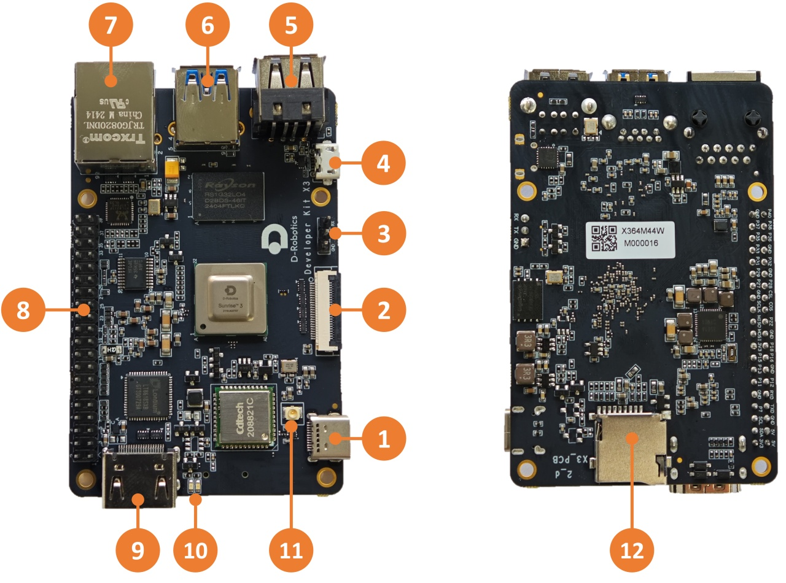
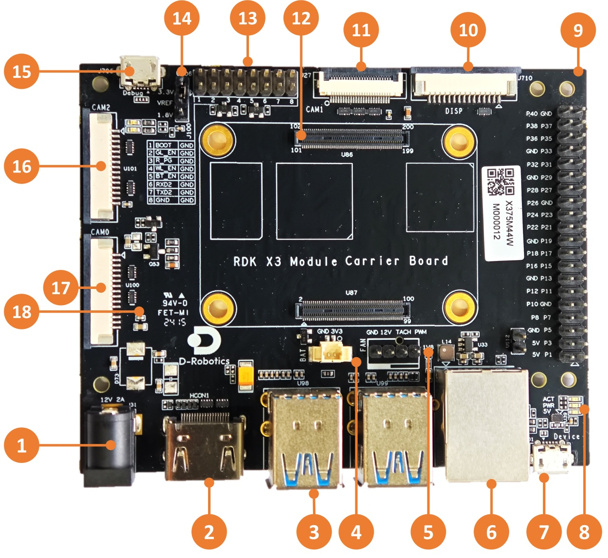
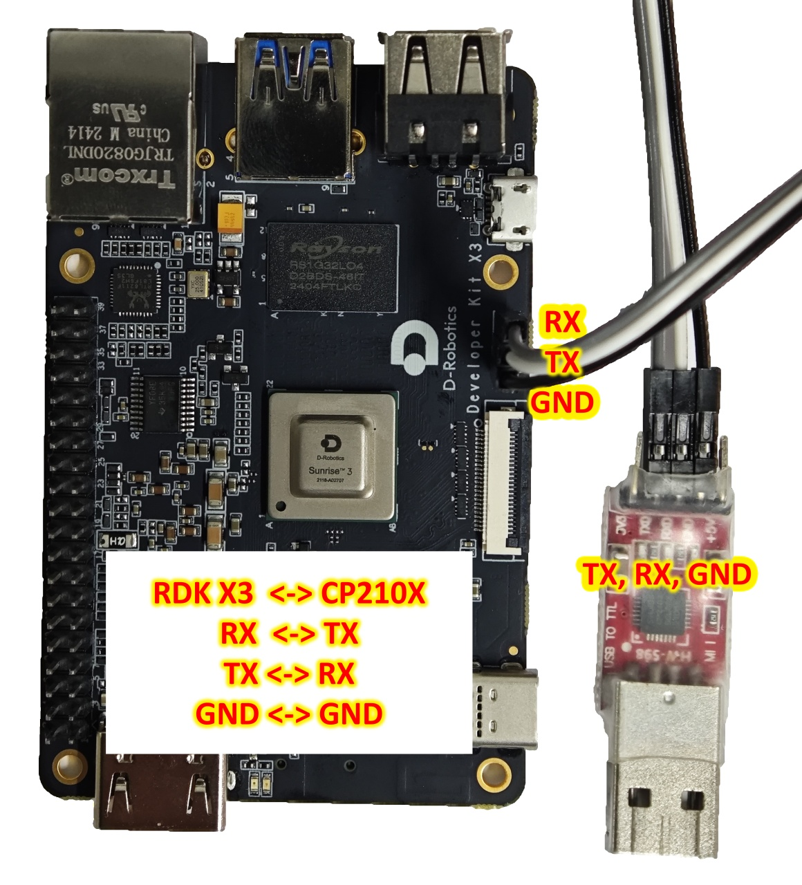
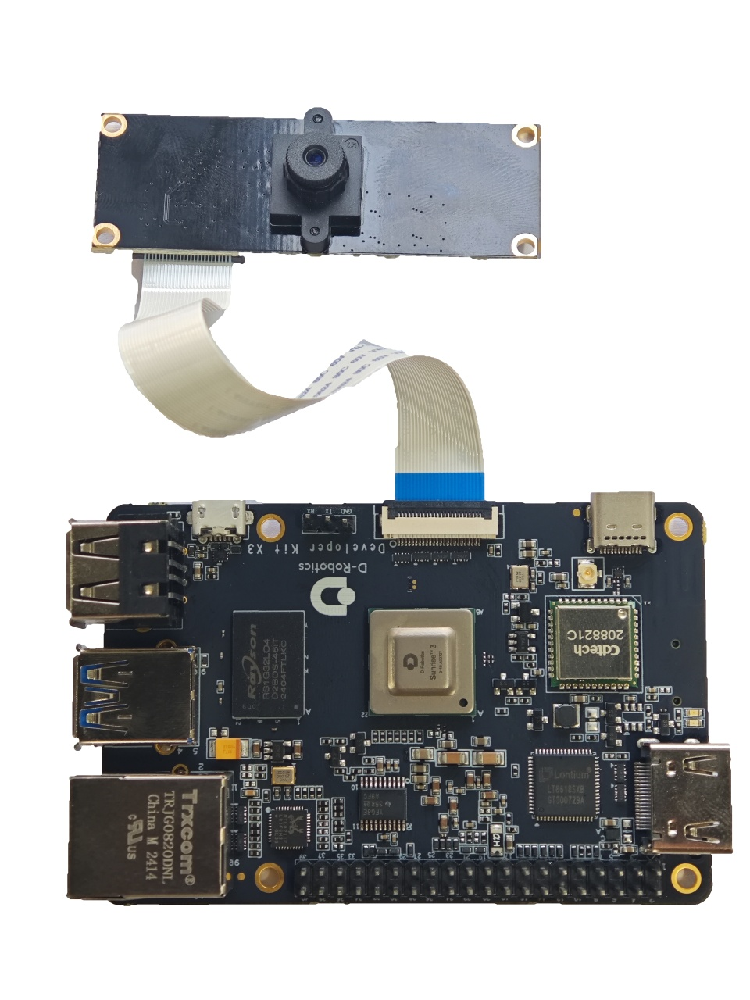
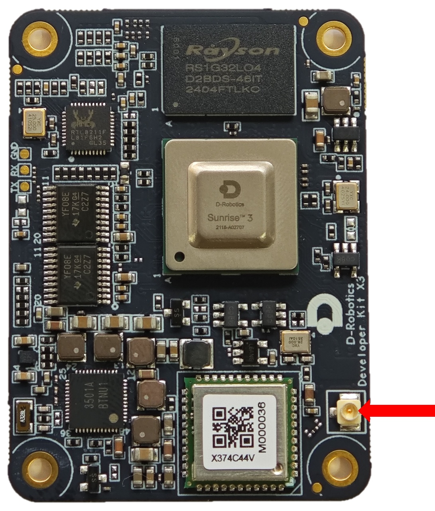
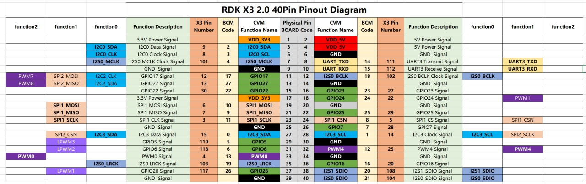

# 1.1 Hardware Interface Specification

```mdx-code-block
import Tabs from '@theme/Tabs';
import TabItem from '@theme/TabItem';
```

## Interface Overview

<Tabs groupId="rdk-type">
<TabItem value="x3" label="RDK X3">

RDK X3 provides interfaces such as Ethernet port, USB, camera, LCD, HDMI, 40PIN, etc., which facilitate the development and testing of image multimedia and deep learning algorithms. The interface layout of the development board is as follows:



| No. | Function | No. | Function | No. | Function |
| --- | -------- | --- | -------- | --- | -------- |
| 1 | USB Type C power interface | 2 | MIPI CSI camera interface | 3 | Debug serial port |
| 4 | Micro USB 2.0 interface | 5 | Two USB 2.0 Type A interfaces | 6 | USB 3.0 Type A interface |
| 7 | Gigabit Ethernet port | 8 | 40PIN interface | 9 | HDMI interface |
| 10 | Power and status LED indicators | 11 | Wi-Fi antenna interface | 12 | TF card interface (bottom) |

</TabItem>

<TabItem value="x3md" label="RDK X3 Module">

The official carrier board of RDK X3 Module provides various peripheral interfaces such as Ethernet port, USB, HDMI, MIPI CSI, MIPI DSI, 40PIN, etc., which facilitate the functional verification and development testing of RDK X3 Module. The interface layout is as follows:

 

| No. | Interface Function | No. | Interface Function      | No. | Interface Function      |
| --- | ----------------- | --- | --------------------- | --- | --------------------- |
| 1   | Power interface   | 7   | Micro USB2.0 Device interface | 13  | Functional control IO header |
| 2   | HDMI interface    | 8   | Working indicator light     | 14  | IO level selection header |
| 3   | USB3.0 Host interface | 9 | 40pin header               | 15  | Debug port, USB to serial port |
| 4   | RTC battery interface | 10 | MIPI DSI interface         | 16  | CAM2 interface, 2 lanes |
| 5   | Fan interface    | 11  | CAM1 interface, 4 lanes    | 17  | CAM0 interface, 2 lanes |
| 6   | Gigabit Ethernet port | 12 | Core module interface      | 18 | Micro SD Card interface (back) |

</TabItem>

</Tabs>


## Core Module Interface

<Tabs groupId="rdk-type">
<TabItem value="x3" label="RDK X3">

Full integration design, no core module.

</TabItem>

<TabItem value="x3md" label="RDK X3 Module">

RDK X3 Module carrier board provides a 200-pin board-to-board connector for installation of the core module. When installing, confirm the correct orientation and positioning to avoid damage to the core module and carrier board connectors.

 

Steps for module installation:

1. Compare the left-to-right order of the main chip, DDR, and Wi-Fi module on the core module with the silkscreen on the carrier board to confirm the correct installation direction.
2. Place the core module directly above the carrier board and align the four locating holes around it.
3. Press down from the center of the core module. When you hear a click sound, it means the module is properly installed.

</TabItem>


</Tabs>

## Power interface

<Tabs groupId="rdk-type">
<TabItem value="x3" label="RDK X3">


The development board provides one USB Type C interface (Interface 1) as the power supply interface, which requires the use of a power adapter supporting 5V/3A to power the development board. After connecting the power adapter to the development board, the development board's <font color='Red'>red</font> power indicator light illuminates, indicating that the development board is powered properly.

</TabItem>

<TabItem value="x3md" label="RDK X3 Module">

The RDK X3 Module carrier board is powered via the DC interface, and it is recommended to use the recommended **12V/2A** adapter in the certified accessory list. After connecting the power, if the **red power indicator light is on** (Interface 8), it indicates that the device is powered normally.

</TabItem>


</Tabs>


:::caution

Do not use the USB interface of the computer to power the development board, as it may cause insufficient power supply and lead to abnormal power failure and repeated restarts of the development board.

:::


## Debug UART{#debug_uart}

<Tabs groupId="rdk-type">
<TabItem value="x3" label="RDK X3">

The development board provides one debug UART (Interface 3) for serial port login and debugging functions. The parameter configuration of the computer serial port tool is as follows:

- Baud rate: 921600
- Data bits: 8
- Parity: None
- Stop bits: 1
- Flow Control: None

When connecting the UART, the DuPont wire needs to be connected to Interface 3 of the development board, and the USB serial adapter needs to be connected to the computer. After the connection is completed, it should look like the following figure:


</TabItem>

<TabItem value="x3md" label="RDK X3 Module">

The RDK X3 Module carrier board provides one debugging interface (Interface 15). Hardware-wise, the core module debugging serial port is converted into a USB interface via the `CH340` chip, allowing users to perform various debugging tasks using this interface. The parameters of the computer serial port tool should be configured as follows:

- Baud rate: 921600
- Data bits: 8
- Parity: None
- Stop bits: 1
- Flow Control: None

Typically, when users use this interface for the first time, they need to install the CH340 driver on the computer. Users can search for the keyword `CH340 serial port driver` for downloading and installation.

</TabItem>

</Tabs>


## Ethernet Port

<Tabs groupId="rdk-type">
<TabItem value="x3" label="RDK X3">

The development board provides one Gigabit Ethernet interface (Interface 7), supporting the 1000BASE-T and 100BASE-T standards. It defaults to static IP mode with the IP address `192.168.1.10`. To confirm the IP address of the development board, you can log in to the device via serial port and use the `ifconfig` command to view the configuration of the `eth0` interface:


```bash
sunrise@ubuntu:/# ifconfig 
eth0: flags=4163<UP,BROADCAST,RUNNING,MULTICAST>  mtu 1500
        inet 192.168.1.10  netmask 255.255.255.0  broadcast 192.168.1.255
        inet6 fe80::211:22ff:fe6f:de17  prefixlen 64  scopeid 0x20<link>
        ether 00:11:22:6f:de:17  txqueuelen 1000  (Ethernet)
        RX packets 112  bytes 7327 (7.3 KB)
        RX errors 0  dropped 0  overruns 0  frame 0
        TX packets 197  bytes 8678 (8.6 KB)
        TX errors 0  dropped 0 overruns 0  carrier 0  collisions 0
        device interrupt 39  base 0xc000 
```

If the system displays the following printout after inserting the Ethernet cable into the development board, it indicates that the Ethernet connection is normal:

```bash
[13293.952661] st_gmac a5014000.ethernet eth0: Link is Down
[13295.062996] st_gmac a5014000.ethernet: Link is Up - 1000/Full 
[13296.000750] st_gmac a5014000.ethernet eth0: Link is Up - 1Gbps/Full - flow control rx/tx
```

</TabItem>

<TabItem value="x3md" label="RDK X3 Module">

The development board provides one Gigabit Ethernet interface (Interface 6), supporting the 1000BASE-T and 100BASE-T standards. It defaults to static IP mode with the IP address `192.168.1.10`. To confirm the IP address of the development board, you can log in to the device via serial port and use the `ifconfig` command to view the configuration of the `eth0` interface:

```bash
sunrise@ubuntu:/# ifconfig 
eth0: flags=4163<UP,BROADCAST,RUNNING,MULTICAST>  mtu 1500
        inet 192.168.1.10  netmask 255.255.255.0  broadcast 192.168.1.255
        inet6 fe80::211:22ff:fe6f:de17  prefixlen 64  scopeid 0x20<link>
        ether 00:11:22:6f:de:17  txqueuelen 1000  (Ethernet)
        RX packets 112  bytes 7327 (7.3 KB)
        RX errors 0  dropped 0  overruns 0  frame 0
        TX packets 197  bytes 8678 (8.6 KB)
        TX errors 0  dropped 0 overruns 0  carrier 0  collisions 0
        device interrupt 39  base 0xc000 
```

If the system displays the following printout after inserting the Ethernet cable into the development board, it indicates that the Ethernet connection is normal:

```bash
[13293.952661] st_gmac a5014000.ethernet eth0: Link is Down
[13295.062996] st_gmac a5014000.ethernet: Link is Up - 1000/Full 
[13296.000750] st_gmac a5014000.ethernet eth0: Link is Up - 1Gbps/Full - flow control rx/tx
```

</TabItem>

</Tabs>

## HDMI Interface {#hdmi_interface}

<Tabs groupId="rdk-type">
<TabItem value="x3" label="RDK X3">


The development board provides one HDMI display interface (Interface 9), supporting a maximum resolution of 1080P. The development board outputs the Ubuntu system desktop (Ubuntu Server version displaying logo icons) on the monitor via the HDMI interface. Additionally, the HDMI interface supports real-time display of camera and network stream images.

The currently supported display resolutions for the HDMI interface are as follows:

- 1920x1080
- 1280x720
- 1024x600
- 800x480

</TabItem>

<TabItem value="x3md" label="RDK X3 Module">

The RDK X3 Module carrier board provides one HDMI display interface (Interface 2), supporting a maximum resolution of 1080P. The development board outputs the Ubuntu system desktop (Ubuntu Server version displaying logo icons) on the monitor via the HDMI interface. Additionally, the HDMI interface supports real-time display of camera and network stream images.

The currently supported display resolutions for the HDMI interface are as follows:

- 1920x1080
- 1280x720
- 1024x600
- 800x480

</TabItem>


</Tabs>

## USB Interface

<Tabs groupId="rdk-type">
<TabItem value="x3" label="RDK X3">

Due to the X3 chip providing only one USB interface, the development board implements multiple USB interface extensions through hardware circuits to meet the needs of multiple USB device connections. The interface descriptions are as follows:

| Interface Type    | Interface Number | Quantity | Interface Description                                       |
| ----------------- | ---------------- | -------- | ------------------------------------------------------------ |
| Micro USB 2.0     | Interface 4      | 1        | USB Device mode, used for connecting to the host to implement functions such as ADB, Fastboot, UVC, etc. |
| USB 2.0 Type A    | Interface 5      | 2        | USB Host mode, used for connecting USB 2.0 peripherals      |
| USB 3.0 Type A    | Interface 6      | 1        | USB Host mode, used for connecting USB 3.0 peripherals      |

USB host and device mode switching is fully implemented by hardware circuits. Users only need to connect devices according to the logic in the table above.

The development board's USB Host and Device functions are mutually exclusive. When a device is connected to the Device interface, the Host interface will automatically become inactive.

### Using a USB Flash Drive

<iframe src="//player.bilibili.com/player.html?aid=700903305&bvid=BV1rm4y1E73q&cid=1196553711&page=5" scrolling="no" border="0" frameborder="no" framespacing="0" width="100%" height="500" allowfullscreen="true"> </iframe>

The USB Type A interfaces (Interfaces 5 and 6) on the development board support USB flash drive functionality. They can automatically detect and mount USB flash drives. The default mount directory is `/media/sda1`. Users can use the `touch` command to confirm that the USB flash drive is working properly, as shown below:

```bash
sunrise@ubuntu:/media/sda1$ sudo touch test
[sudo] password for sunrise: 
sunrise@ubuntu:/media/sda1$ ls -l test 
-rwxr-xr-x 1 root root 0 Apr 30 21:19 test
sunrise@ubuntu:/media/sda1$
```

### Using a USB Serial Port Adapter

The USB Type A interfaces (Interfaces 5 and 6) on the development board support USB serial port adapter functionality. They can automatically detect the USB serial port adapter and create device nodes `/dev/ttyUSB*` or `/dev/ttyACM*` (the asterisk represents a number starting from 0). Users can refer to the [UART Usage](../03_Basic_Application/03_40pin_user_guide/uart.md#40pin_uart_usage) section for instructions on using the serial port.

</TabItem>

<TabItem value="x3md" label="RDK X3 Module">

The RDK X3 core module only supports one USB3.0 interface. Therefore, the carrier board expands to 4 USB3.0 host interfaces and 1 Micro USB2.0 device interface through peripheral circuits and USB hubs, meeting the diverse USB interface requirements of users. The interface descriptions are as follows:

| Interface Type        | Interface Number | Quantity | Description                |
| --------------------- | ---------------- | -------- | -------------------------- |
| USB3.0 Type A Host    | Interface 3      | 4        | Used for USB peripherals   |
| Micro USB2.0 Device   | Interface 7      | 1        | Used for adb debugging and fastboot flashing |

:::caution Note
The USB host/device mode switch is completely implemented by the hardware circuit. Users only need to connect the devices according to the logic in the above table.

The USB host and device functions on the development board are mutually exclusive. After connecting a device to the device interface, the host interface will be automatically disabled.
:::

</TabItem>

</Tabs>


## USB Camera

<iframe src="//player.bilibili.com/player.html?aid=700903305&bvid=BV1rm4y1E73q&cid=1196554247&page=6" scrolling="no" border="0" frameborder="no" framespacing="0" width="100%" height="500" allowfullscreen="true"> </iframe>

The development board's USB Type A interface supports USB camera functionality and can automatically detect the connection of a USB camera and create a device node `/dev/video8`. Users can use the `v4l2` command to confirm if the USB camera is working properly, as shown below:

```bash
sunrise@ubuntu:/media/sda1$ sudo v4l2-ctl -d /dev/video8 --all
Driver Info:
        Driver name      : uvcvideo
        Card type        : FHD Camera: FHD Camera
        Bus info         : usb-xhci-hcd.0.auto-1.2
        Driver version   : 4.14.87
        Capabilities     : 0x84200001
                Video Capture
                Streaming
                Extended Pix Format
                Device Capabilities
        Device Caps      : 0x04200001
                Video Capture
                Streaming
                Extended Pix Format
Media Driver Info:
```Driver name: uvcvideo
Model: FHD Camera: FHD Camera
Serial: 12345
Bus info: 1.2
Media version: 4.14.87
Hardware revision: 0x00000020 (32)
Driver version: 4.14.87

Interface Info:
ID: 0x03000002
Type: V4L Video

Entity Info:
ID: 0x00000001 (1)
Name: FHD Camera: FHD Camera
Function: V4L2 I/O
Pad 0x01000004: Sink
Link 0x0200000a: from remote pad 0x1000007 of entity 'Processing 2': Data, Enabled, Immutable

Priority: 2
Video input: 0 (Camera 1: ok)

Format Video Capture:
Width/Height: 1920/1080
Pixel Format: 'MJPG' (Motion-JPEG)
Field: None
Bytes per Line: 0
Size Image: 4147200
Colorspace: Default
Transfer Function: Default (maps to Rec. 709)
YCbCr/HSV Encoding: Default (maps to ITU-R 601)
Quantization: Default (maps to Full Range)
Flags: 

Crop Capability Video Capture:
Bounds: Left 0, Top 0, Width 1920, Height 1080
Default: Left 0, Top 0, Width 1920, Height 1080
Pixel Aspect: 1/1

Selection Video Capture: crop_default, Left 0, Top 0, Width 1920, Height 1080, Flags: 
Selection Video Capture: crop_bounds, Left 0, Top 0, Width 1920, Height 1080, Flags: 

Streaming Parameters Video Capture:
Capabilities: timeperframe
Frames per second: 30.000 (30/1)
Read buffers: 0
```

## MIPI CSI{#mipi_port}

<Tabs groupId="rdk-type">
<TabItem value="x3" label="RDK X3">
<iframe width="560" height="315" src="https://www.youtube.com/embed/nabpS2CUkjY?si=jNZ6DNGTio852aIQ" title="YouTube video player" frameborder="0" allow="accelerometer; autoplay; clipboard-write; encrypted-media; gyroscope; picture-in-picture; web-share" referrerpolicy="strict-origin-when-cross-origin" allowfullscreen></iframe>

The development board provides 1 MIPI CSI interface (Interface 2), which allows for the connection of MIPI cameras. Currently, the development board is compatible with multiple specifications of camera modules. The module models and specifications are as follows:


| No. | Sensor | Resolution | FOV | I2C Device Address |
| --- | ------ | ---------- | --- | ----------------- |
| 1   | GC4663 | 400W       | H:104 V:70 D:113 | 0x29 |
| 2   | JXF37  | 200W       | H:62  V:37 D:68   | 0x40 |
| 3   | IMX219 | 800W       | H:62  V:37 D:68   | 0x10 |
| 4   | IMX477 | 1200W      | H:62  V:37 D:68   | 0x1a |
| 5   | OV5647 | 500W       | H:62  V:37 D:68   | 0x36 |

The camera module is connected to the development board through a FPC cable. Please note that the blue side of the cable should face up when inserting it into the connector.

Taking the JXF37 camera module as an example, after installation, it should look like the following picture:


After installation, users can use the i2cdetect command to verify if the I2C address of the module can be detected correctly. If it cannot be detected, users need to check if the FPC cable connection is correct. When the I2C address is successfully detected, the log will print as follows:
```bash
# First, enable the 24MHz master clock for the sensor
sunrise@ubuntu:~# sudo bash -c "echo 1 > /sys/class/vps/mipi_host0/param/snrclk_en"
sunrise@ubuntu:~# sudo bash -c "echo 24000000 > /sys/class/vps/mipi_host0/param/snrclk_freq"
# Execute the i2cdetect command, and the displayed 40 is the I2C device address of the JXF37 sensor, indicating that the camera is connected correctly
sunrise@ubuntu:~# sudo i2cdetect -y -r 1
     0  1  2  3  4  5  6  7  8  9  a  b  c  d  e  f
00:          -- -- -- -- -- -- -- -- -- -- -- -- --
10: -- -- -- -- -- -- -- -- -- -- -- -- -- -- -- --
20: -- -- -- -- -- -- -- -- -- -- -- -- -- -- -- --
30: -- -- -- -- -- -- -- -- -- -- -- UU -- -- -- --
40: 40 -- -- -- -- -- -- -- -- -- -- -- -- -- -- --
50: -- -- -- -- -- -- -- -- -- -- -- -- -- -- -- --
60: -- -- -- -- -- -- -- -- -- -- -- -- -- -- -- -- 
70: -- -- -- -- -- -- -- --                         
```

The purchase method for the above Camera module can be referred to on the [purchase link](../07_Advanced_development/01_hardware_development/rdk_x3/accessory.md).

</TabItem>

<TabItem value="x3md" label="RDK X3 Module">

The RDK X3 Module carrier board provides three sets of MIPI CSI interfaces for CAM 0/1/2, allowing for the simultaneous connection of three camera modules to meet the diverse needs of users. The specific descriptions are as follows:

1. CAM 0/2 (Interfaces 16/17), using 15-pin FPC connectors, can directly connect to various camera modules such as Raspberry Pi's OV5647, IMX219, IMX477, etc.
2. CAM 1 (Interface 11), using a 24-pin FPC connector, supports various camera modules such as F37, GC4663, IMX415, etc.

The basic specifications of the camera modules are as follows:

| Number | Sensor | Resolution | FOV              | I2C Device Address |
| ------ | ------ | ---------- | ---------------- | ------------------ |
| 1      | GC4663 | 4MP        | H:104 V:70 D:113 | 0x29               |
| 2      | JXF37  | 2MP        | H:62  V:37 D:68  | 0x40               |
| 3      | IMX219 | 8MP        | H:62  V:37 D:68  | 0x10               |
| 4      | IMX477 | 12MP       | H:62  V:37 D:68  | 0x1a               |
| 5      | OV5647 | 5MP        | H:62  V:37 D:68  | 0x36               |

The purchase links for the above camera modules can be found [here](../07_Advanced_development/01_hardware_development/rdk_x3/accessory.md).

</TabItem>

</Tabs>

:::caution
Important: It is strictly prohibited to plug or unplug the camera while the development board is powered on, as it may damage the camera module.
:::


## MIPI DSI Interface

<Tabs groupId="rdk-type">
<TabItem value="x3" label="RDK X3">

Not applicable.

</TabItem>

<TabItem value="x3md" label="RDK X3 Module">

The RDK X3 Module carrier board provides one MIPI DSI interface (Interface 10) that can be used for connecting LCD displays, etc. The interface uses a 15-pin FPC connector and can directly connect to various LCD displays for Raspberry Pi.

For detailed instructions on how to use the MIPI DSI interface, please refer to [MIPI DSI Display Usage](/hardware_development/rdk_x3_module/display).

</TabItem>


</Tabs>

## Micro SD Interface

<Tabs groupId="rdk-type">
<TabItem value="x3" label="RDK X3">

The development board provides 1 Micro SD card interface (Interface 12). It is recommended to use a storage card with a capacity of at least 8GB to meet the installation requirements of the Ubuntu operating system and related packages.

</TabItem>

<TabItem value="x3md" label="RDK X3 Module">

The RDK X3 Module carrier board provides 1 Micro SD card interface (Interface 18). It is recommended to use a storage card with a capacity of at least 8GB to meet the installation requirements of the Ubuntu operating system and related packages.

</TabItem>


</Tabs>

:::caution

Hot-plugging the TF storage card is prohibited during the use of the development board, as it may cause abnormal system operation or even damage to the storage card file system.

:::

## Wi-Fi Antenna Interface

<Tabs groupId="rdk-type">
<TabItem value="x3" label="RDK X3">

<iframe width="560" height="315" src="https://www.youtube.com/embed/daliyPZNoLM?si=hszHz3WYvqX3qxRF" title="YouTube video player" frameborder="0" allow="accelerometer; autoplay; clipboard-write; encrypted-media; gyroscope; picture-in-picture; web-share" referrerpolicy="strict-origin-when-cross-origin" allowfullscreen></iframe>

The development board supports both onboard and external antennas for wireless networking. In most cases, the onboard antenna can meet the user's needs. However, when the development board is installed with a metal casing, an external antenna needs to be connected to Interface 11 to enhance signal strength.

:::tip 
To convert the onboard antenna to an external antenna, use the following command: sed -i 's/trace/cable/g' /etc/init.d/hobot-wifi. Restart the system for the changes to take effect.
To revert to the onboard antenna, use the following command: sed -i 's/cable/trace/g' /etc/init.d/hobot-wifi. Restart the system for the changes to take effect.
:::

</TabItem>

<TabItem value="x3md" label="RDK X3 Module">

The development board supports both on-board and external antenna configurations for wireless networking. In most cases, the on-board antenna can meet the usage requirements. However, when the development board is installed with a metal housing, an external antenna needs to be connected to enhance signal strength.



</TabItem>

</Tabs>

## 40-pin header interface

<Tabs groupId="rdk-type">
<TabItem value="x3" label="RDK X3">

The RDK X3 development board provides a 40-pin header interface with IO signals using a 3.3V logic level design. The pin definitions are compatible with products such as Raspberry Pi. The detailed pin definitions and multiplex relationships are as follows:


The development board has silk screen marking for the 40-pin interface, making it convenient for users to operate. The positions of PIN1 and PIN40 are as follows:


For the usage of each function of the 40-pin interface, please refer to the [40PIN Function Usage](../03_Basic_Application/03_40pin_user_guide/40pin_define.md) section.

</TabItem>

<TabItem value="x3md" label="RDK X3 Module">

The RDK X3 Module carrier board provides a set of 40-pin header interfaces (Interface 9), and the interface voltage level is determined by the IO level switching header (Interface 14), supporting both 1.8V and 3.3V modes. The pin definitions are compatible with products such as Raspberry Pi. The detailed pin definitions and multiplex relationships are as follows:



:::caution Caution
By default, the RDK X3 Module core module firmware and carrier board voltage configuration are set to 3.3V. If you need to switch the IO level, please refer to the [IO Level Selection Header Interface](#io-level-switching-interface).
:::

</TabItem>

</Tabs>


## Functional Control Interfaces

<Tabs groupId="rdk-type">
<TabItem value="x3" label="RDK X3">

No such interface.

</TabItem>

<TabItem value="x3md" label="RDK X3 Module">

The RDK X3 Module carrier board provides a set of control IO interfaces (Interface 13). Users can use jumper caps to short the corresponding pins to achieve control over various functional modes of the core module. The pin functions are defined as follows:

| Pin Number | Pin Name | Function Description                             | Usage                                      |
| ---------- | -------- | ----------------------------------------------- | ------------------------------------------ |
| 1          | BOOT     | Used to enter fastboot flashing mode            | Short the jumper cap to ground and power on |
| 2          | GL_EN    | Used to turn off the input power of the board   | Short the jumper cap to ground             |
| 3          | R_PG     | Used to indicate the working status of the board | High level indicates normal operation      |
| 4          | W_EN     | Used to turn off Wi-Fi function                  | Short the jumper cap to ground to turn off Wi-Fi, restart the system to recover |
| 5          | BT_EN    | Used to turn off Bluetooth function              | Short the jumper cap to ground to turn off Bluetooth, restart the system to recover |
| 6          | RXD2     | Serial UART2 receive signal                      | Serial UART2 receive signal                 |
| 7          | TXD2     | Serial UART2 transmit signal                     | Serial UART2 receive signal                 |
| 8          | GND      | Ground                                          | GND                                        |

In addition, for user convenience, the above pin definitions are also reflected on the carrier board silkscreen. 


</TabItem>

</Tabs>


## IO Level Switching Interface

<Tabs groupId="rdk-type">
<TabItem value="x3" label="RDK X3">

This interface is not available.

</TabItem>

<TabItem value="x3md" label="RDK X3 Module">

The RDK X3 Module carrier board provides the IO level switching function for controlling the 40-pin header level mode, which supports two levels: 1.8V and 3.3V.

The interface signals from top to bottom are 3.3V, VREF, 1.8V, as shown in the following figure:


It is important to note that **this interface cannot be left unconnected, otherwise the core module will not be able to start up due to power supply abnormalities**.

:::caution When switching levels, please follow the steps below strictly.
By default, the firmware of the core module of RDK X3 Module and the level configuration of the carrier board are set to 3.3V. If you need to switch the IO level, please follow the steps below:

1. Download the boot firmware that supports the 1.8V level configuration from the [firmware download address](http://archive.d-robotics.cc/downloads/miniboot).
2. Use the official programming tool `hbupdate` to update the boot firmware of the core board. For detailed instructions, please refer to [Image Flash](./install_os).
3. Power off the device, short connect the `vref` and `1.8V` signals using a jumper cap, and then power on again.
:::

</TabItem>

</Tabs>