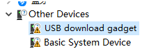
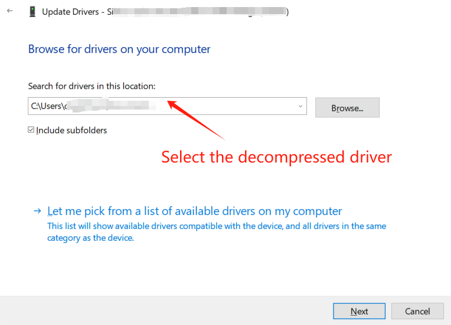
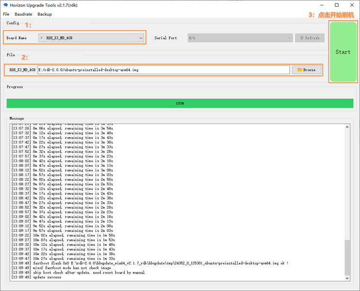
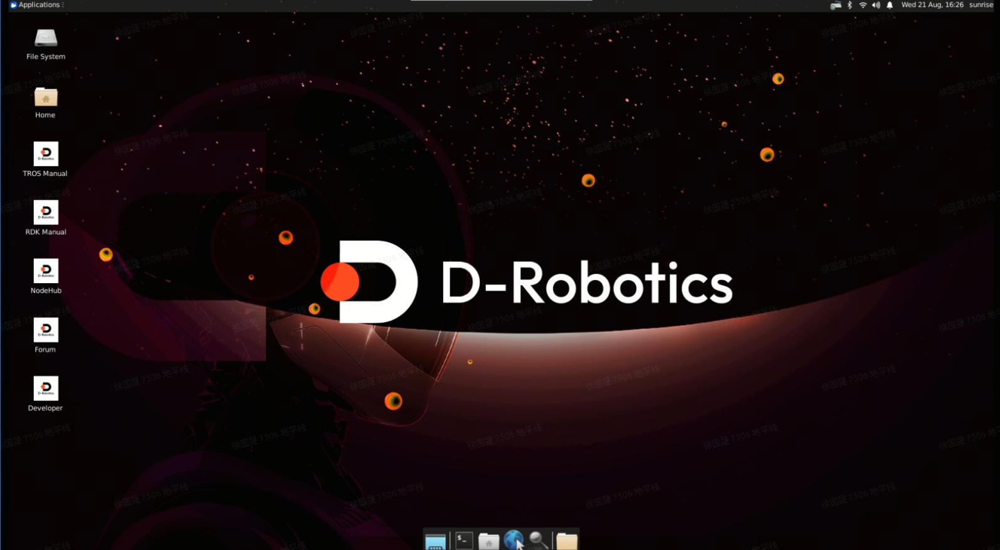

# 1.2.1 RDK X3

```mdx-code-block
import Tabs from '@theme/Tabs';
import TabItem from '@theme/TabItem';
```

Before using the RDK X3 development board, the following preparations need to be made.

## Preparation


### **Power Supply**

<Tabs groupId="rdk-type">
<TabItem value="x3" label="RDK X3">

The RDK X3 development board is powered by a USB Type C interface. It requires a power adapter that supports **5V/3A** to power the board. It is recommended to use the recommended power adapter model in the [Basic Accessories List](../../07_Advanced_development/01_hardware_development/rdk_x3/accessory.md) section.

</TabItem>

<TabItem value="x3md" label="RDK X3 Module">

The RDK X3 Module is powered through the power interface on the carrier board. The [official carrier board](../../07_Advanced_development/01_hardware_development/rdk_x3_module/accessory.md) is powered through a DC interface. It is recommended to use the **12V/2A** adapter recommended in the certified accessories list.

</TabItem>

</Tabs>

:::caution

Please do not power the development board through the USB interface of a computer, as it may cause abnormal power failure and repeated restarts due to insufficient power supply.

For more troubleshooting, please refer to the [Common Questions](../../08_FAQ/01_hardware_and_system.md) section.

:::


### **Storage** 
<Tabs groupId="rdk-type">
<TabItem value="x3" label="RDK X3">
The RDK X3 development board uses a Micro SD card as the system boot medium, and it is recommended to use a storage card with a capacity of at least 8GB to meet the storage requirements of the Ubuntu system and application software.

</TabItem>

<TabItem value="x3md" label="RDK X3 Module">

The RDK X3 Module has onboard eMMC (optional) and supports booting the system from both eMMC and SD cards.

</TabItem>

</Tabs>


### **Display** 
<Tabs groupId="rdk-type">
<TabItem value="x3" label="RDK X3">

The RDK X3 development board supports HDMI display interface, and connects the development board and monitor via HDMI cable to support graphical desktop display.

</TabItem>

<TabItem value="x3md" label="RDK X3 Module">

The RDK X3 Module supports HDMI display interface, and connects the official carrier board and monitor via HDMI cable to support graphical desktop display.

</TabItem>

</Tabs>


### **Network Connection**
<Tabs groupId="rdk-type">
<TabItem value="x3" label="RDK X3">

The RDK X3 development board supports Ethernet and Wi-Fi network interfaces, and users can use either interface for network connection.

</TabItem><TabItem value="x3md" label="RDK X3 Module">

The RDK X3 Module supports two types of network interfaces: Ethernet and Wi-Fi (optional). Users can achieve network connectivity through either interface.

</TabItem>

</Tabs>

## System burning

The RDK suite currently provides the Ubuntu 20.04/22.04 system image, which supports desktop graphical interaction.


### Image download 

<Tabs groupId="rdk-type">
<TabItem value="x3" label="RDK X3">

Video: https://www.youtube.com/watch?v=du1EypDtxMY&list=PLSxjn4YS2IuFUWcLGj2_uuCfLYnNYw6Ld&index=15

Click [**Download image**](http://archive.d-robotics.cc/downloads/os_images) to enter the version selection page, select the corresponding version directory, and enter the file download page. Take downloading the 2.0.0 version of the system image as an example:


After downloading, unzip the Ubuntu system image file, such as `ubuntu-preinstalled-desktop-arm64.img`.

**Version description:**

- Version 2.0: Made based on the RDK Linux open source code package, supporting the full range of hardware such as RDK X3 and X3 module.

</TabItem>

<TabItem value="x3md" label="RDK X3 Module">

Click [**Download image**](https://archive.d-robotics.cc/downloads/en/os_images/rdk_x3/) to enter the version selection page, select the corresponding version directory, and enter the file download page. Take downloading the 2.0.0 version of the system image as an example:


After downloading, unzip the Ubuntu system image file, such as `ubuntu-preinstalled-desktop-arm64.img`

**Version description:**

- Version 2.0: Made based on the RDK Linux open source code package, supporting the full range of hardware such as RDK X3 and X3 module.

</TabItem>

</Tabs>

:::tip

- desktop: Ubuntu system with a desktop, can be connected to an external screen and operated with a mouse
- server: Ubuntu system without a desktop, can be operated remotely through serial or network connection
:::


### System Burning

<Tabs groupId="rdk-type">
<TabItem value="x3" label="RDK X3">

:::tip

Before burning the Ubuntu system image, please make the following preparations:
- Prepare a Micro SD card with a capacity of at least 8GB
- SD card reader
- Download the image burning tool balenaEtcher (available for download [here](https://www.balena.io/etcher/))
:::

balenaEtcher is a PC-side boot disk creation tool that supports multiple platforms such as Windows/Mac/Linux. The process of creating an SD boot card is as follows:
1. Open the balenaEtcher tool, click the `Flash from file` button, and select the extracted `ubuntu-preinstalled-desktop-arm64.img` file as the burning image.

    

2. Click the `Select target` button and select the corresponding Micro SD storage card as the target storage device.

    

3. Click the `Flash` button to start burning. When the tool prompts `Flash Complete`, it means the image burning is complete. You can close balenaEtcher and remove the storage card.

    

</TabItem><TabItem value="x3md" label="RDK X3 Module">

The RDK X3 Module supports booting the system from two modes: eMMC and SD card:

- **Using SD card**: If you want to burn the system to an SD card (not booting from eMMC mode), follow the same steps as RDK X3 for burning the system.
- **Using eMMC**: You need to use the D-Robotics `hbupdate` tool. (**This method is mainly described below**)

The `hbupdate` tool supports two versions: Windows and Linux, which start with `hbupdate_win64` and `hbupdate_linux` respectively. The tool download link is: [hbupdate](https://archive.d-robotics.cc/downloads/en/hbupdate/).

:::tip Note

  - Extract the compressed tool package, and do not include **spaces, Chinese characters, special characters**, etc. in the extraction path.
  - The tool communicates with the RDK X3 module through the USB port, so you need to install the USB driver in advance. See the following description for specific steps.
:::

1. For PCs using the Windows system, before using the flashing tool, you need to confirm whether the fastboot driver program has been installed. Please follow the steps below to check:

   (1) Ground the `Boot` pin of the RDK X3 carrier board using a jumper cap. Refer to the figure below for the pin position.    
     

   (2) Connect the Micro USB interface of the carrier board to the computer via a USB cable. Refer to the figure below for the interface position.  
     

   (3) Power on the device and observe the port status of the computer device manager. If the `USB download gadget` unknown device appears, you need to update the device driver; otherwise, you can skip the following steps.  
     

   (4) Download and extract the driver package `android_hobot.zip`. The download link is [android_hobot](http://archive.d-robotics.cc/downloads/hbupdate/android_hobot.zip).

   (5) Go to the extracted directory and run `5-runasadmin_register-CA-cer.cmd` as an administrator to complete the registration of the driver program.

   (6) Double-click the `USB download gadget` unknown device, select the driver package extraction directory, and then click Next.   
   

   (7) After the driver installation is complete, the device manager will display the fastboot device `Android Device`.   
   

   

2. After confirming that the PC device manager displays the fastboot device `Android Device`, run `hbupdate.exe` to open the burning tool, and follow the steps below to burn the system:

   

   (1) Select the development board model, which is a required field.

   - RDK_X3_2GB: RDK X3 (Sunrise X3), 2GB RAM version, only supports burning the minimal system image

   - RDK_X3_4GB: RDK X3 (Sunrise X3), 4GB RAM version, only supports burning the minimal system image

   - RDK_X3_MD_2GB: RDK X3 Module, 2GB RAM version
   - RDK_X3_MD_4GB: RDK X3 Module, 4GB RAM version

   

   (2) Click the `Browse` button to select the image file to be burned, this is a required option.

   

   (3) Click the `Start` button to start the flashing process, and follow the popup prompts to continue:

   

   - When burning the image, it is necessary to connect the `BOOT` pin to the ground using a jumper cap. The pin position can be referred to in the [Function Control Interface](/hardware_development/rdk_x3_module/interface#function-control-interface).

   - Connect the Micro USB interface to the computer, and the computer device manager will recognize the `Android Device` as described in the previous section for installing USB download drivers.

   - After the burning is completed, disconnect the power supply, disconnect the connection cable from the computer, and remove the BOOT jumper cap, then re-power on.

   - If the startup is normal, the `ACT LED` on the hardware will enter the state of `two fast flashes followed by one slow flash`.

   (4) Check the upgrade results

   - When the image burning is successful, the tool will prompt as follows:

   

   - When the image burning fails, the tool will prompt as follows, and at this time, you need to check if the `Android Device` device exists in the PC device manager.

   

</TabItem>

</Tabs>

:::caution

If the burning process is interrupted, please follow the above steps to restart.
:::

### Start the system

<Tabs groupId="rdk-type">
<TabItem value="x3" label="RDK X3">

First, keep the development board powered off, then insert the prepared memory card into the Micro SD card slot of the development board, and connect the development board to a monitor using an HDMI cable. Finally, power on the development board.The default environment configuration will be performed when the system starts up for the first time. The entire process takes about 45 seconds, and after the configuration is completed, the Ubuntu system desktop will be displayed on the monitor.

:::tip Explanation of Development Board Indicator Lights

* **<font color='Red'>Red</font>** indicator light: When it is on, it indicates normal hardware power-on.
* **<font color='Green'>Green</font>** indicator light: When it is on, it indicates that the system is booting up. When it is off or flashing, it indicates that the system booting process is complete.

If there is no display output on the development board for a long time (more than 2 minutes) after power-on, it means that the development board failed to start. In this case, users can check the system status through the indicator lights using the following methods:

* **<font color='Green'>Green light</font>** stays on: It indicates that the system failed to start. Users can check if the power adapter meets the requirements and try to remake the system image.
* **<font color='Green'>Green light</font>** is off or flashing: It indicates that the system has started successfully, but the display service failed to start. Users need to confirm if the connected display meets the specification requirements.

:::

</TabItem>

<TabItem value="x3md" label="RDK X3 Module">

RDK X3 Module supports two modes of system startup: eMMC mode and SD card mode.

- If the eMMC on the module does not have a system image burned, you can insert an SD card with the system image to the carrier board to start the system from the SD card.

- If the eMMC on the module already has a system image burned, you can switch between eMMC and SD card startup by following these steps:

   1. By default, the system starts up from the eMMC.

   2. To disable eMMC booting and switch to SD card startup, log into the system and execute the following command to remove the boot flag from the second partition of eMMC, then restart the system for the change to take effect:

   ```
   sudo parted /dev/mmcblk0 set 2 boot off
   sudo reboot
   ```

   3. In uboot, you will find that there is no boot partition on the eMMC and it looks for the boot partition on the SD card. The system is booted from the SD card. After logging into the system, you can execute the `mount` command to see that the root file system is mounted on the second partition of the SD card, and the config partition also uses the first partition of the SD card.

   ```
   /dev/mmcblk2p2 on / type ext4 (rw,relatime,data=ordered) 
   /dev/mmcblk2p1 on /boot/config type vfat
   ```

- To switch back to eMMC startup from SD card startup:

   When the system is started from the SD card and the system has already been burned to the eMMC, execute the following command to restore the eMMC startup. Restart the system for the change to take effect.
   ```
  sudo parted /dev/mmcblk0 set 2 boot on
  sudo reboot
  ```

</TabItem>

</Tabs>

After the Ubuntu Desktop version system is fully booted, the system desktop will be displayed on the monitor via the HDMI interface, as shown in the following figure:




## **Frequently Asked Questions**  

Here are some common issues when using the development board for the first time:

- **<font color='Blue'>Power on failure</font>**: Please ensure that the recommended power adapter is used for [power supply](#power_supply); please also ensure that the Micro SD card or eMMC of the development board has been flashed with the Ubuntu system image.
- **<font color='Blue'>No response from USB Host interface</font>**: Please make sure that no data cable is connected to the Micro USB interface of the development board.
- **<font color='Blue'>Hot-plugging storage card during usage</font>**: The development board does not support hot-plugging of Micro SD storage cards. If an accidental operation occurs, please restart the development board.


### **Important Notices**

- Do not plug and unplug any devices other than USB, HDMI, and Ethernet cables when they are powered on.
- The Type C USB interface of RDK X3 is only used for power supply.
- Use USB Type C power cables from reputable brands; otherwise, power supply abnormalities may occur, leading to system power failure.


:::tip

For more problem-solving, please refer to the [Frequently Asked Questions](../../08_FAQ/01_hardware_and_system.md) section, and you can also visit the [D-Robotics Developer Forum](https://developer.d-robotics.cc/forum) for assistance.

:::


:::info Note

The **RDK X3 Module** comes with a pre-installed test version of the system image. To ensure the use of the latest version of the system, <font color='Red'>it is recommended to refer to this document to complete the burning of the latest version of the system image</font>.
:::

