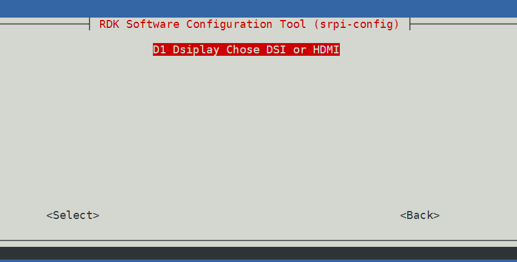
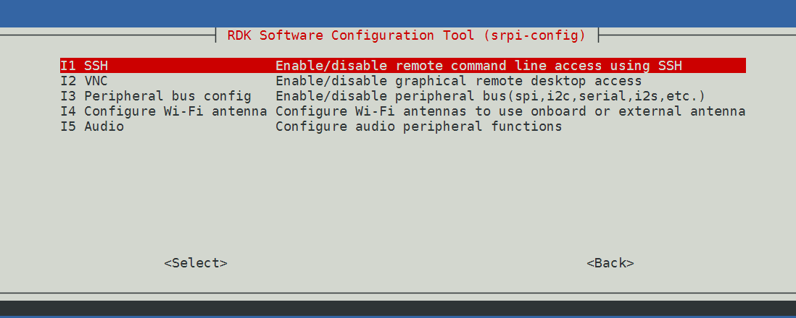
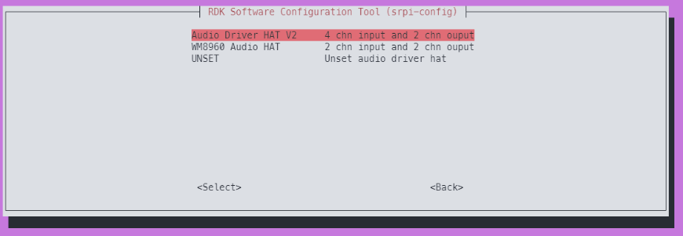
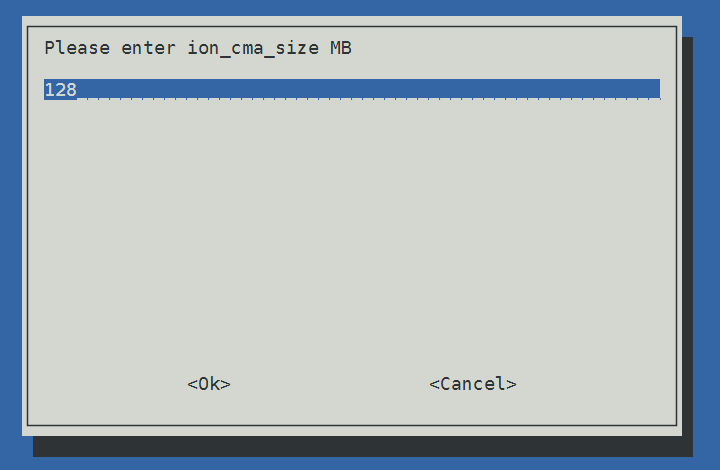

# 2.2 srpi-config Configuration Tool User Guide

:::info Note
The `srpi-config` configuration tool is only applicable to the `RDK X3` and `RDK X3 Module` development boards and is not suitable for the `RDK Ultra` development board.
:::

## Introduction

`srpi-config` is a system configuration tool. To open the configuration tool, type the following command in the command line:

```
sudo srpi-config
```

> `sudo` is a command for privilege management. It is necessary to enter it here in order to have root privileges for configuration management. The default sunrise account does not have permission to modify system files.


If you are using a desktop system, you can find the `RDK Configuration` application in the menu for configuration. It will also open a configuration terminal similar to the image above.


## System Options

The System Options menu allows you to configure changes to various parts such as Wi-Fi network, user password, hostname, system login mode, browser selection, and some system-level changes.


- **Wireless LAN**

  Set the `SSID` and `password` for the wireless network.

- **Password**

  Change the default user password. The default account is `sunrise`.

- **Hostname**

  Set the visible name of the current device on the network.

- **Boot / Auto login**

  Choose whether to boot to console or desktop, and whether automatic login is required. If automatic login is chosen, it will be logged in with the default account `sunrise`.
  
- **Power LED**
 
  If the model of RDK allows, you can change the behavior of the power LED in this option. The default is off or flashing.

- **Browser**
 
  If using a desktop system, you can set the default browser. If not configured, `firefox` is used by default, and users can install the `chromium` browser with the command `sudo apt install chromium`.

## Display Options
 
 Display options menu.
 
 

- **FB Console Resolution**
 
  Supports setting the HDMI display resolution in `Server` system and `console` mode.

[Only X5 supports]



- **Dsiplay Chose DSI or HDMI**
  
  Support switching between `DSI` and `HDMI` display.

## Interface Options
 
 Interface options menu, with the following options to enable/disable: SSH, VNC, SPI, I2C, I2S, Serial, etc.
 
 
 
- **SSH**
 
  Use SSH to enable/disable remote login to `RDK`. By default, the SSH option is enabled.
 
- **VNC**
 
  Enable/disable X11vnc virtual network computing server.
 
> VNC (Virtual Network Console) is an abbreviation for Virtual Network Console. It is a remote control software that can be enabled when remotely accessing the desktop system.
 
- **Peripheral bus config**
 
  Enable/disable SPI, I2C, Serial Port, I2S and other interfaces on the 40-pin interface. This configuration directly modifies the `status` of the corresponding bus in the device tree file and takes effect after reboot.
  [X5] 
  X5 has added a PWM interface;
  In the table below, each row of interfaces uses the same pins and can only have one function in effect. When all interfaces in a row are dsiable, the pins are gpio function pins


  | fun1 | fun2 | 
| ---- | ---- |
| serial3 | i2c5 |
| i2c0 | pwm2 |
| spi2 | pwm0 |
| spi2 | pwm1 |
| i2c1 | pwm3 |
  
 
 
- **Configure Wi-Fi antenna**
  
  Switch Wi-Fi antenna mode, supports setting to use onboard or external antenna.

> Currently supported in RDK X3 V2.1 RDK X5.

- **Audio**
  Install and uninstall audio adapter board
  Possible supported audio adapters include Audio Driver HAT V1, Audio Driver HAT V2, and WM8960 Audio HAT. Different hardware may also support different audio adapters


 

## Performance Options
 
 Performance options, including overclocking, CPU operating mode and frequency settings, adjusting ION memory size, etc.
 
 
 - **CPU frequency**

  Use this tool to overclock the CPU of the RDK. It is generally not recommended to enable this option, but you can try modifying it if sufficient cooling measures are in place.

  

- **ION memory**

  Use this option to configure the common size of ION memory.

> ION memory is a physical memory space reserved for the BPU, image, and video multimedia functions. The default configuration size is 672MB. If you need to run large algorithm models or decode multiple videos at the same time, adjust the memory size according to specific needs.

- **[X5] ION memory**

  The ION of X5 is divided into three partitions, and the sizes of the three partitions need to be set separately. The default size configuration is ion_cma 128MB, ion_deserved 320MB, ion_carveout 320MB, for a total of 768MB.

  

  

## Localisation Options

Localisation options provide the following choices: local language, time zone, and keyboard layout.


- **Locale**

  Select a locale, such as configuring Chinese environment `zh_CN.UTF-8`. Restart to take effect.

- **Time Zone**

  Select your local time zone, starting from the region, for example, Asia, and then choose a city, like Shanghai. Type a letter to jump to that point in the alphabet.

- **Keyboard**

  Reading all keyboard types may take a long time to display. Changes usually take effect immediately but may require a restart.

## Advanced Options

Advanced options allow you to configure disk expansion, network proxy settings, and more.


- **Expand Filesystem**

  This option expands the installation to fill the entire TF card, providing more space for the file system.

> If the system is copied from another system that has already been initialized and configured, the capacity of the `TF` card may not be automatically adjusted to the current TF card. Use this feature to conveniently complete the expansion.

- **Network Proxy Settings**

  Configure the network proxy settings.

- **Boot Order**

  The RDK X3 module supports booting the system from eMMC and SD cards. This option is used to switch the boot mode.
  
## Update

Update the `srpi-config` tool to the latest version.

## About srpi-config

Information about `srpi-config`

Choosing this option will display the following information:


## Finish button


After making the changes, select the `Finish` button. The system will ask if you want to restart. It is recommended to restart when using it for the first time.