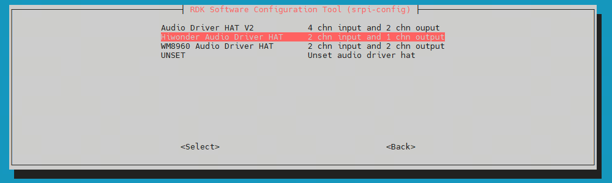

# Hiwonder Carrier Board

## Product Overview
This carrier board integrates multiple peripherals. The following are instructions for using the audio section.

## Installation

- ### Hardware Deployment
Refer to other audio boards for connection. Connect using the 40-pin to 40-pin interface.

- ### Software Configuration
1. Use `srpi-config` to configure the audio board.  
Go to `3 Interface Options` -> `I5 Audio`  
Select `Hiwonder Audio Driver HAT`:


2. Follow the prompts to execute the `reboot` command, or run `sync && reboot` to restart the board. If `cat /proc/asound/cards` shows the `duplexaudioi2s1` sound card, the carrier board is installed successfully.

```shell
root@ubuntu:~# cat /proc/asound/cards 
 0 [duplexaudioi2s1]: simple-card - duplex-audio-i2s1
            duplex-audio-i2s1
 1 [duplexaudio    ]: simple-card - duplex-audio
            duplex-audio
```

- ### Uninstallation
1. Use `srpi-config` to configure the audio board.  
Go to `3 Interface Options` -> `I5 Audio`  
Select `UNSET` to uninstall the audio driver and related configurations.

2. Remove the carrier board.

## Usage
Check if the sound card exists and verify the device number.

To confirm the sound card is registered (as mentioned above):
```shell
root@ubuntu:~# cat /proc/asound/cards 
 0 [duplexaudioi2s1]: simple-card - duplex-audio-i2s1
            duplex-audio-i2s1
 1 [duplexaudio    ]: simple-card - duplex-audio
            duplex-audio
```

To check logical devices:
```shell
root@ubuntu:~# cat /proc/asound/devices
  2: [ 0- 0]: digital audio playback
  3: [ 0- 1]: digital audio capture
  4: [ 0]   : control
  5: [ 1- 0]: digital audio playback
  6: [ 1- 0]: digital audio capture
  7: [ 1]   : control
 33:        : timer
```

To check actual device files in user space:
```shell
root@ubuntu:~# ls /dev/snd/
by-path  controlC0  controlC1  pcmC0D0p  pcmC0D1c  pcmC1D0c  pcmC1D0p  timer
```
Based on the above and the [onboard Earphone audio port](in_board_es8326.md#运行) documentation, sound card 0 corresponds to the `Hiwonder Audio Driver HAT` node; the devices exist, with device numbers `0-0` and `0-1`. The actual devices to operate are `pcmC0D0p` and `pcmC0D1c`.

The onboard sound card corresponds to 1, with device number `1-0`, which is not used here.

- ### Recording
Use the following command to record audio:
```
arecord -Dhw:0,0 -c 2 -r 48000 -f S32_LE -t wav -d 10 /userdata/record1.wav
```

- ### Playback
Use the following command to play back the recorded audio:
```
aplay -D hw:0,0 /userdata/record1.wav
```

## FAQ
[See the following link for more information](../../../08_FAQ/04_multimedia.md)
