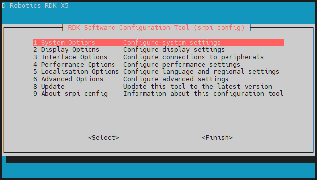
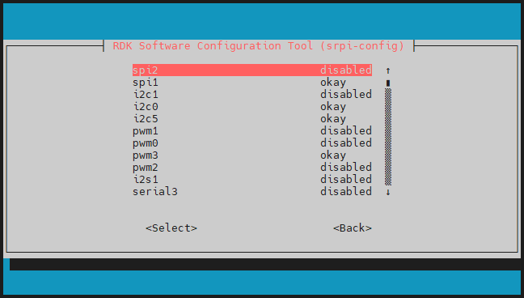
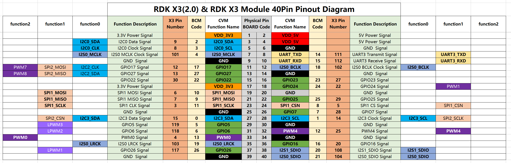

# 3.3.1 Pin Configuration and Definition

For the 40-pin on the development board, please refer to the [40-Pin GPIO Definition](./40pin_define) section for interface definitions.

## Pin Multiplexing Configuration

The 40-pin are enabled with default configurations for UART, SPI, I2C, I2S, and other dedicated functions as shown in the [40-Pin GPIO Definition](#40pin_define). If you want to configure specific pins as GPIO, you need to use the `srpi-config` graphical configuration tool.

Note that the `srpi-config` program needs to run in a **full-screen command-line window**. Perform the following steps:

```
sudo srpi-config
```




After selecting `3 Interface Options` -> `I3 Peripheral bus config`, you will enter the following bus configuration interface:



- **`okay`:** Configures the corresponding pin for its dedicated function.  
- **`disabled`:** Disables the pin's dedicated function, allowing it to be used as a GPIO.  
- **Note:** Configuration changes take effect **after a restart**.

#### Navigation Instructions
- Use **Up/Down keys** on the keyboard to select a function item, press **Enter** to toggle the function.  
- Use **Left/Right keys** on the keyboard to choose between `Select` and `Exit`, press **Enter** to confirm.


## 40-Pin Definition{#40pin_define}

The development board provides a 40-pin standard interface for convenient peripheral expansion. The digital I/Os use a 3.3V voltage level. The pin definitions for the 40-pin interface are as follows:


The development board has silk screen markings on the 40-pin interface to facilitate operation. The locations of PIN1 and PIN40 are as follows:


:::info
The RDK X3 Module provides the 40-pin GPIOs and their definitions as follows:
:::


:::info
The RDK Ultra provides the 40-pin GPIOs and their definitions as follows:
:::


## GPIO Read/Write Operation Example

**Video Reference:** [Watch on Bilibili](https://www.bilibili.com/video/BV1rm4y1E73q/?p=16)

The development board includes various 40-pin GPIO pin function test codes in the `/app/40pin_samples/` directory, such as GPIO input/output testing, PWM, I2C, SPI, and UART tests. All test programs are written in Python. Detailed information about each module can be found in other sections of this chapter.

For example, in `/app/40pin_samples/button_led.py`, the program configures pin `37` as input and pin `36` as output. The output state of pin `36` is controlled based on the input state of pin `37`.

### Environment Setup
Use Dupont wires to connect pin `37` to 3.3V or GND to control its voltage level.


### Execution Steps
Run the `button_led.py` program to start the GPIO read/write operation:

```bash
sunrise@ubuntu:~$ cd /app/40pin_samples/
sunrise@ubuntu:/app/40pin_samples$ sudo python3 ./button_led.py
```
## Expected Output
By controlling the voltage level of pin `37`, the output level of pin `36` will change accordingly.

```bash
sunrise@ubuntu:/app/40pin_samples$ sudo python3 ./button_led.py
Starting demo now! Press CTRL+C to exit
Outputting 0 to Pin 36
Outputting 1 to Pin 36
Outputting 0 to Pin 36
```