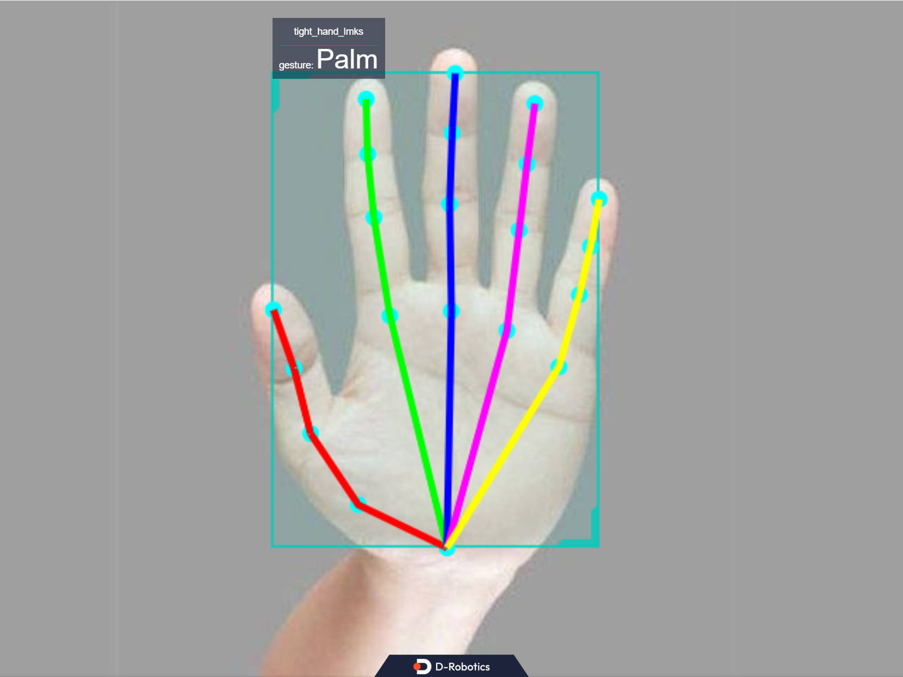

# Hand Keypoints and Gesture Recognition (Mediapipe)

```mdx-code-block
import Tabs from '@theme/Tabs';
import TabItem from '@theme/TabItem';
```

## Introduction

The hand keypoint detection algorithm example subscribes to images and smart messages containing hand bounding box information, uses BPU for algorithm inference, and publishes algorithm messages containing hand keypoints and gesture information.

The hand keypoint indices are shown in the following diagram:


Code Repositories:

 (https://github.com/D-Robotics/palm_detection_mediapipe)

 (https://github.com/D-Robotics/hand_landmarks_mediapipe)

The gesture recognition categories supported by the algorithm, along with their corresponding numerical values in the algorithm message (Attribute member, type "gesture"), are as follows:

| Gesture    | Description   | Value |
| ---------- | ------------- | ----- |
| ThumbUp    | Thumbs up     | 2     |
| Victory    | "V" gesture   | 3     |
| Mute       | mute gesture  | 4     |
| Palm       | Palm          | 5     |
| Okay       | OK gesture    | 11    |
| ThumbLeft  | Thumb left    | 12    |
| ThumbRight | Thumb right   | 13    |
| Awesome    | "666" gesture | 14    |

Application scenarios: Gesture recognition algorithms integrate hand keypoint detection, gesture analysis, and other technologies, enabling computers to interpret human gestures as corresponding commands. It can be used for gesture control, sign language translation, and other functions, primarily in the fields of smart homes, smart cabins, smart wearables, etc.

Example of gesture-controlled car: [Car Gesture Control](../../apps/car_gesture_control)

## Supported Platforms

| Platform                             | System | Function                                 |
| -------------------------------- | ------------ | ----------------------------------------------- |
| RDK S100 | Ubuntu 22.04 (Humble) | Start MIPI/USB camera and display inference results via web |

## Algorithm Information

| Model | Platform | Input Size | Inference FPS |
| ---- | ---- | ------------ | ---- |
| mediapipe | S100 | 224x224 | 1114 |

## Preparations

### RDK

1. RDK is flashed with  Ubuntu 20.04/22.04 system image provided by D-Robotics.

2. TogetheROS.Bot has been successfully installed on RDK.

3. The RDK is installed with a MIPI or USB camera.

4. Confirm that the PC can access the RDK through the network.

## Usage

The gesture recognition package (hand_landmarks_mediapipe) subscribes to the hand key point detection package and publishes the hand key point detection results. After inference, it publishes the algorithm message. The WebSocket package is used to display the images and corresponding algorithm results on the PC browser.


**Use MIPI Camera to Publish Images**


<Tabs groupId="tros-distro">

<TabItem value="humble" label="Humble">

```bash
# Configure the tros.b environment
source /opt/tros/humble/setup.bash
```

</TabItem>

</Tabs>

```shell
# Copy the configuration file required for running the example from the installation path of tros.b.
cp -r /opt/tros/${TROS_DISTRO}/lib/palm_detection_mediapipe/config/ .
cp -r /opt/tros/${TROS_DISTRO}/lib/hand_landmarks_mediapipe/config/ .

# Configuring MIPI camera
export CAM_TYPE=mipi

# Start the launch file
ros2 launch hand_landmarks_mediapipe hand_landmarks.launch.py
```

**Use USB Camera to Publish Images**


<Tabs groupId="tros-distro">

<TabItem value="humble" label="Humble">

```bash
# Configure the tros.b environment
source /opt/tros/humble/setup.bash
```

</TabItem>

</Tabs>

```shell
# Copy the configuration file required for running the example from the installation path of tros.b.
cp -r /opt/tros/${TROS_DISTRO}/lib/palm_detection_mediapipe/config/ .
cp -r /opt/tros/${TROS_DISTRO}/lib/hand_landmarks_mediapipe/config/ .

# Configuring USB camera
export CAM_TYPE=usb

# Start the launch file
ros2 launch hand_landmarks_mediapipe hand_landmarks.launch.py
```

**Use local image**

```bash
# Configure the tros.b environment
source /opt/tros/humble/setup.bash
```

<Tabs groupId="tros-distro">

<TabItem value="humble" label="Humble">

```bash
# Copy the configuration file required for running the example from the installation path of tros.b.
cp -r /opt/tros/${TROS_DISTRO}/lib/palm_detection_mediapipe/config/ .
cp -r /opt/tros/${TROS_DISTRO}/lib/hand_landmarks_mediapipe/config/ .

# Configuring local image
export CAM_TYPE=fb

# Start the launch file
ros2 launch hand_landmarks_mediapipe hand_landmarks.launch.py publish_image_source:=config/example.jpg publish_image_format:=jpg publish_output_image_w:=640 publish_output_image_h:=480
```

## Analysis of Results

The following information will be displayed in the terminal output:

```shell
[palm_detection_mediapipe-4] [DNN]: 3.7.3_(4.2.11 HBRT)
[hand_landmarks_mediapipe-3] [WARN] [1757389272.651945922] [mono2d_hand_lmk]: Get model name: hand_224_224 from load model.
[palm_detection_mediapipe-4] [WARN] [1757389272.653466536] [mono2d_palm_det]: Get model name: palm_det_192_192 from load model.
[palm_detection_mediapipe-4] [WARN] [1757389272.657688231] [mono2d_palm_det]: Enabling zero-copy
[palm_detection_mediapipe-4] [WARN] [1757389272.657755005] [mono2d_palm_det]: Create hbmem_subscription with topic_name: /hbmem_img
[hand_landmarks_mediapipe-3] [WARN] [1757389272.658734823] [mono2d_hand_lmk]: Enabling zero-copy
[hand_landmarks_mediapipe-3] [WARN] [1757389272.658829973] [mono2d_hand_lmk]: Create hbmem_subscription with topic_name: /hbmem_img
[hand_landmarks_mediapipe-3] [WARN] [1757389272.679073504] [mono2d_hand_lmk]: Loaned messages are only safe with const ref subscription callbacks. If you are using any other kind of subscriptions, set the ROS_DISABLE_LOANED_MESSAGES environment variable to 1 (the default).
[palm_detection_mediapipe-4] [WARN] [1757389272.679083479] [mono2d_palm_det]: Loaned messages are only safe with const ref subscription callbacks. If you are using any other kind of subscriptions, set the ROS_DISABLE_LOANED_MESSAGES environment variable to 1 (the default).
[hand_landmarks_mediapipe-3] [WARN] [1757389272.679384552] [mono2d_hand_lmk]: SharedMemImgProcess Recved img encoding: nv12, h: 480, w: 640, step: 640, index: 0, stamp: 1757389272_411007134, data size: 460800, comm delay [268.3575]ms
[palm_detection_mediapipe-4] [WARN] [1757389272.679384452] [mono2d_palm_det]: SharedMemImgProcess Recved img encoding: nv12, h: 480, w: 640, step: 640, index: 0, stamp: 1757389272_411007134, data size: 460800, comm delay [268.3576]ms
[hand_landmarks_mediapipe-3] [WARN] [1757389273.715343396] [mono2d_hand_lmk]: input fps: 13.58, out fps: 13.94, infer time ms: 71, post process time ms: 1
[palm_detection_mediapipe-4] [WARN] [1757389273.723452363] [mono2d_palm_det]: input fps: 13.59, out fps: 13.94, infer time ms: 71, post process time ms: 0
[palm_detection_mediapipe-4] [WARN] [1757389275.711869066] [mono2d_palm_det]: SharedMemImgProcess Recved img encoding: nv12, h: 480, w: 640, step: 640, index: 33, stamp: 1757389275_710984298, data size: 460800, comm delay [0.8785]ms
[hand_landmarks_mediapipe-3] [WARN] [1757389275.711873416] [mono2d_hand_lmk]: SharedMemImgProcess Recved img encoding: nv12, h: 480, w: 640, step: 640, index: 33, stamp: 1757389275_710984298, data size: 460800, comm delay [0.8835]ms
[hobot_codec_republish-2] [WARN] [1757389277.211724002] [hobot_codec_decoder]: Pub img fps [9.66]
[hand_landmarks_mediapipe-3] [WARN] [1757389278.811834846] [mono2d_hand_lmk]: SharedMemImgProcess Recved img encoding: nv12, h: 480, w: 640, step: 640, index: 64, stamp: 1757389278_810957877, data size: 460800, comm delay [0.8710]ms
```

The output log shows that the program runs successfully, with a single inference time of 0.87ms after initialization.

Enter http://IP:8000 in a PC browser to view the images and algorithm rendering effects (IP is the RDK's IP address):


