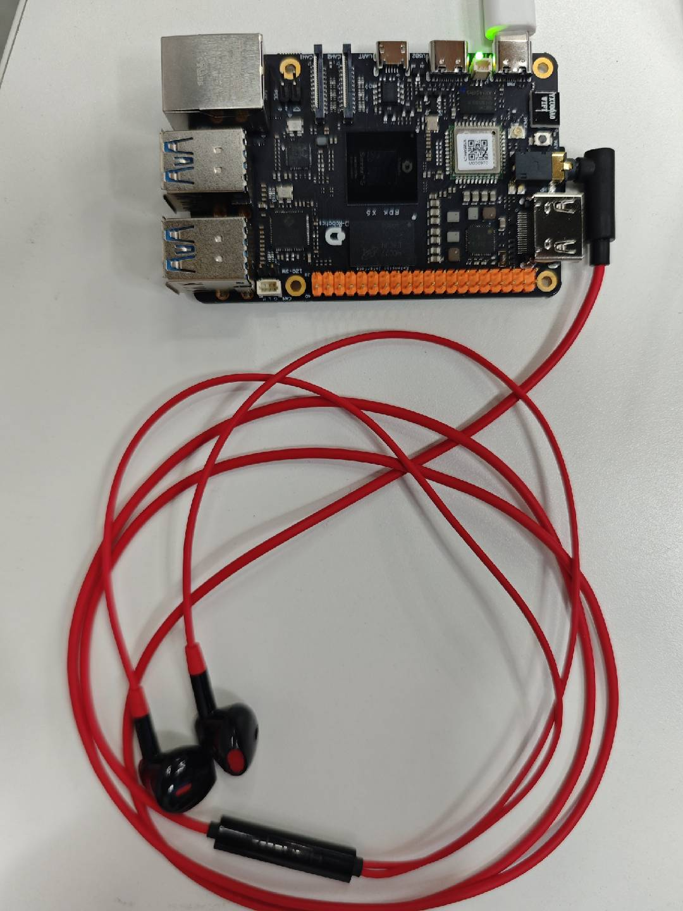

# 5.4.10 Vision & Speech Box

```mdx-code-block
import Tabs from '@theme/Tabs';
import TabItem from '@theme/TabItem';
```

## Overview

This section introduces how to experience the full pipeline of ASR + VLM/LLM + TTS on the RDK platform.

Code repository: (https://github.com/D-Robotics/hobot_llamacpp.git)

## Supported Platforms

| Platform                        | OS/Environment         | Example Feature         |
| ------------------------------- | ---------------------- | ---------------------- |
| RDK X5 (4GB RAM)                | Ubuntu 22.04 (Humble)  | Vision & Speech Box    |

**Note: Only supported on RDK X5 with 4GB RAM.**

## Preparation

### RDK Platform

1. RDK must be the 4GB RAM version.
2. RDK should be flashed with Ubuntu 22.04 system image.
3. TogetheROS.Bot should be successfully installed on RDK.
4. Install the ASR module for speech input with `apt install tros-humble-sensevoice-ros2`.

## Usage

### On RDK Platform

- You can use the Vision Language Model [Vision Language Model](../02_quick_demo/hobot_llamacpp.md)

- You can use the TTS tool [Text-to-Speech](../02_quick_demo/hobot_tts.md)

- ASR tool should be installed

- The RDK device has a 3.5mm headphone jack, and a wired headset should be plugged in. After plugging in, check if the audio device is detected:

```bash
root@ubuntu:~# ls /dev/snd/

by-path  controlC1  pcmC1D0c  pcmC1D0p  timer
```

The audio device name should be "hw:1,0" as shown.



### Instructions

```bash
# Configure tros.b environment
source /opt/tros/humble/setup.bash
```

**Using MIPI Camera for Image Publishing**

```shell
cp -r /opt/tros/${TROS_DISTRO}/lib/hobot_llamacpp/config/ .
# Set up MIPI camera
export CAM_TYPE=mipi
ros2 launch hobot_llamacpp llama_vlm.launch.py audio_device:=hw:1,0
```

**Using USB Camera for Image Publishing**

```shell
cp -r /opt/tros/${TROS_DISTRO}/lib/hobot_llamacpp/config/ .
# Set up USB camera
export CAM_TYPE=usb
ros2 launch hobot_llamacpp llama_vlm.launch.py audio_device:=hw:1,0
```

**Using Local Images for Playback**

```shell
cp -r /opt/tros/${TROS_DISTRO}/lib/hobot_llamacpp/config/ .
# Set up local image playback
export CAM_TYPE=fb
ros2 launch hobot_llamacpp llama_vlm.launch.py audio_device:=hw:1,0
```

After starting the program, you can interact with the device via voice prompts. Usage: Wake up the device by saying "Hello", then give it a task, such as "Please describe this image". After receiving the task, the device will reply "Okay", then wait for the device to finish inference and start outputting text.

Example flow:

1. User: "Hello, describe this image."

2. Device: "Okay, let me take a look."

3. Device: "This image shows xxx."

## Advanced Features

Besides supporting vision-language large models, this package also supports using pure language models for conversation:

```bash
# Configure tros.b environment
source /opt/tros/humble/setup.bash
```

```shell
cp -r /opt/tros/${TROS_DISTRO}/lib/hobot_llamacpp/config/ .

ros2 launch hobot_llamacpp llama_llm.launch.py llamacpp_gguf_model_file_name:=Qwen2.5-0.5B-Instruct-Q4_0.gguf audio_device:=hw:1,0 
```

After starting the program, you can interact with the device via voice prompts. Usage: After device initialization, it will say "I'm here"; wake up the device by saying "Hello", then give it a task, such as "How should I relax on weekends?". The device will start inference and output the response.

1. Device: "I'm here"

2. User: "Hello, how should I relax on weekends?"

3. Device: "Rest is important. You can read, listen to music, paint, or exercise."

## Notes

1. About the ASR module: After ASR starts, even if the wake word is not detected, logs will be output to the serial port. You can speak to check if detection works. If not, check device status and number with `ls /dev/snd/`.

2. About wake word: Sometimes the "Hello" wake word may not be recognized, causing no output. If abnormal, check the logs for `[llama_cpp_node]: Recved string data: xxx` to see if text is recognized.

3. About audio devices: It is recommended to use the same device for recording and playback to avoid echo. If not, you can modify the device name by searching for `audio_device` in `/opt/tros/${TROS_DISTRO}/share/hobot_llamacpp/launch/llama_vlm.launch.py`.

4. About model selection: Currently, the VLM model only supports the large model provided in this example. The LLM model supports inference using GGUF-converted models from https://huggingface.co/models?search=GGUF.