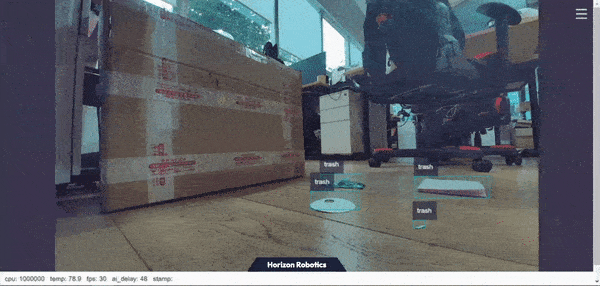

# 5.5.5 Garbage Detection

```mdx-code-block
import Tabs from '@theme/Tabs';
import TabItem from '@theme/TabItem';
```

## Introduction

The mono2d_trash_detection package is an example of 2D garbage object detection algorithm developed based on the hobot_dnn package. Unlike previous functionality demonstrations, this example will demonstrate how to train models based on open-source frameworks, convert models using the Horizon toolchain, and deploy the algorithm in the Horizon Robot Operating System.

This package supports subscribing to topics of type sensors/msg/Image directly and supports inferring using local images. The algorithm information is published through topics and the results are rendered and visualized on a web page. When inferring with local images, the rendered images are saved in the current directory.

Code repository:  `https://github.com/HorizonRDK/mono2d_trash_detection.git`

Application scenarios: Indoor and outdoor garbage detection, identifying garbage in scenes, can be used with robots for garbage finding and picking (in combination with robotic arms) in APP design.

This package uses the open-source framework [PaddlePaddle](https://github.com/PaddlePaddle/PaddleDetection.git) and the [PPYOLO](https://github.com/PaddlePaddle/PaddleDetection/tree/release/2.5) model for garbage detection task design and training. The specific model configuration is [ppyolo_r18vd_coco.yml](https://github.com/PaddlePaddle/PaddleDetection/blob/release/2.5/configs/ppyolo/ppyolo_r18vd_coco.yml).

The supported object detection categories for the algorithm are as follows:

| Category | Description | Data Type |
| -------- | ----------- | -------- |
| Trash    | Garbage box | Roi      |

## Supported Platforms

| Platform         | System | Function                                             |
| ---------------- | -------------- | ------------------------------------------------------------ |
| RDK X3, RDK X3 Module | Ubuntu 20.04 (Foxy), Ubuntu 22.04 (Humble) | · Start MIPI/USB camera/local image inference, render and display results on the web/save locally |

## Preparation

Since we do not consider the internal structure information of the algorithm model during deployment, we only focus on the pre-processing and post-processing steps of the algorithm. The pre-processing steps include image reading and image resizing, while the post-processing steps include detection header decoders and non-maximum suppression (NMS). These pre-processing and post-processing methods are consistent across most similar models and have strong universality. Therefore, the basic deployment package can be used for quick deployment.

The Horizon Robot Operating System provides the [dnn_node_example](https://github.com/HorizonRDK/hobot_dnn/tree/develop/dnn_node_example) deployment package for rapid deployment of basic algorithms. The currently supported common algorithms include image classification, 2D object detection, and semantic segmentation. Among them, 2D object detection integrates Fasterrcnn, Fcos, yolov2, yolov3, yolov5, SSD, and efficientnet for user selection.

In this example, the [dnn_node_example](https://github.com/HorizonRDK/hobot_dnn/tree/develop/dnn_node_example) is used to adapt custom detection models by replacing the Horizon cross-compiled model, post-processing configuration files, and detection category configuration files.

If the pre-processing and post-processing steps are different from the above models and cannot be adapted quickly, the custom deployment method can refer to the [dnn_node_sample](https://github.com/HorizonRDK/hobot_dnn/tree/develop/dnn_node_example) example.

### Horizon RDK

1. The Horizon RDK has been flashed with the  Ubuntu 20.04/22.04 system image provided by Horizon.

2. TogetheROS.Bot has been successfully installed on the Horizon RDK.

3. Obtain the Horizon cross-compiled model (such as [ppyolo_trashdet_416x416_nv12.bin](https://github.com/HorizonRDK/mono2d_trash_detection/blob/develop/config/ppyolo_trashdet_416x416_nv12.bin)) in this example.4. Post-processing configuration file (such as [ppyoloworkconfig.json](https://github.com/HorizonRDK/mono2d_trash_detection/blob/develop/config/ppyoloworkconfig.json) in this example)

5. Detection category configuration file (such as [trash_coco.list](https://github.com/HorizonRDK/mono2d_trash_detection/blob/develop/config/trash_coco.list) in this example)

### X86

1. X86 environment has been configured with Ubuntu 20.04 system image.

2. Tros.b has been successfully installed on the X86 environment.

3. Obtain the Horizon cross-compiled model (such as [ppyolo_trashdet_416x416_nv12.bin](https://github.com/HorizonRDK/mono2d_trash_detection/blob/develop/config/ppyolo_trashdet_416x416_nv12.bin) in this example).

4. Post-processing configuration file (such as [ppyoloworkconfig.json](https://github.com/HorizonRDK/mono2d_trash_detection/blob/develop/config/ppyoloworkconfig.json) in this example).

5. Detection category configuration file (such as [trash_coco.list](https://github.com/HorizonRDK/mono2d_trash_detection/blob/develop/config/trash_coco.list) in this example).

## Post-processing Configuration

The config_file configuration file is in JSON format. In this example, the file is [ppyoloworkconfig.json](https://github.com/HorizonRDK/mono2d_trash_detection/blob/develop/config/ppyoloworkconfig.json). The specific configuration is as follows:

```bash
  {
    "model_file": the path to the model file

    "model_name": the name of the model

    "dnn_Parser": the choice of built-in post-processing algorithm. In this example, "yolov3" is used.

    "model_output_count": the number of output branches of the model

    "class_num": the number of detection categories

    "cls_names_list": the specific labels of detection categories

    "strides": the stride of each output branch

    "anchors_table": the preset anchor ratios

    "score_threshold": the confidence score threshold

    "nms_threshold": the IOU threshold for NMS post-processing

    "nms_top_k": the number of selected boxes for NMS post-processing
  }
```

Note: The actual size of each preset anchor is anchors_table x strides.

## Usage

Complete algorithm development and deployment workflow diagram:


The first step, Paddle model training, and the second step, toolchain model conversion, will be introduced in the links below. Here, we will mainly introduce the on-board deployment process.

Model training: [PPYOLO Trash Detection + Horizon RDK Deployment (Part 1)](https://aistudio.baidu.com/aistudio/projectdetail/4606468?contributionType=1)

Model conversion: [PPYOLO Trash Detection + Horizon RDK Deployment (Part 2)](https://aistudio.baidu.com/aistudio/projectdetail/4754526?contributionType=1)

The package publishes algorithm messages that include semantic segmentation and object detection information, which users can subscribe to for application development.

### Horizon RDK

**Publish Images using MIPI camera**

<Tabs groupId="tros-distro">
<TabItem value="foxy" label="Foxy">

```bash
# Configure the tros.b environment
source /opt/tros/setup.bash
```

</TabItem>

<TabItem value="humble" label="Humble">

```bash
# Configure the tros.b environment
source /opt/tros/humble/setup.bash
```

</TabItem>

</Tabs>

```shell
# Copy the required configuration files from the tros installation path.
cp -r /opt/tros/lib/mono2d_trash_detection/config/ .

# Configure MIPI camera
export CAM_TYPE=mipi

# Launch the launch file
ros2 launch dnn_node_example dnn_node_example.launch.py dnn_example_config_file:=config/ppyoloworkconfig.json dnn_example_msg_pub_topic_name:=ai_msg_mono2d_trash_detection dnn_example_image_width:=1920 dnn_example_image_height:=1080
```

**Publish Images using USB camera**

<Tabs groupId="tros-distro">
<TabItem value="foxy" label="Foxy">

```bash
# Configure the tros.b environment
source /opt/tros/setup.bash
```

</TabItem>

<TabItem value="humble" label="Humble">

```bash
# Configure the tros.b environment
source /opt/tros/humble/setup.bash
```

</TabItem>

</Tabs>

```shell
# Copy the required configuration files from the tros installation path.
cp -r /opt/tros/lib/mono2d_trash_detection/config/ .

# Configure USB camera
export CAM_TYPE=usb

# Launch the launch file
ros2 launch dnn_node_example dnn_node_example.launch.py dnn_example_config_file:=config/ppyoloworkconfig.json dnn_example_msg_pub_topic_name:=ai_msg_mono2d_trash_detection dnn_example_image_width:=1920 dnn_example_image_height:=1080
```

**Use A Local Image Offline**

<Tabs groupId="tros-distro">
<TabItem value="foxy" label="Foxy">

```bash
# Configure the tros.b environment
source /opt/tros/setup.bash
```

</TabItem>

<TabItem value="humble" label="Humble">

```bash
# Configure the tros.b environment
source /opt/tros/humble/setup.bash
```

</TabItem>

</Tabs>

```shell
# Copy the configuration files needed for running the example from the installation path of tros.
cp -r /opt/tros/lib/mono2d_trash_detection/config/ .

# Launch the launch file
ros2 launch dnn_node_example dnn_node_example_feedback.launch.py dnn_example_config_file:=config/ppyoloworkconfig.json dnn_example_image:=config/trashDet0028.jpg
```

## Result Analysis

**Using mipi camera to publish images**

After package initialization, the following information will be output to the terminal:

```shell
[example-3] [WARN] [1665644838.299475772] [example]: This is dnn node example!
[example-3] [WARN] [1665644838.439577121] [example]: Parameter:
[example-3]  feed_type(0:local, 1:sub): 1
[example-3]  image: config/test.jpg
[example-3]  image_type: 0
[example-3]  dump_render_img: 0
[example-3]  is_shared_mem_sub: 1
[example-3]  config_file: config/ppyoloworkconfig.json
[example-3]  msg_pub_topic_name_: ai_msg_mono2d_trash_detection
[example-3] [WARN] [1665644838.441379412] [example]: Parameter:
[example-3]  model_file_name: config/ppyolo_trashdet_416x416_nv12.bin
[example-3]  model_name: ppyolo_trashdet_416x416_nv12
[example-3] [WARN] [1665644838.441523485] [example]: model_file_name_: config/ppyolo_trashdet_416x416_nv12.bin, task_num: 4
[example-3] [C][34177][10-13][15:07:18:448][configuration.cpp:49][EasyDNN]EasyDNN version: 0.4.11
[example-3] [BPU_PLAT]BPU Platform Version(1.3.1)!
[example-3] [HBRT] set log level as 0. version = 3.14.5
[example-3] [DNN] Runtime version = 1.9.7_(3.14.5 HBRT)
```[example-3] [WARN] [1665644838.688580704] [dnn]: Run default SetOutputParser.
[example-3] [WARN] [1665644838.688758775] [dnn]: Set output parser with default dnn node parser, you will get all output tensors and should parse output_tensors in PostProcess.
[example-3] [WARN] [1665644838.691224728] [example]: Create ai msg publisher with topic_name: ai_msg_mono2d_trash_detection
[example-3] [WARN] [1665644838.698936232] [example]: Create img hbmem_subscription with topic_name: /hbmem_img
[example-3] [WARN] [1665644839.926634917] [example]: Sub img fps: 32.45, Smart fps: 33.07, infer time ms: 36, post process time ms: 5
[example-3] [WARN] [1665644840.950361855] [example]: Sub img fps: 30.30, Smart fps: 30.21, infer time ms: 40, post process time ms: 3
[example-3] [WARN] [1665644841.971040371] [example]: Sub img fps: 30.39, Smart fps: 30.48, infer time ms: 36, post process time ms: 7
[example-3] [WARN] [1665644842.972618649] [example]: Sub img fps: 29.94, Smart fps: 29.88, infer time ms: 36, post process time ms: 3
[example-3] [WARN] [1665644843.982243911] [example]: Sub img fps: 29.62, Smart fps: 29.70, infer time ms: 36, post process time ms: 3
[example-3] [WARN] [1665644844.995728928] [example]: Sub img fps: 29.79, Smart fps: 29.73, infer time ms: 36, post process time ms: 6
```

The result is as below：



**Use A Local Image Offline**

After initializing the package, output the following information on the terminal:

```shell
[example-1] [INFO] [1665646256.967568866] [dnn]: The model input 0 width is 416 and height is 416
[example-1] [WARN] [1665646256.967698807] [dnn]: Run default SetOutputParser.
[example-1] [WARN] [1665646256.967754550] [dnn]: Set output parser with default dnn node parser, you will get all output tensors and should parse output_tensors in PostProcess.
[example-1] [INFO] [1665646256.967794962] [dnn impl]: Set default output parser
[example-1] [INFO] [1665646256.967972439] [dnn]: Task init.
[example-1] [INFO] [1665646256.970036756] [dnn]: Set task_num [4]
[example-1] [INFO] [1665646256.970176988] [example]: The model input width is 416 and height is 416
[example-1] [WARN] [1665646256.970260061] [example]: Create ai msg publisher with topic_name: hobot_dnn_detection
[example-1] [INFO] [1665646256.977452592] [example]: Dnn node feed with local image: config/trashDet0028.jpg
[example-1] [INFO] [1665646257.027170005] [dnn]: task id: 3 set bpu core: 2
[example-1] [INFO] [1665646257.057492754] [example]: Output from frame_id: feedback, stamp: 0.0
[example-1] [INFO] [1665646257.063816821] [PostProcessBase]: out box size: 1
[example-1] [INFO] [1665646257.064070497] [PostProcessBase]: det rect: 216.061 223.173 317.97 282.748, det type: trash, score:0.80733
[example-1] [INFO] [1665646257.064206479] [ClassificationPostProcess]: out cls size: 0
[example-1] [INFO] [1665646257.068688365] [ImageUtils]: target size: 1
[example-1] [INFO] [1665646257.068836554] [ImageUtils]: target type: trash, rois.size: 1
[example-1] [INFO] [1665646257.068884048] [ImageUtils]: roi.type: , x_offset: 216 y_offset: 223 width: 101 height: 59
[example-1] [WARN] [1665646257.071375688] [ImageUtils]: Draw result to file: render_feedback_0_0.jpeg
```

The result is as below：

