# 6.2 AMR
Autonomous Mobile Robot (AMR) is a type of robot that can autonomously navigate and perform tasks in an environment. AMR is different from Automated Guided Vehicles (AGVs), which rely on tracks or pre-defined routes and typically require operator supervision. AMR uses various technologies such as multi-sensor fusion, artificial intelligence, and machine learning to understand the environment and navigate within it, without being limited by wired power sources. Due to its highly flexible mobility and intelligent navigation system, AMR has been widely used in industrial automation, logistics, healthcare, and other fields.

## 1.  Example Introduction

### 1.1 Appearance
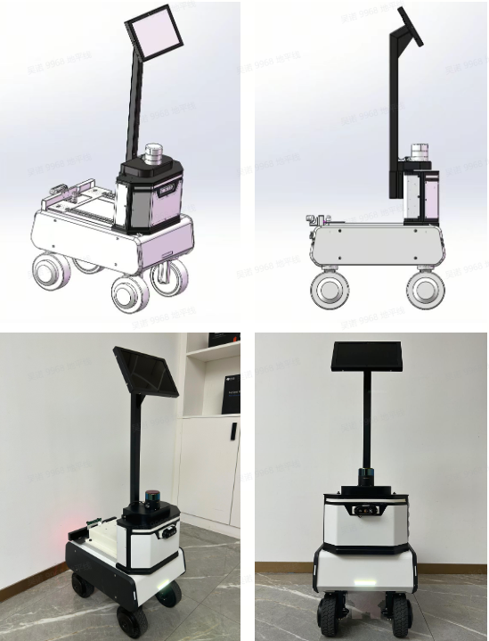

### 1.2 Functional framework

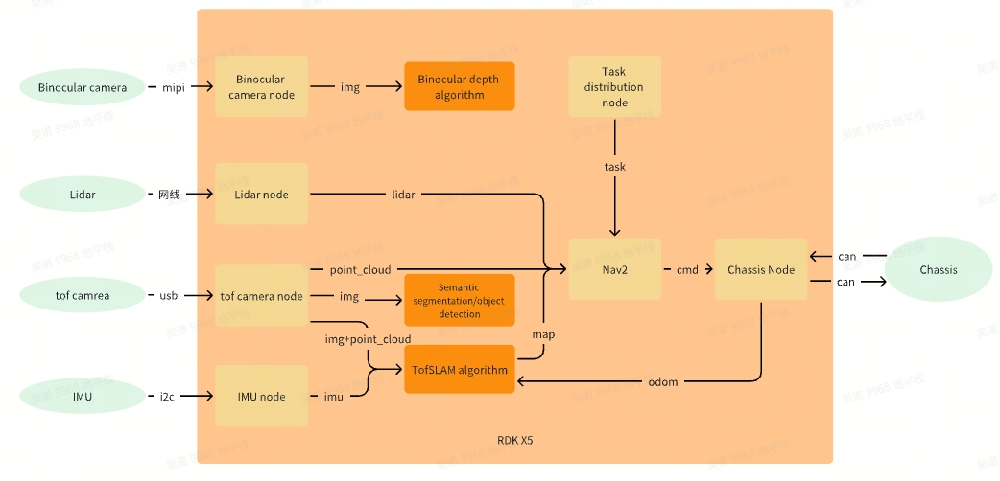

## 2. Assembly Example

### 2.1 Component List
|  Name                     | Number      | notes    |
| -------------------------| ---------| --------|
| RDK X5                   | 1        | D-robotics     |
| AMR chassis（Steering wheel）+ Screws and Parts| 1  | YUHESEN     |
| Single line LiDAR               | 1        | KRUISEE   |
| TOFcamera                 | 1        | DEPTRUM   |
| Binocular camera（230ai）        | 1        |  D-robotics  |
| IMU（BMI088）             | 1        | D-robotics  |
| Network cable(0.3m)        | 1        |    |
| 12v to 5V4A(MAX 5A)        | 1        |    |
| TOF camera stand（3D Printing）        | 1        |    |
| Binocular camera stand（3D Printing）        | 1        |    |
| Cover board（3D Printing）              | 1        |    |
| M2*16 Screws + M2 nuts           | 1        |    |

### 2.2 Assembly steps explanation

#### 2.2.1 Assemble upper shell
The native chassis cannot install cameras or store various cables, so a separate installation is needed to connect to the chassis. Simply align the two holes at the bottom of the installation with the parts on the chassis mounting rail, and tighten the screws

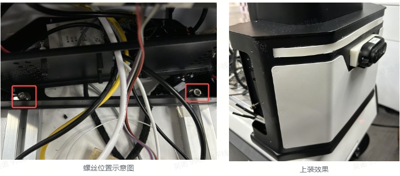

#### 2.2.2 Wiring of RDK X5
All sensors and chassis are directly connected to RDK X5. It should be noted that the binocular camera uses two 22 pin ribbon cables on the same surface. Please install them in the direction shown in the following figure

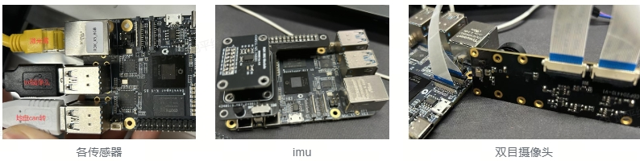

#### 2.2.3 Assemble cover board
The cover plate is a 3D printed part (see the attached drawing at the end of the text), mainly used for installing RDK X5 and storing other cables. The four mounting holes in the yellow frame are used to install RDK X5, located on the back of the upper cover plate. Align the installation holes at the red box position with the parts on the chassis mounting rail, and tighten the screws.

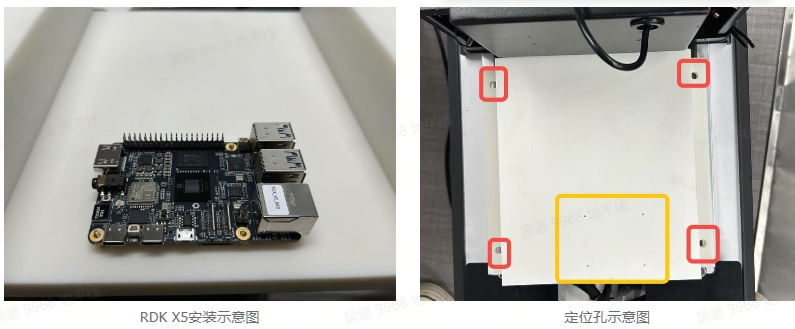

#### 2.2.4 Lidar access
First, install the LiDAR onto the carrier board, screw it onto the back of the carrier board, and then connect the wiring through the holes on the overload board (shown in the yellow box on the right) to the power manager. The power manager is installed on the back of the carrier board, and the screws are installed from the front of the carrier board (as shown in the red box on the left). After installation, the network cable and 12V power supply are connected, and the network cable and power cord pass through the holes on the top (as shown in the red box on the right).

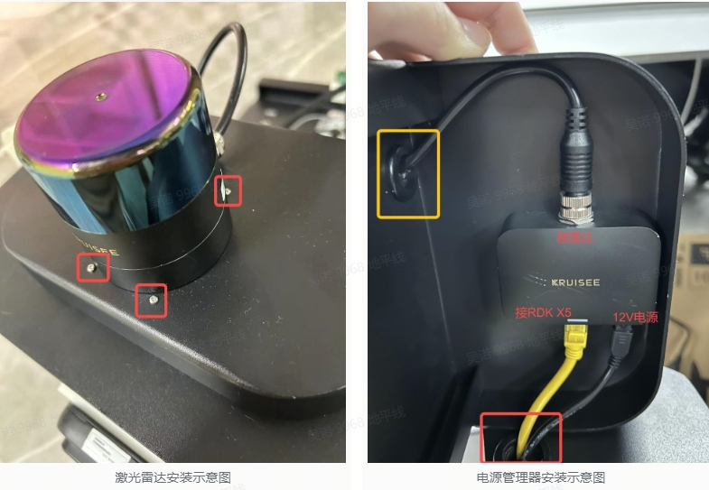

#### 2.2.5 Install camera

#####   1. Install TOF camera
Firstly, connect the TOF camera, 3D printed part, and sheet metal bracket together, paying attention to the groove of the 3D printed part facing downwards. After the connection is completed, insert the entire device into the groove above the upper part, and pass the power and signal wires through the internal holes of the upper part (yellow box in Figure 3). Align the screw holes of the sheet metal parts (red box in Figure 1) with the internal screw holes of the upper assembly (red box in Figure 3), and tighten the screws.

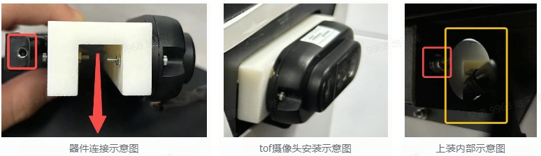

#####   2. Install Binocular camera
First, connect the binocular camera to the 3D printed part, and then connect it to the sheet metal bracket at the rear of the chassis

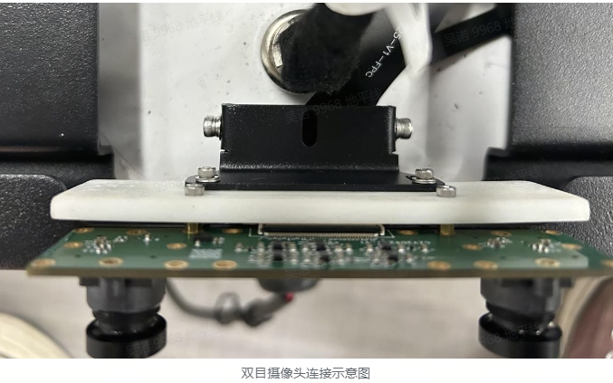

#### 2.2.6 Power supply instructions
A 12V power supply is provided on the chassis. 12V is provided to the radar, TOF camera, and transformer, and the transformer outputs 5V to the RDK X5

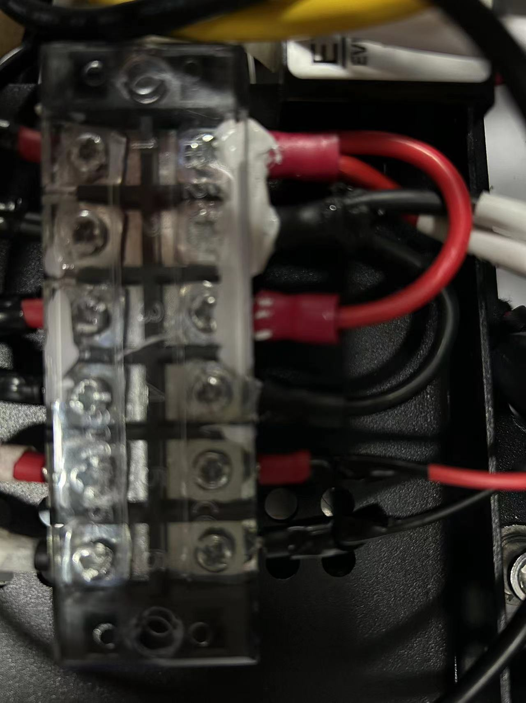

#### 2.2.7 Installation of other components

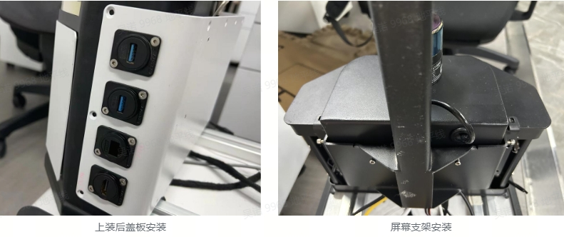

## 3. Preparation of operating environment
:::info attention

Please obtain the code or function package for TOF camera, LiDAR, chassis, and IMU based on the actual device model. Only the source code for the sweet potato accessory IMU is provided here.
:::

### 3.1 Sensors check
#### 3.1.1 Binocular camera
```shell
#Check the i2c device
root@ubuntu:~# i2cdetect -y -r 4
     0  1  2  3  4  5  6  7  8  9  a  b  c  d  e  f
00:                         -- -- -- -- -- -- -- --
10: -- -- -- -- -- -- -- -- -- -- -- -- -- -- -- --
20: -- -- -- -- -- -- -- -- -- -- -- -- -- -- -- --
30: -- -- 32 -- -- -- -- -- -- -- -- -- -- -- -- --
40: -- -- -- -- -- -- -- -- -- -- -- -- -- -- -- --
50: 50 -- -- -- -- -- -- -- 58 -- -- -- -- -- -- --
60: -- -- -- -- -- -- -- -- -- -- -- -- -- -- -- --
70: -- -- -- -- -- -- -- --

root@ubuntu:~# i2cdetect -y -r 6
     0  1  2  3  4  5  6  7  8  9  a  b  c  d  e  f
00:                         -- -- -- -- -- -- -- --
10: -- -- -- -- -- -- -- -- -- -- -- -- -- -- -- --
20: -- -- -- -- -- -- -- -- -- -- -- -- -- -- -- --
30: 30 -- -- -- -- -- -- -- -- -- -- -- -- -- -- --
40: -- -- -- -- -- -- -- -- -- -- -- -- -- -- -- --
50: 50 -- -- -- -- -- -- -- 58 -- -- -- -- -- -- --
60: -- -- -- -- -- -- -- -- -- -- -- -- -- -- -- --
70: -- -- -- -- -- -- -- --
```

#### 3.1.2 Lidar
```shell
#Ensure that the gateway and mask of the Lidar and board are consistent, and confirm if they can be pinged
ping ip of Lidar
```

#### 3.1.3 Chassis
```shell
#Start the CAN device, please set it according to the specific CAN device number and baud rate
ip link set can1 up type can bitrate 500000

#Checking the equipment will result in the following outputs：can1: <NOARP,UP,LOWER_UP> mtu 16 qdisc mq state UP mode DEFAULT group default qlen 10link/can 
ip link show can1

#Check if CAN data can be obtained, please set according to the specific CAN device number
candump can1
```

#### 3.1.4 IMU
```shell
#Check the i2c device
root@ubuntu:~# i2cdetect -y -r 5
     0  1  2  3  4  5  6  7  8  9  a  b  c  d  e  f
00:                         -- -- -- -- -- -- -- --
10: -- -- -- -- -- -- -- -- -- 19 -- -- -- -- -- --
20: -- -- -- -- -- -- -- -- -- -- -- -- -- -- -- --
30: -- -- -- -- -- -- -- -- -- -- -- -- -- -- -- --
40: -- -- -- -- -- -- -- -- -- -- -- -- -- -- -- --
50: -- -- -- -- -- -- -- -- -- -- -- -- -- -- -- --
60: -- -- -- -- -- -- -- -- -- 69 -- -- -- -- -- --
70: -- -- -- -- -- -- -- --

# Obtain IMU data (will print three numbers and change with IMU pose)
cat /sys/devices/virtual/input/input2/acc_bal
cat /sys/devices/virtual/input/input2/gry_bal
```

### 3.2 Function installation
```shell
sudo apt -y tros-hobot-nav2 libsuitesparse-dev libblas-dev liblapack-dev libeigen3-dev libopencv-dev libspdlog-dev libconsole-bridge-dev libpcl-dev libgoogle-glog-dev libtf2-dev  ros-humble-cv-bridge  ros-humble-nav-msgs ros-humble-image-transport ros-humble-tf2-ros ros-humble-pcl-conversions ros-humble-navigation2 libceres-dev
```

### 3.3 Source code acquisition (without installation package function, requires source code compilation)
```shell
mkdir -p ~/amr_ws/src && cd src
#tofSLAM 
git clone https://github.com/wunuo1/Tofslam.git -b humble

#point cloud filter
git clone https://github.com/wunuo1/voxel_filter.git

#Specify location navigation
git clone https://github.com/wunuo1/pose_setter.git

#双目深度
git clone https://github.com/D-Robotics/hobot_stereonet.git
```

### 3.4 Compile code
```shell
#It is recommended to enable swap memory before compilation
sudo fallocate -l 4G /swapfile
sudo chmod 600 /swapfile
sudo mkswap /swapfile
swapon /swapfile

#Before compilation, the g2o feature package needs to be compiled, and the code can be obtained from the attachment at the end of the article
#The compilation method is as follows
cd g2o
mkdir build && cd build
cmake ..
make
make install

#After compiling g2o, you can compile various feature packages of ros2
cd ~/amr_ws
source /opt/tros/humble/setup.bash
colcon build
```

### 3.5 Sensor calibrate
#### 3.5.1 Preparation before sensor calibration
##### 1. Calibration environment preparation (calibration tool is kalibr, here we provide dokcer containing kalibr and other calibration scripts)
###### i. Download Docker files(Baidu Netdisk)
Link: http://pan.baidu.com/s/1yN5aj3quDJU182rYI0AK8A?pwd=31un 
Extracted code：31un
###### ii. Create environment
```shell
#Load Docker
docker load -i ubuntu18.04_calibration.tar

#Check if Docker loads successfully (images with TAG as calibration appear)
docker images

#Generate a contact from an image
docker run -it --privileged -v /home/nuo.wu/share_dir:/share_dir -e DISPLAY=$DISPLAY -e GDK_SCALE -e GDK_DPI_SCALE --net=host ubuntu18.04:calibration /bin/bash
```
###### iii.Docker supports interface display
```shell
# Run on the host side
xhost +local:docker
# Run the following command on the host side
echo $DISPLAY
# Run the following command in Docker
echo $DISPLAY
# Check if the outputs of the two are the same
# If the outputs of the two are different, and the result displayed on the host side is 0, then run the following command in Docker
export DISPLAY=:0
```
##### 2. Prepare calibration board and configure parameters
Both checkerboard and aprilgrid are acceptable (see attachment for aprilgrid file). The size of the checkerboard should be at least 10cm in length, and to avoid errors in extracting or connecting the corners of the checkerboard during calibration, the rows and columns of the checkerboard should be different. The Aprilgrid calibration board is relatively convenient for data acquisition and easy to operate, but it requires high image quality. Therefore, at this stage, it is still recommended to use a checkerboard. The outer dimensions of the calibration board are greater than 1m.

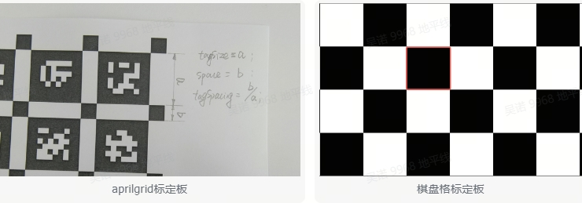

```shell
#Set aprilgrid.yaml file
target_type: 'aprilgrid' #gridtype
tagCols: 6               #number of apriltags
tagRows: 6               #number of apriltags
tagSize: 0.024           #size of apriltag, edge to edge [m]
tagSpacing: 0.3083          #ratio of space between tags to tagSize
codeOffset: 0            #code offset for the first tag in the aprilboard
```

```shell
#Set the parameters of the chessboard calibration board, where targetCols and targetRows are the number of inliers in each column and row, respectively. If the number of squares is 9 columns x8 columns, then the number of inliers is 8 columns x7 columns.
target_type: 'checkboard' 
targetCols: 8 
targetRows: 7  
rawSpacingMeters: 0.1        
colSpacingMeters: 0.1    
```

#### 3.5.2 Binocular camera internal parameter calibration (using binocular depth algorithm)

#####     1. Calibration data collection
Move the camera or calibration board at different distances to ensure that the calibration board covers the FOV range of the image as much as possible. During the movement, do not move the checkerboard calibration board out of the frame. Slowly and steadily move the camera or calibration board to avoid image blurring caused by motion.

######      i. Activate the binocular camera
```shell
source /opt/tros/humble/setup.bash
ros2 run mipi_cam mipi_cam --ros-args -p device_mode:="dual" -p out_format:="nv12" -p dual_combine:=2 -p framerate:=10.0 --log-level warn
```

######      ii. Ros1 and Ros2 message conversion and saving of image dataset (Ubuntu 20.04 system, Ros1 and Ros2 installed)
```shell
# Install ros1_bridge
sudo apt update
sudo apt install ros-humble-ros1-bridge

#Start Terminal
source /opt/ros/noetic/setup.bash
roscore

#Start a new terminal
source /opt/ros/noetic/setup.bash
source /opt/ros/humble/setup.bash
ros2 run ros1_bridge dynamic_bridge --bridge-all-topics=false --bridge-topic sensor_msgs/msg/Image /image_combine_raw

#Start a new terminal to record image data (move the camera to different positions)
source /opt/ros/noetic/setup.bash
rosbag record image_combine_raw
```

######     iii. Call the calibration program for calibration (specify the path of the recorded bag package and the path of the calibration configuration file)
```shell
$1=path_to_bag
$2=path_to_calib_yaml(checkbord.yaml or aprilgrid.yaml)
rosrun kalibr kalibr_calibrate_cameras --bag $1 --topics /camera/left/image_raw /camera/right/image_raw --models pinhole-radtan pinhole-radtan --target $2 --show-extraction
```
######     iv. After calibration is completed, the calibration file is as follows
```yaml
cam0:
  cam_overlaps: [1]
  camera_model: pinhole
  distortion_coeffs: [-0.30512368344314034, 0.06869074995752597, -0.0007768971335288749, -0.0018077365618742228]
  distortion_model: radtan
  intrinsics: [874.7756769752957, 876.9016366753913, 988.9147013767086, 574.9147170323885]
  resolution: [1920, 1080]
  rostopic: /camera/left/image_raw
cam1:
  T_cn_cnm1:
  - [0.9998783828690954, -0.0007967376839525958, 0.015575130180209843, -0.06826569753821157]
  - [0.0008025928358794327, 0.9999996095896897, -0.0003696825565397285, 8.695548926243514e-05]
  - [-0.01557482955949466, 0.0003821380847083855, 0.9998786319622305, 0.0011080079883866683]
  - [0.0, 0.0, 0.0, 1.0]
  cam_overlaps: [0]
  camera_model: pinhole
  distortion_coeffs: [-0.30647450034075296, 0.06904546877578269, -0.0015178028297652521, -0.00016199661118514476]
  distortion_model: radtan
  intrinsics: [875.6405166670517, 877.1839943792446, 963.0392879775055, 519.3086364230766]
  resolution: [1920, 1080]
  rostopic: /camera/right/image_raw
```

#### 3.5.3 Monocular camera internal parameter calibration (used for external parameter calibration of IMU and RGB CAM in the future. If the module already provides internal parameters, ignore this step)
#####    1. Run the camera (please execute the command according to the actual module used)
#####    2. Run the bag recorded as ros1 (the conversion between ros1 and ros2 can refer to binocular intrinsic calibration)
#####    3. Run calibration instructions (in Docker image)
```shell
#cam.bag records the bag file/image camera topic pinhole radtan camera model checkborad.yaml calibration board description file
rosrun kalibr kalibr_calibrate_cameras --bag cam.bag --topic /image --model pinhole-radtan --target checkboard.yaml
```

#####     4. After calibration is completed, the content is as follows (distortion_comffs: distortion coefficients intrinsic: internal parameters)

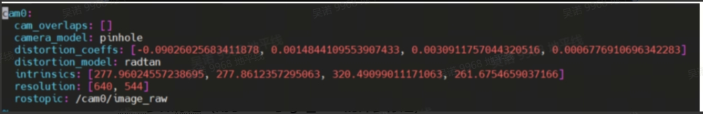


#### 3.5.4 IMU parameter calibration (used for external parameter calibration of IMU and RGB CAM)
#####        1. Data acquisition
######      i. Run imu
```shell
source ~/amr_ws/install/setup.bash 
ros2 launch imu_sensor imu_sensor.launch.py
```

######      ii. Ros1 and Ros2 message conversion and saving of image dataset (Ubuntu 20.04 system, Ros1 and Ros2 installed)
```shell
#Start Terminal
source /opt/ros/noetic/setup.bash
roscore

#Start a new Terminal
source /opt/ros/noetic/setup.bash
source /opt/ros/humble/setup.bash
ros2 run ros1_bridge dynamic_bridge --bridge-all-topics=false --bridge-topic sensor_msgs/msg/Imu /imu_data

#Start a new terminal to record IMU data (IMU needs to be left idle for more than 30 minutes to store data)
source /opt/ros/noetic/setup.bash
rosbag record imu_data
```

######      iii. Modify script file parameters (in Docker environment)
```shell
vim /root/catkin_ws/src/imu_utils/launch/oal.launch

#imu_topic         IMU's topic
#data_save_path    Save path of calibration file
#max_time_min      The duration of collecting IMU data
```
######      iv. Run calibration script (calibration results will be printed after imu bag data playback is complete)
```shell
roslaunch imu_utils oal.lauch
```

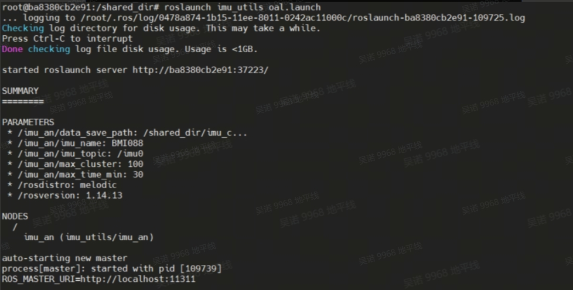

######      v.Play IMU's bag data
```shell
rosbag play imu.bag
```

######    vi. Modify the parameter configuration file of IMU
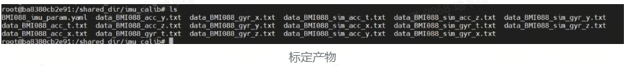

```shell
# Copy a new copy of the BMI088_imu_ param. yaml file generated in the previous text as a backup for future use. Execute the following command:
cp -r BMI088_imu_param.yaml imu.yaml

vim imu.yaml
```

After opening the configuration file, as shown in the following figure:
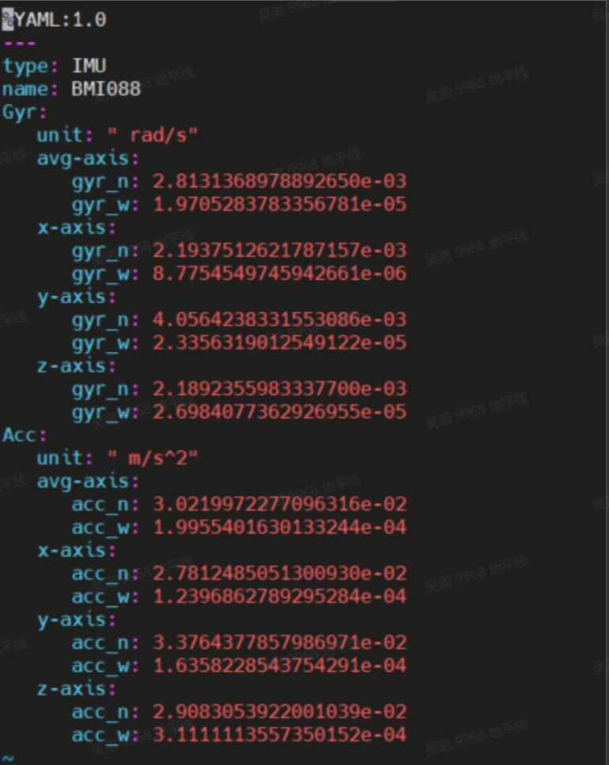

Rewrite the content of the original BMI088_imu_maram.ml file and modify it to the following format:
```yaml
#Accelerometers
accelerometer_noise_density: 3.0219972277096316e-02   #Noise density (continuous-time): Corresponding to Acc ->avg axis ->acc_n in the screenshot above
accelerometer_random_walk:   1.9955401630133244e-04   #Bias random walk: Corresponding to Acc ->avg axis ->accw_ in the screenshot above
 
#Gyroscopes
gyroscope_noise_density:     2.8131368978892658e-03   #Noise density (continuous-time): Corresponding to Gyr ->avg axis ->gyr-n in the screenshot above
gyroscope_random_walk:       1.9705283783356781e-05   #Bias random walk: Corresponding to Gyr ->avg axis ->gyr-w in the screenshot above
 
rostopic:                    /imu_data     #The IMU ROS topic corresponds to the/imu_data in the topic of the data bag generated in rosbag format in the previous section
update_rate:                 400.0      #Hz (for discretization of the values above) corresponds to the actual IMU frequency used
```

#### 3.5.5 Rgb_cam imu extrinsic calibration (used to obtain the transformation of tof_cam imu)
#####     1. Activates binocular cameras
```shell
source /opt/tros/humble/setup.bash
ros2 run mipi_cam mipi_cam --ros-args -p device_mode:="dual" -p out_format:="nv12" -p dual_combine:=2 -p framerate:=10.0 --log-level warn
```

#####    2. Start imu
```shell
source ~/amr_ws/install/setup.bash 
ros2 launch imu_sensor imu_sensor.launch.py
```

#####    3. Ros1 and Ros2 message conversion and saving of image dataset (Ubuntu 20.04 system, Ros1 and Ros2 installed)
```shell
#Install ros1_bridge
sudo apt update
sudo apt install ros-humble-ros1-bridge

#Start terminal
source /opt/ros/noetic/setup.bash
roscore

#Start a new terminal
source /opt/ros/noetic/setup.bash
source /opt/ros/humble/setup.bash
ros2 run ros1_bridge dynamic_bridge --bridge-all-topics

#Start a new terminal to record image data (move the camera to different positions)
source /opt/ros/noetic/setup.bash
rosbag record /image_combine_raw /imu_data
```

#####     4. Run the calibration program
```shell
rosrun kalibr kalibr_calibrate_imu_camera --bag cam_imu.bag --target april.yaml --cam cam.yaml --imu imu.yaml
```

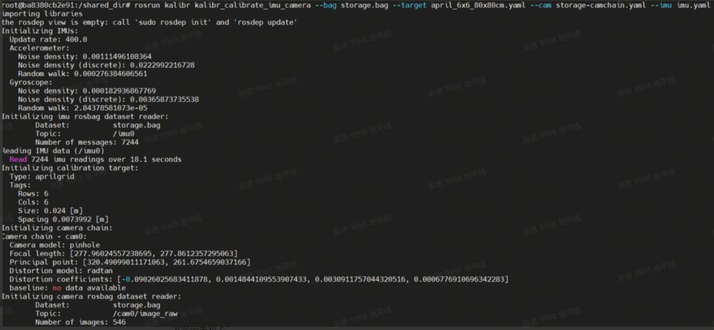

After calibration, check the calibration results (when dJ converges and drops below 0.1, it indicates accurate calibration)
```shell
# storage-results-imucam.txt 
vim storage-results-imucam.txt
```
The external reference results are as follows：
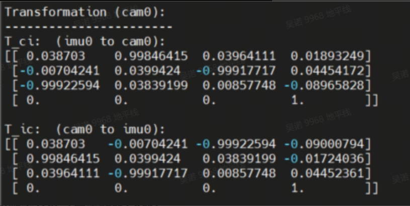

#### 3.5.6 Other
#####    1.  The rgb-cam-tof_cam transformation is provided by the module, and the tof_cam-bask-lonk transformation is provided by the equipment assembly drawing.
#####    2.  The transformation of tof_cam imu (used for tofSLAM) can be obtained by multiplying the transformation matrices of rgb-cam imu and rgb-cam tof_cam
#####    3.  The transformation of bask_link imu (for tofSLAM) can be obtained by multiplying the transformation matrices of tof_cam imu and tof_cam bask_link

### 3.6 Change configuration file (for tofSLAM)
Modify the mapping.yaml file in the config folder and pay attention to the parameters with explanations，the output file is obtained from the attachment at the end of the article
```yaml
YAML: 1.0

preprocess:
  point_filter_num: 3  #Point cloud downsampling
  lidar_type: 7  # 1-AVIA 2-velodyne 3-ouster  4-robosense 5-pandar 6-dtof 7-mtof
  blind: 0.01


common:
  imu_topic: /imu #imu message name 
  lid_topic: /nebula/mtof_points2 #point cloud or lidar message name 
  odom_topic: /odom  # odometer message name 
  img_topic: /camera/color/image_raw/compressed #rgb image message, can be compressed or original image
  Localization_mode: False #Whether to locate, otherwise it is mapping
  output_path: /home/slam_ws_2/output #Path to store mapping products
  model_path: /home/slam_ws_2/output/hfnet.onnx #Specify the hfnet model path
  imuhz: 400 #IMU's frequency
 
mapping:
  extrinsic_est_en: true
  #The change from TOF to IMU can be obtained by referring to the calibration instructions
  tof2imu_extrinsic_T: [ -0.0039799203111821468, -0.027189542185995823831, -0.14001955020902342461]
  tof2imu_extrinsic_R: [-0.993063627638373553564 ,0.052518963674774226572 ,-0.01498737732389914978, 
                        -0.033814436045461613632 ,-0.016796566829113524293 ,-0.99928717438014507495, 
                        -0.00801808196977665167 ,-0.99847864521832871386  ,0.03465425204866725379]
  
  #The change from bsak_link to IMU can be obtained by referring to the calibration instructions
  robot2imu_extrinsic_T: [0.12588064308116462841, 0.008162559660163853708, 0.20705414746130172184]
  robot2imu_extrinsic_R: [0.052268869631951098023, -0.93852017660344945467, 0.033846560965168889575, 
                          0.93808656435923075909, -0.051737213472478319612, 0.015014368436287678477, 
                          0.033019704102458273174        , 0.01675474093936925155, 0.99931446977489903968]


delay_time: 0.3

odometry:
  wheelmode: 1 #0-relativepose 1-velocity
  max_trans_diff: 0.1
  max_drift_num: 15
  surf_res: 0.1 #0.4
  log_print: true
  max_num_iteration: 5
  # ct_icp
  icpmodel: CT_POINT_TO_PLANE  # CT_POINT_TO_PLANE  #CT_POINT_TO_PLANE                    # Options: [CT_POINT_TO_PLANE, POINT_TO_PLANE]
  size_voxel_map: 0.1 #0.4                         # The voxel size of in the voxel map
  min_distance_points: 0.05
  max_num_points_in_voxel: 20                 # The maximum number of points per voxel of the map
  max_distance: 50.0                        # The threshold of the distance to suppress voxels from the map
  weight_alpha: 0.9
  weight_neighborhood: 0.1
  max_dist_to_plane_icp: 0.1 #0.3
  init_num_frames: 20
  voxel_neighborhood: 1
  max_number_neighbors: 20
  threshold_voxel_occupancy: 1
  estimate_normal_from_neighborhood: true
  min_number_neighbors: 20                    # The minimum number of neighbor points to define a valid neighborhood
  power_planarity: 2.0
  num_closest_neighbors: 1

  sampling_rate: 1.0
  ratio_of_nonground: 2
  # max_num_residuals: 1000
  max_num_residuals: 2000
  min_num_residuals: 100
  motion_compensation: CONSTANT_VELOCITY #NONE #CONSTANT_VELOCITY  #CONTINUOUS #NONE, CONSTANT_VELOCITY, ITERATIVE, CONTINUOUS
  beta_location_consistency: 1.0
  beta_orientation_consistency: 1.0
  beta_constant_velocity: 1.0
  beta_small_velocity: 0.0

  thres_translation_norm: 0.03
  thres_orientation_norm: 0.05

  use_ground_constraint: 0

#The following are the positioning function parameters
reloc:
  mapfile: /home/slam_ws_2/output/final-voxel.pcd #PCD point cloud map path, the product of completed mapping
  reloc_mode: 1  #0-scancontext 1-hfnet  2-no   #Relocation detection method, 0 is point cloud detection, 1 is feature point detection
  scancontext_dbfile: /home/slam_ws_2/output/ScanContext.bin #Point cloud detection model path
  hfnet_dbfile: /home/slam_ws_2/output/HFNet.bin #Feature point detection model path
  icp_threshold: 0.03
```

## 4. Functional Experience
### 4.1 TofSLAM creates 3D maps
```shell
#Ensure the completion of all items mentioned in the preparation of the operating environment
#Please ensure that the camera can see the complete apriltag at the beginning of the mapping process, and that all topic parameters match. After running, the map coordinate system will be transformed to apriltag in the output folder
source ~/amr_ws/install/setup.bash
ros2 run demo demo --ros-args -p build_map:=true

#The Localization mode parameter in the config configuration file is set to False, and various topic parameters match
source ~/amr_ws/install/setup.bash
ros2 run ct_lio ct_lio_eskf
```

After startup, it is necessary to let the IMU initialize successfully for 3-4 seconds. Then, the mobile robot can be used for mapping. After the mapping is completed, the program should be closed. After completion, as shown in the following figure:
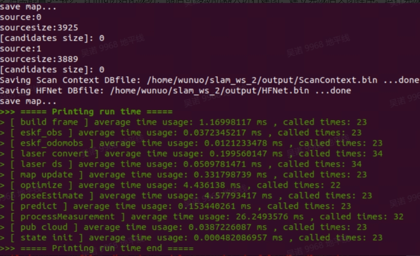

The path specified in the mapping. yaml file will generate the following products
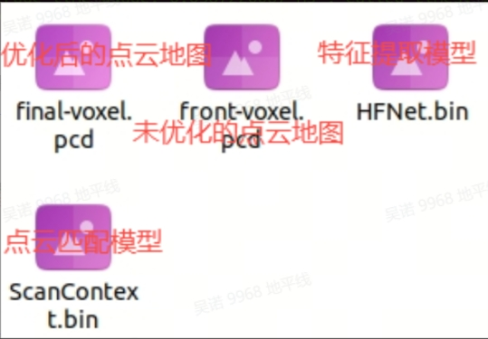

Use the pcl_viewer tool to view point cloud maps:
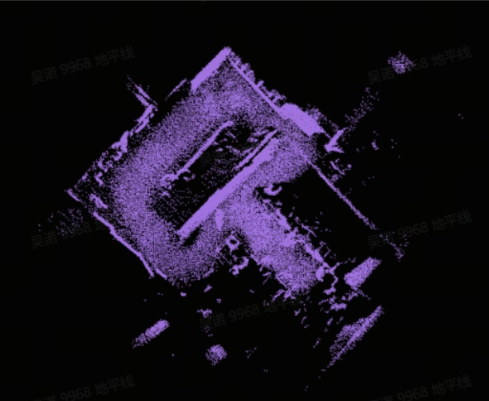

Architectural effect video: https://www.youtube.com/watch?v=TKRYnEfsEoQ&list=PLSxjn4YS2IuFUWcLGj2_uuCfLYnNYw6Ld&index=20

### 4.2 TofSLAM-positioning
```shell
#Ensure that all items mentioned in the preparation of the running environment are completed, the Localization_made parameter in the config configuration file is set to True, and all types of topic parameters match
source ~/amr_ws/install/setup.bash
ros2 run ct_lio ct_lio_eskf
```
After startup, if the display frame number remains at 1, it means that the relocation has not been successful yet
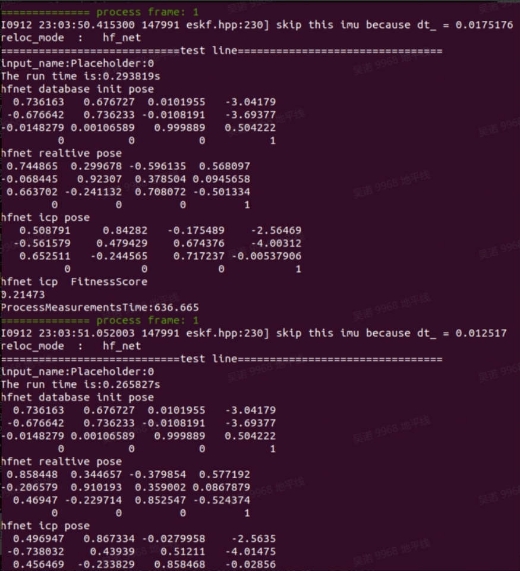
When the frame number is greater than 1, it indicates successful relocation, and rviz2 can be opened to view the path

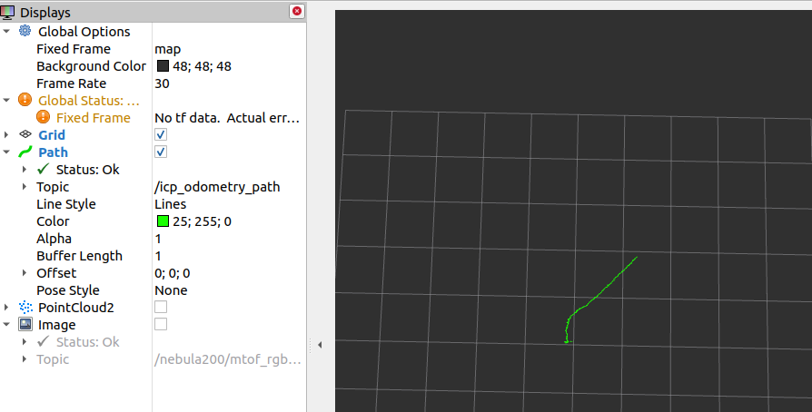

### 4.3 Convert 3D point cloud map to 2D grid map
This feature pack is an open-source feature pack for ros1. Please use it in an environment where ros1 is already installed. The usage method is as follows:

####  1. Source code download and compilation
```shell
mkdir -p ~/pcd3d-2d/src && cd ~/pcd3d-2d/src
git clone https://github.com/Hinson-A/pcd2pgm_package
cd ..
source /opt/ros/noetic/setup.bash
catkin_make
```

####   2. Operation function
```shell
source /opt/ros/noetic/setup.bash
source ~/pcd3d-2d/devel/setup.bash

#Replace the pcd file path in the launch file with the actual path
roslaunch pcd2pgm run.launch
```

####  3. Save map
```shell
#Open a new terminal (requiring installation of ros nometic map server)
source /opt/ros/noetic/setup.bash
rosrun map_server map_saver
```
After execution, map.pgm and map.yaml files will be generated in the current path. These two files can be used for Nav2, but when using them, the files in the maps folder of hobot_nav2 need to be replaced. The general path is/opt/dros/humble/share/hobot_nav2/maps. The point cloud map and raster map effects are as follows:
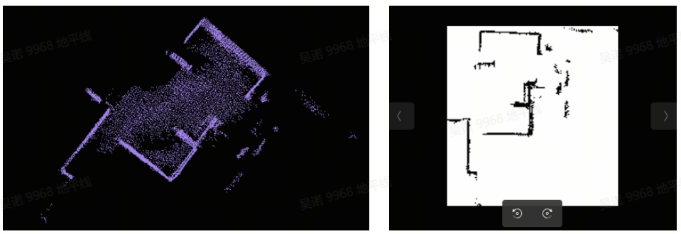

### 4.4 Fixed-point navigation
####   1. Activate TOF camera, LiDAR, chassis, IMU
```shell
#Please start each sensor according to the actual device operation instructions. Only the IMU start instruction is provided here
source /opt/tros/humble/setup.bash
ros2 launch imu_sensor imu_sensor.launch.py

#Open a new terminal and start point cloud filtering
ros2 run point_cloud_processing point_cloud_sparsification
```

####   2. Activate Nav2 navigation function
```shell
source /opt/tros/humble/setup.bash
ros2 launch hobot_nav2 hobot_nav2_bringup.launch.py
```

####   3. Activate the fixed-point navigation function (ensure that the complete AprilTag can be seen in the camera image after activation)
```shell
source ~/amr_ws/install/setup.bash
ros2 run demo demo
```

####  4. Open rviz on PC to view navigation effects
```shell
ros2 launch nav2_bringup rviz_launch.py
```
Video: https://www.youtube.com/watch?v=IYsS2bADpeQ&list=PLSxjn4YS2IuFUWcLGj2_uuCfLYnNYw6Ld&index=21

### 4.5 Object detection and segmentation
####  1. Copy the launch script to the board and change the corresponding parameters:
```shell
import os
from launch import LaunchDescription
from launch_ros.actions import Node
from launch.actions import IncludeLaunchDescription
from launch.launch_description_sources import PythonLaunchDescriptionSource, AnyLaunchDescriptionSource
from ament_index_python import get_package_share_directory

def generate_launch_description():
    #Encode the BGR8 images released by the TOF camera into JPEG format for web display
    bgr2jpeg =  Node(
        package='hobot_codec',
        executable='hobot_codec_republish',
        output='screen',
        parameters=[{
            'in_mode': 'ros',
            'in_format': 'bgr8',
            'out_mode': 'ros',
            'out_format': 'jpeg',
            'sub_topic': '/nebula200/stof_rgb/image_raw',
            'dump_output': False
        }],
        arguments=['--ros-args', '--log-level', 'warn']
    )
    #Decoding JPEG images into NV12 for YOLOV8 inference
    jpeg2nv12 =  Node(
        package='hobot_codec',
        executable='hobot_codec_republish',
        output='screen',
        parameters=[{
            'in_mode': 'ros',
            'in_format': 'jpeg',
            'out_mode': 'ros',
            'out_format': 'nv12',
            'channel': 1,
            'sub_topic': '/image_raw/compressed',
            'dump_output': False,
            'pub_topic': '/image'
        }],
        arguments=['--ros-args', '--log-level', 'warn']
    )
    #Run YOLOV8 to detect segmentation
    yolov8 =  Node(
        package='dnn_node_example',
        executable='example',
        output='screen',
        parameters=[{
            'feed_type': 1,
            'is_shared_mem_sub': 0,
            'config_file': 'config/yolov8segworkconfig.json'
        }],
        arguments=['--ros-args', '--log-level', 'warn']
    )
    #Activate the web display function
    web_node = IncludeLaunchDescription(
        PythonLaunchDescriptionSource(
            os.path.join(
                get_package_share_directory('websocket'),
                'launch/websocket.launch.py')),
        launch_arguments={
            'websocket_image_topic': '/image_raw/compressed',
            'websocket_image_type': 'mjpeg',
            'websocket_smart_topic': '/hobot_dnn_detection'
        }.items()
    )

    return LaunchDescription([
        bgr2jpeg,
        jpeg2nv12,
        yolov8,
        web_node
    ])
```

####  2. Replace path_of_launchFILE in the command with your own launch file path and run the command
```shell
source /opt/tros/humble/setup.bash
ros2 launch <path_of_launch_file>
```

####  3. Open a browser on a PC within the same local area network and enter "board ip: 8000" in the website to view the recognition effect
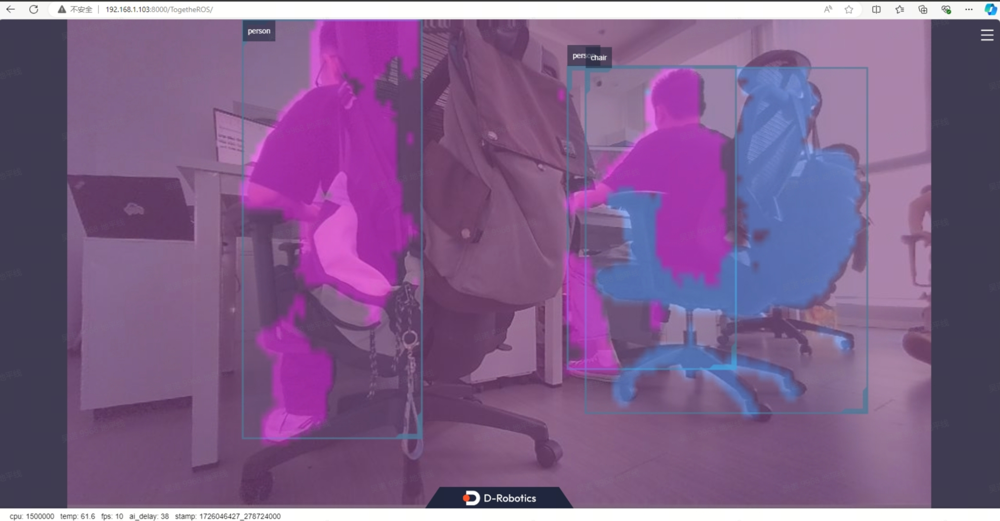

## 5.  Code Introduction
### 5.1 tofSLAM
#### 5.1.1 Code repository:
https://github.com/wunuo1/TofSLAM_ros2

#### 5.1.2 Engineering framework logic:
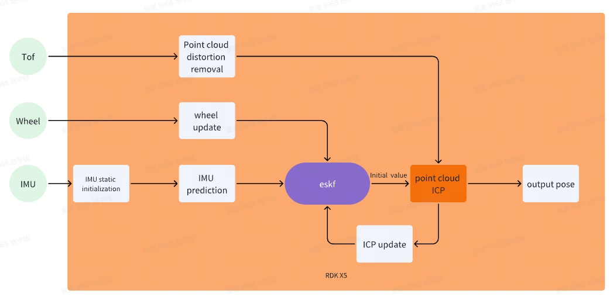

#### 5.1.3 detailed description:
#####  1. ESKF（Error State Kalman Filter）
The error state Kalman filter is an algorithm for sensor fusion. It is based on the classical Kalman Filter (KF) principle and has been improved to better handle error propagation in nonlinear systems

*state quantity*：p、R、v、bg、ba、g

*prediction model*：IMU
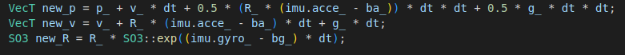

*Observation (update) model 1 *: Chassis wheel speed&chassis IMU pose calculated through EKF - loose coupling (R, p update)

*Observation (update) model 2 *: pose obtained from point cloud ICP calculation - loose coupling (R, p update)
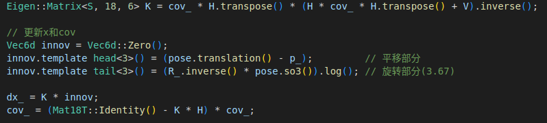
#####   2. IMU static initialization
IMU initialization remains static, estimating the direction of gravity, gyroscope bias, and accelerometer bias based on the accelerometer. Set the initial pose as the origin and the initial velocity as 0

#####  3. Map format: Ha style voxel map
Use a Ha series table to store voxel maps, with several points stored in each voxel (0.1 × 0.1 × 0.1) and a certain distance (0.05) maintained between each point.

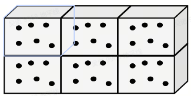

#####  4.  Point Cloud ICP
###### 1.  Key point extraction: Use gridsample method to downsample the point cloud of each frame and extract key points.
For each key point:

    1. Find nearest neighbors: Using voxelmap, search for the N nearest points qi in adjacent voxels as neighbor points.
    2. Calculate the normal n, covariance matrix, and smoothness weight a of neighboring points
    3. Calculate the distance between key points and the plane where neighboring points are located, and add ICP optimization for point pairs with distances less than the threshold.
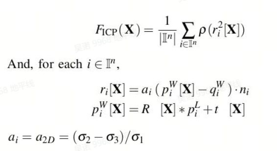

#####  5. CT_SCP algorithm（CT-ICP: Real-time Elastic LiDAR Odometry with Loop Closure）
######    1. Front end pose estimation
The overall framework of the front-end part of the CTICP algorithm uses two poses to describe each frame:
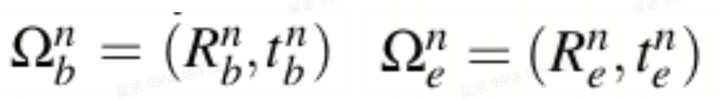
There is no need to separately remove motion distortion for each frame of point cloud in advance, but rather to directly remove distortion during the optimization process. This algorithm is more robust for high-speed motion.

Optimization equation:
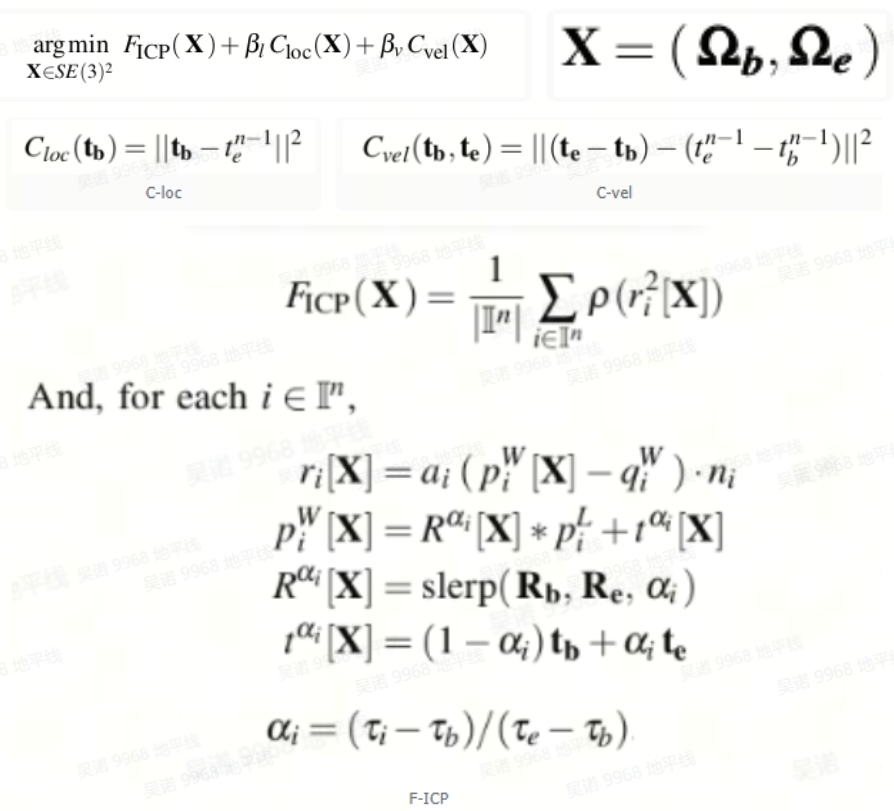

######    2. Backend Loop Optimization
Scan Nmap frames each time to form a point cloud, and insert each point into a 2D elevation grid. Then generate a 2D elevation map from the 2D elevation grid, with each pixel corresponding to the point with the largest Z-axis. Extract features from 2D elevation maps, and store the extracted features in memory along with the 2D elevation grid along with keyframes. When the elevation map features are extracted each time and matched with the features in memory; For successfully matched elevation maps, first estimate the 2D transformation matrix using RANSAC, and verify the matching reliability based on the number of inliers; Using the 2D transformation matrix as the initial value, perform ICP on the point cloud in the 2D elevation grid, and finally add an edge to the successfully matched keyframes. Use g2o to optimize the pose map. (This method is only applicable to planar motion)
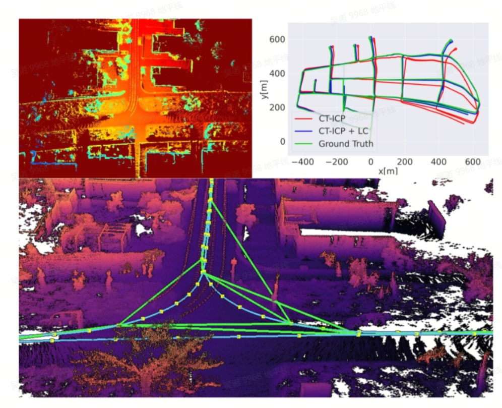

### 5.2 Binocular depth
#### 5.2.1 Repositories:
https://github.com/D-Robotics/hobot_stereonet.git

#### 5.2.2 Engineering Logic Framework:

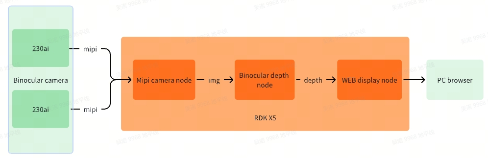

#### 5.2.3 detailed description:
#####  1. Detailed principle of binocular depth perception:
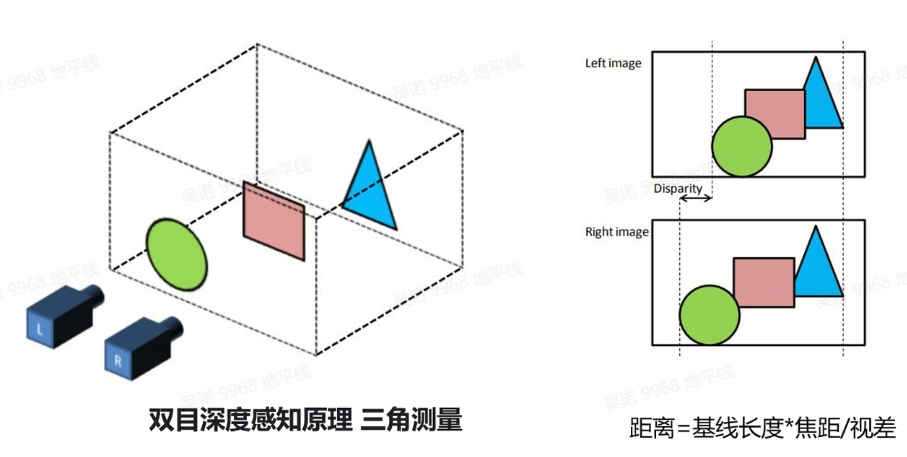

#####  2. Steps of binocular stereo matching algorithm:
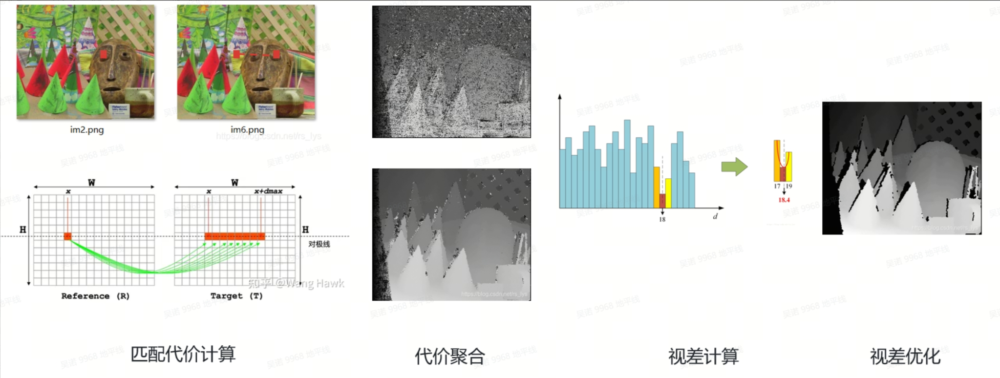

#####  3. Model Introduction

    1. Backbone: MixVarGENet+UNet. Efficient backbone+UNet recovery details optimized for X5;
    2. Cost Volume: Groupwise Correlation Cost Volume. Calculate the correlation between left and right image features to construct a cost volume;
    3. Cost Aggregation: UNet. Aggregate cost volume through UNet to achieve more refined integration of cost volume;
    4. Refinement: GRU. The use of GRU module brings performance improvement in edge details.
    5. Spatial Upsampling: Using Conv instead of Unfold operation for tensor segmentation, generating a full resolution disparity map through weighted combination
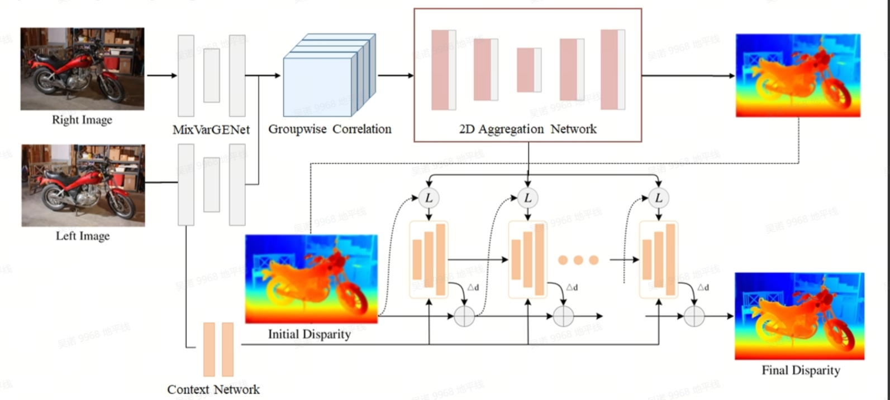

### 5.3 Object detection and segmentation
#### 5.3.1 Repositories:
https://github.com/D-Robotics/hobot_dnn/tree/

#### 5.3.2 Code Engineering Logic Framework:
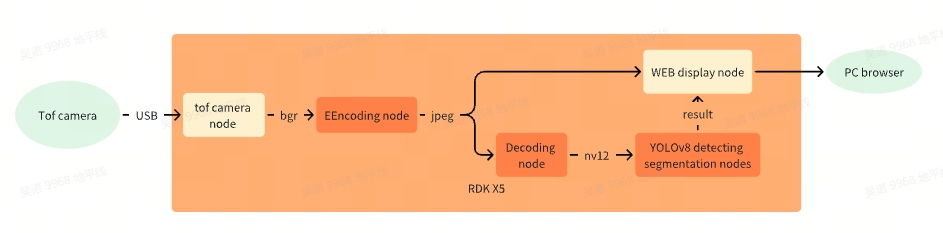

#### 5.3.3 detailed description:
1. Use the official version YOLOV8 SEG model, source code repository link https://github.com/ultralytics/ultralytics
2. The encoding and decoding functions are accelerated by the hardware unit on RDK X5, significantly reducing CPU usage while improving format conversion efficiency
3. The project uses the hobot-dnn_deample with the code tros, which supports inference for multiple models in addition to yolov8-seg

### 5.4 Navigation and task scheduling
#### 5.4.1 Repositories:
https://github.com/wunuo1/pose_setter.git

#### 5.4.2 Engineering Logic Framework:
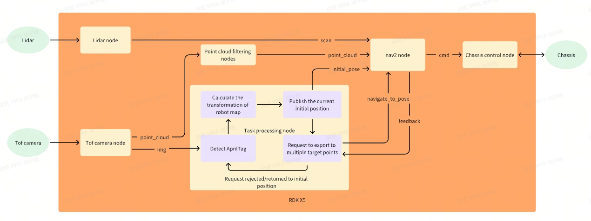

#### 5.4.3 detailed description:
  1. The program performs AprilTag detection at startup. After successful detection, it will cache ten frames of transformations and take the average value. Obtain the transformation from RGB to AprilTag, read the transformation from map to AprilTag recorded during mapping, and calculate the transformation from RGB to map. In the early calibration process, the transformation from RGB to robot can already be calculated, so the transformation from robot to map can be obtained to publish the initial position of the robot in the map coordinate system.
  2. After the initial position is published, the activation thread starts requesting navigation to the target position. If the request is rejected, it indicates that the posture initialization has failed and the initial position is republished.
  3. Request navigation to multiple target locations. Only after the previous target location is successfully navigated, will the thread be activated for the next request
  4. After the initial position, AprilTag detection will be performed and the previous steps will be repeated in a loop
  5. In the Nav2 navigation plugin, point cloud information has been added to the obstacle layer to avoid obstacles with heights lower than the LiDAR. However, due to the noise in the native point cloud data and the large amount of point cloud data, point cloud filtering nodes have been added to sparsify and filter the point cloud.

## 6. Annex
Link：https://pan.baidu.com/s/1Sg7zNvwnfBDLywBvjYKDbA?pwd=oxh7 
Extracted code：oxh7
