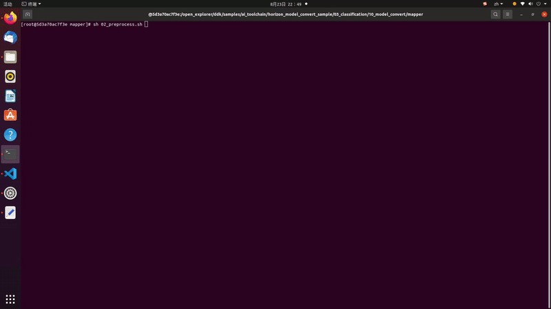

# 6.1 Line Following

```mdx-code-block
import Tabs from '@theme/Tabs';
import TabItem from '@theme/TabItem';
```

## Introduction


The line following task refers to the ability of a robot car to autonomously follow a guide line and move forward. When the guide line turns left, the car also turns left. When the guide line turns right, the car turns right accordingly. This task is a basic task in wheeled robots and can be implemented in various ways, such as:

- Installing multiple photoelectric sensors (gray scale sensors) to determine if the sensors are on the line based on their return values, and then adjust the robot's movement direction accordingly.
- Using a camera to obtain the position of the line in the image based on traditional image processing methods such as edge detection, and then adjust the robot's movement direction.

The commonly used methods mentioned above often require repeated image collection, threshold adjustment, and testing to achieve good recognition results when there are changes in lighting conditions or the environment. Is it possible to make the robot adapt to changes in the environment without the need for manual threshold adjustment? Convolutional Neural Network (CNN) is one of the most successful applications of deep learning algorithms, with good adaptability and robustness. With the rapid development of processors in recent years, CNN inference can already be performed on embedded devices. Here, CNN is used to perceive the position of the guide line in the line following task.

Code repository:  (https://github.com/D-Robotics/line_follower)

## Supported Platforms

| Platform     | System     | Function          |
| -------- | ------------ | ------------------------------ |
| RDK X3, RDK X3 Module | Ubuntu 20.04 (Foxy), Ubuntu 22.04 (Humble) | Start MIPI camera to capture images, perform guide line detection and car control, and finally demonstrate line following effect through the motion of the real car |


## Preparation

### D-Robotics RDK

1. D-Robotics RDK has been flashed with the  Ubuntu 20.04/22.04 system image provided by Horizon.

2. TogetheROS.Bot has been successfully installed on the D-Robotics RDK.

3. MIPI or USB camera has been installed on the D-Robotics RDK.

4. The PC is in the same network segment (wired or connected to the same wireless network) as the D-Robotics RDK. The following environment needs to be installed on the PC:

<Tabs groupId="tros-distro">
<TabItem value="foxy" label="Foxy">

   - Ubuntu 20.04 system and [ROS2 Foxy Desktop Full](https://docs.ros.org/en/foxy/Installation/Ubuntu-Install-Debians.html)

</TabItem>
<TabItem value="humble" label="Humble">

   - Ubuntu 22.04 system and [ROS2 Humble Desktop Full](https://docs.ros.org/en/humble/Installation/Ubuntu-Install-Debians.html)

</TabItem>
</Tabs>

   - Algorithm toolchain for OE package (obtain by running the following command):
`wget -c ftp://vrftp.horizon.ai/Open_Explorer_gcc_9.3.0/2.3.3/horizon_xj3_open_explorer_v2.3.3_20220727.tar.gz`
   - Algorithm toolchain for Docker (obtain by running the following command):
`wget -c ftp://vrftp.horizon.ai/Open_Explorer_gcc_9.3.0/2.3.3/x3pi_toolchain/ai_toolchain_2.3.3.tar.gz`
   - Project source code
`https://github.com/D-Robotics/line_follower/tree/develop`
  
## Usage

### D-Robotics RDK


The OriginBot kit is selected for the chassis of the car, which has two active wheels and one passive wheel. The rotation control of the car is achieved through the differential speed of the two active wheels. The MCU module is mainly used for the motor control of the car and communicates with the main control board D-Robotics RDK through serial communication. OriginBot website: [www.originbot.org](https://www.originbot.org/)


As shown in the above figure, the D-Robotics RDK obtains the environmental data in front of the car through a camera. The image data is processed by a trained CNN model to infer the coordinates of the guiding line. Then, based on a certain control strategy, the motion mode of the car is calculated. The motion control instructions are sent to the car through UART to achieve closed-loop control of the entire system.

The PC is used for data annotation and training. To improve efficiency, the D-Robotics RDK is used to send images to the PC for annotation through Ethernet.


The entire software engineering process includes 5 main steps:

- Data acquisition and annotation: Obtain the corresponding data according to the task goal and annotate it for model training.
- Model selection: Select a suitable model structure based on the task goal to ensure both performance and accuracy.
- Model training: Train the model using annotated data to achieve satisfactory accuracy requirements.
- Model conversion: Use the algorithm toolchain to convert the trained floating-point model into a fixed-point model that can run on the D-Robotics RDK.
- On-device deployment: Run the converted model on the D-Robotics RDK to obtain perception results and control the robot's motion.

**X86**

#### Data Acquisition and Annotation

Data collection and annotation are essential for model training. Here, we utilize the MIPI camera image acquisition function and inter-device communication capabilities provided by hobot_sensor in tros.b to build a simple data acquisition and annotation system on the PC. The workflow of the data acquisition and annotation system is as follows: the MIPI camera image acquisition function and inter-device communication capabilities provided by sensor in tros.b are used to build a simple data acquisition and annotation system on the PC. The workflow of the data acquisition and annotation system is as follows:


On the D-Robotics RDK, start mipi_cam. The selected camera module is F37, and the output image format is BGR8 with a resolution of 960x544. The communication method is non-zero copy.

<Tabs groupId="tros-distro">
<TabItem value="foxy" label="Foxy">

```bash
# Configure the tros.b environment
source /opt/tros/setup.bash
```

</TabItem>

<TabItem value="humble" label="Humble">

```bash
# Configure the tros.b environment
source /opt/tros/humble/setup.bash
```

</TabItem>

</Tabs>

```shell
export RMW_IMPLEMENTATION=rmw_cyclonedds_cpp
ros2 launch mipi_cam mipi_cam.launch.py mipi_out_format:=bgr8 mipi_io_method:=mmap
```

On the PC, run

<Tabs groupId="tros-distro">
<TabItem value="foxy" label="Foxy">

```bash
source  /opt/ros/foxy/setup.bash
```

</TabItem>
<TabItem value="humble" label="Humble">

```bash
source  /opt/ros/humble/setup.bash
```

</TabItem>
</Tabs>

```shell
export RMW_IMPLEMENTATION=rmw_cyclonedds_cpp
# Build line_follower_model, go to the line_follower_model directory
colcon build --packages-select line_follower_model
# Load the compiled line_follower_model
source install/setup.bash
# Run the annotation program on the PC
ros2 run line_follower_model annotation
```

Use the right mouse button to click on the center of the black guiding line in the middle of the picture to mark the target point. Press the Enter key, and the program will automatically save the image in the image_dataset folder along with the labeling results. The image is named as xy_[x-coordinate]_[y-coordinate]_[uuid].jpg, where uuid is the unique identifier of the image to avoid duplicate file names.According to the data collection and annotation methods mentioned above, collect a certain amount of data, preferably at least 100 images, for subsequent model training. Corresponding images can also be collected when there are changes in the environment or location, to improve the adaptability of the model.


#### Model Selection

Taking into account the maturity of the model, the hardware requirements of the CPU/GPU for training the model, ResNet network is chosen as the backbone here. Residual Neural Network (ResNet) was proposed by researchers from Microsoft Research Institute including Kaiming He, Xiangyu Zhang, Shaoqing Ren, and Jian Sun. It won the championship in the 2015 ILSVRC (ImageNet Large Scale Visual Recognition Challenge). ResNet cleverly uses shortcut connections to solve the problem of model degradation in deep networks. It is one of the most widely used CNN feature extraction networks. The structure of [ResNet18](https://huggingface.co/microsoft/resnet-18) is as follows:


On the D-Robotics RDK, ResNet18 has a high inference performance of up to 232FPS, and ResNet50 has an inference performance of over 100FPS. The high frame rate ensures the real-time nature of data processing, which is a necessary condition for improving vehicle speed and implementing more complex applications in the future. ResNet18 network structure is used here initially, and a deeper ResNet50 network structure will be considered later if a bottleneck is encountered. In order to satisfy the output of guide line coordinates x and y, the FC output of ResNet18 network needs to be modified to 2 directly outputting the x and y coordinates of the guide line. The input resolution of ResNet18 is 224x224.
The training framework selected here is the popular PyTorch. The CPU version of PyTorch is installed here, but the GPU version of PyTorch can be used if there is a GPU card on the hardware. The installation command is as follows:

```shell
pip3 install torch torchvision torchaudio --extra-index-url https://download.pytorch.org/whl/cpu
```

The development PC is a regular notebook with the following specifications:

- CPU: Intel i5-7260U
- DDR: 8G
- OS: Ubuntu 20.04

#### Model Implementation and Training

The code that completes this function is located in line_follower/line_follower_model/line_follower_model/training_member_function.py

Running on the PC:

<Tabs groupId="tros-distro">
<TabItem value="foxy" label="Foxy">

```bash
source  /opt/ros/foxy/setup.bash
```

</TabItem>
<TabItem value="humble" label="Humble">

```bash
source  /opt/ros/humble/setup.bash
```

</TabItem>
</Tabs>

```shell
# Compile line_follower_model and enter the line_follower_model directory
colcon build --packages-select line_follower_model
# Load the compiled line_follower_model
source install/setup.bash
# Run the PC-side annotation program
ros2 run line_follower_model training
```

#### Model Conversion


If the floating-point model obtained by training with PyTorch is run directly on the D-Robotics RDK, the efficiency will be low. In order to improve the running efficiency and use the 5T computing power of BPU, it is necessary to convert the floating-point model to a fixed-point model.

1. Generate ONNX model from the PyTorch model

   Run on the PC:
   ```shell
   ros2 run line_follower_model generate_onnx
   ```

   After running, generate the best_line_follower_model_xy.onnx model in the current directory.

2. Generating fixed-point models from floating-point models
    
    The completion code for this function is located in line_follower/10_model_convert.
    The directory structure of OE packages is as follows:

   ```shell
   .
   ├── bsp
   │   └── X3J3-Img-PL2.2-V1.1.0-20220324.tgz
   ├── ddk
   │   ├── package
   │   ├── samples
   │   └── tools
   ├── doc
   │   ├── cn
   │   ├── ddk_doc
   │   └── en
   ├── release_note-CN.txt
   ├── release_note-EN.txt
   ├── run_docker.sh
   └── tools
       ├── 0A_CP210x_USB2UART_Driver.zip
       ├── 0A_PL2302-USB-to-Serial-Comm-Port.zip
       ├── 0A_PL2303-M_LogoDriver_Setup_v202_20200527.zip
       ├── 0B_hbupdate_burn_secure-key1.zip
       ├── 0B_hbupdate_linux_cli_v1.1.tgz
       ├── 0B_hbupdate_linux_gui_v1.1.tgz
       ├── 0B_hbupdate_mac_v1.0.5.app.tar.gz
       └── 0B_hbupdate_win64_v1.1.zip
   ```
   Copy 10_model-convert from the project to the algorithm toolchain OE package ddk/samples/ai_toolchain/horizon_model-convert_sample/03_classification/directory.

   Load the algorithm toolchain docker and run it in the root directory of the OE package.

   ```shell
   sh run_docker.sh /data/
   ```

   Generate calibration data. The calibration data generated in this step is mainly used for calibration in the next step of model compilation. Part of the training model data can be used without special requirements, as long as the standards are correct, and the quantity should be around 100 sheets.

```shell
cd ddk/samples/ai_toolchain/horizon_model_convert_sample/03_classification/10_model_convert/mapper
sh 02_preprocess.sh
```

   Results are as follows:

   

   Model compilation, this step will generate fixed-point model files.

   ```shell
   # Execute in the docker
   cd ddk/samples/ai_toolchain/horizon_model_convert_sample/03_classification/10_model_convert/mapper
   sh 03_build.sh
   ```

   Results are as follows:

   

#### Deployment

Through the previous model conversion, we have obtained a fixed-point model that can run on the D-Robotics RDKBPU. How can we deploy it on the D-Robotics RDK to achieve the complete functionality of image acquisition, model inference, and motion control? Here, we rely on the hobot_dnn implementation in the tros.b. Hobot_dnn is a board-end algorithm inference framework in the tros.b software stack, which uses the BPU processor on the D-Robotics RDK to implement algorithm inference functions. It provides a simpler and easier-to-use model integration and development interface for robot application development, including model management, input processing and output parsing based on model descriptions, and model output memory allocation and management.

Inherit DnnNode to implement necessary interfaces. Here, public inheritance is used, and the interfaces that must be implemented are:

- SetNodePara(), used to configure model parameters such as model path and model name
- SetOutputParser(), used to parse model inference outputs
- PostProcess(const std::shared_ptr\<DnnNodeOutput\> &outputs), used for further post-processing of the results

For the complete code, please refer to: line_follower/line_follower_perception/src/line_follower_perception.cpp

Copy the line_follower_perception folder and the compiled fixed-point model to the board for execution.

<Tabs groupId="tros-distro">
<TabItem value="foxy" label="Foxy">

```bash
# Configure the tros.b environment
source /opt/tros/setup.bash
```

</TabItem>

<TabItem value="humble" label="Humble">

```bash
# Configure the tros.b environment
source /opt/tros/humble/setup.bash
```

</TabItem>

</Tabs>

```shell
# Execute in the line_follower_perception folder path
clocon build --packages-select line_follower_perception
```

After the compilation is completed, specify the model path and name through the parameters model_path and model_name.

```shell
source install/setup.bash
ros2 run line_follower_perception line_follower_perception --ros-args -p model_path:=./resnet18_224x224_nv12.bin -p model_name:=resnet18_224x224_nv12 &
```

Run mipi_cam.

<Tabs groupId="tros-distro">
<TabItem value="foxy" label="Foxy">

```bash
# Configure the tros.b environment
source /opt/tros/setup.bash
```

</TabItem>

<TabItem value="humble" label="Humble">

```bash
# Configure the tros.b environment
source /opt/tros/humble/setup.bash
```

</TabItem>

</Tabs>

```shell
ros2 launch mipi_cam mipi_cam.launch.py &
```

Lastly, enter the motion control package of the car and run `originbot_base`:

```shell
source install/setup.bash
ros2 run originbot_base originbot_base
```

## Results Analysis

The car has started line following movement.

