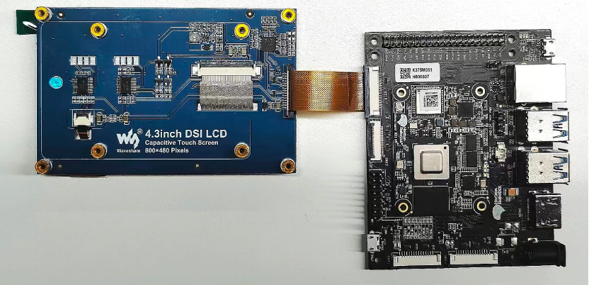

# LCD Display Usage

The RDK X3 Module carrier board provides one MIPI DSI interface, supporting the connection of various LCD screens. The following example uses a 4.3-inch MIPI LCD to illustrate the screen connection and usage.

The screen connection is as shown in the following diagram:



:::caution Caution
It is strictly prohibited to plug or unplug the screen when the development board is not powered off, as it may cause short circuits and damage to the screen module.
:::

Since the RDK X3 Module system defaults to HDMI output, it needs to be switched to LCD display mode through commands. First, execute the following command to back up the `DTB`:

```shell
sudo cp /boot/hobot/hobot-x3-cm.dtb /boot/hobot/hobot-x3-cm_backup.dtb
```

Execute the following command to determine the current display type:

```shell
sudo fdtget /boot/hobot/hobot-x3-cm.dtb /chosen bootargs
```

Taking `HDMI` as an example, executing the above command will print:

```shell
sunrise@ubuntu:~$ sudo fdtget /boot/hobot/hobot-x3-cm.dtb /chosen bootargs
earlycon loglevel=8 kgdboc=ttyS0 video=hobot:x3sdb-hdmi
```

Execute the following command to modify the `chosen` node:

```shell
sudo fdtput -t s /boot/hobot/hobot-x3-cm.dtb /chosen bootargs "earlycon loglevel=8 kgdboc=ttyS0 video=hobot:cm480p"
```

Execute the following command to print the modified node and confirm that the modification was successful:

```shell
sudo fdtget /boot/hobot/hobot-x3-cm.dtb /chosen bootargs
```

Enter the following command to restart the development board:

```shell
sync
sudo reboot
```

The display mode has been switched from `HDMI` to `DSI`.

If you want to switch back to `HDMI` display, after entering the kernel, execute the following command:

```shell
sudo cp /boot/hobot/hobot-x3-cm_backup.dtb /boot/hobot/hobot-x3-cm.dtb
sync
```

Then enter `sudo reboot` to restart the development board.