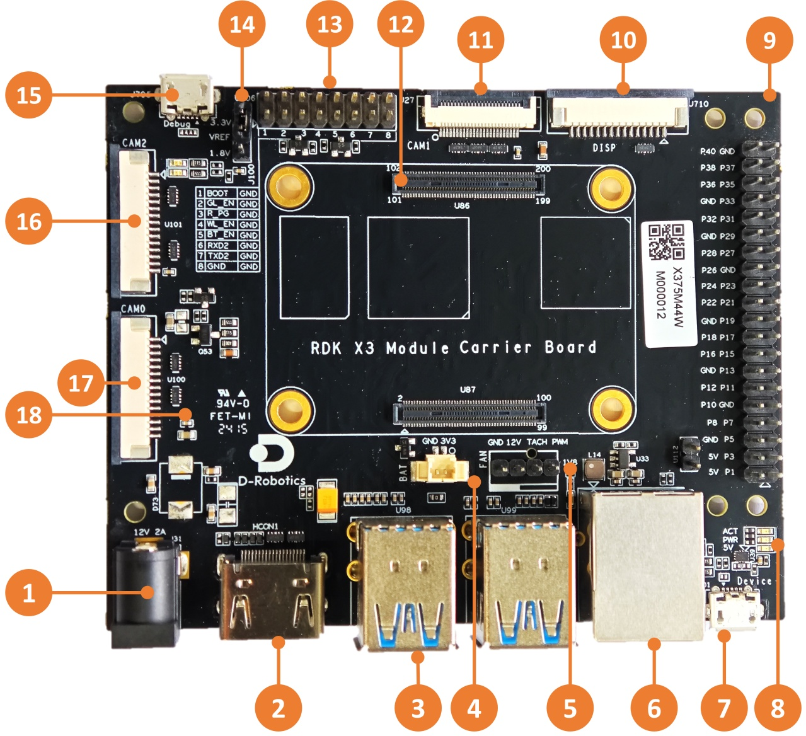
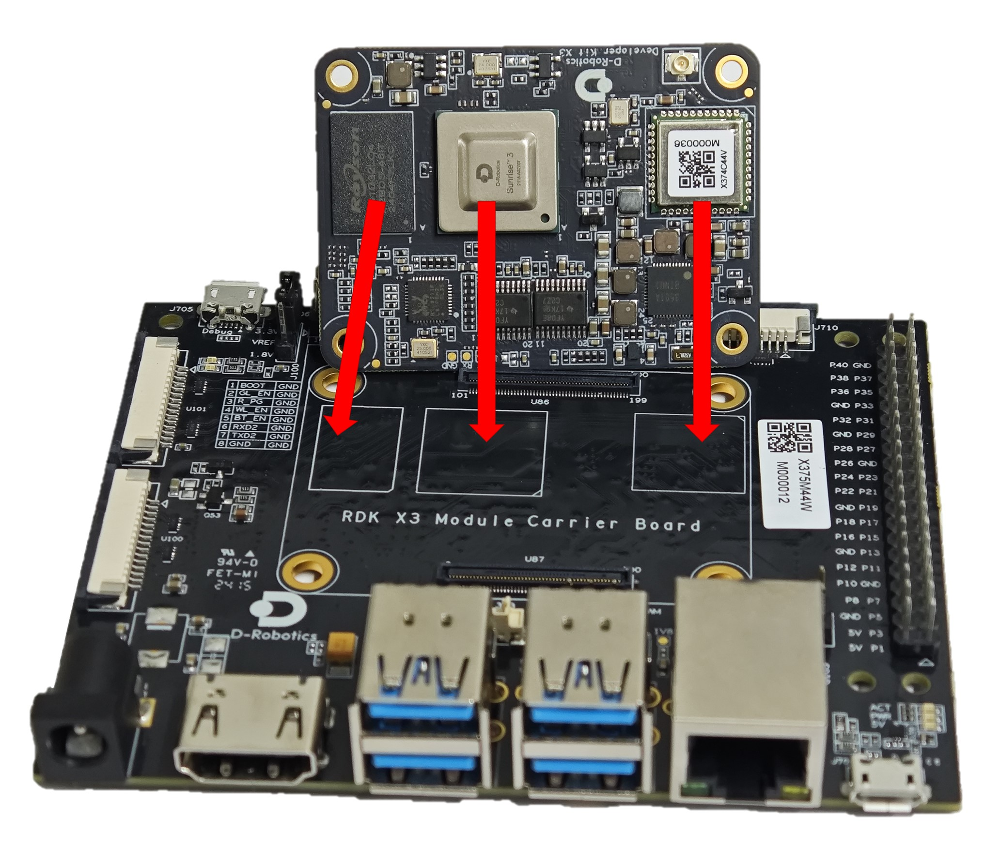
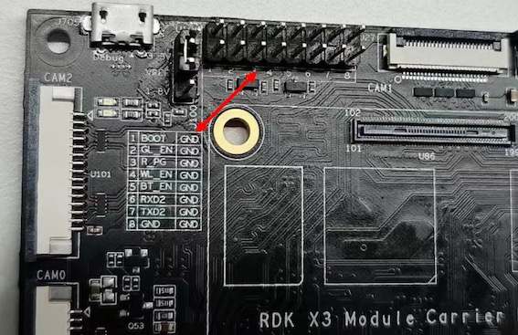
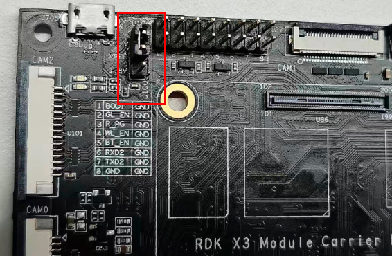
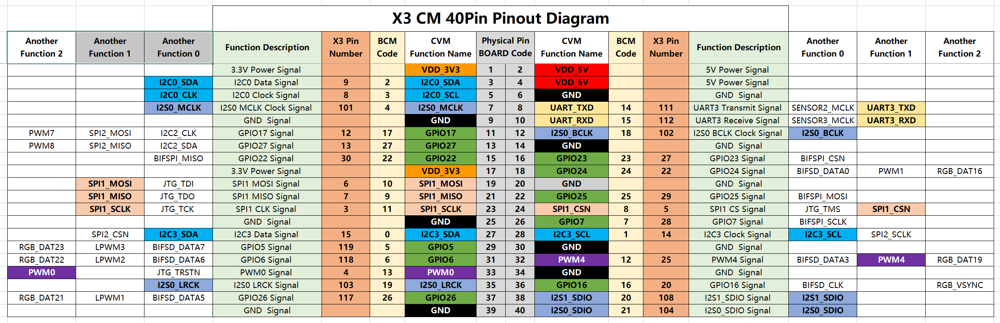

# Interface Description

This chapter introduces the interface functions and usage of the official carrier board for RDK X3 Module. The carrier board provides various peripheral interfaces such as Ethernet port, USB, HDMI, MIPI CSI, MIPI DSI, 40PIN, etc., which facilitate users to perform function verification, development testing, and other tasks on the RDK X3 Module.

The interface layout of the RDK X3 Module carrier board is as follows:

 

| No.  | Interface Function             | No.  | Interface Function         | No.  | Interface Function        |
| ---- | ----------------------------- | ---- | -------------------------- | ---- | ------------------------- |
| 1    | Power Interface               | 7    | Micro USB2.0 Device Port   | 13   | Function Control IO Header |
| 2    | HDMI Port                     | 8    | Working Indicator Light    | 14   | IO Level Select Header    |
| 3    | USB3.0 Host Port              | 9    | 40-pin Header              | 15   | Debug Port, USB to UART   |
| 4    | RTC Battery Port              | 10   | MIPI DSI Port              | 16   | CAM2 Port, 2-lane         |
| 5    | Fan Port                      | 11   | CAM1 Port, 4-lane          | 17   | CAM0 Port, 2-lane         |
| 6    | Gigabit Ethernet Port         | 12   | Core Module Interface      | 18   | Micro SD Card Interface (on the back) |

## Core Module Interface

The RDK X3 Module carrier board provides a 200-pin board-to-board connector for the installation of the core module. When installing, it is necessary to confirm the correct direction and alignment to avoid damage to the connectors of the core module and the carrier board.

 

The module installation method is as follows:

1. Match the left and right order of the main chip, DDR, Wi-Fi module on the core module with the three silk screens on the carrier board to confirm the correct installation direction.
2. Place the core module above the carrier board and align the four locating holes around it.
3. Press down from the center of the core module, and when the module makes a clicking sound, it indicates that it is installed properly.

## Power Interface

The RDK X3 Module carrier board is powered by a DC interface. It is recommended to use the recommended **12V/2A** adapter from the certified accessories list. After connecting the power supply, if the red power indicator light is lit up (interface 8), it indicates that the device is powered on properly.

## HDMI Interface

The RDK X3 Module carrier board provides an HDMI display interface (interface 2), which supports a maximum resolution of 1080P. The development board outputs the Ubuntu system desktop (Ubuntu Server version displays the logo icon) on the monitor through the HDMI interface. In addition, the HDMI interface also supports real-time display of camera and network streaming.

Currently, the supported display resolutions for the HDMI interface are as follows:

- 1920x1080
- 1280x720
- 1024x600
- 800x480

## MIPI CSI Interface

RDK X3 Module carrier board provides three sets of MIPI CSI interfaces for CAM 0/1/2, which can support the simultaneous connection of 3 Camera modules, meeting the needs of different users. The specific details are as follows:

1. CAM 0/2 (Interface 16/17) adopts a 15-pin FPC connector and can directly connect with various Camera modules such as Raspberry Pi OV5647, IMX219, IMX477, etc.
2. CAM 1 (Interface 11) adopts a 24-pin FPC connector and supports various Camera modules such as F37, GC4663, IMX415, etc.

The basic specifications of the camera modules are as follows:

| No.  | Sensor  | Resolution | FOV              | I2C Device Address |
| ---- | ------- | ---------- | ---------------- | ------------------ |
| 1    | GC4663  | 400W       | H:104 V:70 D:113 | 0x29               |
| 2    | JXF37   | 200W       | H:62  V:37 D:68  | 0x40               |
| 3    | IMX219  | 800W       | H:62  V:37 D:68  | 0x10               |
| 4    | IMX477  | 1200W      | H:62  V:37 D:68  | 0x1a               |
| 5    | OV5647  | 500W       | H:62  V:37 D:68  | 0x36               |

The purchase information for the above Camera modules can be found in the [purchase link](./accessory.md).

:::caution Caution
Important Note: It is strictly prohibited to plug or unplug the camera module without powering off the development board, as it can easily damage the camera module.
:::

## MIPI DSI Interface

The RDK X3 Module carrier board provides one MIPI DSI interface (Interface 10), which can be used for connecting LCD displays. The interface uses a 15-pin FPC connector and can directly connect with various Raspberry Pi LCD displays.

For detailed instructions on using the MIPI DSI interface, please refer to [MIPI DSI Display Usage](./display.md).

## USB Interface

The RDK X3 core module only supports one USB3.0 interface. Therefore, the carrier board expands to 4 USB3.0 Host interfaces and 1 Micro USB2.0 Device interface through peripheral circuits and USB hubs, meeting the diverse USB interface needs of users. The interface details are as follows:

| Interface Type           | Interface Number | Interface Quantity | Interface Description         |
| ------------------------ | ---------------- | ------------------ | ----------------------------- |
| USB3.0 Type A Host       | Interface 3      | 4                  | For connecting USB peripherals |
| Micro USB2.0 Device Port | Interface 7      | 1                  | For adb debugging and fastboot flashing |

:::caution Caution
The USB host and device functions are exclusively switched by the hardware circuit. Users only need to connect the device according to the logic in the table.

When the Device interface is connected to a device, the Host interface will automatically be disabled.
:::

## Micro SD Card Interface

The RDK X3 Module carrier board provides one Micro SD card interface (Interface 18). It is recommended to use a storage card with a capacity of at least 8GB to meet the installation requirements of the Ubuntu operating system and related packages.

:::caution Caution
Do not hot-plug or unplug the TF storage card during use of the development board, as it may cause abnormal system operation and even damage the file system of the storage card.
:::

## Debug interface {#debug_uart}

The RDK X3 Module board provides a debug interface (interface 15). On the hardware side, the core module's debug serial port is converted to a USB interface through the `CH340` chip. Users can use this interface for various debugging works. The parameters of the computer's serial port tool should be configured as follows:

- Baud rate: 921600
- Data bits: 8
- Parity: None
- Stop bits: 1
- Flow Control: None

Usually, when users use this interface for the first time, they need to install the CH340 driver on the computer. Users can search for the keyword "CH340 serial port driver" to download and install it.

## Function control interface

The RDK X3 Module board provides a group of control IO interfaces (interface 13). Users can use jumper caps to short the corresponding pins to achieve control over various functional modes of the core module. The pin functions are defined as follows:

| Pin number | Pin name | Function description | Usage |
| ------ | -------- | ------------------------------ | ----------------------------------- |
| 1      | BOOT     | Used to enter fastboot burn mode | Short with GND, then power on again |
| 2      | GL_EN    | Used to turn off the core board power supply | Short with GND, then power off the core board |
| 3      | R_PG     | Used to indicate the working status of the core board | High level means the core board is working normally |
| 4      | W_EN     | Used to turn off Wi-Fi function | Short with GND, Wi-Fi will be turned off, restart the system to restore |
| 5      | BT_EN    | Used to turn off Bluetooth function | Short with GND, Bluetooth will be turned off, restart the system to restore |
| 6      | RXD2     | Serial UART2 receive signal | Serial UART2 receive signal |
| 7      | TXD2     | Serial UART2 transmit signal | Serial UART2 receive signal |
| 8      | GND      | GDN                            | GND                                 |

In addition, for easy reference by users, the above pin definitions are also shown on the board's silk screen.

## IO level switching interface

The RDK X3 Module board provides IO level switching function to control the 40-pin header level mode, supporting 1.8V and 3.3V levels.

The interface signals from top to bottom are 3.3V, VREF, 1.8V, as shown in the following figure:

It should be noted that **this interface cannot be left floating, otherwise the core module will not be able to power on due to abnormal power supply**.

:::caution When switching levels, please strictly follow the following steps.
By default, the firmware of the RDK X3 Module core module and the level configuration of the board are set to 3.3V. If you need to switch the IO level, please follow the steps below:

1. Download the startup firmware that supports the 1.8V level configuration at [firmware download address](https://archive.d-robotics.cc/downloads/en/miniboot/).
2. Use the official burning tool `hbupdate` to update the core board's startup firmware. For specific methods, please refer to [Image Burning](../../../01_Quick_start/install_os.md).
3. Power off the device, use jumper caps to short the `vref` and `1.8V` signals, and then power on again.
:::## 40pin header interface

The RDK X3 Module carrier board provides a set of 40pin header interfaces (interface 9). The interface signal level is specified by the IO level switching header (interface 14), which supports two modes: 1.8V and 3.3V. The pin definitions are compatible with products such as Raspberry Pi. The detailed pin definitions and multiplexing relationships are as follows:

:::caution Note
By default, the RDK X3 Module core module firmware and carrier board level configuration are set to 3.3V. If you need to switch the IO level, please refer to the [IO level switching header interface](#io-level-switching-interface).
:::