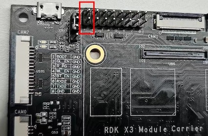
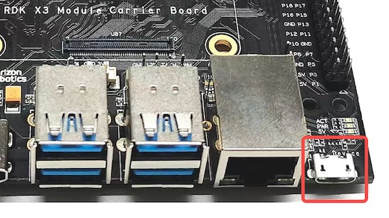
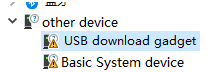
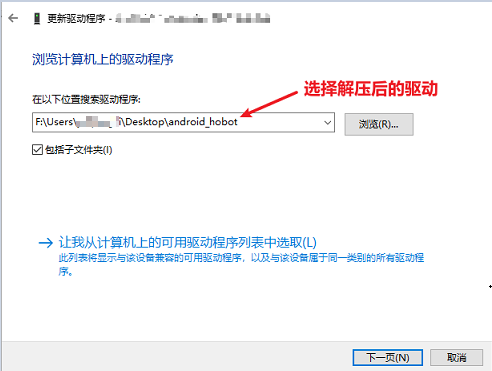
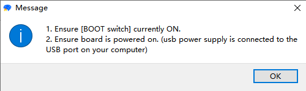

# System Burning

:::info Note

The **RDK X3 Module** comes with a pre-burned test version of the system image. To ensure the use of the latest version of the system, it is recommended to refer to this document to complete the [burning of the latest version of the system image](/installation/install_os).

:::

The RDK X3 Module supports booting the system from both eMMC and SD card:

- If the eMMC on the module has not been burned with a system image, insert the SD card with the prepared system into the carrier board to boot the system from the SD card.

- If the eMMC on the module has been burned with a system image, you can switch the startup between eMMC and SD card by following these steps:

  1. By default, the system starts from eMMC.

  2. Disable the eMMC startup and switch to boot from the SD card. After logging into the system, execute the following command to remove the boot flag on the second partition of the eMMC and restart the system to take effect:

  ```
  sudo parted /dev/mmcblk0 set 2 boot off
  sudo reboot
  ```

  3. In uboot, you will find that there is no boot partition on the eMMC and it looks for the boot partition on the SD card. The system boots from the SD card. After logging into the system, you can execute the `mount` command to see that the root file system is mounted on the second partition of the SD card, and the config partition also uses the first partition of the SD card.

  ```
  /dev/mmcblk2p2 on / type ext4 (rw,relatime,data=ordered) 
  /dev/mmcblk2p1 on /boot/config type vfat
  ```

- Switch back to boot from eMMC after booting from the SD card

  When the system is booted from the SD card and the eMMC has already been burned with the system, execute the following command to switch back to boot from the eMMC, and restart the system to take effect.

  ```
  sudo parted /dev/mmcblk0 set 2 boot on
  sudo reboot
  ```

When the RDK X3 module needs to burn the system to the SD card and does not boot from the eMMC mode, please refer to [Install OS](../../installation/install_os.md) to complete the burning of the SD card system.

When burning the eMMC system image on the RDK X3 module, the D-Robotics `hbupdate` burning tool is required. Currently, the tool supports two versions: Windows and Linux, which are respectively named `hbupdate_win64` and `hbupdate_linux`. The tool can be downloaded from the following link: [hbupdate](http://sunrise.horizon.cc/downloads/hbupdate/).

The following precautions should be taken when using the tool:
- Unzip the compressed file of the tool, and make sure that the decompression path does not contain any **spaces, Chinese characters, special characters**, etc.
- The tool communicates with the RDK X3 module through the USB port, so you need to install the USB driver in advance. Please refer to the following description for the specific method.

## Installing USB Driver

For a PC using the Windows operating system, before using the flashing tool, it is necessary to confirm if the fastboot driver has been installed. Please follow the steps below for confirmation:

1. Use a jumper cap to ground the `Boot` pin on the RDK X3 carrier board. Refer to the figure below for the pin position.    
     
2. Connect the Micro USB interface on the carrier board to the PC using a USB cable. Refer to the figure below for the interface position.  
     
3. Power on the device and observe the port status in the computer's Device Manager. If there is an unknown device named `USB download gadget`, the driver needs to be updated. Otherwise, you can skip the following steps.  
     
4. Download and unzip the driver package `android_hobot.zip` from the following link: [android_hobot](http://sunrise.horizon.cc/downloads/hbupdate/android_hobot.zip).
5. Go to the extracted directory and run `5-runasadmin_register-CA-cer.cmd` as an administrator to complete the driver program registration.
6. Double-click the unknown device named `USB download gadget` and select the directory where the driver package is extracted. Then click Next.   
   
7. After the driver installation is completed, the Device Manager will display the fastboot device `Android Device`.   
   

## Flashing the System {#flash_system}

After confirming that the PC Device Manager displays the fastboot device `Android Device`, run `hbupdate.exe` to open the flashing tool, and follow the steps below to flash the system:


1. Select the development board model, which is a required option.

- RDK_X3_2GB: RDK X3 (Sunrise X3 platform), 2GB memory version, supports flashing the minimal system image only.

- RDK_X3_4GB: RDK X3 (Sunrise X3 platform), 4GB memory version, supports flashing the minimal system image only.

- RDK_X3_MD_2GB: RDK X3 Module, 2GB memory version.

- RDK_X3_MD_4GB: RDK X3 Module, 4GB memory version.


2. Click the `Browse` button to select the image file to be flashed, which is a required option.


3. Click the `Start` button to start flashing. Follow the pop-up prompts to begin flashing:



- When flashing the image, ground the `BOOT` pin using a jumper cap. Refer to [Function Control Interface](../rdk_x3_module/interface#function_control_interface) for the pin position.

- Connect the Micro USB interface to the computer. The Device Manager of the computer will recognize the device as `Android Device`, as described in the previous section for installing the USB download driver.

- After flashing, disconnect the power, disconnect the cable connected to the computer, remove the BOOT jumper cap, and power on again.- If the startup is normal, the 'ACT LED' on the hardware will enter a state of 'two quick flashes, one slow flash'.

4) Check the upgrade result

- When the image burning is successful, the tool prompt is as follows:


- When the image burning fails, the tool prompt is as follows, at this time it is necessary to confirm whether the PC Device Manager has 'Android Device' device.

