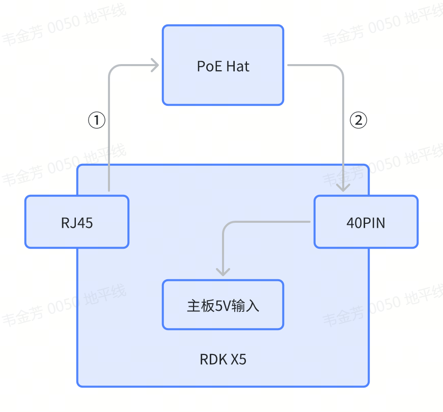

# PoE供电使用

目前查阅到PoE有多种标准，每个标准的电压，功率都不相同。，避免开发者使用不适配的PoE导致供电异常或者板卡损坏，请阅读以下内容

## 协议简介

以太网供电（Power over Ethernet，简称 PoE），是一种可以在以太网中透过双绞线来传输电力到设备上的标准化技术。

PoE系统由供电设备（Power sourcing equipment， PSE）、受电设备 （Powered device，PD）组成。其中，PSE是负责在以太网线缆上提供电源的设备，这个设备可能是一台网络交换机；PD设备通常指的是任何由 PoE系统供电的设备。一般来说，PD受电设备通常附带一个可选的外部电源供电接口，即将从PoE获得的电源，转换为其他派生电源VDD。

目前，常见的PoE协议有IEEE 802.3af、IEEE 802.3at，分别支持最高15W、30W的电力传输。

## 接口使用

RDK X5支持通过PoE系统供电，但是其本身并非完整的PSE设备或PD设备。RDK X5在其中扮演的角色为：PD设备的前端、PD设备的后端负载。如下图所示。

RDK X5板载的RJ45座内置变压器，可以输出AC交流电源，接口位于以太网连接器旁边的4PIN针脚。

如图示路径①，用户应当将上述4PIN针脚连接到外部第三方PoE Hat，送入PD设备电路。

PoE Hat的主要功能是将输入的AC电源，转换为DC电源。对RDK X5而言，**要求该DC电源为5V（MAX 5.2V）**。

如图示路径②，用户应当将上述DC 5V电源连接到RDK X5 40PIN上的5V针脚。

## PoE Hat

用户在设计或选购PoE Hat时，应当注意其支持的协议标准。地瓜推荐使用IEEE 802.3at标准的PoE方案，以保证RDK X5及相关外设的可靠使用。