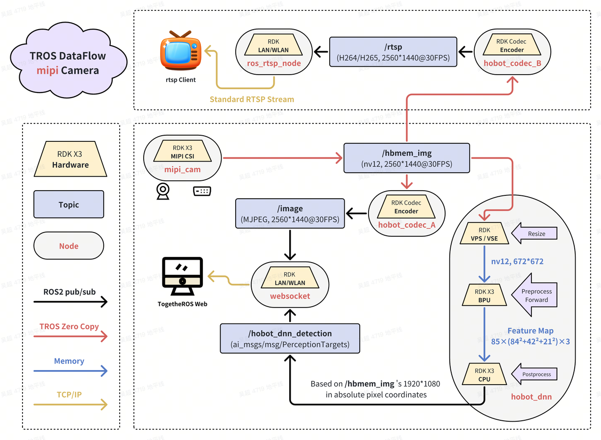
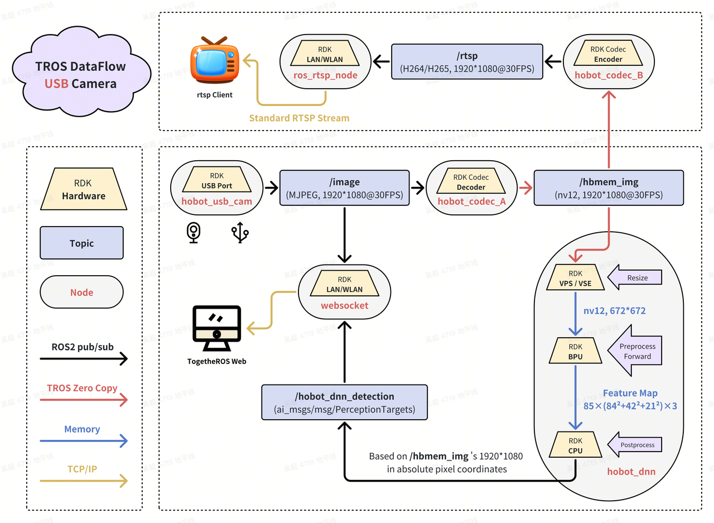
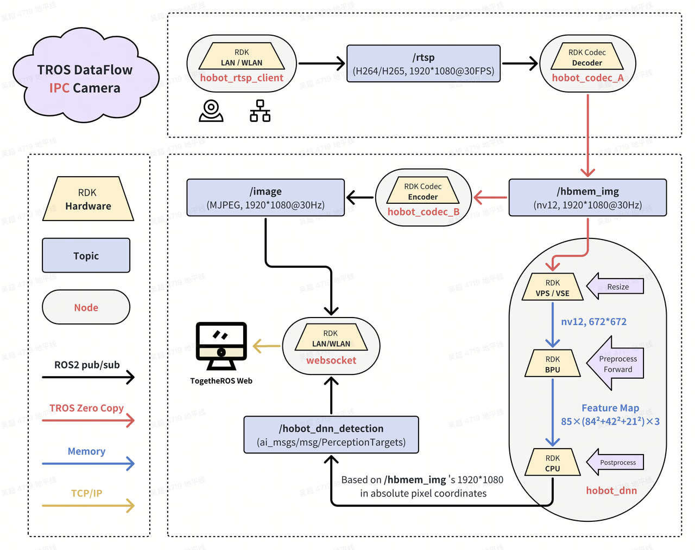

# 8.6 TROS/ROS Development

This section addresses frequently asked questions about developing and using TogetheROS.Bot (TROS.b) and general ROS/ROS2 on the RDK platform.

### Q1: What are the recommended troubleshooting steps if TROS-related packages fail to run?
**A:**
1.  **Ensure your TROS packages are up to date:** Many issues may have been fixed in newer versions. After confirming that the official Horizon APT sources (such as `sunrise.horizon.cc` or the latest `archive.d-robotics.cc`) are correctly configured, update all TROS-related packages:
    ```bash
    sudo apt update && sudo apt upgrade
    ```
    When seeking help, please provide your system and package version information using commands like `rdkos_info`, `apt list --installed | grep tros`, and `apt show <tros_package_name>`.
2.  **Try to locate the problematic ROS node:**
    * Refer to the launch file of the relevant package and set the log level to `debug` (e.g., add `['--ros-args', '--log-level', 'DEBUG']` to the node's arguments).
    * Relaunch the file and use the detailed debug logs to identify which node is causing the issue.
    * TROS package launch files are usually located at `/opt/tros/<tros_distro>/share/<package_name>/launch/` (e.g., `/opt/tros/humble/share/mipi_cam/launch/`).
    * ROS2 log files are typically stored in `~/.ros/log/` or `/root/.ros/log/`. Before troubleshooting, you can clear old logs with `rm -rf ~/.ros/log/*` (or the corresponding root path), then rerun the package to collect fresh logs.
3.  **Reinstall the relevant TROS package:**
    * If you suspect a package's configuration is corrupted or incomplete, try reinstalling it.
    * For example, to reinstall `hobot_usb_cam`:
        1.  Find the exact package name: `apt list --installed | grep hobot-usb-cam`
        2.  Remove the package: `sudo apt remove <tros_package_name_found>`
        3.  Ensure APT sources are correct and update: `sudo apt update`
        4.  Reinstall the package: `sudo apt install <tros_package_name_found>`

### Q2: What are the differences between TROS and standard ROS2? How to upgrade TROS Foxy to TROS Humble?
**A:**
* **Relationship between TROS and ROS2:**
    * TROS (TogetheROS.Bot) is Horizon's robot operating system, optimized and adapted from open-source ROS2 for its RDK hardware platform.
    * It is usually built on a ROS2 LTS version, for example:
        * On RDK OS 2.x (Ubuntu 20.04), TROS is based on **ROS2 Foxy Fitzroy**.
        * On RDK OS 3.x (Ubuntu 22.04), TROS is based on **ROS2 Humble Hawksbill**.
    * TROS integrates Horizon hardware drivers (BPU, VPU, JPU, sensors, etc.), hardware acceleration libraries, and optimized solutions and examples for common robotics functions.
    * TROS is **fully compatible** with the core APIs and communication mechanisms of the corresponding ROS2 version, meaning nodes and services developed for standard ROS2 Foxy/Humble can usually run on TROS with little or no modification, and vice versa.

* **TROS version upgrade (e.g., Foxy to Humble):**
    * Since TROS versions are tightly coupled with the underlying Ubuntu version (e.g., Foxy with Ubuntu 20.04, Humble with Ubuntu 22.04), **you cannot upgrade TROS from one major LTS version to another (e.g., Foxy to Humble) simply via `apt upgrade`**.
    * **The correct way is:** Flash a complete RDK OS system image that includes the new TROS version (e.g., Humble) and the corresponding Ubuntu version (e.g., 22.04).

* **ROS2 runtime environment on the board:**
    * TROS itself is a complete ROS2 runtime environment on the RDK board.
    * You can also install other standard ROS2 distributions (e.g., Foxy, Humble) or ROS1 (e.g., Noetic) on the board; they can coexist, but **only one ROS environment should be sourced in a terminal session**.
    * `colcon` is a common ROS2 build tool. If not pre-installed, you may need to install it manually:
        ```bash
        sudo apt update
        sudo apt install python3-colcon-common-extensions python3-catkin-pkg-modules python3-rosdep
        # Or via pip:
        # pip3 install -U colcon-common-extensions empy
        ```
* **Note:** ROS packages compiled directly on x86 (not cross-compiled) cannot run on ARM-based RDK boards, and vice versa. Ensure your programs are compiled for the target architecture.

### Q3: How is TROS installed on the RDK board? Is manual installation required?
**A:**
* TROS is **pre-installed** on the board when you flash the official RDK OS system image. You do not need to manually install TROS after flashing.
* You can update or incrementally install TROS packages via the APT package manager. With the official Horizon APT source configured, `sudo apt update && sudo apt upgrade` will update installed TROS packages.
* Older tools like `hhp` or manual symlink steps are generally no longer needed in newer TROS versions.

### Q4: Where can I find the source code for TROS-related packages?
**A:**
* **TROS Manual:** The official TROS user manual usually provides GitHub repository links for core packages or examples.
* **NodeHub:** If a package is provided via NodeHub (the Horizon robotics app store/component platform), its introduction page usually includes a source code link.
* **GitHub D-Robotics Organization:** Most open-source TROS packages are hosted under the **D-Robotics** organization ([https://github.com/D-Robotics](https://github.com/D-Robotics)). Search for the package name to find its repository.
* **README:** Each TROS package repository typically contains a detailed `README.md` with build instructions, usage, parameters, dependencies, etc.

### Q5: What should I pay attention to when compiling TROS packages from source?
**A:**
1.  **When to compile from source:**
    * **For experience:** If you just want to try existing TROS features, you **do not need** to compile from source. Flash the latest RDK OS image and run pre-built packages.
    * **For secondary development:** If you need to modify an official TROS package, download its source, modify, and compile it. It's recommended to compile **directly on the RDK board** (if resources allow), or in a **cross-compilation Docker environment**.
    * **Full TROS build:** Building the entire TROS distribution from scratch is complex and usually requires the official cross-compilation Docker environment on a powerful x86 Ubuntu machine.

2.  **Cross-compilation Docker environment:**
    * **Version matching:** Ensure the Docker image version matches your target TROS version (Foxy or Humble) and RDK OS version.
    * **Source branch:** When pulling source code, switch to the branch matching your TROS version (e.g., `foxy`, `humble`, or a specific release tag). **Avoid using `main` or `develop` unless you know it's compatible.**

3.  **Dependency issues:**
    * You may encounter missing dependencies during compilation. Carefully read error messages to identify missing libraries or headers.
    * Use `apt search <package_name>` to find the Debian package, and install with `sudo apt install <package_name-dev>`.
    * For ROS dependencies, use `rosdep`:
        ```bash
        sudo apt install python3-rosdep
        sudo rosdep init # Only once
        rosdep update
        cd <your_ros_workspace_root>
        rosdep install --from-paths src --ignore-src -r -y
        ```
    * The community usually cannot provide one-on-one support for individual build environments.

### Q6: What if I get errors when installing standard ROS2 on the RDK board?
**A:** If you try to install a standard ROS2 distribution (e.g., Foxy, Humble) on the RDK board (which may already have TROS pre-installed) and encounter issues:
1.  **Use recommended installation tools:**
    * Try popular third-party ROS installation tools, such as "FishROS One-Click Installer":
        ```bash
        wget http://fishros.com/install -O fishros && bash fishros
        ```
2.  **Install from source (if tools fail):**
    * If the one-click tool fails, clone the installer script from GitHub and run the Python script manually for more detailed output or customization:
        ```bash
        git clone https://github.com/fishros/install
        cd install
        sudo python3 install.py
        ```
3.  **Check network and sources:** Ensure the board has network access and can reach ROS and Ubuntu official sources.
4.  **Check error logs:** Carefully read any error messages during installation for clues (dependency conflicts, download failures, build errors, etc.).

### Q7: What are recommended resources for multimedia (video streaming, encoding/decoding) in TROS?
**A:** The official TROS manual usually has dedicated sections or examples on using RDK multimedia capabilities in ROS2.
* **Community Manual - Robot Development - Application Examples - Video Applications (video_boxs):**
    [https://developer.d-robotics.cc/rdk_doc/Robot_development/apps/video_boxs](https://developer.d-robotics.cc/rdk_doc/Robot_development/apps/video_boxs)
    (Please verify the link is current and valid.)
    This page or its subpages typically cover:
    * How to publish image topics using MIPI or USB cameras.
    * How to use hardware codecs (`hobot_codec`) for image/video encoding (H.264, H.265, MJPEG) and decoding.
    * How to efficiently transfer image data between ROS2 nodes (possibly using zero-copy).
    * Related sample code and launch files.
    
    
    

### Q8: After launching a USB or MIPI camera node, the terminal says "[usb_camera_calibration.yaml] does not exist!" Is this normal?
**A:** This message is **usually normal and does not necessarily mean the camera isn't working**.
* **Log level:** Many ROS nodes default to `INFO` or `WARN`. When starting, the camera node tries to load an intrinsic calibration file (usually a `.yaml` with focal length, distortion, etc.). If not found, it warns but usually continues with default or uncalibrated parameters.
* **Function check:**
    * Even with this warning, the camera may be publishing images.
    * In another terminal (after sourcing TROS), check:
        1.  `ros2 topic list`: See if image topics (e.g., `/image_raw`, `/image_color`, `/hbmem_img`) are published.
        2.  `ros2 topic hz /your_image_topic_name`: Check publish rate.
        3.  `ros2 topic echo /your_image_topic_name`: See if image messages are output (will scroll quickly).
        4.  Use `rqt_image_view` (on PC or board desktop) to view the image topic.
* **When calibration is needed:** If your application needs precise image measurements, 3D reconstruction, or undistortion, a correct calibration file is important. For simple display or AI inference, missing calibration may not matter.

### Q9: Why does the browser not display images or AI results when using TROS WebSocket visualization?
**A:** There are many possible causes. Troubleshoot step by step:
1.  **Ensure relevant ROS nodes are running:**
    * **Image publisher node:** A node (e.g., `mipi_cam`, `usb_cam`, or playback node) must be publishing image topics.
    * **AI inference node (if displaying AI results):** A node must be publishing AI result topics.
    * **WebSocket node (`hobot_websocket` or similar):** This node converts ROS topics to WebSocket messages for the browser.
    * Use `ros2 node list` and `ros2 topic list` to check node and topic activity.

2.  **Network connection and IP address:**
    * Ensure your PC (browser) and RDK board (WebSocket server) are on the same LAN.
    * The browser must access the correct RDK board IP.
    * Check for IP conflicts or routing issues.

3.  **Proxy server settings:**
    * If your PC uses a proxy, check if it blocks LAN IPs. Try disabling the proxy or setting exceptions.

4.  **WebSocket node parameters and AI message sync (for AI results):**
    * If `only_show_image` is `False`, `hobot_websocket` may wait for the first AI result (`ai_msg`) before syncing and rendering.
    * **Check:** Ensure your AI node is publishing at least one AI result. If not, the WebSocket may not display overlays.

5.  **Network bandwidth and quality:**
    * Uncompressed images (especially high-res, high-FPS) require high bandwidth. Poor network (weak Wi-Fi, congestion, mobile hotspot) may cause lag or failure.
    * Try lowering image resolution/FPS or use compressed formats.

6.  **High CPU load on RDK board:**
    * If you open the browser on the RDK board's desktop (via VNC or direct display), the CPU may be overloaded by ROS nodes, WebSocket service, desktop rendering, and browser.
    * **Recommendation:** Use a separate PC for browser access.

7.  **Browser compatibility or cache:**
    * Clear browser cache or try a different browser (latest Chrome, Firefox, Edge).
    * Check browser developer tools (Console, Network) for JS errors, WebSocket errors, or resource failures.

8.  **Refresh the page:** Sometimes, simply refreshing (Ctrl+R or Cmd+R) resolves temporary issues.

### Q10: How to configure TROS for smart voice features or use a custom USB microphone?
**A:**
1.  **Check sound card devices:**
    * Confirm your microphone (onboard or USB) is recognized:
        ```bash
        cat /proc/asound/cards
        ls /dev/snd/
        ```
        `cat /proc/asound/cards` lists sound cards and their numbers (card 0, card 1). `ls /dev/snd/` shows PCM device nodes (e.g., `pcmC0D0c` means card 0, device 0, capture).

2.  **Configure TROS voice node microphone device:**
    * TROS voice nodes usually have a parameter (in launch or config files) to specify the microphone device, such as `micphone_name`, `device_name`, or `alsa_device`.
    * The value is typically an ALSA device name, `hw:X,Y`, where `X` is the card number and `Y` is the PCM device number.
    * **Default:** Usually `"hw:0,0"` (card 0, device 0).
    * **Modify:** If your USB mic is card 1, device 0 capture (`pcmC1D0c`), set the parameter to `"hw:1,0"`.
    * **Example:** If `cat /proc/asound/cards` shows your USB mic as `card 1` and `arecord -l` shows device 0, set the parameter to `hw:1,0`.

3.  **Check ALSA volume and mute settings:**
    * Use `alsamixer`, press `F6` to select the card, then `F4` to adjust capture controls (e.g., 'Mic', 'Capture', 'ADC PGA Gain'), ensure they're not muted (MM, toggle with M) and volume is appropriate.

4.  **Permissions:** Ensure the process running the voice node has permission to access audio devices.

### Q11: Why is it not recommended to run Rviz or Gazebo directly on RDK embedded devices? What is the recommended approach?
**A:**
* **Resource consumption:** Rviz and Gazebo are powerful but resource-intensive, requiring strong CPU, lots of RAM, and (especially for Gazebo and complex Rviz configs) good GPU acceleration.
* **Embedded device limitations:** RDK boards have limited CPU, memory, and graphics power. Running Rviz or Gazebo directly may:
    * Exhaust resources, causing severe lag or system freeze.
    * Result in poor user experience and slow visualization/simulation.
    * Severely impact real-time performance of core robot programs.

* **Recommended approach:**
    1.  **Distributed ROS network:** Run Rviz or Gazebo on a powerful PC or Ubuntu VM **on the same LAN as the RDK board**.
    2.  **Topic subscription/publication:**
        * RDK nodes publish sensor data, robot state, AI results, etc.
        * PC Rviz subscribes to these topics for visualization.
        * PC Gazebo simulates the robot/environment and interacts with RDK nodes via ROS topics.
    3.  **Network configuration:** Ensure PC and RDK are networked correctly, with matching ROS_DOMAIN_ID (ROS2) or ROS_MASTER_URI/ROS_IP (ROS1). For ROS2, same network and DOMAIN_ID usually suffice.
    4.  **VM configuration:** If using a VM, set network mode to "Bridged Adapter" so the VM gets an IP on the same subnet as the RDK board.

This way, compute-intensive visualization and simulation run on the PC, while the RDK board focuses on real-time robot applications, ensuring overall performance and stability.

### Q12: The RDK X3 kernel is old. Can it still support RealSense D435i? How to install?
**A:**
* **Support:** Although RDK X3's Linux kernel may be old (e.g., 4.14.x), Horizon usually **pre-integrates required kernel patches and drivers** for common peripherals (like Intel RealSense cameras) in the official RDK OS image.
* **Installation:** You **do not need** to build kernel modules from RealSense SDK source. Horizon provides APT packages for RealSense drivers and tools.
    * **Official guide:** Refer to the Horizon developer community or RDK X3 manual for "Sensor Demo" or "Peripheral Support" sections on RealSense D435i.
        For example: [RDK Docs - RealSense Image Acquisition](https://developer.d-robotics.cc/rdk_doc/Robot_development/quick_demo/demo_sensor#realsense%E5%9B%BE%E5%83%8F%E9%87%87%E9%9B%86).
    * **APT install:** After configuring the official APT source, install with:
        ```bash
        sudo apt install librealsense2-dkms librealsense2-utils librealsense2-dev
        ```
* **Usage:** After installation, you can use the RealSense SDK (librealsense2) API to get depth, color, IR, and IMU data (for D435i).
* **API details:** For programming with librealsense2, refer to Intel RealSense SDK documentation and examples.

### Q13: How to configure zero-copy data transfer in TROS?
**A:** Zero-copy is a technique to optimize large data (e.g., images) transfer between ROS2 nodes by avoiding unnecessary memory copies, often via shared memory. TROS (based on ROS2) supports zero-copy.

* **TROS Foxy (ROS2 Foxy):**
    * ROS2 Foxy has limited zero-copy support. Horizon may provide a custom shared memory solution (e.g., `hobot_shm` package).
    * Refer to the TROS Foxy documentation or `hobot_shm` README for details.

* **TROS Humble (ROS2 Humble):**
    * ROS2 Humble has more mature zero-copy support (Loaned Messages, DDS shared memory).
    * **Configuration:** Set environment variables to enable Fast DDS shared memory. See FAQ "8.3 Applications and Examples" **Q15: How to configure and use zero-copy in TROS Humble?** for details.
        Key variables:
        ```bash
        export RMW_IMPLEMENTATION=rmw_fastrtps_cpp
        export FASTRTPS_DEFAULT_PROFILES_FILE=/opt/tros/humble/lib/hobot_shm/config/shm_fastdds.xml # Confirm path
        export RMW_FASTRTPS_USE_QOS_FROM_XML=1
        export ROS_DISABLE_LOANED_MESSAGES=0
        ```
* **General reference:**
    * Horizon's official docs on TROS communication optimization or specific demos (e.g., image transfer) usually include zero-copy configuration guides.
        For example: [RDK Docs - ROS Communication - Zero-Copy Configuration](https://developer.d-robotics.cc/rdk_doc/Robot_development/quick_demo/demo_communication) (verify link validity).

### Q14: Besides the official Horizon APT source, are there other public ROS2 sources available?
**A:** Yes. Standard ROS2 distributions (Foxy, Humble, Iron, etc.) have official APT sources maintained by Open Robotics (now Intrinsic).
* **ROS2 official source:**
    * Usually at `http://packages.ros.org/ros2/ubuntu`.
    * When installing standard ROS2 or third-party packages, you may need to add this source.
    * Example (for Humble on Ubuntu Jammy 22.04):
        1.  **Set locale:**
            ```bash
            sudo apt update && sudo apt install locales
            sudo locale-gen en_US en_US.UTF-8
            sudo update-locale LC_ALL=en_US.UTF-8 LANG=en_US.UTF-8
            export LANG=en_US.UTF-8
            ```
        2.  **Add ROS2 GPG key and source:**
            ```bash
            sudo apt install software-properties-common
            sudo add-apt-repository universe
            sudo apt update && sudo apt install curl -y
            sudo curl -sSL https://raw.githubusercontent.com/ros/rosdistro/master/ros.key -o /usr/share/keyrings/ros-archive-keyring.gpg
            echo "deb [arch=$(dpkg --print-architecture) signed-by=/usr/share/keyrings/ros-archive-keyring.gpg] http://packages.ros.org/ros2/ubuntu $(. /etc/os-release && echo $UBUNTU_CODENAME) main" | sudo tee /etc/apt/sources.list.d/ros2.list > /dev/null
            ```
        3.  **Update APT cache:**
            ```bash
            sudo apt update
            ```
    * Then you can install packages with `sudo apt install ros-humble-desktop` (full desktop) or `ros-humble-<package_name>` (specific package).

* **China mirror sources:**
    * For faster downloads, some Chinese universities/institutions (e.g., TUNA, USTC LUG, SJTUG) provide ROS2 mirror sources. Replace `packages.ros.org` with the mirror address as needed.

**Note:** When both Horizon TROS and ROS2 official sources are present, `apt` will choose packages based on version and priority. TROS packages are usually optimized for RDK hardware.
