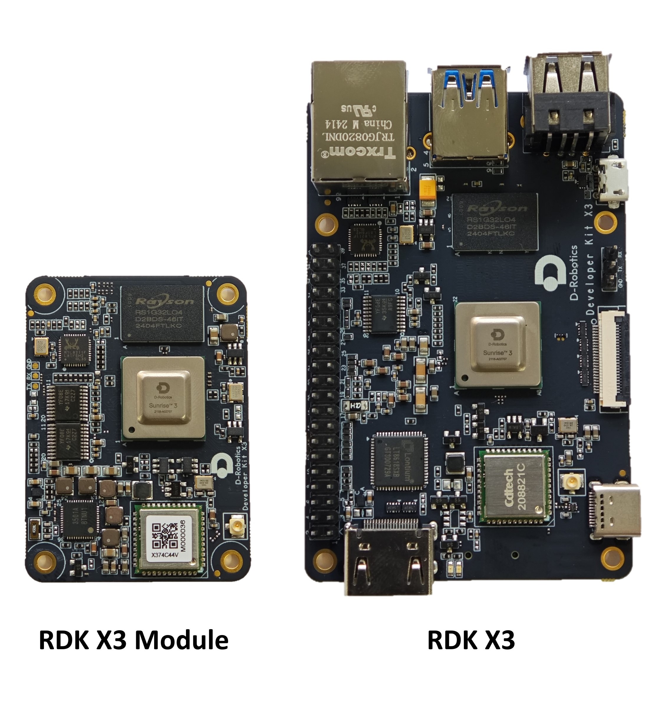

# D-Robotics  RDK Suite

This document is the user manual for the D-Robotics RDK Suite, providing developers with instructions and development guidance for products such as RDK X3, RDK X3 Module, and RDK Ultra. The content covers various aspects such as hardware design, system customization, application development, and algorithm toolchains. Users are welcome to update and experience, please refer to the [System Burning](./01_Quick_start/install_os.md) section for specific instructions.

:::info Note

- All **RDK X3** mentioned in this document use the Ubuntu 22.04 operating system.

- The **RDK X3 Module** comes with a pre-burned test version system image, to ensure the use of the latest version of the system, it is recommended to refer to this document to complete [the burning of the latest version of the system image](./01_Quick_start/install_os.md).

To check the system version number, you can use the following command `cat /etc/version`.
:::

## Overview of D-Robotics RDK Suite

**D-Robotics Developer Kits**, abbreviated as D-Robotics RDK Suite, is a robot development kit built on the D-Robotics intelligent chip, including RDK X3, RDK X3 Module. In combination with the TogetheROS.Bot robot middleware, the D-Robotics RDK Suite can help developers quickly build robot prototypes and carry out evaluation and verification work.

This document will provide detailed instructions on how to use the D-Robotics RDK Suite, including setting up the development environment, running example tutorials, developing applications, and customizing system images. Regardless of which hardware you choose to use, the content described in this document will provide you with a consistent user experience.

## Product Introduction

**RDK X3 (Sunrise X3)** is a full-featured development board with 5Tops edge inference power. It provides developers with flexible hardware expansion and connection options by supporting a variety of sensors and expansion components.

**RDK X3 Module (Sunrise X3 Module)** is a compact core module that maintains the same specifications as RDK X3 and is compatible with the Raspberry Pi CM4 module in terms of size and interface. By combining with the expansion board, it can provide efficient computing and communication capabilities for various application scenarios.

### Operating Temperature and Thermal Recommendations

#### Operating Temperature Range

- Recommended ambient temperature: **-20°C to 60°C**  
    Ensure the device operates within this temperature range to maintain stability and reliability.

#### Chip Thermal Characteristics

- Maximum chip junction temperature: **105°C**
- When the chip junction temperature exceeds **95°C**, the system will automatically initiate frequency reduction to lower the temperature, which may affect performance.

#### Thermal Design Recommendations

- **Development and Testing Phase**: It is recommended to use heat sinks, the RDK Case, and cooling fans for additional thermal management.
- **Productization Phase**: Conduct thorough thermal design evaluation and optimization based on the overall system thermal environment. Ensure the chip operates within a reasonable temperature range under all usage scenarios to avoid performance degradation or system instability due to overheating.

## Documentation Usage Guide

The following is an introduction to the overall content division of the user manual, helping users quickly understand the structure and content of the document for better use in development and learning.

**I. Quick Start**  
This section provides an introduction to system installation and hardware interface usage, helping users quickly get started with the development board.  

**II. System Configuration**  
This section introduces a series of configuration steps and tips to ensure the system works properly and meets specific needs, guiding users through system configuration, including system upgrades, network, and Bluetooth settings.  

**III. Basic Application Development**  
This section covers the pre-installed function examples in the system, such as GPIO control, audio/video capture, and initial multimedia usage.  

**IV. Algorithm Application Development Guide**  
This section introduces the usage of simplified algorithm interfaces in both Python and C++, which are easy to use and allow users to get started quickly. These interfaces are built on lower-level inference interfaces and come with basic usage examples.  

**V. Robot Application Development Guide**  
This section is aimed at robot manufacturers and ecosystem developers, introducing a robot operating system designed to unleash the intelligent potential of robotic scenarios, enabling efficient and convenient robot development for ecosystem developers and commercial customers, and helping to create competitive intelligent robot products.  

**VI. Application Development Guide**  
This section includes application development guides for various aspects, such as deep learning line-following cars, AMR development guides, and large model applications.  

**VII. Advanced Development Guide**  
This section provides a comprehensive introduction to hardware development, system development, multimedia application development, and algorithm development guides. It covers the development processes of hardware design, system configuration and compilation, multimedia usage and debugging, and algorithm training and quantization for deployment. The interfaces are rich in functionality, capable of meeting complex and flexible functional requirements.  

**VIII. Frequently Asked Questions**  
This section addresses common issues and questions that users may encounter while using the developer kit. It provides solutions and tips to help users resolve common problems and proceed smoothly with their development work.

## Version Release History

### Version: 3.0.0

New Features:

- Improved srpi-config system configuration tool, supporting Wi-Fi connections, enabling/disabling SSH and VNC, enabling/disabling peripheral buses on the 40-pin connector, language localization configuration, CPU overclocking, ION memory size configuration, and more.
- Support for /boot/config.txt system configuration file, supporting options such as dtoverlay, CPU overclocking, and IO boot state configuration.
- Added yolov5s v6/v7 model examples.

Enhancements:

- Support for outputting boot logs and entering the user command-line interface on HDMI displays to facilitate user use.
- Support for more HDMI display resolutions, greatly enhancing compatibility.
- Optimized pre-installed software lists for Desktop and server versions, removing redundant items and adding necessary software, such as VLC.
- Optimized layout of the Desktop menu bar, simplifying options.
- Bluetooth functionality is enabled by default.
- Added C++ interface for post-processing, improving post-processing efficiency.
- Automatically mount USB flash drives using udisk2, solving the problem of not being able to access NTFS file systems after automatic mounting.
- Support for retaining VNC password file.
- VNC service is not automatically started by default to reduce system resource consumption. Users can enable it through the srpi-config tool.
- RDK X3 v2.1 and RDK Module development board's CPU can run at a maximum frequency of 1.5GHz in normal mode and 1.8GHz after overclocking.

Bug Fixes: 
- Remove redundant kernel logs for Wi-Fi drivers.
- Modify apt source domain to sunrise.D-Robotics.cc.

Other updates:

- Support for the Chromium browser, users can install and use it with `sudo apt install chromium`.

### Version: 2.0.0

This release brings many anticipated features and improvements, aiming to provide a better development experience and broader application support. Here are the main highlights of this version release:

Open-source:

- We have fully open-sourced the source code of the operating system, including the source code of system core modules and functional modules. Developers can freely view and modify the source code, providing greater flexibility for customization and optimization.
- Detailed code documentation and comments will be provided to developers to help them better understand and use the source code.
- We welcome developers to participate in code contribution and discussions through the open-source community, together driving the improvement and optimization of the operating system. The source code is maintained on [D-Robotics](https://github.com/D-Robotics).

Support for RDK X3 Module:

- We introduce a brand new core board development kit, the RDK X3 Module.
- The RDK X3 Module has a smaller size and is compatible with the Raspberry Pi CM4 interface.
- Developers can choose compatible third-party carrier boards according to their needs to expand the functionality and application scenarios of the core board.

Other updates:

- We have optimized existing functions, fixed known issues and vulnerabilities, improving the stability and performance of the operating system.
- Revised the documentation and help documents, providing more comprehensive and accurate technical information and guidelines.
- We provide lower-level APIs to facilitate developers for secondary development and integration, enabling them to customize software more flexibly.